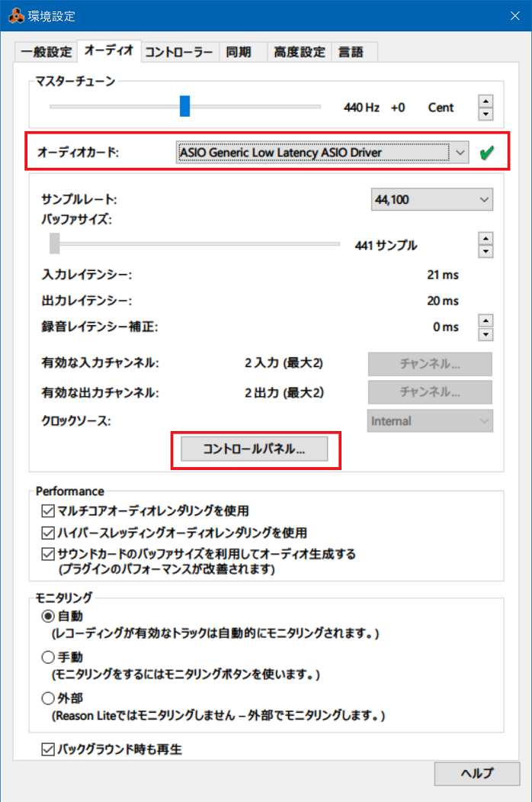

DTM デビュー。

  <iframe width="560" height="315" src="https://www.youtube.com/embed/rBP6crOVMpQ" title="YouTube video player" frameborder="0" allow="accelerometer; autoplay; clipboard-write; encrypted-media; gyroscope; picture-in-picture" allowfullscreen></iframe>

- [【DTM】Reason Lite 10 で初めてオリジナル曲作ってみた - YouTube](https://www.youtube.com/watch?v=rBP6crOVMpQ)
- [001 2021-06-18 First Song by Neos21 - SoundCloud](https://soundcloud.com/neos21/001-2021-06-18-first-song)

以前購入した Korg microKEY Air-49 に付属していた、_Reason Lite 10_ というフリーの DAW を使って、打ち込みとギターの録音をやってみた。

- [MIDI キーボード「Korg microKEY Air-49」を買った](/blog/2020/02/21-02.html)

詳細は YouTube の説明欄にも書いているが、ブログにも書いておく。

## 楽曲情報

- 曲名：「First Song」

2021-06-18 製作開始。2021-06-21 完成。

## 製作環境

音楽的なことはともかく、使用機材や製作環境に関して。

ドラムとキーボードの打ち込みは microKEY Air-49 で行った。USB 接続でも若干のレイテンシがあり、さらにリズム感もないので、録音時からクォンタイズ機能で補正をかけ、さらに打ち込み後にも微修正した。

ギターは Fender Japan Exclusive Classic 50s Telecaster + TN-SPL ネックを使用。

- [Fender Japan Exclusive Classic 50s Telecaster と Fender Japan TN-SPL ネックで真の22フレットテレキャスを手に入れた](/blog/2019/05/12-01.html)

ギターの音作りは Zoom G2.1Nu でほとんどの音作りを行い、PC に USB 接続して録音した。Zoom G2.1Nu は PC に USB 接続すると、AC 電源を接続することなく、USB からの給電のみで駆動してくれたので、ケーブル類が少なくスッキリだ。

- [My Effectors 03 - Zoom G2.1Nu](/music/gears/effector-03.html#zoomg21nu)

Zoom G2.1Nu には Cubase LE6 という DAW が付属していて、過去にちょっとだけ使ったことがあったが、PC のリカバリをしたりしている内にライセンスキー認証が上手く行かなくなったので、もう使わないことにした。世間的には Reason より Cubase の方が利用者・情報量が多めかも。

Zoom G2.1Nu を PC に USB 接続した後、Reason Lite 10 でギターの音を録音させつつ、PC のスピーカーから音を出すために、「環境設定」でちょっと設定をしたので、スクショを貼っておく。

- 
  - Reason Lite 10 の環境設定 → 「オーディオ」タブ → 「オーディオカード」で_「ASIO Generic Low Latency ASIO Driver」_を選択する
  - コレで Zoom G2.1Nu からのギター音を録音できる状態になる
- 
  - Reason Lite 10 の環境設定 → 「オーディオ」タブ → 「コントロールパネル」ボタン → 「出力ポート」で、普段使っている PC のスピーカーを選択する
  - オーディオカードを「ASIO Generic Low Latency ASIO Driver」に変更した直後は、出力ポートがスピーカー以外になっていることがあり、PC のスピーカーから音が出ないことがある
  - この設定をすれば PC のスピーカーから弾いたギターの音がすぐに流れる

USB 接続のためか、PC のスピーカーから流れるギターの音は、若干のレイテンシがある。打ち込み音源を再生しながらギターを録音すると、確実にタイミングがズレて録音されるので、録音後にギターの音源を若干早い時間にシフトしてやるとイイカンジになる。

## 製作秘話

2020年に microKEY Air-49 を買ってから、実はそんなに頻繁には触っていなかった。サボっていたのである。

先日の記事でも書いたとおり、最近自分は生活環境が大きく変わり、一人の時間が増えてしまったので、何か身につけよう、何かせねば、と思い、ボーッとしてしまう時や頭を抱えてしまうだけで何も出来ていない時に、MIDI キーボードを触ることにしたのである。

とりあえず音を出すために Reason Lite 10 を使っていたが、イマイチ使い方が分からないままでいた。より手軽に演奏するだけなら、先日紹介した「Synthesia」などのフリーソフトを起動するのが手っ取り早かったりするし、押さえているコードも分かるので、Synthesia で爪弾くことが多かった。

自分がやっていることを他人に見てもらうには、何かしら形のある成果にしないといけない。自分は神経質で完璧主義なところもあるので、凝り性が発揮されてしまうと<dfn title="永遠に完成しない">エターナる</dfn>こともしばしば。処女作は拙くてもいいから、どうにか「曲」の体裁にしないとなーと思っていた。

---

そんなことを考えていた2021年6月19日。家で塞ぎ込んでいたので、中学時代から吹奏楽を続けている弟の演奏会を見に行ってみた。2020年からの流行風邪の影響で、特に「息を吹く」ことで演奏を行う吹奏楽団は感染リスクが高くなることを懸念して、ほとんどの演奏会やコンクールなどが中止されていたそうだ。会社員になっても、仕事終わりに熱心に吹奏楽活動を続けていた弟にとっては、実に1年半ぶりに人前で演奏ができる機会だったそうだ。

そうした情勢で苦労していたのは、弟だけでなく他の楽団員、指揮者の方も同様。やっとのことで開催できた今回の演奏会の迫力は凄まじいもので、見ているコチラも息を呑むほどの緊張感の中、物凄い集中力で、全力の演奏を聴かせてくれた。弟の演奏はちょくちょく聴いていたが、つい何年か前、高校時代のコンクールなんかでは、素人が聞いても分かるような「トチり」方をしていたりしたのに、なんや、いつの間にかプロと変わらぬ演奏しとるやないけ。感動した。

感染予防対策のため、会場の規模に対して大幅に入場者を制限していたものの、それでも数百人の観客がこのご時世に訪れていた。弟の音楽にはこれだけの人数の人々を集める力があるんだなぁと思うと、そのことにも心打たれた。弟が中学の吹奏楽部に入部し、初めて楽器を手にした時の様子をよく覚えている。「全く音が出ていないリコーダー」といえば想像しやすいだろうか、あんなレベルで「プひぃ～～」なんて情けない音を出していた弟。それを見てケラケラ笑っていたと思ったら、いつの間にか高校のコンクールでは金賞を連発。会社員になってからも社会人楽団を掛け持ちして演奏を続け、今ではプロレベルのスキルに上達し、これだけの人を集め、感動させている。

---

自分も、ジャンルは違えどエレキギターを手にし、軽音楽部に入ってバンド活動をしていた。しかし元々「他人に自分の演奏を見せる」ことには興味がなく、目標がないためかギターの腕は上達せず、趣味の方向は機材集めに移り、それもそのうち飽きてほとんどの機材を手放した。「意味のなかった趣味」とは言わないが、こうして弟が実現し、今なお磨き続けている格好良い趣味を見ると、自分にはこうした格好良い趣味がないなぁと思った。

エンジニアを生業とし、プログラミングスキルを手にすると、「今やっていることは将来楽するための投資」みたいな思考の癖が付いてしまう。コレ自体は別に悪いことではないのだが、そうした思考を趣味にまで適用してしまう。「コレをやって何になるんだろう」とか、「必要か？」とか言って、斜に構えて、練習を面倒臭がったり、「この歳でギターなんかに熱中してても、な…」とかいって自分で飽きるように仕向けてみたりする。

そうして出来上がった人間は、結局何の面白みのない、クッソつまらないオッサンであった。

音楽なんてやって何になる、いまさらプロになるワケでもないし、どれだけ努力しても自分より上手な人はごまんといる…。確かにそうだけど、だからといって音楽をやっちゃいけないワケじゃない。音楽を止める理由にもならない。

趣味に必要性や利益・効果なんて、求めなくて良いのだ。「やりたいからやる」が全てで良いのだ。

自分が2002年にウェブサイトを開設し、当時熱心に更新していたのは、それがただただ楽しかったからやっていたはずだ。楽しくて作っていたら、そのうち掲示板に書き込みがあったりして応援をもらえていたワケだ。

2016年から2020年までやっていた技術ブログ「Corredor」は、もう少し違うことを考えていた。転職に使えるポートフォリオを兼ねていたり、最初から収益化を狙っていたり、収益を狙うための記事を書いたりと、「それをやることで利益があるからやる」という点が大きかった。会社に入ったあたりから、このように効果や利益ばかり追求するようになって、「無駄なことはしたくない」とか「やってもどうせ知れている・だからやらない」みたいな考え方になっていったと思う。

自分でそういう思考になっていったと思うのだが、いやー、なんとつまらない人間なんだろうと、自分で常々思っていた。何か熱中できる趣味が欲しくて、ココ何年かもがいていたのだけど、どうにも熱中できずにいた。よくよく思い返すと、どれもこれも「ブログのネタにしよう」と考えているフシがあったのが良くなかった。「やってみた」を記事にして、それで収益が得られれば…という思考だったのだ。

---

自分が「ただただやりたいこと」って、なんだろう。今の自分にとってそれは、「僕が喜ばせたいと思っている人を喜ばせること」だ。自分に対して何の見返りも、収益も要らない。関係ない。相手が喜んでくれれば、それだけが願いだ。

その人が何を喜んでくれるかは分からない。でも、色んなモノを見せて、色んな選択肢を知ってもらって、色んな発想で楽しいと感じてもらいたい。

だから、自分は色んなことをやってみよう、と。色んなモノを見せられるようにしておいて、見てもらって、へぇ～そういうモノがあるんだー、と思ってもらえたら。それって面白いのー？自分もやってみようかな？なんて思ってもらえたら。

そう思うと、自分がちょこちょこと趣味にしてきた「音楽」は、もっと深く身に付け、その楽しさを自分がもっとプレゼンできるようにしたいと思うようになった。

コレもまだ、「自分の趣味」にするには動機が不純かもしれない。

でも、この歳になって、何となく分かった。趣味の根源は「やりたいからやる」のだ。収益や効果を気にしながらやることじゃない。自分の趣味を応援してもらえるとモチベーションになるのは分かるが、自分を見せて承認欲求を満たしたい、みたいな発想はまた違う。「俺コレが大好きなんだよ！どう、面白いでしょ？良いでしょ！」っていう共有が、良い発信スタンスになるのかなーと思う。

---

あーだこーだ言ってみたけど、めっちゃ簡単に言うと、__僕は弟の演奏を聴いて、「俺も音楽やりてぇー！！！」と強く思った__のである。

だから、その日のうちから「とにかくひとつ楽曲を作り上げること」を目標に、Reason Lite を起動した。

4つ打ちのダンス・ミュージックの上に、自分の好きなフュージョンっぽいギターを乗せたいな、という、何となくのコンセプトはずっと持っていたのだけど、知識もスキルも追いついていない。しかしそれでも、ダッサダサでもいいから、とにかく何か音楽がやりてぇ、なんか作りてぇと思っていたので、勢いで作っていくことにした。

作曲も、DTM 全般の知識も、Reason Lite の知識もないので、音作りから何から、本当に何もかも分からず。ホントはこういうことをやりたいんだけど、どうやってやるんだろう？と迷うことばかりだった。

頭の中で鳴ったコードを、まずはギターで弾いてみて、あぁこういう感じーと思ったら、それをキーボードで弾き直して、転回してみたりして音を決めた。シンセの音は何がなんだか分からないまま、雰囲気の良い音を選んで、テキトーにツマミをいじくってみた。ギターのエフェクター以上にダイナミックに音が変わるので、シンセは面白い。

ドラムのようなリズム楽器は、さらに知識がないので苦労した。なんとなく「実際に演奏することを想像して、手が3つないと演奏できないような音は出さない方が自然なんだろうな」ぐらいの想像をして作ってみたが、うまいこと音圧が得られなくて、もっと良いバスドラの音ないのかなーとか色々気になるところは多い。でも、ココにこだわりすぎてエターナるのは避けたかったので、今回は適当なところで手を打つことにした。

ギターは実際にエレキギターを弾いたワケだが、課題が山積みだった。

元来の面倒臭がりということもあり、自分は普段アンプから音を出さず、生音で爪弾いていたのだが、コレが良くなかった。マンションの騒音問題も気にして、大きな音を出さないように弱いピッキングで遠慮して爪弾いてきたので、そのクセが残り、いざ録音してみると全然キレイな音が鳴っていないのだ。思い切って強くピッキングするぐらいでちょうど良く、「あーこれは自宅じゃキレイなピッキングが出せないや」と思った。現在の住まいは、今まで住んできたマンションの中で一番防音性に乏しい部屋なので、ギターの練習や録音のためにスタジオに行った方が良さそうだなーと思った。

リズム感もないし、録音時のレイテンシも相まってもっさりして聞こえる。ある程度 Reason Lite の中で波形をズラしたりしてタイム感は調整したが、元はもっともっと酷かった。

テレキャスの電装周りも全然メンテナンスしていないので、ノイズが凄い。また、久々に使う Zoom G2.1Nu の使い方もなかなか思い出せず、キレイな音が作れなかった。

ほとんどワンコードの簡単なバッキングにしておけば、アドリブソロもそれなりに作れるんじゃないかとナメてかかったが、なかなかこう、音源として聞けるレベルでまとめるのは難しかった。楽器屋でデタラメに試奏しているのと違って、ちゃんと音楽として成立させなきゃいけないので、フレーズがちゃんと小節に収まらないといけないワケで、コレが全く上手くいかなかった。音楽理論の知識もないし、いきなりオリジナリティ溢れるフレーズが作曲できるとは考えていなかったけど、それにしてもなかなかまとまらなかった。

バッキングをループ再生して、何時間か爪弾いて、__どこかで聴いたことのあるフレーズ__をあれやこれやと繋ぎ合わせて、最終的には一応ソロっぽいモノを作ってみた。

18日からコード進行をこねこねしていたが、弟の演奏を聴いた19日の夜に本格的に「一曲作ろう」と奮起し、21日に一旦完成させた。

どの部分をとってもスキル不足が否めないし、音作りももっと追求したいが、今回は_とにかく早く、一つ何か形にしてみることを優先_して、あまり凝りすぎないようにした。素人の処女作なのだ。ココで時間をかけても作品として優秀なモノにはならないだろう。今回はそうした成果物の品質よりも、

- _今こうやって作曲を頑張っていること自体が楽しい_
- __ギターもっと上手くなりてぇなぁー！と燃えること自体が楽しい__

っていう、アツくなる感じ、楽しいーもっとやっていたいーと思う感じを、久々に感じて、それが今の自分にとって大事なことだった。

分からないこと、思いどおりにいかないことばかりで、作り上げた楽曲自体のレベルはまだまだ完全素人レベル、それは分かってます。それでも、_作曲・楽器演奏はとても楽しい_と感じた。今回はそんな、自分の趣味に対する熱意を取り戻せた第一歩だと思ってます。

そして、_自分はこんなことをやって楽しかった、っていうのを簡単にお見せする手段として、YouTube に動画をアップする、という方法をとってみた次第_である。Reason Lite の再生画面をベースに、使用機材のワイプを入れた程度。Premiere Pro も久々に触る気がする。動画製作を趣味にしていたのは2005～2008年ぐらいだったかな。動画を作ること自体も好きだから、今後はまた動画を色々作ってみようと思っている。

## 音楽的なこと

最後に、音楽的な情報や、作曲中のインスピレーションの元を紹介する。

### キーボード

- コード進行 : 以下のノートを押さえて演奏
  - Gb M7 (Gb-Bb-Db-F)
  - F m7 (F-Ab-C-Eb)
  - Eb m7 (Eb-Gb-Bb-Db) (最後の方に1回だけ)
- このコード進行と構成音が被っているので、「Daft Punk - One More Time」のメロディが弾けたりする
- このコード進行を半音下げた、FM7 → Em7 → Dm7 もありがちなコード進行ですね (広瀬香美 - Groovy! のイントロとか)

### ギター

- フレーズの引用元
  - T-Square - Wind Song (安藤正容)
  - 渡辺香津美 - Somebody Samebody
  - 角松敏生 - Sato
  - 高中正義 - Beach

それぞれの曲を聴いてもらえば、各ギタリストの手癖フレーズをパクってソロに取り入れてるのが分かると思います。初見でどのぐらいバレるのでしょうか。

- コピーしすぎて個人的な手癖になっているものから生み出したフレーズ
  - 角松敏生がやりそうな下降フレーズ : 角松は1・2弦で5度離れた下降フレーズをやりがちだが、今回は4度離れた下降フレーズを自分で組み立てて弾いてみた
  - 野呂一生がやりそうなジャズっぽいフレーズ : スケールの中の経過音みたいなのを入れて、ジャジーな響きをやりがちなので、それを意識してみた
  - 高中正義がやりそうな上昇フレーズ : 5弦から1弦にかけてセブンスのスケールを4連で上昇していくフレーズをやりがちで、それを参考にフレーズを組み立てた

具体的な秒数でどことは書きませんが、引用フレーズ以外の箇所を聞けばすぐ分かるかと。

## 感想

趣味は、楽しいからやる。やりたいからやる。「上手に出来ないから意味がない」とか「お金にならないなら無駄だ」なんて考えなくていい。下手でもいい。お金にならなくもいい。

音楽に限ったことではないが、何かをゼロから作るのはとても難しい。だから、色々悩みながら工夫してみて、拙くても何かそれらしいモノが出来上がると、嬉しいし、達成感がある。

やりたいことをやれた。やって楽しかった。それでいい。そう思えることが大事なのだ。

  

    
  

  

    

      <a href="https://hb.afl.rakuten.co.jp/hgc/g00ry2p2.waxyccab.g00ry2p2.waxydc9f/?pc=https%3A%2F%2Fitem.rakuten.co.jp%2Frockonline%2F63878%2F&amp;m=http%3A%2F%2Fm.rakuten.co.jp%2Frockonline%2Fi%2F10005879%2F">Reason Studios Reason 11 アップグレード版【対象：過去のReason/前のバージョンなどをお持ちの方】【※シリアルメール納品】【DTM】【DAW】【作曲ソフト】</a>
    

    

      <a href="https://hb.afl.rakuten.co.jp/hgc/g00ry2p2.waxyccab.g00ry2p2.waxydc9f/?pc=https%3A%2F%2Fwww.rakuten.co.jp%2Frockonline%2F&amp;m=http%3A%2F%2Fm.rakuten.co.jp%2Frockonline%2F">Rock oN Line 楽天市場店</a>
    

    
価格 : 12900円

  

  

    
  

  

    

      <a href="https://www.amazon.co.jp/dp/B076Q9R3RQ?tag=neos21-22&amp;linkCode=osi&amp;th=1&amp;psc=1">propellerhead プロペラヘッド 音楽制作ソフト Reason 10 Upgrade アップグレード版</a>
    

  

DAW 高い…。エフェクターや MIDI キーボードに付属のフリー版 (バンドル版) しか使っていないけど、今のところコレで十分なんだよな…。凝り始めたら高いプラグイン買ったりとかしだすのかな…。ｗ
