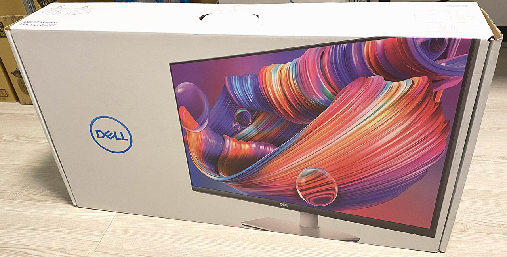
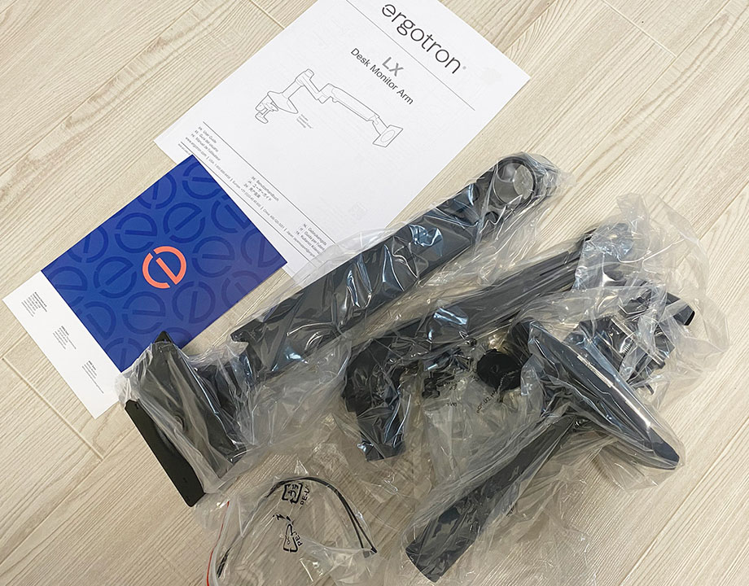
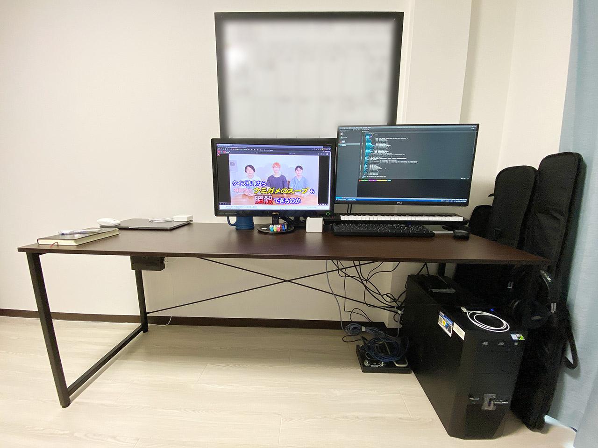
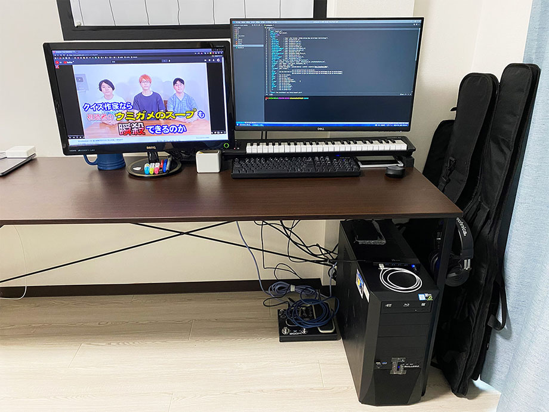
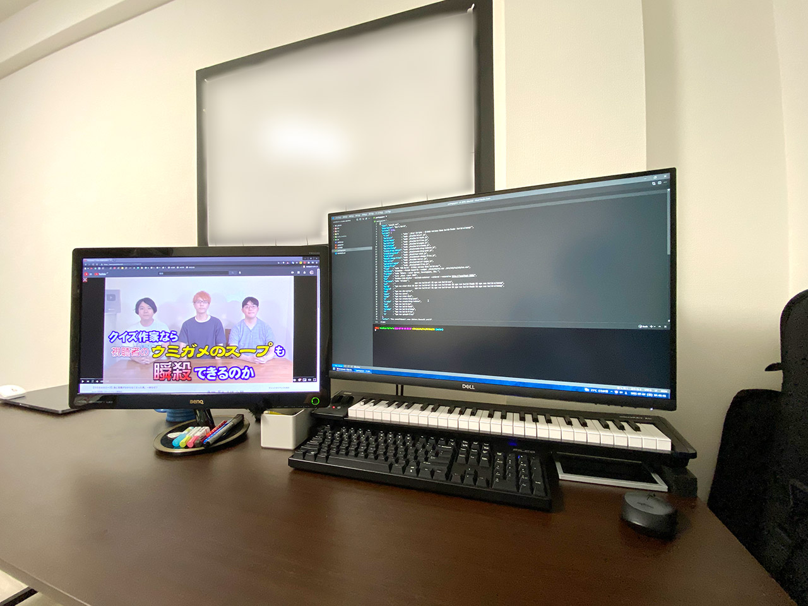

自分は2020年からフルで在宅勤務をやっているので、単純に仕事の時間だけでも、パソコンデスクの前に座っている時間が長い。また、パソコンは趣味でもあるので、パソコンデスクの前は僕がほぼ1日中過ごす場所であり、自分の生活の中心だ。

最近、僕は生活環境が変わり、一人で自分のスペースを広く持てるようになった (なってしまった)。

そこで一念発起し、広いパソコンデスク環境を構築することにした。

## 目次

## ワイドデスク：サンワダイレクト 100-DESKF007BR

コレまで自分が「パソコンデスク」として使っていたのは、ルミナスのメタルラックだった。幅 90cm・奥行 60cm・高さ 200cm 程度のメタルラックを組んで、そこに透明なシートを敷いてデスクに仕立てていた。

- 過去記事：[いつの間にか月間10万 PV 突破していた「わたしのブログ環境」を語る](/blog/2018/04/29-01.html)

今回はちゃんとした机を買おうと思い、サンワダイレクトの __100-DESKF007BR__ という型番のワイドデスクを購入した。幅 180cm・奥行 60cm のデスクである。Amazon で1万3,800円程度だった。

幅が 180cm もあるので、組み立てはなかなか大変だった。デスクの中央付近を押し込むと多少はたわむが、概ね問題ないだろう。使っていて不具合や問題を感じるところは特にない。

色もダークブラウンの天板に、黒のメタルフレームでシックな雰囲気。購入したガジェットなんかをデスクで撮影すると映える。

  

    
  

  

    

      <a href="https://www.amazon.co.jp/dp/B0757K1VH8?tag=neos21-22&amp;linkCode=osi&amp;th=1&amp;psc=1">サンワダイレクト シンプルワークデスク 幅180cm×奥行き60cm 組立簡単 モニターアーム取付対応 パソコンデスク パソコン台 ダークブラウン 100-DESKF007BR</a>
    

  

  

    
  

  

    

      <a href="https://hb.afl.rakuten.co.jp/hgc/g00pw4y2.waxyc62e.g00pw4y2.waxyd13a/?pc=https%3A%2F%2Fitem.rakuten.co.jp%2Fesupply%2Fez1-deskf007br%2F&amp;m=http%3A%2F%2Fm.rakuten.co.jp%2Fesupply%2Fi%2F10074202%2F">【割引クーポン配布中 7/11 01：59まで】ワークデスク シンプル 平机 パソコンデスク 幅180cm 奥行60cm 100-DESKF007BR</a>
    

    

      <a href="https://hb.afl.rakuten.co.jp/hgc/g00pw4y2.waxyc62e.g00pw4y2.waxyd13a/?pc=https%3A%2F%2Fwww.rakuten.co.jp%2Fesupply%2F&amp;m=http%3A%2F%2Fm.rakuten.co.jp%2Fesupply%2F">イーサプライ　楽天市場店</a>
    

    
価格 : 13800円

  

## Dell 4K モニタ S2721QS

コレまで自分は、BenQ の VW2424H というモニタを使っていた。2011年12月発売の製品らしく、2012年ぐらいには使い始めていたと思うので、もう8・9年ぐらいは使っていたと思う。

サイズは24インチ、1920x1080px (Full HD) の解像度。DVI 端子で母艦に搭載している NVIDIA GeForce GTX1080 と繋いで、コレまで不便することなく使ってきていた。

- [【モニター】BenQ 『VW2424H』 レビューチェック - ヲチモノ](https://watchmono.com/blog-entry-1983.html)

ただ、以前 Dell XPS13 を試用させていただいた時に、4K ディスプレイの高精細さに感動していて、4K モニタはいつか欲しいなぁ〜と思っていた。

- 解像度は 4K で、
- 現在使っている24インチモニタとそんなに変わらない筐体サイズで、
- HDMI ケーブル一本で音出しまで済ませられるので、できればスピーカー内蔵モニタが良いな、
- そんで値段は高くないモノを…

と思って調べると、__Dell S2721QS__ という 4K・27インチモニタがヒットした。Amazon で3万9,800円程度で購入できた。

似たような型番の商品がいくつかあるが、以下のページが詳しい。

- [Dellの4KモニターS2721QとS2721QSとS2721QRの違い！Amazonモデルがお買い得！ | 中年男・馬山のブログ](https://middleagedman-umayama.com/recommendation-product-81-2143)

基本は販売店の違いで、自分が買った S2721「QS」は Amazon 販売モデル。また、基本モデルの S2721「Q」と、S2721「QR」は、モニタスタンドの調節機能が若干少ないようだ。自分が購入した「QS」は、一番調節機能が豊富なモデルなのだが、後述のとおりモニタアームを買ったので、優秀なモニタスタンドを使うことなくしまってある…。

入力端子は HDMI が2つ、DisplayPort が1つあり、内蔵スピーカーから音が出せるのが便利。ディスプレイ裏の配置になるので使いづらいが、ライン出力ポートもある。

使用感などのレビューは後述する。

  

    
  

  

    

      <a href="https://www.amazon.co.jp/dp/B08HGNYMWZ?tag=neos21-22&amp;linkCode=osi&amp;th=1&amp;psc=1">Dell 4K ワイドフレームレスモニター 27インチ S2721QS(3年間無輝点交換保証/AMD FreeSync™/4K/IPS非光沢/DP,HDMIx2/縦横回転,高さ調節/スピーカー付)</a>
    

  

  

    
  

  

    

      <a href="https://hb.afl.rakuten.co.jp/hgc/g00t3u12.waxyc194.g00t3u12.waxyd580/?pc=https%3A%2F%2Fitem.rakuten.co.jp%2Fonedayonestyle%2Fs2721qs%2F&amp;m=http%3A%2F%2Fm.rakuten.co.jp%2Fonedayonestyle%2Fi%2F10000523%2F">あす楽対応♪　Dell 4K ワイドフレームレスモニター 27インチ S2721QS(3年間無輝点交換保証/AMD FreeSync&amp;#8482;/4K/IPS非光沢/DP,HDMIx2/縦横回転,高さ調節/スピーカー付)</a>
    

    

      <a href="https://hb.afl.rakuten.co.jp/hgc/g00t3u12.waxyc194.g00t3u12.waxyd580/?pc=https%3A%2F%2Fwww.rakuten.co.jp%2Fonedayonestyle%2F&amp;m=http%3A%2F%2Fm.rakuten.co.jp%2Fonedayonestyle%2F">ONE DAY ONE STYLE</a>
    

    
価格 : 56800円

  

## エルゴトロン LX デスクマウントアーム

自分はココ数年視力が悪くなってきていたので、モニタを手元に近付けて閲覧したりすることも少なくなかった。モニタアームが使えればそうした操作がやりやすいなぁと思い、今回モニタを購入する際に「モニタアーム」についても調べてみた。

すると、最近は_「VESA マウント」_という規格が普及していて、様々なメーカの組み合わせでディスプレイアームを取り付けられるようになっているらしい。

調べていくと、__エルゴトロン LX__ (45-241-224) というデスクマウントアームが優秀っぽかったので、コレを買った。Amazon で1万4,000円程度だった。もっと安いモニタアームもあるようだが、強度や調節のしやすさなどに不満を持ったら面倒臭いので、最初からちょっと良いヤツを買っておくことにした。

最初のモニタ取り付けと角度調整は注意が必要。_ディスプレイにアームを取り付けてからでないと、マウント部分の首の傾きが調節できない (テコの原理で動くらしいので、モニタを付けていないと動かない)。_説明書だけだと若干分かりづらいところもあるので、ググってみたり、Amazon のレビューなんかも見てみてほしい。

サンワダイレクトから、モニタアームを取り付ける際に使用できる補強パーツが売っていたりするが、自分はそういうモノは買わなかった。デスクに直接モニタアームを取り付けている。特に不便や問題もないのでコレで OK。

  

    
  

  

    

      <a href="https://www.amazon.co.jp/dp/B07Q8TJ2KL?tag=neos21-22&amp;linkCode=osi&amp;th=1&amp;psc=1">エルゴトロン LX デスクマウント モニターアーム マットブラック 34インチ(3.2~11.3kg)まで対応 45-241-224</a>
    

  

  

    
  

  

    

      <a href="https://hb.afl.rakuten.co.jp/hgc/g00s2t82.waxyc7d5.g00s2t82.waxyd769/?pc=https%3A%2F%2Fitem.rakuten.co.jp%2F123market%2F2021marathonsale-e1r00wv%2F&amp;m=http%3A%2F%2Fm.rakuten.co.jp%2F123market%2Fi%2F10045103%2F">エルゴトロン LX デスクマウントアーム(マットブラック) 45-241-224【お買い物マラソン セール価格】</a>
    

    

      <a href="https://hb.afl.rakuten.co.jp/hgc/g00s2t82.waxyc7d5.g00s2t82.waxyd769/?pc=https%3A%2F%2Fwww.rakuten.co.jp%2F123market%2F&amp;m=http%3A%2F%2Fm.rakuten.co.jp%2F123market%2F">123market 楽天市場店</a>
    

    
価格 : 12380円

  

## デスクはこうなりました

ということで、サンワのワイドデスクを組み立て、エルゴトロン LX デスクマウントアームを Dell S2721QS 4K モニタに取り付けてデスクに固定すると、こんな感じになりました…！

あ、背景の黒い枠は、壁貼りタイプの_ホワイトボード_を黒いマスキングテープで貼っ付けてるモノです。コレも今回買ったモノ。ホワイトボードシートには無痕釘とか何とか色々付属品があって良き良き。

  

    
  

  

    

      <a href="https://www.amazon.co.jp/dp/B07F3X3NFK?tag=neos21-22&amp;linkCode=osi&amp;th=1&amp;psc=1">Magjump ホワイトボード シート 白板 60x90cm 磁石付き 水性ペン付き 壁に貼ってはがせる 取り付け簡単 お絵かき 掲示板 落書き 伝言板に適用</a>
    

  

  

    
  

  

    

      <a href="https://hb.afl.rakuten.co.jp/hgc/g00tiww2.waxycd35.g00tiww2.waxyd56f/?pc=https%3A%2F%2Fitem.rakuten.co.jp%2Fleiwado%2Fb07f3x3nfk%2F&amp;m=http%3A%2F%2Fm.rakuten.co.jp%2Fleiwado%2Fi%2F10179163%2F">Magjump ホワイトボード シート 白板 60x90cm 磁石付き 水性ペン付き 壁に貼ってはがせる 取り付け簡単 お絵かき 掲示板 落書き 伝言板に適用</a>
    

    

      <a href="https://hb.afl.rakuten.co.jp/hgc/g00tiww2.waxycd35.g00tiww2.waxyd56f/?pc=https%3A%2F%2Fwww.rakuten.co.jp%2Fleiwado%2F&amp;m=http%3A%2F%2Fm.rakuten.co.jp%2Fleiwado%2F">令和堂</a>
    

    
価格 : 4338円

  

  

    
  

  

    

      <a href="https://www.amazon.co.jp/dp/B00U2CO12Y?tag=neos21-22&amp;linkCode=osi&amp;th=1&amp;psc=1">カモ井加工紙 マスキングテープ mt CASA 50mm 50mm幅×10m巻き マットブラック MTCA5085</a>
    

  

母艦 PC の Galleria XG に搭載している GTX1080 から、コレまでどおり DVI 端子で BenQ VW2424H を繋ぎ、左側に配置。右側にある Dell S2721QS は HDMI 端子で接続している。それぞれ、Full HD と 4K 解像度できちんと表示されている。

MIDI キーボードを少し底上げして、下に PC キーボードの USB ケーブルを通せるようにしている。以下の 3cm 幅の角ゴムを2つ買った。

  

    
  

  

    

      <a href="https://www.amazon.co.jp/dp/B006Y4D7II?tag=neos21-22&amp;linkCode=osi&amp;th=1&amp;psc=1">エスコ 30x30x200mm角棒ゴム EA997XC-223</a>
    

  

  

    
  

  

    

      <a href="https://hb.afl.rakuten.co.jp/hgc/g00ql4f2.waxyc2b5.g00ql4f2.waxydf31/?pc=https%3A%2F%2Fitem.rakuten.co.jp%2Fmutsuura%2F10103791%2F&amp;m=http%3A%2F%2Fm.rakuten.co.jp%2Fmutsuura%2Fi%2F10103791%2F">エスコ(ESCO) 30x30x200mm 角棒ゴム EA997XC-223</a>
    

    

      <a href="https://hb.afl.rakuten.co.jp/hgc/g00ql4f2.waxyc2b5.g00ql4f2.waxydf31/?pc=https%3A%2F%2Fwww.rakuten.co.jp%2Fmutsuura%2F&amp;m=http%3A%2F%2Fm.rakuten.co.jp%2Fmutsuura%2F">工具屋のプロ 楽天市場店</a>
    

    
価格 : 660円

  

ベゼルの差で、2枚のモニタの外見上のサイズがほとんど変わらないのが良い。ただ、解像度が違うため、Windows 10 の設定でディスプレイ位置を調整しても、見た目どおりにマウスを行き来できないところがちょっとアレ。ただまぁ、自分はそもそも__デュアルモニタでほとんど作業しない__ので、あまり困ることはない。_基本はモニタ1枚で作業するのが好き_なのだ。動画を見ながら作業したいとか、そういう時だけ BenQ のモニタの電源を ON にして使う感じで運用している。

Dell S2721QS モニタに内蔵されているスピーカーからも、ちゃんと音が出ている。HDMI 端子はオーディオも転送できるから便利だよなぁ〜。ただ、スピーカーは 3W × 2個なので、音質は知れている。低音は全く出ないので、音楽をちゃんと聴くには向かない。そんな時はモニタ裏のオーディオ出力や、PC 本体に直接ヘッドホンでも繋いで聴くとしよう。自分はラジオをよく聞くので、そういう用途ではモニタ内蔵スピーカーで十分かな。やはりスピーカー用にケーブルや電源が必要になるのは面倒だし、この手軽さに勝るモノはない。

HDR に対応していて、YouTube の対応する動画なんかがよりキレイに見られたりする。ただ、Windows デスクトップがギラギラに輝いてしまって常時 ON には出来ないので、高画質な映画をガッツリ観る時とかに ON にするのかな。まぁ HDR を ON にしなくとも、YouTube でも 1080p と 4K とで歴然とした画質の差を感じるので、やはり 4K モニタにして正解。

他にも、Picture In Picture (PiP) モードとかいうのもあって、複数の入力ポートの映像を重ねて表示したりできるらしい。全然使っていないが。ｗ

応答時間が 4ms だとか、その辺の性能はよく分からないや。ゲームも別にやらないし、反応が遅いとかカクつくとか、そういう不具合は感じていない。ただ、YouTube で 4K 60fps を滑らかに再生するためには、ブラウザの設定調整が必要だったので、そこだけ留意。PC のスペックが不足しているワケでもないのに 4K 60fps 動画がカクつく場合は、試しに Chrome ではなく Firefox で閲覧してみて変化があるかなどを確認して、Chrome の設定を見直してやるのが良いだろう。

エルゴトロンのモニタアームも、安定感があって良い。高さを変えたり、手前に近付けたり、奥に下げたり、スイスイとモニタを動かせるので重宝している。サンワのワイドデスク側がモニタアームの万力固定に耐えられるのかちょっと心配ではあるが、今のところ全く問題なし。この様子なら天板ごとバッキリもげるような恐ろしい壊れ方はしないだろう。

## 以上

- サンワダイレクト ワイドデスク：約13,800円
- Dell 4K モニタ：約39,800円
- エルゴトロン モニタアーム：約13,980円
- _合計：約67,580円_

ポイントなども使ったりしたので、65,000円程度で揃えられたが、確かに安い買い物ではないだろう。

しかし、自分がほとんど一日中過ごすことになる「職場環境」でもあるし、「趣味の部屋」でもあるから、そこの環境を向上させて過ごしやすくするのに、家賃1ヶ月分弱の出費なら、キチンと費用対効果のある出費であろう。

ワイドデスクによってパソコンを何台も並べたり、MIDI キーボードも並べてみたりできて、作業スペースが広がったことは物凄く快適だ。

そして、4K モニタとモニタアームの組み合わせは最高。デュアルディスプレイ環境も駆使して、Windows 環境の中としても作業スペースが広がったことになり、申し分ない環境である。
