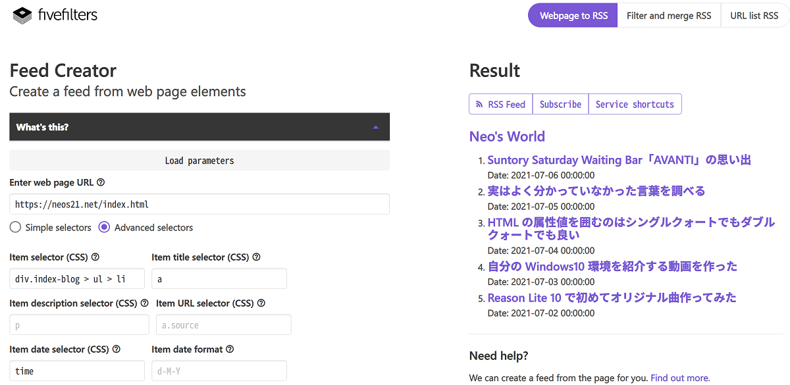

最近「React や Gatsby.js やら Next.js やらで JAMStack なブログを自作してみました」みたいなサイトが多いのだが、RSS フィード配信がされていないサイトがいくつかあった。

僕は未だ Feedly を使っているので、ブログサイトの更新は RSS 配信して欲しいのである。

そこで、サイト運営者が RSS フィードを配信していない場合に、閲覧者側で勝手に RSS フィードを作成する方法がないか調べたところ、以下の __Feed Creator__ というサービスを見つけた。

- [Feed Creator (RSS Generator) · FiveFilters.org](http://createfeed.fivefilters.org/)

要するに_記事一覧ページから記事タイトルと URL を上手いこと抽出してやる_ことで、それを RSS フィードとして配信してくれる仕組みのようだ。

このサイトは RSS フィードを配信しているものの、サンプルとして Feed Creator で__トップページからブログ記事一覧を取得__させてみた。

僕は CSS で書くのが手っ取り早いと思ったので、「Advanced selectors」を選択し、最低限「Item selector (CSS)」と「Item title selector (CSS)」を設定してやる。ページの HTML を見て、なるべく ID セレクタを起点にすると扱いやすいと思う。

ページ下部の「Preview」ボタンを押すと、右ペインにプレビューが表示されるので、右上の「RSS Feed」ボタンで RSS の URL を取得するか、「Subscribe」ボタンから「Feedly」などのサービスを選択して購読を開始すれば良い。

  

    
  

  

    

      <a href="https://www.amazon.co.jp/dp/B07C61Q5T5?tag=neos21-22&amp;linkCode=osi&amp;th=1&amp;psc=1">ブログの書き方講座: ブログ収益はユーザー目線で加速する 初心者のためのブログ入門</a>
    

  

  

    
  

  

    

      <a href="https://hb.afl.rakuten.co.jp/hgc/g00q0722.waxyc9ff.g00q0722.waxyd017/?pc=https%3A%2F%2Fitem.rakuten.co.jp%2Fbook%2F14358674%2F&amp;m=http%3A%2F%2Fm.rakuten.co.jp%2Fbook%2Fi%2F18112881%2F">世界一やさしいブログの教科書1年生 再入門にも最適！ [ 染谷昌利 ]</a>
    

    

      <a href="https://hb.afl.rakuten.co.jp/hgc/g00q0722.waxyc9ff.g00q0722.waxyd017/?pc=https%3A%2F%2Fwww.rakuten.co.jp%2Fbook%2F&amp;m=http%3A%2F%2Fm.rakuten.co.jp%2Fbook%2F">楽天ブックス</a>
    

    
価格 : 1738円

  

