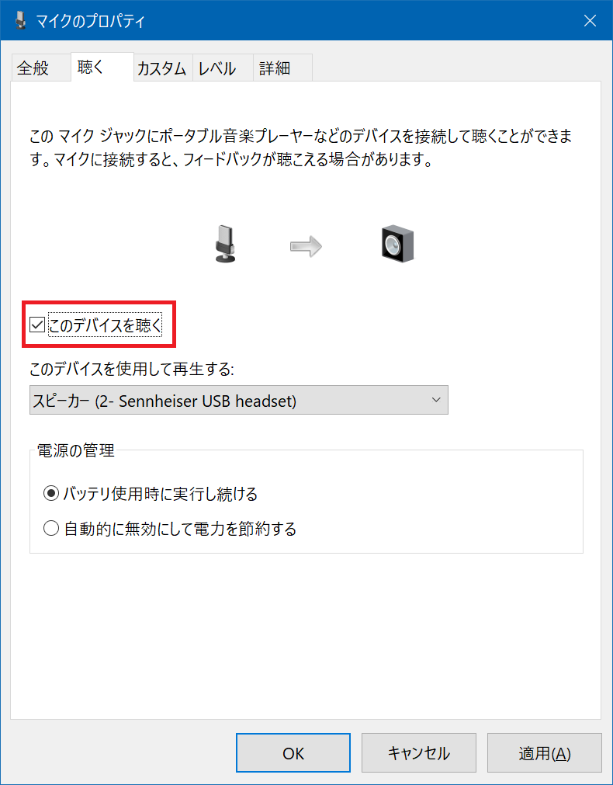

先日紹介した Dell 4K モニタ S2721QS だが、モニタ内蔵のスピーカーはやはり音質が悪い。低音が出なくて困る。

- 過去記事：[Dell 4K モニタ S2721QS + エルゴトロン LX デスクマウントアーム + ワイドデスクでデスクトップ環境を改善した](./09-01.html)

そこで、*Audio-Technica ATH-M20x* というヘッドホンを買った。最初はちょっとキツくて耳が痛くなっていたが、内部の鉄板をねじ曲げて調整したらマシになった。音声を聴くならコレで良いかなと。

  

    
  

  

    

      <a href="https://www.amazon.co.jp/dp/B00HVLUR18?tag=neos21-22&amp;linkCode=osi&amp;th=1&amp;psc=1">audio-technica プロフェッショナルモニターヘッドホン ATH-M20x スタジオレコーディング / 楽器練習 / ミキシング / DJ / ゲーム ブラック</a>
    

  

  

    
  

  

    

      <a href="https://hb.afl.rakuten.co.jp/hgc/g00r7ld2.waxycfeb.g00r7ld2.waxyddc5/?pc=https%3A%2F%2Fitem.rakuten.co.jp%2Fbiccamera%2F4961310125400%2F&amp;m=http%3A%2F%2Fm.rakuten.co.jp%2Fbiccamera%2Fi%2F10613526%2F">オーディオテクニカ　audio-technica ヘッドホン ATH-M20X [φ3.5mm ミニプラグ][ATHM20X]</a>
    

    

      <a href="https://hb.afl.rakuten.co.jp/hgc/g00r7ld2.waxycfeb.g00r7ld2.waxyddc5/?pc=https%3A%2F%2Fwww.rakuten.co.jp%2Fbiccamera%2F&amp;m=http%3A%2F%2Fm.rakuten.co.jp%2Fbiccamera%2F">楽天ビック（ビックカメラ×楽天）</a>
    

    
価格 : 5300円

  

ほんで今回、*今度は音声を録音できるようにしたいな*、と思い、マイクもしくはヘッドセットを買おうと思った。「USB 接続なら楽だろうな～」「オーディオインターフェースって言葉がやたら出てくるけど何だろ～？」という知識レベルの状態だったので、色々調べながら、今回は **Sennheiser PC 8** という USB 接続のヘッドセットを買った。

  

    
  

  

    

      <a href="https://www.amazon.co.jp/dp/B006J3CSES?tag=neos21-22&amp;linkCode=osi&amp;th=1&amp;psc=1">ゼンハイザー PCヘッドセット ヘッドバンド型両耳式/ノイズキャンセルマイク PC 8 USB【国内正規品】</a>
    

  

ゼンハイザーの PC シリーズヘッドセットはどういう違いがあるのかパッと見分かりにくかったので、以下にまとめる。

- PC 2 : 片耳・3.5mm イヤホンジャック接続 (マイクとスピーカーが別れている)
- PC 3 : 両耳・3.5mm イヤホンジャック接続
- PC 5 : 両耳・3.5mm イヤホンジャック接続 (4極)
- PC 7 : 片耳・USB 接続
- *PC 8 : 両耳・USB 接続* (今回購入)

さらに、Amazon 限定の新モデルとして 3.2・5.2・8.2 というモノもあった。自分が買ったのは PC 8 で、PC 8.2 は細部が違うみたい。

  

    
  

  

    

      <a href="https://www.amazon.co.jp/dp/B07VMSR2HX?tag=neos21-22&amp;linkCode=osi&amp;th=1&amp;psc=1">【Amazon.co.jp限定】ゼンハイザー (Sennheiser) PCヘッドセット VoIP PC 8.2 USB</a>
    

  

  

    
  

  

    

      <a href="https://hb.afl.rakuten.co.jp/hgc/g00ss1d2.waxyc1a1.g00ss1d2.waxydf35/?pc=https%3A%2F%2Fitem.rakuten.co.jp%2Fvelsolare%2F4918404374765%2F&amp;m=http%3A%2F%2Fm.rakuten.co.jp%2Fvelsolare%2Fi%2F10009792%2F">【Amazon.co.jp限定】ゼンハイザー (Sennheiser) PCヘッドセット VoIP PC 8.2 USB</a>
    

    

      <a href="https://hb.afl.rakuten.co.jp/hgc/g00ss1d2.waxyc1a1.g00ss1d2.waxydf35/?pc=https%3A%2F%2Fwww.rakuten.co.jp%2Fvelsolare%2F&amp;m=http%3A%2F%2Fm.rakuten.co.jp%2Fvelsolare%2F">GMOnline楽天市場店</a>
    

    
価格 : 12699円

  

↑ Amazon 限定モデルが楽天でも買えるｗ

- 参考：[ヘッドセットの「3極」「4極」って？その違いは何？ | ヘッドセット&スピーカーフォン お悩み解決ナビ](https://navi.jade-corp.jp/headset/401)
- 参考：[ゼンハイザーのビジネスヘッドセット（PCシリーズ）の型番ごとの違いとおすすめ | miruhi.net](http://miruhi.net/2020/05/23/%E3%82%BC%E3%83%B3%E3%83%8F%E3%82%A4%E3%82%B6%E3%83%BC%E3%81%AE%E3%83%98%E3%83%83%E3%83%89%E3%82%BB%E3%83%83%E3%83%88%EF%BC%88pc%E3%82%B7%E3%83%AA%E3%83%BC%E3%82%BA%EF%BC%89%E3%81%AE%E5%9E%8B%E7%95%AA/)
- 参考：[ゼンハイザー PC8をレビュー|超軽量ヘッドセット&音声品質はテレワークに最適](https://yuyu-life.blog/gadget/headset/sennheiser-pc-8-usb/)

PC 8 の購入価格は約4,500円。自分はコレまでノート PC 内蔵のマイクしか使ってこなかったので、こういうヘッドセットの品質が如何ほどなのか、感覚が掴めずにいた。買ってみて色々調整してみた感想を以下に記す。

## 接続する PC 側の USB 端子によってノイズ量が大きく変わる

デスクトップ PC の Galleria XG に接続して使用してみたのだが、その際*パソコンのどの USB 端子に接続するかで、マイク音声に乗るノイズ量が大きく変わった。*

- *デスクトップ筐体前面の USB 端子：一番ノイズがない*
  - 
  - ↑ PC 前面に接続。隣の Bluetooth レシーバーはノイズ要因にはなっていなかった
- **USB ハブ経由：「ピッピッ」とか「ブーッブーッ」といった定期的なノイズ音がかなりの音量で乗る**
  - 
  - デスク裏に貼り付けてある USB ハブ。この中でいくと *SD カードリーダが接続されていると凄いノイズが乗った*

要するに **PC 本体の USB 端子に直接繋がないと電気信号がノイズとして乗る**、ということだ。

---

PC 本体の USB 端子に直挿ししても、かすかな「ピッピッ」というノイズ音は乗っていて、完全なノイズレスとはいかない。**このノイズの原因は PC 本体そのもので、避けようがない。**詳細は後述していくが、USB で直接続できるようなヘッドセットは、PC 本体に流れる電気信号がノイズ音として乗ってしまう宿命にあるようだ。

今回使った USB ハブは「J5 Create JUH377 A」というモノを使っていて、このハブを PC 本体の裏面にある USB 端子に挿していたのだが、ハブに挿している他のケーブルや SD カードアダプタなどがまたノイズを増強していた。

もしも、PC 本体の USB 端子の数などの兼ね合いでどうしても USB ハブを経由しないとヘッドセットが挿せないという場合は、USB ハブに繋がっている未使用の機器を可能な限り外しておくと、ノイズは軽減できるだろう。

  

    
  

  

    

      <a href="https://www.amazon.co.jp/dp/B07K48YXB2?tag=neos21-22&amp;linkCode=osi&amp;th=1&amp;psc=1">j5 create ジェイファイブ クリエイト USB Type A マルチ ハブ USB 3.0 7ポートハブ JUH377 A(ACアダプター付属) Windows Macbook 対応</a>
    

  

自分の場合は幸い、PC 本体の USB 端子には空きがあったので、PC に直挿しして使っていくことにしたが、こんなにモロにノイズ音が乗ってくるものなのかと初めて実感した。

## オーディオインターフェースの重要性

ココで、*「オーディオインターフェース」*という装置が何をしているのか？ということがようやく理解できた。

まず、コンデンサマイクなんかは「XLR キャノンコネクタ」などというオーディオ用のデカい端子で接続する必要があるので、それを PC に接続するためには途中で USB に変換するコネクタが必要になるのだが、その「変換コネクタ」を兼ねているのが「オーディオインターフェース」という装置部分である。

いま簡単に「変換」なんて書いたけど、オーディオインターフェースの内部ではコンデンサマイクを動作させるためのファンタム電源を適切に扱ったり、受信した音声信号のボリュームやノイズ処理などを高速に行い、高音質な音声データに変換して PC にお届けしているワケだ。

じゃあ、オーディオインターフェース不要で USB 接続できるようなヘッドセットはどうなっているのかというと、*ヘッドセット内に超簡易なオーディオインターフェースが内蔵されているだけ*なのだ。USB バスパワーで駆動する程度の簡易なオーディオインターフェースでは、微細な電気信号の処理は難しく、結果的に USB 端子の違いなどに影響を受けやすいというワケだ。

今回買った PC 8 の場合、ケーブル先端の USB 端子部分が「USB メモリ」みたくちょっとゴツめになっているのだが、恐らくこの部分に「オーディオインターフェース」の役目を果たす回路が備わっているモノと思われる。USB を握りやすく・接続しやすくする狙いもあるのだろうが、PC 側の USB 端子の間近にオーディオインターフェース回路があるため、よりノイズを拾いやすかったりするのかもしれない。

ゲーム実況者なんかがわざわざオーディオインターフェースとコンデンサマイクを使っていたりするが、*2021年になってもああいう高尚な機材を用意しないといけない理由はココにある。*「普通に聞ける並の音質」というつもりでも、あれだけの機材がないと、避けられないノイズが乗ってしまうのだ。今回身を持って実感した。

## Windows 側の設定でノイズ感はマシになる

というワケで、今回買った USB ヘッドセットでは PC 本体から発生するノイズを完全に避けられないのは何となく分かった。しかし、せっかく買ったことだし、ノイズ感をマシにするための調整を試みる。

Windows10 の場合、ゼンハイザー PC 8 を USB 接続すると、「サウンド」ウィンドウ → 「録音」タブに、このヘッドセットのマイクデバイスが登場する。

「マイクのプロパティ」から「このデバイスを聴く」にチェックを入れることで、マイクが拾った音声をすぐさまスピーカーから再生してくれる。コレでリアルタイムに音声を聞いて確認できる。

- なお、「このデバイスを聴く」設定のままデスクトップキャプチャなどで録音すると、デスクトップ上の音声の他にこのマイク音声も同時に録音されてしまうので注意。デスクトップの音声とマイクの音声を別々に録音したい場合はチェックを外しておこう

「カスタム」タブにある*「AGC (Auto Gain Control)」*のチェックボックスは、自分はチェックを付けておいた方が音が綺麗に調整されたきがするので、*チェックは付けておくことにする。*

ヘッドセットのマイク部分は、口元に近付けると吐息が乗ってしまうので、*鼻と同じ高さ*ぐらいに上げて、口元からは少し離してやると聴きやすい音になるかもしれない。この辺は個人差もあると思うので、マイク位置は「必ずしも口元」とは考えずに色々と試してみてほしい。

ソフトウェア側でノイズ感を改善する方法としては、以下の2つの対処法を見つけた。

### 対処法 1 : サンプルレートを 441,000Hz に下げる

1つ目は、「マイクのプロパティ」→「詳細」で、サンプルレートを「480,000Hz」から*「441,00Hz」*に下げるというモノ。コレだけでノイズ感がだいぶ減った。

### 対処法 2 : 「マイクのセットアップ」で大きな声を出す

2つ目は、「コントロールパネル」→「音声認識」→**「マイクのセットアップ」**という項目を選び、ココでディクテーションを読み上げる際に**出来るだけ大きな声で読み上げる**というモノ。ココで認識させた音量によって、マイクの音質をイイカンジに調整してくれるようだ。自分のマイクに合わせて、普段よりも小さい声で読み上げてみたり、大声で読み上げてみたりして、ノイズが減る方を選んでみよう。

自分の場合は*大きな声*で認識させた方が、ノイズ感が減った。わずかに聞こえていた「ドクッドクッ」「ピーピー」といった電気信号のノイズも、この「マイクのセットアップ」でほとんど聞こえないくらいに改善できた。

## 手軽さを優先するか、音質を優先するか…

ココまでの設定をしてやると、ゼンハイザー PC 8 は、ヘッドホンとしてもマイクとしても常用に足るレベルで使えるようになった。ビデオ会議や簡単な音声録音ぐらいであれば問題ないだろう。値段の割には使える商品だと思う。

だが、世間のゲーム実況動画だとか、生配信をしている人の音声なんかと比べてみると、ノイズもそうだし、そもそもの音質についてもいわゆる「ビデオ通話の音声」になってしまい、空間的な広がり感というのか、クリアさがない感じがする。

  

    
  

  

    

      <a href="https://www.amazon.co.jp/dp/B08ZS7ZML2?tag=neos21-22&amp;linkCode=osi&amp;th=1&amp;psc=1">YAMAHA / AG03 配信AT2020セット01 -コンデンサーマイク、純正マイクケーブル、ポップブロッカー、ステレオミニケーブル、黒アームスタンド- 6点セット</a>
    

  

だからみんな YAMAHA AG-06 に Audio-Technica AT2020 とか Roland DR-HS5 とか SHURE WH30XLR とかを繋いでるんだな～。ケーブル類が煩雑になるけど、こうしないと「並の音質」って手に入らないんだなーとようやく理解した。

USB ケーブル1本で接続すればすぐにヘッドホンとマイクが有効になる手軽さは良いが、音質は「こんなモン」である。「なるべく安く・手軽に揃えよう」と思うと、我慢できないレベルで音質が犠牲になる。素直にオーディオインターフェースとコンデンサマイクをセットアップする方が、録音時のストレスはなくて良いのかもしれない。

  

    
  

  

    

      <a href="https://hb.afl.rakuten.co.jp/hgc/g00qjy02.waxycec5.g00qjy02.waxyd4c8/?pc=https%3A%2F%2Fitem.rakuten.co.jp%2Fe-earphone%2F4044155076103%2F&amp;m=http%3A%2F%2Fm.rakuten.co.jp%2Fe-earphone%2Fi%2F10030801%2F">ヘッドセット ゲーミング EPOS JAPAN EPOS PC 8 USB ヘッドホン SENNHEISER マイク付き ゼンハイザー テレワーク Web会議 リモート PC Windows 【送料無料】</a>
    

    

      <a href="https://hb.afl.rakuten.co.jp/hgc/g00qjy02.waxycec5.g00qjy02.waxyd4c8/?pc=https%3A%2F%2Fwww.rakuten.co.jp%2Fe-earphone%2F&amp;m=http%3A%2F%2Fm.rakuten.co.jp%2Fe-earphone%2F">eイヤホン楽天市場店</a>
    

    
価格 : 5060円

  

  

    
  

  

    

      <a href="https://hb.afl.rakuten.co.jp/hgc/g00tkd82.waxyc055.g00tkd82.waxyd3d1/?pc=https%3A%2F%2Fitem.rakuten.co.jp%2Fjugem2020%2F10000716%2F&amp;m=http%3A%2F%2Fm.rakuten.co.jp%2Fjugem2020%2Fi%2F10000716%2F">ゼンハイザー PCヘッドセット ヘッドバンド型両耳式/ノイズキャンセルマイク PC 8 USB【国内正規品】</a>
    

    

      <a href="https://hb.afl.rakuten.co.jp/hgc/g00tkd82.waxyc055.g00tkd82.waxyd3d1/?pc=https%3A%2F%2Fwww.rakuten.co.jp%2Fjugem2020%2F&amp;m=http%3A%2F%2Fm.rakuten.co.jp%2Fjugem2020%2F">JUGEM　楽天市場店</a>
    

    
価格 : 5480円

  

- 参考：[黒柚にゃんと有限世界の妖精たちのブログ - USBマイクでもノイズ出る事を知った！](http://black-yuzunyan.lolipop.jp/archives/3844)
- 参考：[windows-7 — USBマイクがビープ音を鳴らしている](https://www.it-swarm-ja.com/ja/windows-7/usb%E3%83%9E%E3%82%A4%E3%82%AF%E3%81%8C%E3%83%93%E3%83%BC%E3%83%97%E9%9F%B3%E3%82%92%E9%B3%B4%E3%82%89%E3%81%97%E3%81%A6%E3%81%84%E3%82%8B/959332824/)
