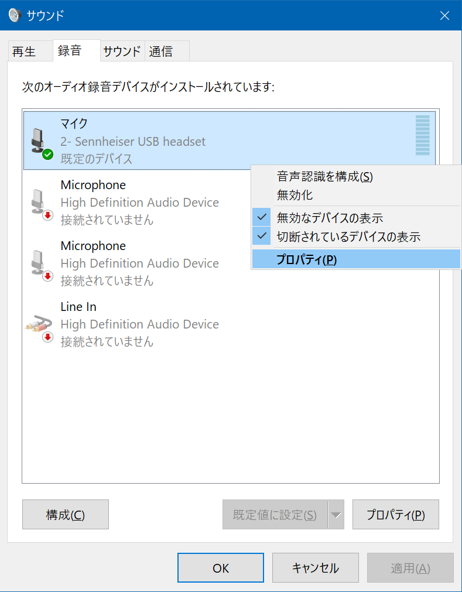

先日紹介した、Dell 4K モニタ S2721QS だが、モニタ内蔵のスピーカーはやはり音質が悪い。低音が出なくて困る。

- 過去記事：[Dell 4K モニタ S2721QS + エルゴトロン LX デスクマウントアーム + ワイドデスクでデスクトップ環境を改善した](./09-01.html)

そこで、_Audio-Technica ATH-M20x_ というヘッドホンを買った。ちょっとキツくて耳が痛くなるが、内部の鉄板をねじ曲げて調整したらマシになった。音声を聴くならコレで良いかなと。

  

    
  

  

    

      <a href="https://www.amazon.co.jp/dp/B00HVLUR18?tag=neos21-22&amp;linkCode=osi&amp;th=1&amp;psc=1">audio-technica プロフェッショナルモニターヘッドホン ATH-M20x スタジオレコーディング / 楽器練習 / ミキシング / DJ / ゲーム ブラック</a>
    

  

  

    
  

  

    

      <a href="https://hb.afl.rakuten.co.jp/hgc/g00r7ld2.waxycfeb.g00r7ld2.waxyddc5/?pc=https%3A%2F%2Fitem.rakuten.co.jp%2Fbiccamera%2F4961310125400%2F&amp;m=http%3A%2F%2Fm.rakuten.co.jp%2Fbiccamera%2Fi%2F10613526%2F">オーディオテクニカ　audio-technica ヘッドホン ATH-M20X [φ3.5mm ミニプラグ][ATHM20X]</a>
    

    

      <a href="https://hb.afl.rakuten.co.jp/hgc/g00r7ld2.waxycfeb.g00r7ld2.waxyddc5/?pc=https%3A%2F%2Fwww.rakuten.co.jp%2Fbiccamera%2F&amp;m=http%3A%2F%2Fm.rakuten.co.jp%2Fbiccamera%2F">楽天ビック（ビックカメラ×楽天）</a>
    

    
価格 : 5300円

  

ほんで今回、_今度は音声を録音できるようにしたいな_、と思い、マイクもしくはヘッドセットを買おうと思った。USB 接続なら楽だろう、オーディオインターフェースって要るの～？って感じだったので、__Sennheiser PC 8__ という USB 接続のヘッドセットを買った。

  

    
  

  

    

      <a href="https://www.amazon.co.jp/dp/B006J3CSES?tag=neos21-22&amp;linkCode=osi&amp;th=1&amp;psc=1">ゼンハイザー PCヘッドセット ヘッドバンド型両耳式/ノイズキャンセルマイク PC 8 USB【国内正規品】</a>
    

  

ゼンハイザーの PC シリーズヘッドセットはどういう違いがあるのかパッと見分かりにくかったので、以下にまとめ。

- PC 2 : 片耳・3.5mm イヤホンジャック接続 (マイクとスピーカーが別れている)
- PC 3 : 両耳・3.5mm イヤホンジャック接続
- PC 5 : 両耳・3.5mm イヤホンジャック接続 (4極)
- PC 7 : 片耳・USB 接続
- PC 8 : 両耳・USB 接続

さらに、Amazon 限定の新モデルとして 3.2・5.2・8.2 というモノもあった。自分が買ったのは PC 8 で、PC 8.2 は細部が違うみたい。

  

    
  

  

    

      <a href="https://www.amazon.co.jp/dp/B07VMSR2HX?tag=neos21-22&amp;linkCode=osi&amp;th=1&amp;psc=1">【Amazon.co.jp限定】ゼンハイザー (Sennheiser) PCヘッドセット VoIP PC 8.2 USB</a>
    

  

  

    
  

  

    

      <a href="https://hb.afl.rakuten.co.jp/hgc/g00ss1d2.waxyc1a1.g00ss1d2.waxydf35/?pc=https%3A%2F%2Fitem.rakuten.co.jp%2Fvelsolare%2F4918404374765%2F&amp;m=http%3A%2F%2Fm.rakuten.co.jp%2Fvelsolare%2Fi%2F10009792%2F">【Amazon.co.jp限定】ゼンハイザー (Sennheiser) PCヘッドセット VoIP PC 8.2 USB</a>
    

    

      <a href="https://hb.afl.rakuten.co.jp/hgc/g00ss1d2.waxyc1a1.g00ss1d2.waxydf35/?pc=https%3A%2F%2Fwww.rakuten.co.jp%2Fvelsolare%2F&amp;m=http%3A%2F%2Fm.rakuten.co.jp%2Fvelsolare%2F">GMOnline楽天市場店</a>
    

    
価格 : 12699円

  

↑ Amazon 限定モデルが楽天でも買える…。

- 参考：[ヘッドセットの「3極」「4極」って？その違いは何？ | ヘッドセット&スピーカーフォン お悩み解決ナビ](https://navi.jade-corp.jp/headset/401)
- 参考：[ゼンハイザーのビジネスヘッドセット（PCシリーズ）の型番ごとの違いとおすすめ | miruhi.net](http://miruhi.net/2020/05/23/%E3%82%BC%E3%83%B3%E3%83%8F%E3%82%A4%E3%82%B6%E3%83%BC%E3%81%AE%E3%83%98%E3%83%83%E3%83%89%E3%82%BB%E3%83%83%E3%83%88%EF%BC%88pc%E3%82%B7%E3%83%AA%E3%83%BC%E3%82%BA%EF%BC%89%E3%81%AE%E5%9E%8B%E7%95%AA/)
- 参考：[ゼンハイザー PC8をレビュー|超軽量ヘッドセット&音声品質はテレワークに最適](https://yuyu-life.blog/gadget/headset/sennheiser-pc-8-usb/)

PC 8 の購入価格は約4,500円。価格帯からいっても音質はそれなりかなーとは思っていたが、自分はコレまで PC に接続するマイクやヘッドセットを吟味したことがなかったので、どのぐらいのモノが届くのか感覚が分からずにいた。

## 接続する PC 側の USB 端子によってノイズ量が大きく変わる

今回自分は、デスクトップ PC の Galleria XG に、このゼンハイザー PC 8 を接続してみたのだが、その際パソコンのどの USB 端子に接続するかで、マイクが拾うノイズ感が大きく変わった。

- _デスクトップ筐体前面の USB 端子：一番ノイズがない_
  - 
  - ↑ PC 前面に接続。隣の Bluetooth レシーバーはノイズ要因にはなっていなかった
- __USB ハブ経由：「ピッピッ」とか「ブーッブーッ」といった定期的なノイズ音がかなりの音量で乗る__
  - 
  - デスク裏に貼り付けてある USB ハブ。この中だと SD カードリーダーが接続されていると凄いノイズが乗る…

要するに __PC 本体の USB 端子に直接繋がないと電気信号がノイズとして乗る__、ということだ。こんなにモロにノイズが録音されるものかと初めて実感した。

USB ハブは、以下の「J5 Create JUH377 A」というモノを使っていて、このハブを PC 本体の裏面にある USB 端子に挿していたのだが、ハブに挿している他のケーブルや SD カードアダプタなどがまたノイズを増強していた。万が一の話だが、USB ハブ経由でしかヘッドセットが接続できないとしたら、ハブの他の端子に接続されているケーブルやアダプタ類は、出来るだけ抜いておくと、ノイズを軽減できるだろう。

  

    
  

  

    

      <a href="https://www.amazon.co.jp/dp/B07K48YXB2?tag=neos21-22&amp;linkCode=osi&amp;th=1&amp;psc=1">j5 create ジェイファイブ クリエイト USB Type A マルチ ハブ USB 3.0 7ポートハブ JUH377 A(ACアダプター付属) Windows Macbook 対応</a>
    

  

幸い、PC 本体の USB 端子には空きがあったので、自分は PC に直挿しすることにしているが、こんなにも電気信号がノイズ音として表れるんだなぁとビックリであった。

## オーディオインターフェースの重要性

ココで、_「オーディオインターフェース」_という装置が何をしているのか？ということがようやく理解できた。

まず、コンデンサマイクなんかだと、XLR キャノンコネクターとかいってオーディオ用のデカい端子で接続する必要があるので、それを PC に接続するためには途中で USB に変換するコネクタが必要になるのだが、その「変換コネクタ」を兼ねているのがオーディオインターフェースである。んで、簡単に「変換」なんて書いたけど、コンデンサマイクを動作させるためのファンタム電源の扱いだったり、受信した音声信号のボリュームやノイズの処理などをオーディオインターフェース側で高速に行い、低遅延で高音質な音声データに変換して PC にお届けしているワケだ。

じゃあ、USB 接続できるヘッドセットはどうなっているのかというと、_ヘッドセット内に超簡易なオーディオインターフェースが内蔵されている_だけなのだ。USB バスパワーで駆動する程度の簡易なオーディオインターフェースでは、微細な電気信号の処理は難しく、結果的に USB 端子の違いなどに影響を受けやすいというワケだ。

なるほど、だからゲーム実況者なんかは、わざわざコンデンサマイクを口元に置いてたりするんだ。_2021年になっても、ああいう高尚な機材を用意しないと、オーディオのノイズって対策できないんだ_、と、ようやく理解できた次第である。

## Windows 側の設定でノイズ感はマシになる

というワケで、USB ヘッドセットのノイズ感をマシにするため、PC 本体の USB 端子に直接続することにして、改めてマイクが拾う音声を聞いてみる。

Windows10 の場合、ゼンハイザー PC 8 を USB 接続すると、「サウンド」の設定ウィンドウ、「録音」タブに、このヘッドセットのマイクデバイスが登場する。

「マイクのプロパティ」から、「このデバイスを聴く」にチェックを入れることで、マイクが拾った音声をすぐさまスピーカーから再生してくれる。コレでリアルタイムに音声のノイズを確認できる。

- なお、「このデバイスを聴く」設定のままデスクトップキャプチャなどで録音すると、デスクトップ上の音声の他にこのマイク音声も同時に録音されてしまうので注意。デスクトップの音声とマイクの音声を別々に録音したい場合はチェックを外しておこう

また、「カスタム」タブにある_「AGC (Auto Gain Control)」_のチェックボックスは、自分はチェックを付けておいた方が音が綺麗に調整されていたので、_チェックは付けておく。_

さて、この状態でマイクが拾う音を聞いてみると、まだノイズが気になる。そこで調べてみると、2つの対処法を見つけた。

### 対処法 1 : サンプルレートを 441,000Hz に下げる

1つ目は、「マイクのプロパティ」→「詳細」で、サンプルレートを「480,000Hz」から_「441,00Hz」_に下げるというモノ。コレだけでノイズ感がだいぶ減った。

### 対処法 2 : 「マイクのセットアップ」で大きな声を出す

2つ目は、「コントロールパネル」→「音声認識」→__「マイクのセットアップ」__という項目を選び、ココでディクテーションを読み上げる際に__出来るだけ大きな声で読み上げる__というモノ。ココで認識させた音量によって、マイクの音質をイイカンジに調整してくれるようだ。自分のマイクに合わせて、普段よりも小さい声で読み上げてみたり、大声で読み上げてみたりして、ノイズが減る方を選んでみよう。

自分の場合は_大きな声_で認識させた方が、ノイズ感が減った。わずかに聞こえていた「ドクッドクッ」「ピーピー」といった電気信号のノイズも、この「マイクのセットアップ」でほとんど聞こえないくらいに改善できた。

## 電源とケーブルが不要な手軽さか、明らかな音質か

ココまでの設定をしてやると、ゼンハイザー PC 8 は、ヘッドホンとしてもマイクとしても、常用に足るレベルで使えるようになった。ビデオ会議や簡単な音声録音ぐらいであれば問題ないだろう。値段の割には使える商品だと思う。

マイクの音質としては、やはり気になりながら使う感じになる。安物で妥協するつもりでいたけど、それでも気になって仕方ないレベルのノイズだった。だから皆 YAMAHA AG-06 に AT2020 なんかを繋いで録音しているんだな、と噛み締めている。「安かろう悪かろう」というより、「ちゃんと高いモノを選ばないとダメ」ってことだなと。

  

    
  

  

    

      <a href="https://www.amazon.co.jp/dp/B08ZS7ZML2?tag=neos21-22&amp;linkCode=osi&amp;th=1&amp;psc=1">YAMAHA / AG03 配信AT2020セット01 -コンデンサーマイク、純正マイクケーブル、ポップブロッカー、ステレオミニケーブル、黒アームスタンド- 6点セット</a>
    

  

USB ケーブル1本で接続すればすぐにヘッドホンとマイクが有効になる手軽さは高いが、オーディオインターフェースとコンデンサマイクをセットアップする方が、録音時のストレスはなくて良いのかもしれない。マイクは金額で選ぶと損をする。使用頻度や求める音質から吟味するべきだと思った。

  

    
  

  

    

      <a href="https://hb.afl.rakuten.co.jp/hgc/g00qjy02.waxycec5.g00qjy02.waxyd4c8/?pc=https%3A%2F%2Fitem.rakuten.co.jp%2Fe-earphone%2F4044155076103%2F&amp;m=http%3A%2F%2Fm.rakuten.co.jp%2Fe-earphone%2Fi%2F10030801%2F">ヘッドセット ゲーミング EPOS JAPAN EPOS PC 8 USB ヘッドホン SENNHEISER マイク付き ゼンハイザー テレワーク Web会議 リモート PC Windows 【送料無料】</a>
    

    

      <a href="https://hb.afl.rakuten.co.jp/hgc/g00qjy02.waxycec5.g00qjy02.waxyd4c8/?pc=https%3A%2F%2Fwww.rakuten.co.jp%2Fe-earphone%2F&amp;m=http%3A%2F%2Fm.rakuten.co.jp%2Fe-earphone%2F">eイヤホン楽天市場店</a>
    

    
価格 : 5060円

  

  

    
  

  

    

      <a href="https://hb.afl.rakuten.co.jp/hgc/g00tkd82.waxyc055.g00tkd82.waxyd3d1/?pc=https%3A%2F%2Fitem.rakuten.co.jp%2Fjugem2020%2F10000716%2F&amp;m=http%3A%2F%2Fm.rakuten.co.jp%2Fjugem2020%2Fi%2F10000716%2F">ゼンハイザー PCヘッドセット ヘッドバンド型両耳式/ノイズキャンセルマイク PC 8 USB【国内正規品】</a>
    

    

      <a href="https://hb.afl.rakuten.co.jp/hgc/g00tkd82.waxyc055.g00tkd82.waxyd3d1/?pc=https%3A%2F%2Fwww.rakuten.co.jp%2Fjugem2020%2F&amp;m=http%3A%2F%2Fm.rakuten.co.jp%2Fjugem2020%2F">JUGEM　楽天市場店</a>
    

    
価格 : 5480円

  

- 参考：[黒柚にゃんと有限世界の妖精たちのブログ - USBマイクでもノイズ出る事を知った！](http://black-yuzunyan.lolipop.jp/archives/3844)
- 参考：[windows-7 — USBマイクがビープ音を鳴らしている](https://www.it-swarm-ja.com/ja/windows-7/usb%E3%83%9E%E3%82%A4%E3%82%AF%E3%81%8C%E3%83%93%E3%83%BC%E3%83%97%E9%9F%B3%E3%82%92%E9%B3%B4%E3%82%89%E3%81%97%E3%81%A6%E3%81%84%E3%82%8B/959332824/)
