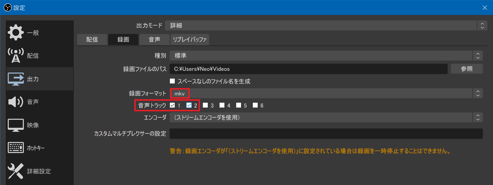
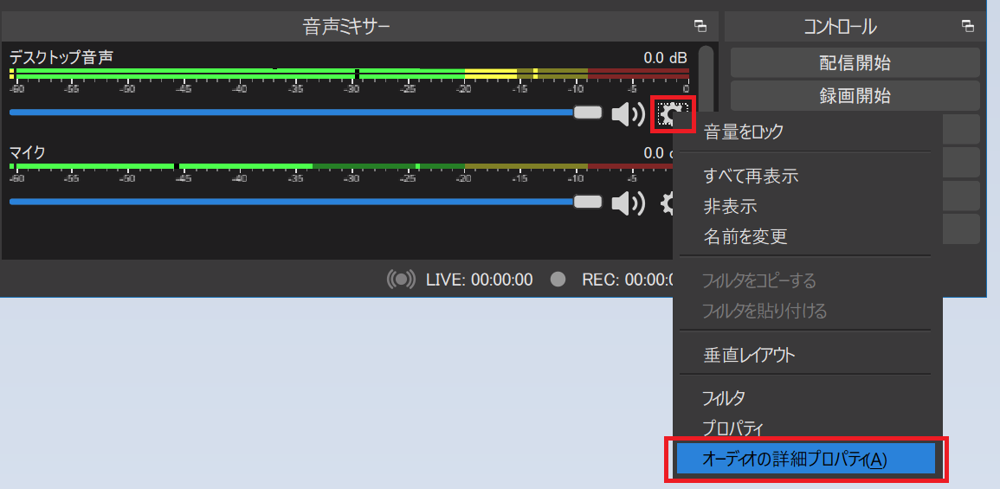
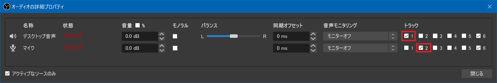
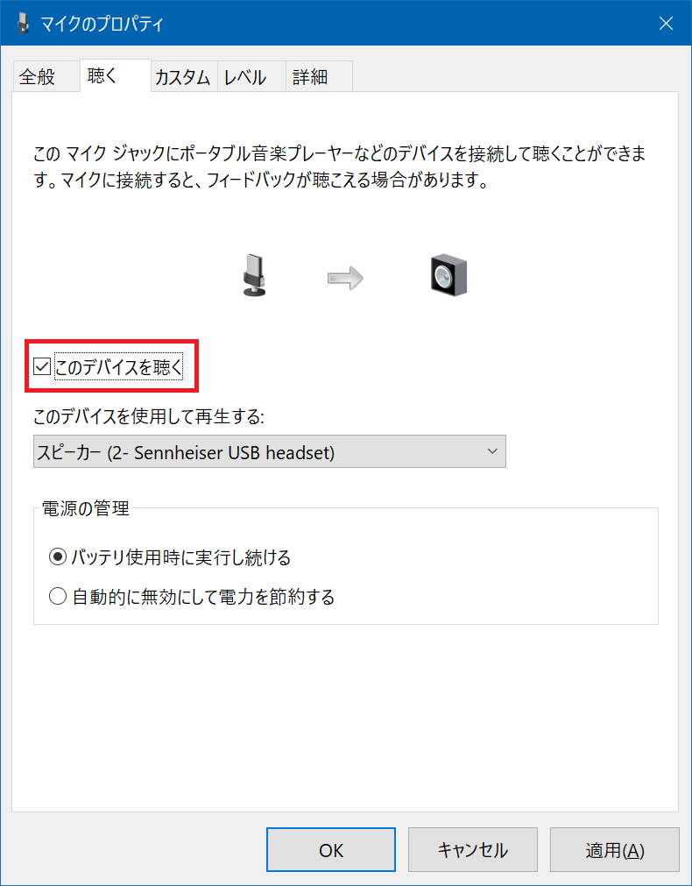
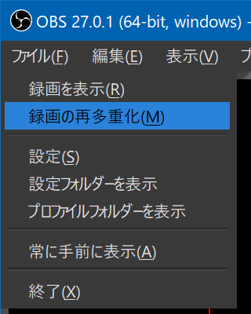

OBS Studio というフリーソフトを使って、ゲーム実況を録画・録音してみようと思った。

- [ダウンロード | OBS](https://obsproject.com/ja/download)

このソフトはビデオチャット時の映像加工に使ったことがあって、ゲーム実況者が使っている記事も見たことがあったのでコレを選んでみた。

マイクは、昨日の記事で紹介した「ゼンハイザー PC 8」というヘッドセットのマイクを利用するが、どのマイクをどう繋いでいても同じで、今回の主旨には影響しないと思われる。

ゲーム実況動画を収録する際、ゲームの映像は勿論録画するとして、*Windows10 上で動作しているゲームの音声と、マイクの音声を別々に録音したい*と思った。そのためには OBS Studio でいくつかの設定が必要なので紹介する。

## ゲーム音とマイク音を分けて録音する

- 参考：[【OBS】ゲーム音・マイク音を分けて、別々に録画する方法。別撮りのポイント - 新・VIPで初心者がゲーム実況するには](https://vip-jikkyo.net/multiple-audio-tracks-in-obs)

再初にチェックするポイント。「設定」→「出力」→「録画」タブで、以下2つの設定をする。

- 録画フォーマット：「*mkv*」にする
  - 後述するとおり mkv 形式では Adobe Premiere Pro を読み込めないのだが、「mp4」形式にすると録画ファイルが破損した時に復旧が困難なので、一旦 mkv で録画し、後で mp4 形式に「*再多重化*」する方が安全
- 音声トラック：**「1」と「2」** を選択する
  - このあとの設定と合わせて、トラック1がデスクトップ音声、トラック2がマイクの音声となる

続いて、メインウィンドウの「音声ミキサー」にて、歯車アイコンから「*オーディオの詳細プロパティ*」を選択する。

開いたウィンドウで、

- デスクトップ音声は「トラック1」のみにチェック
- マイク音声は「トラック2」のみにチェック

という風に、チェックボックスを操作する。コレで、音声デバイスと録音するトラック番号の対応付けを行う。

コレで設定完了。

なお、注意点として、「マイクのプロパティ」で **「このデバイスを聴く」にチェックを入れていると、デスクトップ音声側でもマイク音を録音してしまうので、このチェックを外しておくこと**。

↑ 「このデバイスを聴く」のチェックが外れていることを確認しよう。

コレで後は録画すれば良い。

## 収録した動画の音声をトラック別に確認する

動画を収録したら、mkv ファイルが生成されているので、正しく2トラック録音されているか確認しよう。

トラック別の音声が確認しやすいプレイヤーは、MPC-HC (Media Player Classic) か、VLC Media Player のいずれかだろう。これらのソフトで mkv 動画を再生し、「オーディオトラック」を選択すれば、ゲーム音のみ、もしくはマイク音のみが聞こえることが確認できる。

## Adobe Premiere Pro で mkv 動画を編集できない → 再多重化を行う

こうして収録した動画を Adobe Premiere Pro で編集しようとしたら、mkv 形式は Premiere Pro で編集できないらしい。

そこで、OBS Studio が持つ「録画の再多重化」という機能を利用して、動画ファイルの形式を mp4 に変換してやる。

- 参考：[OBSで録画した動画を編集ソフトで読み込めない、投稿できないときの対処法 - 新・VIPで初心者がゲーム実況するには](https://vip-jikkyo.net/obs-studio-mkv-to-mp4)

↑「ファイル」→「録画の再多重化」と進み、mkv ファイルを指定すれば、mp4 形式にすぐ変換してくれる。コイツを Premiere Pro に取り込めば、無事音声トラックを別々に収録した動画を編集できる。

設定の中に、録画終了後に自動的に mp4 ファイルを生成する自動多重化設定もあるので、お好みで。

  

    
  

  

    

      <a href="https://www.amazon.co.jp/dp/4047299987?tag=neos21-22&amp;linkCode=osi&amp;th=1&amp;psc=1">ネットには書いてないゲーム実況者になるための本 (エンターブレインムック)</a>
    

  

  

    
  

  

    

      <a href="https://www.amazon.co.jp/dp/B089D3C4L2?tag=neos21-22&amp;linkCode=osi&amp;th=1&amp;psc=1">Youtubeでゲーム実況を始めよう！: １日１再生もされなかった私のチャンネルも、この方法で登録者数10万人を越えました！</a>
    

  

  

    
  

  

    

      <a href="https://hb.afl.rakuten.co.jp/hgc/g00reb42.waxycf23.g00reb42.waxyd080/?pc=https%3A%2F%2Fitem.rakuten.co.jp%2Frakutenkobo-ebooks%2Fcdf9fdda293736d4b24b83ae366e712c%2F&amp;m=http%3A%2F%2Fm.rakuten.co.jp%2Frakutenkobo-ebooks%2Fi%2F16363231%2F">パパはゲーム実況者　ガッチマンの愉快で平穏な日々【電子書籍】[ トラちん ]</a>
    

    

      <a href="https://hb.afl.rakuten.co.jp/hgc/g00reb42.waxycf23.g00reb42.waxyd080/?pc=https%3A%2F%2Fwww.rakuten.co.jp%2Frakutenkobo-ebooks%2F&amp;m=http%3A%2F%2Fm.rakuten.co.jp%2Frakutenkobo-ebooks%2F">楽天Kobo電子書籍ストア</a>
    

    
価格 : 1100円

  

  

    
  

  

    

      <a href="https://hb.afl.rakuten.co.jp/hgc/g00reb42.waxycf23.g00reb42.waxyd080/?pc=https%3A%2F%2Fitem.rakuten.co.jp%2Frakutenkobo-ebooks%2Feafb2a4ff45933d9959926ab15e6fd0c%2F&amp;m=http%3A%2F%2Fm.rakuten.co.jp%2Frakutenkobo-ebooks%2Fi%2F16674268%2F">ゲーム実況動画をつくる本 VOICEROID2使いこなしガイド【電子書籍】[ イワサキアキラ ]</a>
    

    

      <a href="https://hb.afl.rakuten.co.jp/hgc/g00reb42.waxycf23.g00reb42.waxyd080/?pc=https%3A%2F%2Fwww.rakuten.co.jp%2Frakutenkobo-ebooks%2F&amp;m=http%3A%2F%2Fm.rakuten.co.jp%2Frakutenkobo-ebooks%2F">楽天Kobo電子書籍ストア</a>
    

    
価格 : 1782円

  

