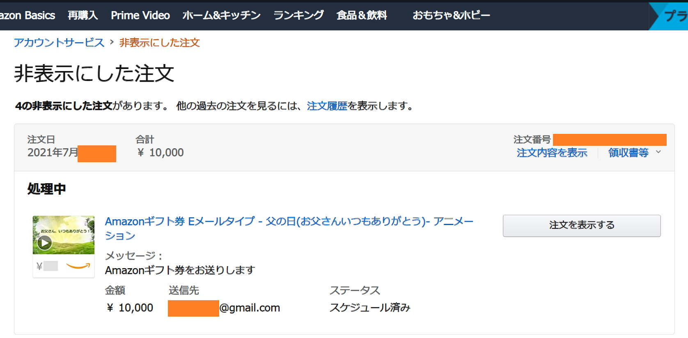
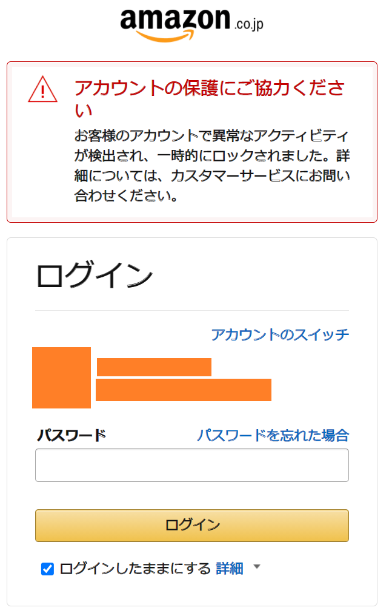
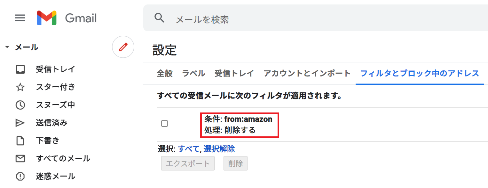

IT エンジニアとして仕事をしていながらとても恥ずかしい事案なのだが、注意喚起のため情報共有しておく。

---

先日、Gmail と Amazon アカウントに不正ログインされ、Amazon ギフト券を不正購入されてしまった。幸い、Amazon 側が不正注文から30分程度で僕に連絡をくれて対応してくれたので、金銭的な被害は出なかったが、あやうく Gmail と Amazon のアカウントをまるごと乗っ取られて身に覚えのないクレカ請求を食らうところであった。

## 発覚の経緯

7月某日の夕方、のんびり過ごしていたら以下の電話番号から電話がかかってくる。

- `03-4578-0364`

電話口の女性は「Amazon の監査チームです」とかなんとか名乗ったと思う。相手は「**1万円の Amazon ギフト券が購入されているが、あなたが購入したものか？**」と聞いてきた。

全く身に覚えがないので、慌てて Amazon アカウントにログイン。「注文履歴」を見るも、アマギフの注文履歴はない。そこでハッと気付き、「アカウントサービス」→「**非表示にした注文の表示**」を開く。するとビンゴで、そこには身に覚えのないアマギフの注文履歴が非表示で隠されていた。

- 購入に使用されたのは自分が登録していたクレジットカード
- アマギフの送り先は、この Amazon アカウントと同じ Gmail アカウント。つまり「僕」が「僕自身」にアマギフを買ったかのような注文になっていたのだ
- 「Amazon ギフト券をお送りします」というメッセージはデフォルトの定型文なのかな？よく知らない。もし手入力していたのであれば、犯人は多少でも日本語が分かる人物であろう

電話先に「『非表示にした注文』に入ってました、自分が注文したものではありません」と答えると、相手は「*不正アクセスの可能性があるのでアカウントを5時間ほど凍結します。凍結解除後、また案内しますので、そしたらパスワード変更などを行ってください*」といわれ、電話が切れた。

---

…ココで別の疑問がよぎる。**今の電話は、本当に Amazon からの電話だったのか？**

電話番号は前述のとおり通知されていたので、急いでこの電話番号をググってみる。どこかの勧誘電話でも使われていたらしく、「疑わしい電話番号」という情報も出てくるし、「Amazon 詐欺窓口」といった文言でのタレコミもあった。本物なのか？偽物なのか？イマイチ分からない。

この時点では半信半疑だったので、慌てて Amazon アカウントのパスワードを変更した。すると変更が完了した直後、アカウントが凍結されたらしく、次のような画面に遷移した。

Amazon アカウントがロックされた。コレは、電話の相手がやったのか？それとも今この瞬間、不正アクセスしている犯人と、パスワード変更した自分のアクティビティがバッティングしたりして凍結されたのか？色々な推測が頭をよぎる。

そうこうしていると、*先ほどと同じ電話番号から再度電話があった。*「まず注文はキャンセルしましたので、クレジットカードへの請求は反映されません。アカウントの凍結も開始しました」という案内だった。そこでコチラは、

- 「どうして不正注文が分かったんですか？」
- 「そちらの電話が Amazon 公式であることを証明する方法はありますか？」

と、直球で質問してみた。

不正注文に関しては、詳しいことは言えないが、ずっと何がしか監視をしていて見つけたのだという、そして、Amazon 公式であることを確認したいのであれば、お客様からフリーダイヤルのコールセンターにかけてみてください、といわれた。また、「*アカウント凍結について、メールでもご案内をお送りします*」といわれた。

---

ひとまず、電話口のいうことが真実なら、

1. アカウントは今から凍結され、5時間程度復旧にかかる
2. Amazon 側としてアカウントを凍結した旨がメールで届く

ということだが、2つ目のその**メールとやらが、一向に届かなかった**。Gmail の受信トレイを何度も更新したが、何のメールも届かず。

本当にあの電話は Amazon からだったのか？Amazon のサイトも確認して、以下のカスタマーサービスに電話してみた。

- `0120-899-543`
- 参考：[Amazon.co.jp ヘルプ: 特定商取引法に基づく表示](https://www.amazon.co.jp/gp/help/customer/display.html?nodeId=202008070)

電話をすると、ほぼ待たされることなくオペレーターに繋がった。アカウント情報を教えると、「なんかロックされてますね？」と言われる。

「いや、その件で電話したんです。さっき `03-4578-0364` という番号から電話があって、Amazon を名乗っていて、不正注文があった、アカウントを一時凍結する、と言ってたんですが、本当に Amazon さんの作業なんですか？確認できますか？」

こんな感じのことを聞いてみた。

調べてもらったところ、*自分にかかってきた電話は、正真正銘 Amazon の「アカウントスペシャリスト」からの電話であり、Amazon 公式による正当な対応であった*ことが分かった。

カスタマーサービスの方でも、分かる内容・分からない内容があるようだったが、

- Amazon アカウントスペシャリストによって、不正注文がキャンセルされていること
- Amazon アカウントスペシャリストによって、僕のアカウントが一時凍結されていること

は確実であった。つまり、「Amazon をかたるニセの電話」ではないことが確定した。

「ただ、メールを送りますと言ってたんですが、メールが届いていないんですよね。再送信ってそちらからしていただけますか？」と聞いてみたら、カスタマーサービスからメールを再送信してもらえた。しかし、*やっぱりメールが受信トレイに届かない。*

- 僕「あれ、やっぱり届いてないですね…」
- オペレータ「さすがにもう届いてるはずですけど、何でしょうね…」

Amazon の人が、Gmail の細かいことは分からなくても仕方ないよな。なんだろう、迷惑メールに入っているのか？でもそうだとしたら、未読件数が付くよなぁ？

そんな風に思いながら **「ゴミ箱」を見てみると、そこには Amazon からのメールがブチこまれていた。**

……嫌な予感がした。

*Gmail のフィルタ設定を見てみる。*

……。

**知らないメールフィルタが追加されている**。どうも、Amazon からのメールをゴミ箱に転送するメールフィルタが作られているようだ。

- 僕「あ、メールありました。自分はアカウント凍結解除まで待つしかないんですよね」
- オペレータ「そうですね。また何かあったらいつでもご連絡ください」

…そうして電話を切った直後、僕は **Gmail アカウントのパスワードを変更し、2段階認証を設定した。**

## Gmail アカウントが先に漏洩した可能性

被害を整理しよう。

- Amazon で不正な注文がされていた
- Gmail のフィルタ設定に、「Amazon からのメールを削除する」設定が勝手に追加されていた

コレってつまり、**犯人は Amazon アカウントにも Gmail アカウントにもログインしていた**ってことだよね…？

自分が使っていたメールアドレスを、以下の「*Have I Been Pwned*」で調べてみる。

- [Have I Been Pwned: Check if your email has been compromised in a data breach](https://haveibeenpwned.com/)

*僕のメールアドレスは、2件の漏洩事件に遭遇していた。*

- Cit0day : 2020年11月に23,000以上のウェブサービスから収集されたユーザデータが流出していた
  - 参考：[UJP - カミさんのメアドに迷惑メールが増えた理由](http://www.ujp.jp/modules/d3blog/details.php?bid=7220)
  - 参考：[200以上の国内サービスからパスワードが流出か、暗号化していても犯人は「解読済み」 | 日経クロステック（xTECH）](https://xtech.nikkei.com/atcl/nxt/column/18/00598/082600091/)
- Lifebear : iOS 用のカレンダーアプリ。2019年にメールアドレスとパスワードが流出していた

確かにこの Gmail アカウントで Lifebear に接続していたし、Amazon の他にもいくつかのウェブサービスで利用しているアカウントであった。

そして迂闊だったのだが、**Gmail と Amazon は、同じパスワード文字列を流用しており、いずれも2段階認証を設定していなかった**。全く恥ずかしい…。*使用頻度が高くないアカウントだったので雑に扱っていたが、それが仇となった*。Gmail も Amazon も、アカウントごと乗っ取られかけていたのである。Amazon から連絡をもらった時、まだパスワード変更等がされていなくて、僕がアクセスできる状態だったのは、不幸中の幸いだったのかもしれない。もう少し発見が遅れていたら、パスワードをごっそり変更されて、僕がログインできなくなっていたかもしれない。

## 2段階認証、大事！！

Gmail アカウントにまでログインされていると思うと気持ち悪くて仕方ないが、いくつかのウェブサービスで使っているアカウントなので、今すぐこのメアドを捨てることも難しく。まずは難解なパスワードに変更し、2段階認証を念入りに設定、少しでも個人が特定できそうなアクティビティや履歴などの類は全て削除した。もう遅いかもしれないが、一応やっておいた。

Amazon のアカウントは、結局、*最初に Amazon から電話を受けた時刻から約2時間半ほどしたところで、ログインができるようになった*。5時間もかからなかったのねん。電話中に一度パスワード変更をしていたが、また別のパスワードに変更し、こちらも2段階認証を設定した。

復旧したアカウントで注文履歴を見てみると、「非表示にした注文」からも、アマギフの不正注文は完全に削除されていた。Amazon 様様である。

念のため、再度カスタマーサービスに電話した。先程とは別のオペレーターが出たが、アカウント情報を教え、「無事復旧してもらえた」旨を伝えると、オペレーターもダブルチェックしてくれた。

- パスワード変更、2段階認証がちゃんとなされていて、コレでひとまずは大丈夫であろう
- もしまだ心配なら、この Amazon アカウントは削除し、別のメールアドレスを作り、Amazon アカウントも作り直すと確実だろう
- コロナも流行っているので、お体にはお気を付けて

…と、最後はアカウント乗っ取りとは関係ないことまでオペレーターにお気遣いいただいた。

## 「面倒臭い必要性」がある

2段階認証とかめんどくせーなー、とか、長ったらしいパスワード打ちたくねーなー、とか、パスワードマネージャーに全部覚えさせちゃお、とか、ついつい思いがちで、自分もそう思っていた。

しかし、そんなパスワードマネージャーを使っている Gmail アカウント自体が乗っ取られたら。パスワードを使い回して横着したことで Amazon アカウントも当たりが付けられてしまったら。2段階認証を設定していなかったことで、今回みたいにログインに成功し、不正な注文ができてしまったら。

…というか、自分は実際にこうやって、不正注文をされたのだ。

今回はたまたま、Amazon アカウントスペシャリストによる監視と対応が迅速だったために、注文を早々にキャンセルでき、クレジット請求もされずに済んだが、こうした監視をすり抜ける場合も多いだろう。

**パスワードを使い回さない、2段階認証を使う、安易に情報を1箇所にまとめない。**

これらは「利便性 ⇔ 面倒臭さ」と「セキュリティ」のトレードオフだが、セキュリティが侵害された結果、失うのは金銭・アカウントそのものになる。天秤にかけるまでもなく、**面倒臭さを取るべきだろう。**

一方、「スマホがないとログインできなくなるのもおっかないなぁ」とは思う。ウェブサービスによっては、2台目の携帯電話番号も登録できる仕組みがあったりもするが、スマホが壊れたりなくしたりしたらアウトじゃね？なんて思いもある。

- 参考：[iPhone紛失した時、二段階認証かけている場合どうするの？を解決│ぐーたらガジェット備忘録](https://gutaramemo.com/1321/)
  - 「iPhone を探す」だけは2ファクタ認証を飛ばせる

しかし、自分は今までスマホを紛失・破損したことはない (2014年のフエルサブルータで、覚悟の上で水没させたことはあるがｗ)。今後も、恐らくスマホをなくすようなことはそうそうしないだろう。その心配と、2段階認証をしないリスクと、どちらを取るというのか。万が一で、スマホをなくした際の対処法は、予め押さえておけば済む話。電話番号・SMS による2段階認証か、「VIP Access」「Google Authenticator」などの認証アプリによる認証の仕組みを必ず入れておこう。

## 全部でこんな対策をした

結局、自分はどんな対策をしたかというと、以下のとおり。

1. サービスごとにユニークなパスワードに変更した
    - 利用サービスが数百あって死にそうだったが、Amazon・Gmail アカウントを乗っ取られかけた日から24時間以内に、自分が使う**全てのサービス**でパスワードを変更した
    - 全て暗記するのは辛いし、どこかに書き留めてしまっては意味がないので、以下のような感じでルールを作った
    - パスワードの文字数を稼ぐために「共通で書く文字列」と、「サービスから個人的に連想するキーワード」を、自分で決めたルールに従って混ぜて記入する
    - 「連想するキーワード」の連想の仕方にも規則性があるが、僕個人の知識・思想を混ぜないと絶対に到達できないキーワードになるので、一般的な辞書的な攻撃では特定ができないようにした
    - ココの「バレない規則性」を編み出すのは大変だが、重要なサービスでは以前から採用していた手法ではあって、でも今回はその規則性を新たに作り直し、例外なく全てのサービスでパスワードを変更した
2. 2段階認証を可能な限り入れた
    - そのサービスが提供する2段階認証の仕組みのうち、ケータイを利用するモノを最優先にし、複数導入できる場合は全部導入した
    - ハードウェアトークンは持っていないので導入しなかったが、超重要なサービスでは入れてもいいかも。バックアップ用にもう一つ携帯電話番号を持つかも悩んでる
    - バックアップコードなどは手書きのメモで残すことにした。後述するとおり、これらも平文では書き残していない
3. 余計なウェブサービスは退会した
    - 登録したサービス数が多かったので、かなり整理した
4. ソーシャルログインは利用するアカウントと対象のサービスを限定する
    - 特に、クレジットカード情報を入力するサービスなんかで、やたらと考えなしにソーシャルログインを使わないようにした。必ず複数の方法で認証と確認ができるようにしておく
5. 出来るだけクレジットカードを登録しないでおき、登録が必要な場合は限度額が低いクレジットカードを登録しておいた
    - 買い物に便利だからといって、限度額が大きいクレジットカードを登録しっぱなしだと、今回のような場合におっかない。クレジットカード情報や、銀行自動引落の設定は、出来るだけ削除するようにした。面倒でも、使う時に毎回入力することにする
    - 課金上の制限で、どうしてもクレジットカードを登録しておかないといけないサービスに対しては、限度額が低いクレジットカードを登録しておき、利用速報をメールで飛ばすようにしておいた。コレで悪用された際の発見を早め、被害を小さくする
6. 全てのパスワードマネージャーの利用を止めた
    - Chrome Gmail、Firefox Sync、Brave Sync、Avast Passwords などのパスワードマネージャーをテキトーに使っていたが、全てのパスワードマネージャーからデータを削除し、可能なものはアカウントごと削除した
    - iPhone Safari からもパスワードは全て削除した
    - そのうえでさらに、パスワードや住所の自動入力設定、および同期設定をオフにした
    - 毎回手入力にする。キーロガー仕込まれてたら終わりだけど…
7. メモは手書き・かつ・平文では利用できない暗号で書く
    - 今までは、ちょっとした無料サービスなんかだと、テキストファイルにパスワードのヒントをメモ書きしてその辺に転がしたりしていたが、全て止めた
    - パスワードに規則性はあるものの、その規則性は「今の僕の脳ミソ」がないと編み出せない。僕が大事故に遭って記憶を失ったり、死んだりした時に、自分自身や信頼する人物にも何も出来なくなってしまう
    - そこで、「よく読んでパズルを解けば規則性を理解できる」という暗号パズルを作り、手書きのメモにしたため、保険証券などと一緒にファイルに閉じておいた。コレで、僕が記憶を失った時は、ファイルを開いてパズルを解けば何とか復旧できる
    - 手書きのメモだからといって平文では書かない、そこは横着・妥協・例外を作らないようにした
    - 暗号パズルに関しても、「家族の中でしか理解できないキーワード」を散りばめたり、「僕が使う PC の指定の階層にある画像ファイルを開かないと分からない情報」をヒントに仕込んだりした。僕は PC・スマホを数台ずつ持っていて、クラウドサーバもいくつか持っているので、それらに同じ「ヒント情報」を冗長配置しておいた。この「ヒント情報」は単体で閲覧されても意味をなさない、なんならウェブ上に公開しても大丈夫な内容にしてある

どうよこの念の入れよう。最初からそうしとけって。ｗ

家族にも、こうした対策の方針は連携してあって、「俺が死んだ時は、エントリポイントのヒントはコレだから、なんとかエントリポイントを見付けて、そこから第2・第3ヒントを頑張って解いて、重要なアカウントの後処理をしてほしい」と伝えておいた。

我が家はたまたま、家族の人数がまぁまぁいて、それぞれ地理的に離れたところに住んでいるので、家族も「DR 構成」が取れている、というか。ｗ 大震災なんかが起きたとしても、誰か一人は生き残って、僕が残したヒントメモに辿り着いて後処理が出来るだろうと思っている。

## 皆さんもくれぐれもご用心を

パスワードマネージャを使うべきか否か、メモの手書きをどこまで徹底するか、粒度は人それぞれポリシーがあるだろうけど、今回少なくとも、**パスワードの使い回し・2段階認証は何があってもサボったらいかん**、ということは身を持って経験した。

金銭的な被害を防ぐためにも、*利用するサービス数は減らす、クレカや銀行の連携設定を減らす、ログインや出金の通知は五月蝿くても設定しておく*、あたりが大事であろう。

**Gmail のフィルタ設定までイジられる**ことを想定して、迷惑メールフォルダ、ゴミ箱フォルダの中身も、できるだけ大事なメールがないか確認することにする。迷惑メールフォルダのスパムメールを踏んでマルウェアを拾ってしまわないようにだけは注意…。ｗ

いやーホントおっかなかった。Amazon の迅速な対応にも感謝感謝である。業務で AWS のスペシャリスト目指して販促して恩返しします。ｗ

  

    
  

  

    

      <a href="https://hb.afl.rakuten.co.jp/hgc/g00reb42.waxycf23.g00reb42.waxyd080/?pc=https%3A%2F%2Fitem.rakuten.co.jp%2Frakutenkobo-ebooks%2F845c0eaacffb3066a802d8ff9b224583%2F&amp;m=http%3A%2F%2Fm.rakuten.co.jp%2Frakutenkobo-ebooks%2Fi%2F20037364%2F">すぐそこにあるサイバーセキュリティの罠【電子書籍】[ 勝村 幸博 ]</a>
    

    

      <a href="https://hb.afl.rakuten.co.jp/hgc/g00reb42.waxycf23.g00reb42.waxyd080/?pc=https%3A%2F%2Fwww.rakuten.co.jp%2Frakutenkobo-ebooks%2F&amp;m=http%3A%2F%2Fm.rakuten.co.jp%2Frakutenkobo-ebooks%2F">楽天Kobo電子書籍ストア</a>
    

    
価格 : 1980円

  

  

    
  

  

    

      <a href="https://www.amazon.co.jp/dp/B017CUAM7G?tag=neos21-22&amp;linkCode=osi&amp;th=1&amp;psc=1">サイバーセキュリティ2020　脅威の近未来予測 (NextPublishing)</a>
    

  

  

    
  

  

    

      <a href="https://hb.afl.rakuten.co.jp/hgc/g00q0722.waxyc9ff.g00q0722.waxyd017/?pc=https%3A%2F%2Fitem.rakuten.co.jp%2Fbook%2F15667684%2F&amp;m=http%3A%2F%2Fm.rakuten.co.jp%2Fbook%2Fi%2F19358605%2F">決定版　サイバーセキュリティ 新たな脅威と防衛策 [ ブループラネットワークス ]</a>
    

    

      <a href="https://hb.afl.rakuten.co.jp/hgc/g00q0722.waxyc9ff.g00q0722.waxyd017/?pc=https%3A%2F%2Fwww.rakuten.co.jp%2Fbook%2F&amp;m=http%3A%2F%2Fm.rakuten.co.jp%2Fbook%2F">楽天ブックス</a>
    

    
価格 : 1980円

  

