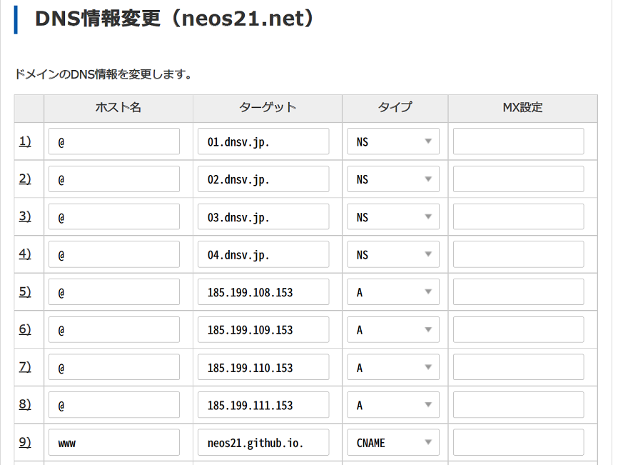
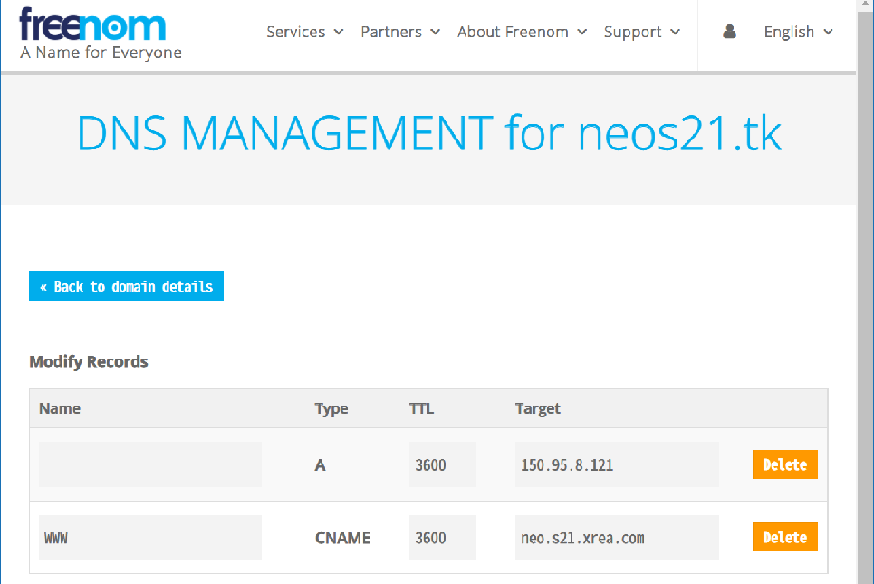

XREA Plus が2,514円/年もかかるのは高いなぁと思い、ホスティング先を XREA サーバから GitHub Pages に変えた。

- 過去記事：[Value Domain・XREA Plus を更新した](./23-01.html)
- 過去記事：[ホスティング先を XREA から GitHub Pages に変えた](./25-01.html)

今回はその技術的な詳細について書いておく。

## 目次

## 移行方針

このサイトは現状、静的なコンテンツしかないので、GitHub Pages に移行することで特に問題はなかった。XREA Plus は広告も除去されていて、元々広告がない GitHub Pages 向けに調整する必要はなかった。

`neos21.net` というドメインを取得しているので、DNS で向き先だけ変えれば、既存の URL 等には影響がないようにしたく、移行作業をしていった。

## GitHub Pages に独自ドメインを割り当てる

[GitHub リポジトリ自体は以前から変わらず同じ。](https://github.com/Neos21/neos21.net)ただし今回の移行作業の中で、リポジトリの要領削減のため_過去のコミットを全て削除した。_その話は後述。

まずはローカルで全量ビルドし、`gh-pages` ブランチに全資材を Push した。その際、`neos21.net` というドメイン名だけを書いた _`CNAME` という1行のファイル_をルート直下にコミットしている。

次に GitHub リポジトリの「Settings」→「Pages」画面に移動し、

- 「Source」が `gh-pages` ブランチの `/ (root)` を指していること
- 「Custom Domain」に `neos21.net` が指定されていること
  - (CNAME ファイルを検知していること)

を確認する。

そしたら、_DNS 設定を変更_していく。以下の GitHub 公式ドキュメントを参考に設定する。

- [GitHub Pages サイトのカスタムドメインを管理する - GitHub Docs](https://docs.github.com/ja/pages/configuring-a-custom-domain-for-your-github-pages-site/managing-a-custom-domain-for-your-github-pages-site)

`neos21.net` ドメインは Value Domain で管理しているので、Value Domain の DNS 設定に移る。

- NS レコードはとりあえずそのままで、
- Apex ドメイン (`@`) に対して GitHub Pages 用の IP を指定した A レコード4つ、
- `www` に対して `neos21.github.io` という自分の GitHub Pages のユーザサイト URL を指定した CNAME レコードを1つ

指定する。



設定後、1・2時間待って `dig` コマンドで確認した時に、以下のようなレコードが取得できていれば OK。

```bash
# ネイキッドドメインに対する NS レコードはそのままにしておく
$ dig neos21.net +nostats +nocomments +nocmd -t NS
;neos21.net.                    IN      NS
neos21.net.             0       IN      NS      01.dnsv.jp.
neos21.net.             0       IN      NS      02.dnsv.jp.
neos21.net.             0       IN      NS      03.dnsv.jp.
neos21.net.             0       IN      NS      04.dnsv.jp.

# ネイキッドドメインには A レコード4つ
$ dig neos21.net +nostats +nocomments +nocmd
;neos21.net.                    IN      A
neos21.net.             0       IN      A       185.199.108.153
neos21.net.             0       IN      A       185.199.109.153
neos21.net.             0       IN      A       185.199.110.153
neos21.net.             0       IN      A       185.199.111.153

# www ドメインには CNAME のみ
$ dig www.neos21.net +nostats +nocomments +nocmd
;www.neos21.net.                        IN      A
www.neos21.net.         0       IN      CNAME   neos21.github.io.
```

ちなみに、Freenom で取得している無料ドメインを使って、Freenom DNS でも試してみたのだが、Freenom でも同様に、A レコード4つ、CNAME レコード1つを作れば1・2時間でしっかり反映された。

Freenom DNS も Value Domain も、若干 `www` ドメインに対する CNAME の反映がちょっと遅れた。ネイキッドドメインでは上手くアクセスできるのに、`www` サブドメインが付いているとまだ反映されていない、みたいな状態が長めに続いた。

DNS の反映が終わったら、再び GitHub リポジトリの「Settings」→「Pages」画面に戻る。

> Your site is published at https://neos21.net/

と無事表示されたら、下部にある**「Enforce HTTPS」チェックボックス**が押下できるようになっていると思う (なっていなかったら F5 更新などして試してみてほしい)。コレにチェックを入れることで、HTTPS 化してくれる。コレも反映には若干時間がかかるので、10分程度は気長に待とう。

コレでドメイン設定は完了。すげー簡単だった…！

GitHub Pages への CNAME ファイル設置・DNS 設定変更と反映待ち・Enforce HTTPS までが完了したら、アクセス URL は次のようになるはずだ。

- `https://neos21.net/` へのアクセス → そのままブラウザのアドレスバーに表示される
- `https://neos21.github.io/neos21.net/` (ホスティングしている GitHub Pages の本来の URL) → HTTP 301 で `https://neos21.net/` にリダイレクトされる
- `https://www.neos21.net/` (`www` 付き) → HTTP 301 で `https://neos21.net/` にリダイレクトされる

`$ dig` コマンドの他、`$ curl -I` でヘッダ情報を確認してみたり、`$ nslookup` でも疎通確認してみたりすると良いだろう。TTL の関係で、反映には1時間はかかると思って良いだろう。どうも外部の dig サービスだと反映されているのに、ローカルからコマンド実行するとまだ反映されていない、みたいな状態は結構長めに続いた印象。

- 参考：[http - How can I use dot.tk domain with GitHub Pages? - Stack Overflow](https://stackoverflow.com/questions/44081863/how-can-i-use-dot-tk-domain-with-github-pages)
- 参考：[freenomで無料ドメインを取得してみる - はしくれエンジニアもどきのメモ](https://cartman0.hatenablog.com/entry/2019/03/05/)
- 参考：[freenomで無料ドメインを取得してGitHub Pagesに独自ドメインを設定してみた - Qiita](https://qiita.com/lamplus/items/9451bc2f1f4612f9e647)
- 参考：[Github PagesにValue Domainを使って独自ドメインを割りあてる - Qiita](https://qiita.com/dropcontrol/items/e955f9aabe3c0926d081)
- 参考：[jekyll - Github pages redirect non www (root domain) to www subdomain - Stack Overflow](https://stackoverflow.com/questions/59596179/github-pages-redirect-non-www-root-domain-to-www-subdomain)
- 参考：[Custom domain for GitHub pages - DEV Community](https://dev.to/aurangzaibdanial/custom-domain-for-github-pages-18a2)
- 参考：[GitHub Pages に カスタムドメイン を 設定 ( Google Domains, VuePress ) - BEACHSIDE BLOG](https://blog.beachside.dev/entry/2020/02/27/183000)
- 参考：[GitHub Pagesに独自ドメインを設定する方法](https://zenn.dev/donchan922/articles/59c54fe659128294bb65)
- 参考：[GitHub Pagesにカスタムドメインを設定する | ほねにくのうわずみ](https://uwazumi.honeniq.net/2018/01/14/github-pages-custom-domain.html)
- 参考：[GitHub Pagesで独自ドメインを使う方法 - AwAlog](http://blog.awairo.net/blog/2013/12/14/custom-domain-for-gh-pages/)

## XREA サーバ側のドメイン紐付けを解除しておく

`neos21.net` ドメインと関わりがなくなった XREA サーバ側の設定をしておく。

- XREA 管理画面の「サーバ設定」と「ドメイン設定」から、`neos21.net` と `www.neos21.net` の設定を削除する
- Value Domain 管理画面にて「サーバの自動更新設定」を「自動更新しない」に変更する
  - 来年はもう XREA Plus (広告なし・100GB スペース) にしない。期限を迎えたら XREA Free (広告付き・1GB スペース) に戻ることになる

## XREA サーバには Freenom ドメインだけ割り当てておく

以前から `neo.s21.xrea.com` に対して割り当てていた `neos21.tk` ドメインだが、以下のように `www` の方は CNAME を使っても大丈夫だったのでこのように変更しておいた。



```bash
$ dig neos21.tk +nostats +nocomments +nocmd -t A
;neos21.tk.                     IN      A
neos21.tk.              0       IN      A       150.95.8.121

$ dig www.neos21.tk +nostats +nocomments +nocmd -t CNAME
;www.neos21.tk.                 IN      CNAME
www.neos21.tk.          0       IN      CNAME   neo.s21.xrea.com.

# ちなみに、Freenom DNS では NS レコードが見えないがこんなのが設定されていた
$ dig neos21.tk +nostats +nocomments +nocmd -t NS
;neos21.tk.                     IN      NS
neos21.tk.              0       IN      NS      ns01.freenom.com.
neos21.tk.              0       IN      NS      ns02.freenom.com.
neos21.tk.              0       IN      NS      ns03.freenom.com.
neos21.tk.              0       IN      NS      ns04.freenom.com.
ns01.freenom.com.       0       IN      A       54.171.131.39
ns02.freenom.com.       0       IN      A       52.19.156.76
ns03.freenom.com.       0       IN      A       104.155.27.112
ns04.freenom.com.       0       IN      A       104.155.29.241
```

コチラも、Apex ドメインへの反映は15分くらいで確認できたが、`www` への CNAME レコードの反映が2時間近くかかった印象。

## GitHub Pages へのデプロイパイプラインを調整する

ホスティング先の移行作業と、XREA サーバに対する後処理はコレで終わり。以降は本サイトで導入しているオレオレデプロイパイプラインを調整していく。

元々は、GitHub Actions にて Push 時のコミットを見て差分だけビルドして XREA サーバに FTP アップロードしていた。また、毎朝予約投稿するためにファイル内に書かれた更新日時を見て、同様に差分ビルドして FTP アップロードしていた。

ブログの記事数も多いし画像ファイルもあるので、毎回全量ビルドすると 500MB くらい扱うことになり無駄が多い。GitHub Pages に移行しても、差分ビルドの仕組みはそのまま活かしたかった。

つまりは、`master` ブランチの `dist/` ディレクトリ配下に出力されたファイルを `gh-pages` ブランチにコミットしたいが、全量ビルドしなくても差分だけ `git add` できれば良いワケだ。その方法を色々検討したので紹介する。

### ローカル環境では「二重 `git clone`」で対応

まずローカル環境で出来そうだと考えたのは、`dist/` ディレクトリ自体が_「`gh-pages` ブランチをチェックアウトしたローカルリポジトリ」_になれば良いのだろう、という手法。

- 参考：[GitHub Pagesへ移行した](https://hail2u.net/blog/internet/hello-github-pages.html)
  > 今まではrsyncでリモート・サーバーにミラーしていたのを、そのままbuildという名前のサブディレクトリーにミラーするように変える方法にした。その後常にgh-pagesブランチをチェックアウトしているbuildディレクトリーで全追加（add --all）してからコミット、そしてpushするという形で公開する。

hail2u 様で行われている作業を参考に、要はこんなことをやってみたワケだ。

```bash
# まずは普通に `master` ブランチを Clone する
$ git clone https://github.com/Neos21/neos21.net.git
$ cd ./neos21.net/
$ pwd
/home/neo/neos21.net
$ git branch
* master

# `.gitignore` には `dist/` を書かないでいるので、ローカルのみ除外するように以下を設定する
$ echo 'dist/' >> ./.git/info/exclude

# `gh-pages` ブランチを `dist/` ディレクトリに Clone する
$ git clone -b gh-pages https://github.com/Neos21/neos21.net.git dist
$ cd ./dist/
$ pwd
/home/neo/neos21.net/dist
$ git branch
* gh-pages
```

Git リポジトリを Clone したディレクトリ内で、また別に Git リポジトリを Clone している。コレでローカルでは問題が起きなかった。

親ディレクトリで全量ビルドすれば、`./dist/` 配下にビルドされたファイルが配置される。`./dist/` ディレクトリに移動して `git diff` を確認しながら `gh-pages` ブランチに Push していけば良い。

手作業でファイル削除など込みでやるなら、コレでやるのが良さそうかなと思う。

### GitHub Actions で差分ビルドし `gh-pages` ブランチにコミットする方法

今回の移行作業のキモはココだった。

- `master` ブランチでは `./src/` ディレクトリのファイルを元に `./dist/` ディレクトリ配下にファイルをビルドしている
- `gh-pages` ブランチは、`./dist/` 配下がルート直下に配置されているような状態にする

ということで、`master` ブランチへの Push 時に実行される GitHub Actions では、

- コレまでどおり、ファイル追加・変更された `./src/` 配下のファイルをビルドし `./dist/` に出力しておく
- **なんとかして `./dist/` 配下を退避しておきつつ、`gh-pages` ブランチに切り替える**
- `./dist/` 配下のファイルを `gh-pages` ブランチに配置する (コレで、ファイル単位で発生した差分が反映できることになる)
- `gh-pages` ブランチに対して `git add`・`git commit`・`git push` を行う

といった処理を行えば良いことになる。中でも「なんとかして `./dist/` を退避して `gh-pages` ブランチに切り替える」のが難しかった。`git subtree` を使う方法とか色々出てきたが、結局以下のように作業すればなんとかなった。

1. `master` ブランチに、コレまでどおり差分ビルドして `./dist/` 配下にファイルを配置しておく
    - `./dist/` 配下に全量ビルドする必要はない
    - どのファイルを対象にするかなどはコレまで自分が自作したスクリプトそのまま
2. `npm install` コマンドで `package.json` が整形されて「ファイルの更新」差分として扱われてしまうので、元に戻しておく
    - `$ git checkout ./package.json`
    - コレをやらないと、このあと `git checkout` でブランチ切替が上手くいかない (`-f` オプションで逃げても良いかも知れないが)
3. `./dist/` 配下を `git stash` で退避する
    - _`$ git stash --include-untracked -- ./dist`_
    - この時、`.gitignore` に `./dist/` の記載があると上手く Stash できないので、_`.gitignore` には `dist/` を記載しないでおく_
3. GitHub Actions 内では直近のコミットのみ取得しており、`gh-pages` ブランチの存在が分からなかったりするので Fetch しておく
    - `$ git fetch origin`
4. GitHub Actions 内でブランチを切り替えるには、以下のように書く
    - `$ git checkout -b gh-pages --track origin/gh-pages`
    - 全く `gh-pages` ブランチが存在しない状態では動かないので、予め `gh-pages` ブランチを生やす作業だけは手作業でやっておく
5. Stash した `./dist/` ディレクトリを復元する
    - _`$ git stash pop`_
6. 復元した `./dist/` ディレクトリ内の資材を `./` 配下に置き直す
    - `$ cp -r ./dist/* .`
    - `mv` で何とか移せないかと試行錯誤していたが、どうにも色んなところで詰まるのでコピーにした
7. `./dist/` ディレクトリやその他 `master` ブランチで使用していたファイルが「ファイルの追加」差分として残っているので、これらを削除する
    - `$ rm -rf ./dist ./node_modules ./package-lock.json`
    - `npm install` 時に `node_modules/` や `package-lock.json` ができていて、これらが `gh-pages` ブランチに `git add` されると死ぬので消しておく
8. `gh-pages` ブランチにコミット・Push していく
    - 先にコミッタの設定が必要なのでしておく
    - `$ git config --global user.email 'neos21@gmail.com'`
    - `$ git config --global user.name 'Neos21'`
    - `$ git add .`
    - `$ git commit -m 'Deploy gh-pages'`
    - `$ git push origin gh-pages`
    - GitHub Actions 内では特にトークン管理などせずとも Push できた

_Git Stash を使い、ブランチ切替後に復元する_という手法だ。あとは `gh-pages` ブランチ内でコミットしたくないファイルを上手く除外して `git add`・`git commit` できていれば OK。

- 参考：[Git/異なるブランチでコミット - Takuya Miyashita](https://hydrocoast.jp/index.php?Git/%E7%95%B0%E3%81%AA%E3%82%8B%E3%83%96%E3%83%A9%E3%83%B3%E3%83%81%E3%81%A7%E3%82%B3%E3%83%9F%E3%83%83%E3%83%88)
  - ココが大変参考になった
- 参考：[git stash についてまとめてみた(file単位でstashしたい) - Qiita](https://qiita.com/KTakata/items/4a25b6e47475b73b43b6)

要は `master` ブランチにおける `./dist/` ディレクトリ配下が、`gh-pages` ブランチのルートディレクトリになるので、`.gitignore` がいなくなったりして扱いがダルくなるというワケだ。`gh-pages` ブランチ用の `.gitignore` を置いても良いのだろうけどな～、そうするかなー。

これらの処理を GitHub Actions YAML 内で全部シェルスクリプトで実装したのも、`master` ブランチにいる `./lib/` などの自作スクリプト群がブランチ切替によって使えなくなるためだ。

当初はローカル環境と同じく、`./dist/` ディレクトリ部分に `gh-pages` ブランチを Clone しようかと思ったのだが、何か微妙そうだったので止めた。

- 参考：[Github Actionsで他リポジトリをCloneする - Qiita](https://qiita.com/broken55/items/fd2f65474243560b71eb)
- 参考：[リモートから特定のブランチを指定してcloneする - Qiita](https://qiita.com/icoxfog417/items/5776e0f0f758f0f0e48a)

GitHub Actions 内でブランチを切り替えるにはちょっとひと手間必要だった。

- 参考：[GitHub Pages (gh-pages) のブランチをローカルにcloneする – rilakkuma3xjapan's blog](https://weblike-curtaincall.ssl-lolipop.jp/blog/?p=565)

`./dist/` 配下の全ファイルを `./` 配下に移したいところは、当初 `mv` コマンドでやろうとしていたのだが、

- 普通に `mv ./dist/* ./` でやろうとすると隠しファイルが対象にならない
- 隠しファイルを対象にしようとして `mv ./dist/* ./dist/.[^\.]* ./` と書くと、隠しファイルがなかった時にエラーコードが立って GitHub Actions が中断してしまう
- `find -maxdepth 1 ./dist -exec mv {} . \;` で `./dist/` 直下のディレクトリから `mv` しようとすると、既存ディレクトリの中身が消えるっぽく、「追加・変更があったファイルを上書きするだけ」という動きが上手くできなかった
- `find -type f ./dist -exec mv {} . \;` だと、子階層・孫階層のファイルが「自身のフルパスから見て1階層上」へ上手く移動させられなかった

などなど、つらみが増えたので、諦めて `cp -r` で全上書きして `./dist/` ディレクトリを丸ごと消す、という処理にした。シェルスクリプトってこんな簡単なことも未だにうまくできんのかいな…。頼むで…。

- 参考：[逆引きUNIXコマンド/隠しファイルも含めcpやmvをする方法 - Linuxと過ごす](https://linux.just4fun.biz/?%E9%80%86%E5%BC%95%E3%81%8DUNIX%E3%82%B3%E3%83%9E%E3%83%B3%E3%83%89/%E9%9A%A0%E3%81%97%E3%83%95%E3%82%A1%E3%82%A4%E3%83%AB%E3%82%82%E5%90%AB%E3%82%81cp%E3%82%84mv%E3%82%92%E3%81%99%E3%82%8B%E6%96%B9%E6%B3%95)
- 参考：[Linuxでファイルやディレクトリを親フォルダに移動するにはどうすればいいですか？](https://ja.softwareuser.asklobster.com/posts/88202/linux%E3%81%A7%E3%83%95%E3%82%A1%E3%82%A4%E3%83%AB%E3%82%84%E3%83%87%E3%82%A3%E3%83%AC%E3%82%AF%E3%83%88%E3%83%AA%E3%82%92%E8%A6%AA%E3%83%95%E3%82%A9%E3%83%AB%E3%83%80%E3%81%AB%E7%A7%BB%E5%8B%95%E3%81%99%E3%82%8B%E3%81%AB%E3%81%AF%E3%81%A9%E3%81%86%E3%81%99%E3%82%8C%E3%81%B0%E3%81%84%E3%81%84%E3%81%A7%E3%81%99%E3%81%8B/)

あと、`gh-pages` ブランチへの切替はコストがかかるので、デプロイ対象のファイルがなければその処理をスキップしたい。ということで、手順 1. で差分ビルドした時に、ビルドしたファイルの情報を `./temp/upload.json` に書き出すことにした。デプロイしたいファイルが1つもなければ、このファイルは生成されない仕組み。

そして、ファイルの存在チェックをしてくれる [andstor/file-existence-action](https://github.com/andstor/file-existence-action) を使ってこのファイルの存在チェックを行い、次のステップで `if` 文を書いてチェックすることにした。

ということで出来上がった YAML ファイルは次のとおり。

- `./.github/workflows/deploy-on-commit.yaml`

```yaml
name: Deploy To GitHub Pages On Commit
on:
  push:
    branches:
      - master
    # 手動実行
    workflow_dispatch:
jobs:
  deploy-on-commit:
    runs-on: ubuntu-latest
    steps:
      - name: Checkout
        uses: actions/checkout@v2
      - name: Use Node.js
        uses: actions/setup-node@v1
        with:
          node-version: 14.x
      # 変更があったファイルを JSON ファイルに書き出す
      - name: Get Changed Files
        id  : get_changed_files
        uses: jitterbit/get-changed-files@v1
        with:
          format: json
      - name: Write Changed Files
        run : |
          mkdir -p ./temp/
          echo '${{ steps.get_changed_files.outputs.added_modified }}' > ./temp/added_modified.json
          echo '${{ steps.get_changed_files.outputs.renamed }}' > ./temp/renamed.json
          echo '${{ steps.get_changed_files.outputs.removed }}' > ./temp/removed.json
          cat ./temp/added_modified.json
          cat ./temp/renamed.json
          cat ./temp/removed.json
      # npm install 後、一部ファイルはビルドしておく (アップロードするかどうかは後で特定する)
      - name: Setup npm
        run : |
          npm install
          npm run clear-dist
          npm run build-css
          npm run build-feeds
          npm run build-sitemap
      # JSON ファイルを基にビルドする (削除されたファイルについては扱わないので手作業する・ビルドしたファイルがあれば `./temp/upload.json` を生成する)
      - name: Detect And Build
        run : |
          node ./.github/workflows/deploy-on-commit.js
      # ビルドしたアップロード対象ファイルのリストがあるかチェックする
      - name: Check File Exists
        id: check_file_exists
        uses: andstor/file-existence-action@v1
        with:
          files: './temp/upload.json'
      # ファイルがあればそれをデプロイする
      # `npm install` 時に `package.json` が整形されて差分扱いになるようなのでチェックアウトして戻しておく (コレをしないとブランチ切替に失敗する)
      # `./dist/` を Stash し `gh-pages` ブランチに切替後 Pop することで、`./dist/` ディレクトリを `gh-pages` ブランチ内に復元する
      # `./dist/` 配下の全ファイル (隠しファイルは含まれない) を再帰的にコピーし `./dist/` ディレクトリを削除する (ファイル移動だと上手く処理しきれなかったので諦めた)
      - name: Deploy To GitHub Pages
        if  : steps.check_file_exists.outputs.files_exists == 'true'
        run : |
          cat ./temp/upload.json
          rm -rf ./temp
          git checkout ./package.json
          git stash --include-untracked -- ./dist
          git fetch origin
          git checkout -b gh-pages --track origin/gh-pages
          git stash pop
          cp -r ./dist/* .
          rm -rf ./dist ./node_modules ./package-lock.json
          git config --global user.email 'neos21@gmail.com'
          git config --global user.name 'Neos21'
          git add .
          git commit -m 'Deploy gh-pages'
          git push origin gh-pages
```

予約投稿のための GitHub Actions についても、ほぼ同様の方法で差分のみビルドして `gh-pages` にコミット・Push している。うまく動いてくれてよかった。

## 肥大化した Git 履歴を全削除した

[neos21.net リポジトリ](https://github.com/Neos21/neos21.net)全体の容量が爆増して、`git pull` に時間がかかるようになってしまったので、思い切って過去のコミットを全部削除した。もう過去には戻れない。前に前になのだ。ｗ

- 参考：[GitHub のコミット一括削除方法 - Drafts](https://cm3.hateblo.jp/entry/2016/10/25/213008)

一般的には上述の記事のような、`git rebase -i` を使って、一部のコミットだけなかったことにするやり方があるが、今回は**「最新の1コミットだけを生かす」**ことにした。新規リポジトリを作って最新のファイルだけ配置したのと同じような感じのことをやる。

- 参考：[git のコミット履歴をすべて消す（現時点の状態の1コミットだけにする） - Qiita](https://qiita.com/okashoi/items/6b1a8ca9a4b001200167)

↑ コチラが参考になった。

```bash
# `master` ブランチの最新コミットだけ生かすとする
$ git checkout master
# `--orphan` オプションを付けると、親を共有しない独立したブランチが作れる
$ git checkout --orphan temp-master
# 既に存在するファイルが全て Add された状態になっているので、そのままコミットする
$ git commit -m 'Initial Commit'
# `-B` オプションにより、既存の `master` ブランチを上書きして `temp-master` ブランチのみを引き継がせる
$ git checkout -B master
# `temp-master` ブランチを消す
$ git branch -d temp-master
# 1コミットだけとなった `master` ブランチを強制 Push する
$ git push -f
```

このやり方で `master` と `gh-pages` ブランチをまっさらに作り直して今に至る。ローカル作業時もかなり速くなった。

## 以上

こうして `neos21.net` ドメインは GitHub Pages で運用していくことになった。

XREA Plus の更新直後に実質的な利用を止めてしまう結果となったが、逆にいえばあと1年間は XREA Plus 環境が使えるので、何か試してみようかな。

<http://neo.s21.xrea.com/> で運営してきた XREA のスペースには <https://neos21.tk/> という Freenom ドメインを割り当てて HTTPS 化してあり、「Neo's World Origin」という仮題を付けてある。ドメイン違いで CGI や DB が使える環境として、何か用途を思い付けば使っていこうと思う。

<div class="ad-general">
  <a href="https://px.a8.net/svt/ejp?a8mat=3HN0M2+AWY41E+1JUK+ZRXQP" rel="nofollow">
  </a>
  
</div>

<div class="ad-general">
  <a href="https://px.a8.net/svt/ejp?a8mat=3HN0M2+AUKDMA+1JUK+HZ2R5" rel="nofollow">
  </a>
  
</div>

↑ A8.net に XREA と Value Domain の広告があったので貼っときます。
