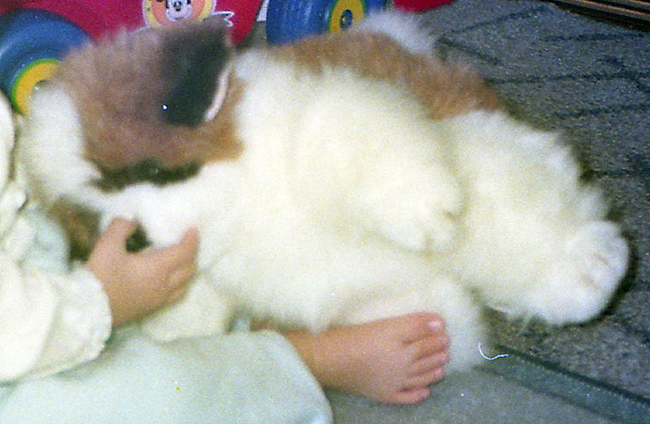
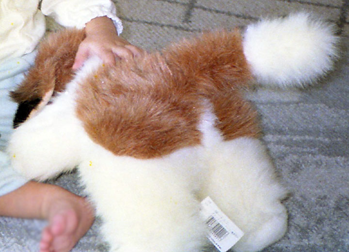
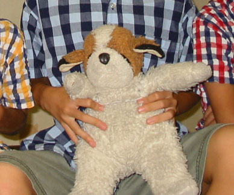
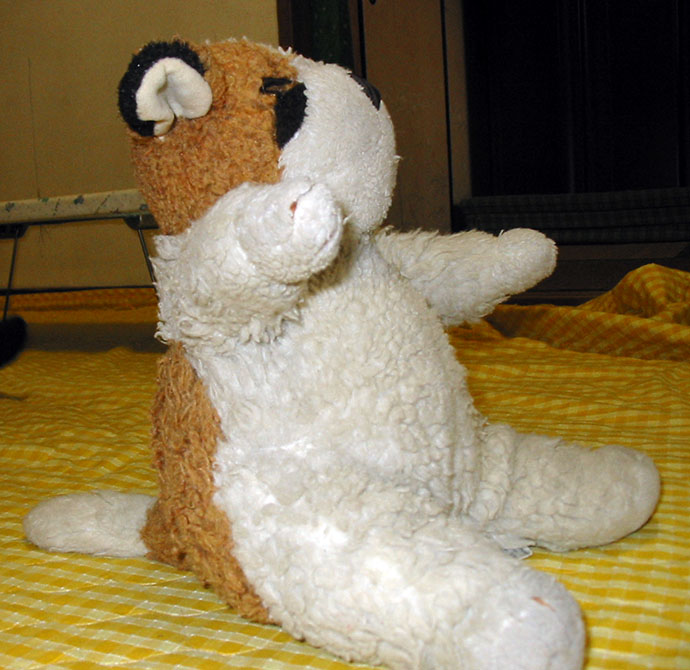
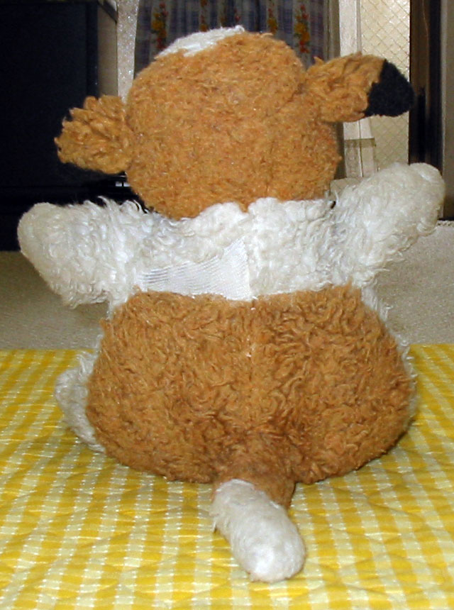
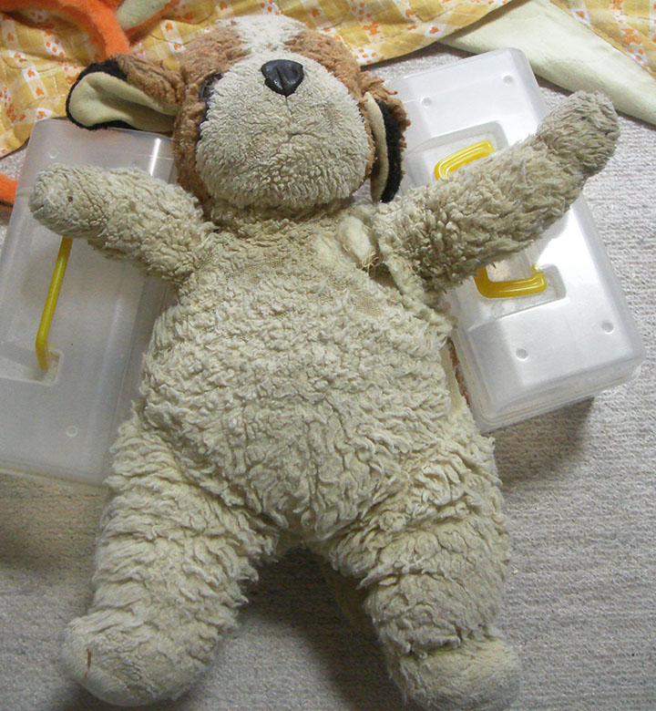
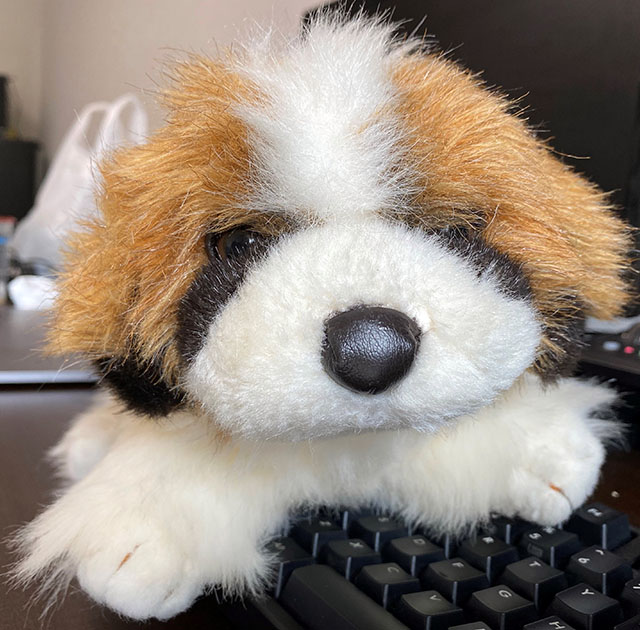
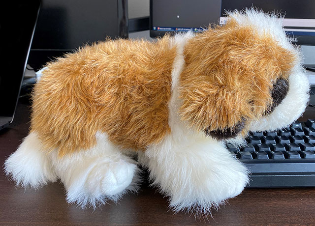
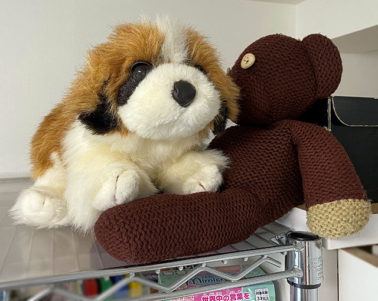

1992年の1月に、__オリエンタルトーイ社の犬のぬいぐるみ__を買ってもらった。

↑ 1992年1月の写真。幼い僕が掴んで遊んでいる、ふかふかのモノがそれ。

恐らくセントバーナード犬のぬいぐるみだと思う。

オリエンタルトーイ社製である、というのは、当時ぬいぐるみに付いていたタグを見て記憶していた次第。調べてみると、オリエンタルトーイ社はこうしたセントバーナード犬タイプのぬいぐるみをいくつか製造していたことは分かった。

- [オリエンタルトーイ株式会社 : かわいいをお届けするオリエンタルトーイのぬいぐるみ](http://www.oriental-toy.co.jp/)

僕が買ってもらったこの犬のぬいぐるみは、幼少期はどこに出掛けるにも持ち出していて、だいぶボロボロになっていた。

↑ 2001年撮影。

↑ 2002年撮影。この時点でだいぶハゲてきているし、1992年当時のふっくらさがだいぶなくなっている。

2002年当時、自分は10歳ぐらいなので、そろそろ出掛ける時に持ち出すことはなくなっていたけど、弟もいたので家でぬいぐるみ遊びをしたりとかはギリギリしていた頃だと思う。

↑ 2009年撮影。押し入れに放置していたのだが、片腕がもげかけている。

---

自分としては、小さい頃から約30年近く一緒に過ごしてきた大切なぬいぐるみだったが、見てのとおりボロボロになっていて、それをそのまま放置していた。

2014年に一人暮らしを始めた時、このぬいぐるみは実家に置いて行ったのだが、それからしばらくして、母が「このあとカビてしまったり、虫でも湧いてしまったら、その方が可哀想だ」と考え、母が処分してしまった。

自分はしばらくして処分されたことを知り悲しかったが、ぬいぐるみを買った母自身が、それでも捨てることを選ぶほど劣化していたワケで、そりゃ仕方ないかなとも思った。

---

母が処分したことは理解しているものの、あのぬいぐるみの詳細をもっと知りたかったなー、と思っている。

商品名は何だったんだろう、セントバーナード犬で合ってるのかな、金額はいくらぐらいだったんだろう、どれくらい生産されていたんだろう、今また同じ商品を手に入れる術はないだろうか。

---

実は色々と調べていて、先日、同じオリエンタルトーイ社製のセントバーナード犬のぬいぐるみを購入してしまった。

自分が持っていたタイプは、仁王立ちしてお尻で座れるような人型に近いタイプだったが、今回購入できたのはご覧のとおり、四足歩行のタイプ。毛並みの質感も全然違いそう。

だが、茶色の毛の色味や、鼻の皮っぽさ、そして瞳の色や質感が全く同じで、とても懐かしく感じる。

ミスター・ビーンのテディベアは、7・8歳の頃にプレゼントしてもらったモノで、コチラもだいぶボロボロだが現存している。

---

この「2代目わんちゃん」も、「初代わんちゃん」の代わりとして大事にしていくが、「初代わんちゃん」の情報をもっと知りたいなーと思っている次第である。

このページをご覧の方で、「初代わんちゃん」の商品に関する情報を御存知の方がいたら、ぜひ教えていただきたい。

  

    
  

  

    

      <a href="https://www.amazon.co.jp/dp/B00A3224OA?tag=neos21-22&amp;linkCode=osi&amp;th=1&amp;psc=1">あやか赤ちゃん</a>
    

  

  

    
  

  

    

      <a href="https://hb.afl.rakuten.co.jp/hgc/g00u2h92.waxycbaa.g00u2h92.waxyd4ef/?pc=https%3A%2F%2Fitem.rakuten.co.jp%2Fclovershop-%2Fak468%2F&amp;m=http%3A%2F%2Fm.rakuten.co.jp%2Fclovershop-%2Fi%2F10025842%2F">オリエンタルトーイ ミニチュアダックス ブラック</a>
    

    

      <a href="https://hb.afl.rakuten.co.jp/hgc/g00u2h92.waxycbaa.g00u2h92.waxyd4ef/?pc=https%3A%2F%2Fwww.rakuten.co.jp%2Fclovershop-%2F&amp;m=http%3A%2F%2Fm.rakuten.co.jp%2Fclovershop-%2F">Cloverショップnext</a>
    

    
価格 : 3175円

  

  

    
  

  

    

      <a href="https://www.amazon.co.jp/dp/B00CEOPDFM?tag=neos21-22&amp;linkCode=osi&amp;th=1&amp;psc=1">こはく S</a>
    

  

