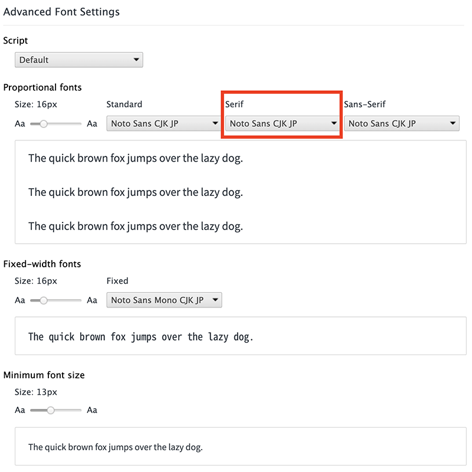
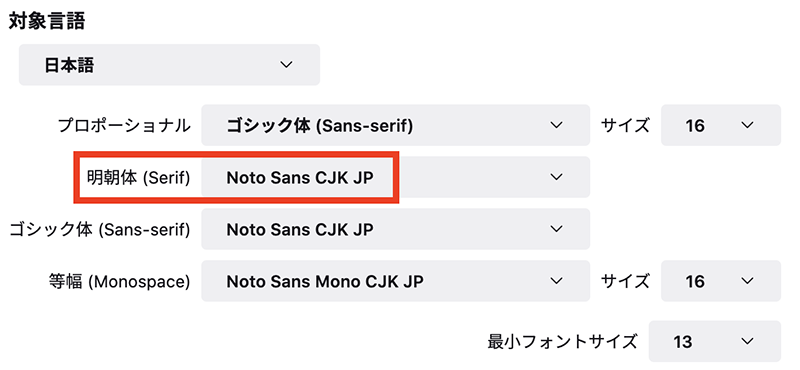

今更感のある話ではあるけど、まとめ。

HTML ページを作成したとき何の CSS も書かないと、ページ中のテキストはセリフ体 (明朝体) で表示される。ブラウザのユーザ設定にもよるが、セリフ体というと Times New Roman のようなフォントが選択されることが多い。

個人的には英文なら Helvetica や Arial、和文ならヒラギノ、メイリオ、游ゴシックあたりのサンセリフ体の方が読みやすく感じるのだが…。

ということで、今回は**多くのブラウザのデフォルトスタイルでセリフ・フォントが選択される理由**を深堀りし、いくつかの考察を加えてみた。

## 目次

## 「ウェブのデフォルト」ではない

先に確認しておくのは、HTML や CSS の仕様では「セリフ体がデフォルトフォントだ」などと定められているワケではない、という点だ。

CSS の `font-family` プロパティのデフォルト値についても、ユーザエージェント (ブラウザ) に依存する、とされている。未指定の場合は `font-family: serif` が適用される、といった仕様ではないワケだ。

- 参考：[font-family - CSS: カスケーディングスタイルシート | MDN](https://developer.mozilla.org/ja/docs/Web/CSS/font-family)
- 参考：[CSS font-family property](https://www.w3schools.com/cssref/pr_font_font-family.asp)

つまり、「何もフォント指定されていなかったらセリフ体で表示しよう」というハンドリングをしているのは、HTML や CSS の仕様ではなく、*各ブラウザ*となる。

## ブラウザは後方互換性を重視する

WWW が公開されたのが1990年。一般ユーザも「ホームページ」を作るようになったのは2000年前後ぐらいからだが、そこから考えても「ウェブページ」というモノは、20年前に作られたモノも現存していたりする。

HTML の仕様としては、現在は「バージョン 5」が一般になっているが、古い HTML バージョンをターゲットに作られた HTML ファイルだからといって、表示できなくなるような事態は避けたい。

そこで各ウェブブラウザは、古いウェブページも限りなく作成当時と同じように表示できるよう、後方互換性を重視した実装になっている。

多くの OS が「サンセリフ体」のフォントを使った UI を提供しているにも関わらず、ウェブブラウザが「セリフ体」をデフォルトフォントとしているのは、**昔の仕様を維持し、古いウェブページの見栄えを不用意に変えてしまわないようにするため**に、セリフ体を採用し続けているワケである。

## 「セリフ体の方が読みやすいから」

では、当初のウェブブラウザはなぜ、セリフ体をデフォルトフォントとして選択したのだろうか。

よく言われているのは、*セリフ体の方が英文が読みやすいから*、という説明である。

セリフ体として多くの OS に標準搭載されているのは、Times New Roman (Mac だとほぼ同じ書体の Times) というフォントである。コレは元々、タイムズ紙が開発したフォントで、新聞などの紙媒体で読みやすいフォントとして作られている。

- 参考：[Times New Roman - Wikipedia](https://ja.wikipedia.org/wiki/Times_New_Roman)

**英文**、かつ*紙媒体*のことを考えると、セリフ体の方が読みやすく感じるというのは、まぁそうなんだろうと思うしかない。今でも「文書作成ソフト」である Word などは、デフォルトフォントがセリフ体・明朝体なのを考えると、英語を紙媒体で読む際はセリフ体の方が読みやすいモノなのだろう。

## Times New Roman が多くの OS に標準搭載されていたから？

表面的な理由は上述のとおりなのだが、もう少しその経緯を深堀りしてみたい。

先程も「Times New Roman」というフォントは多くの OS に標準搭載されている、と言ったが、*様々なデバイスで同等の表示結果を得るために、多くの OS に標準搭載されているフォントから逆算してデフォルトフォントを決めたのでは？*という考え方もできるかもしれない。

例えば Helvetica は、現在も Mac には標準搭載されているが Windows には搭載されていない。Windows では Arial という類似フォントが標準搭載されており、Windows OS 内でも Helvetica は Arial のエイリアスとして登録されていたりする。

なので、現在のところ実質的には、`font-family: Helvetica` と書けば Helvetica ないしは Arial が適用されて、ほぼ同等の見栄えを実現できる。しかしコレが約30年前もそうだったかというと違う。Arial が Windows に搭載されたのは Windows 3.1 (1992年) からであり、WWW の実装と公開 (1990年) の方が若干先である。つまり「Windows には Arial があるから良いじゃん」という考えは、当時はなかったワケだ。

- 参考：[Arial font family - Typography | Microsoft Docs](https://docs.microsoft.com/vi-vn/typography/font-list/arial)

そういう意味で、1990年当時の主要環境で多く利用されていたのが Times New Roman だったから、ブラウザが規定するデフォルトフォントも Times New Roman ≒ セリフ体フォントにした方が無難だ、と考えたのかもしれない。

## プリンタフォント

もはや家庭用プリンタすら持たない人も多いぐらいの昨今だが、20年前はというと、当時インターネットは常時接続ではなく、接続している間だけ電話料金がかかったので、オフラインに保存するとか、紙印刷することがよくあった。さらにもっと前の時代となると、コンピュータ自体がまだ珍しい時代なので、紙で運用するのが常であっただろう。

最近は OpenType フォントの普及によりあまり意識しなくなったが、昔は画面表示用の「スクリーンフォント」と、*プリンタ用の「プリンタフォント」*というモノが別れていたらしい。

前述の「Times New Roman はそのシェア率からデフォルトに採用されたのでは」説は、この「プリンタフォント」としての採用例も多かったのかもしれない。

- 参考：[いまさら聞けない!? DTP・印刷の基礎知識](https://www.oki.com/jp/printing/images/vol_05-2_tcm85-59385.pdf)

## でも…セリフ体って読みにくくね？

「そうはいっても、やっぱりセリフ体って読みにくいから、デフォルトフォントがセリフ体になるのって違和感あるのよね」という気持ちは分かる。自分も、*ブラウザのデフォルトフォントは「サンセリフ体」も「セリフ体」も、同じ Noto Sans CJK JP というサンセリフ体のモノにしてしまっている*ので、僕の環境では CSS 未指定のページでもサンセリフ体で表示される。明朝体は慣れない。

セリフ体の代表格である Times New Roman ばかり引き合いに出して申し訳ないが、Times New Roman は元々新聞紙面用に開発されたフォントだったので、紙面の経済効率を上げるために文字幅が狭かったりして、今のスクリーンデバイスで読みやすいとは言い難い面がある。

- 参考：[Is Times New Roman a good font for a website? - Quora](https://www.quora.com/Is-Times-New-Roman-a-good-font-for-a-website)

また、以前の PC 環境は**ビットマップフォント (ラスターフォント)** と呼ばれる、ドットで構成されたフォントで描画されていたのに対し、最近の多くのデバイスでは*アウトラインフォント*と呼ばれるベクターデータを拡大縮小して表示する方式が一般的だ。さらにアンチエイリアスもほぼ標準でかかっているので、そうした影響で、*小さい文字・細い線が滲んで見えてしまう*ことがある。セリフ体や明朝体に対する違和感の一つは、こうした近年のスクリーンデバイスの環境と、フォント周りの仕様の進化によるモノがあるかもしれない。

Windows XP ぐらいまでの環境だと、ビットマップフォントのセリフ体ってそんなに読みづらくは感じなかったんだけど、最近の環境でセリフ体を見ると、何か大仰な感じがするんだよなぁ。ｗ

- 参考：[ビットマップフォントとアウトラインフォント](https://seiai.ed.jp/sys/text/cs/chp02/c02a140.html)

そもそも、セリフ体とサンセリフ体とでは「読みやすさ」に違いがなかった、という研究もあるらしい。

- 参考：[Which Are More Legible: Serif or Sans Serif Typefaces? | Alex Poole](http://alexpoole.info/blog/which-are-more-legible-serif-or-sans-serif-typefaces/)

## 結論

セリフ体とサンセリフ体とで、読みやすさや感じ方は人それぞれで、科学的な根拠もないっぽい。今となっては「好きな方を選べばいい」のだが、当時の検討経緯を推測すると、こうなるだろう。

ウェブブラウザを開発する際、「デフォルトのフォント」として何か1つ決定しないといけなくなった時に、**驚き最小の原則**に従い、伝統的かつ違和感の少ないセリフ体を採用したのであろう。当時は紙媒体も依然として多用されており、紙面になった時の違和感の少なさに配慮したと考えられる。

その選択には副次的な効果もあった。各種 OS やプリンタで当時からシェア率の高かった Times New Roman が環境の差異を吸収してくれることになり、安定性が高いということで、以降も各社のブラウザが「デフォルト」として採用し続けたのだろう。

Arial が Helvetica のフォールバックとして Windows で機能するようになったのは、WWW の実装と公開よりも後の話だし、コンピュータが扱うテキストをスクリーン上でのみ読了し、紙媒体で扱う機会が少なくなってきたのも21世紀以降の話。今となってはサンセリフ体の方が読みやすいと感じるが、当時は今とは全く状況が違ったワケである。フォント自体の仕様についても、ビットマップフォントが主流だった時代から、アンチエイリアスを利かせたアウトラインフォントが主流になったこともあり、サンセリフ体の方が落ち着いて読みやすく感じるようになった可能性もある。

ちなみに、IE6 などでもブラウザ設定でデフォルトフォントは変更できたが、あまり一般的ではなかった。PC やスマホがココまで一般に普及し、Chrome ブラウザ等々がゴリ押しで標準化と開発を進めてくれたおかげで、近年は誰もが「ブラウザ設定でフォント指定を変えたら？」ぐらいのことが考えつく時代になったのだと思う。

こうした歴史的経緯と、現代人の感覚とは差異が広がりつつあるが、古いウェブページの描画に対する後方互換性を保つためにも、しばらく「デフォルト」として普及した事実上の標準仕様を、ウェブブラウザ側が安易に変えるワケにも行かず、現在まで名残りとして残っているのである。

- 参考：[Why is the web's default font Times New Roman, and not Arial or Helvetica? - Quora](https://www.quora.com/Why-is-the-webs-default-font-Times-New-Roman-and-not-Arial-or-Helvetica)

  

    
  

  

    

      <a href="https://www.amazon.co.jp/dp/B09G9RPJ53?tag=neos21-22&amp;linkCode=osi&amp;th=1&amp;psc=1">図解即戦力　Web技術がこれ1冊でしっかりわかる教科書</a>
    

  

  

    
  

  

    

      <a href="https://hb.afl.rakuten.co.jp/hgc/g00q0722.waxyc9ff.g00q0722.waxyd017/?pc=https%3A%2F%2Fitem.rakuten.co.jp%2Fbook%2F16805150%2F&amp;m=http%3A%2F%2Fm.rakuten.co.jp%2Fbook%2Fi%2F20405986%2F">図解即戦力　Web技術がこれ1冊でしっかりわかる教科書 [ 鶴長 鎮一 ]</a>
    

    

      <a href="https://hb.afl.rakuten.co.jp/hgc/g00q0722.waxyc9ff.g00q0722.waxyd017/?pc=https%3A%2F%2Fwww.rakuten.co.jp%2Fbook%2F&amp;m=http%3A%2F%2Fm.rakuten.co.jp%2Fbook%2F">楽天ブックス</a>
    

    
価格 : 1870円

  

