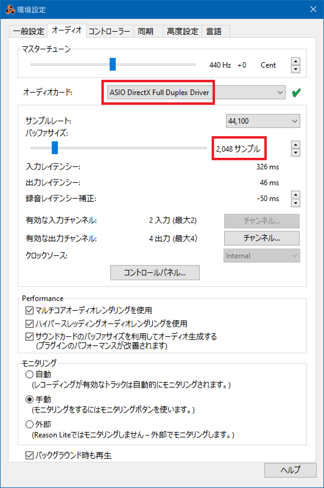
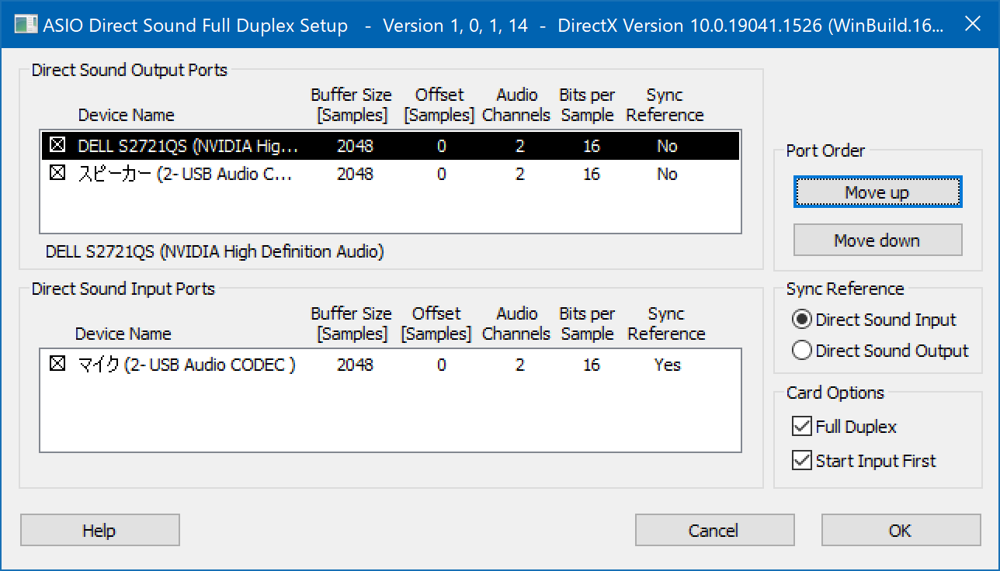
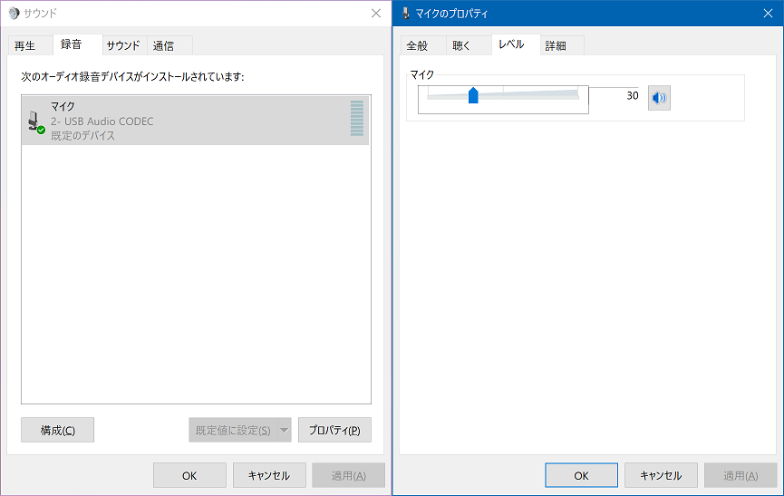
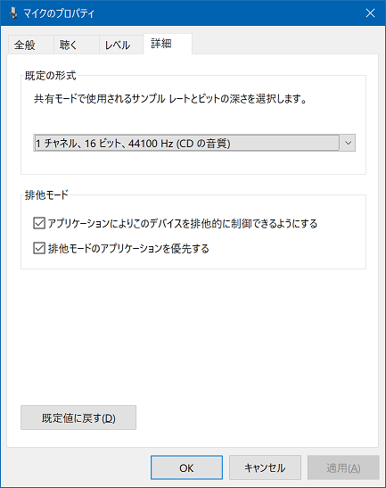
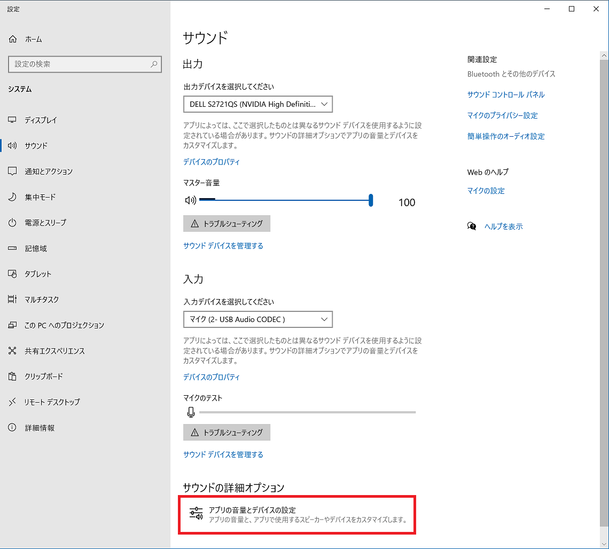
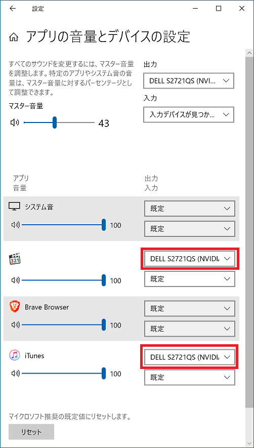

以前、*Zoom G2.1Nu* というギター用のマルチエフェクターを、USB でパソコンに接続し、**Reason Lite 10** という DAW で録音する、という環境を整えた。

- 過去記事：[Reason Lite 10 で初めてオリジナル曲作ってみた](/blog/2021/07/02-01.html)

上の過去記事でも、接続方法と Reason Lite での設定方法をまとめたのだが、久々に触ったらワケ分かんないことになったので設定をやり直したのと、いくつかの問題に関するメモをまとめておく。

  

    
  

  

    

      <a href="https://www.amazon.co.jp/dp/B0034XUXCK?tag=neos21-22&amp;linkCode=osi&amp;th=1&amp;psc=1">ZOOM ギター用マルチエフェクター・オーディオインターフェイス G2.1Nu</a>
    

  

  

    
  

  

    

      <a href="https://hb.afl.rakuten.co.jp/hgc/g00tkpx2.waxycc2d.g00tkpx2.waxyd394/?pc=https%3A%2F%2Fitem.rakuten.co.jp%2Fatorieerina%2Fb0034xuxck%2F&amp;m=http%3A%2F%2Fm.rakuten.co.jp%2Fatorieerina%2Fi%2F10975711%2F">【中古】【輸入品日本仕様】ZOOM ギター用マルチエフェクター・オーディオインターフェイス G2.1Nu</a>
    

    

      <a href="https://hb.afl.rakuten.co.jp/hgc/g00tkpx2.waxycc2d.g00tkpx2.waxyd394/?pc=https%3A%2F%2Fwww.rakuten.co.jp%2Fatorieerina%2F&amp;m=http%3A%2F%2Fm.rakuten.co.jp%2Fatorieerina%2F">アトリエ絵利奈</a>
    

    
価格 : 9861円

  

## 目次

## 環境情報

ハードウェア的には、上述のとおり Zoom G2.1Nu → USB ケーブル → パソコン、と接続している。Zoom G2.1Nu のオーディオインターフェース機能を利用しているワケだ。

パソコンの OS は Windows10 Pro。Reason Lite 10 という DAW は、Korg microKEY Air-49 という MIDI キーボードに同梱されていた。Zoom G2.1Nu には Cubase LE が同梱されていたが、自分はコチラは使っていない。

- 過去記事：[MIDI キーボード「Korg microKEY Air-49」を買った](/blog/2020/02/21-02.html)
- 関連ページ：[My Effectors 03 … Zoom G2.1Nu](/music/gears/effector-03.html#zoomg21nu)

  

    
  

  

    

      <a href="https://hb.afl.rakuten.co.jp/hgc/g00ry2p2.waxyccab.g00ry2p2.waxydc9f/?pc=https%3A%2F%2Fitem.rakuten.co.jp%2Frockonline%2F73247%2F&amp;m=http%3A%2F%2Fm.rakuten.co.jp%2Frockonline%2Fi%2F10007610%2F">Reason Studios REASON 12 Upgrade License【※シリアルメール納品】【DTM】【DAW】【作曲ソフト】</a>
    

    

      <a href="https://hb.afl.rakuten.co.jp/hgc/g00ry2p2.waxyccab.g00ry2p2.waxydc9f/?pc=https%3A%2F%2Fwww.rakuten.co.jp%2Frockonline%2F&amp;m=http%3A%2F%2Fm.rakuten.co.jp%2Frockonline%2F">Rock oN Line 楽天市場店</a>
    

    
価格 : 22000円

  

  

    
  

  

    

      <a href="https://hb.afl.rakuten.co.jp/hgc/g00pvd82.waxyc33d.g00pvd82.waxydf63/?pc=https%3A%2F%2Fitem.rakuten.co.jp%2Fmarks%2Fph-reason10ltad-a%2F&amp;m=http%3A%2F%2Fm.rakuten.co.jp%2Fmarks%2Fi%2F10010027%2F">【即納可能】Propellerhead Reason 10 Upgrade for Ess/Ltd/Adp（新品）【送料無料】</a>
    

    

      <a href="https://hb.afl.rakuten.co.jp/hgc/g00pvd82.waxyc33d.g00pvd82.waxydf63/?pc=https%3A%2F%2Fwww.rakuten.co.jp%2Fmarks%2F&amp;m=http%3A%2F%2Fm.rakuten.co.jp%2Fmarks%2F">マークスミュージック楽天市場店</a>
    

    
価格 : 33000円

  

## iTunes で音楽を流しながら Reason Lite の音も両方スピーカーから出したい

過去記事にも書いたが、Reason Lite で「ASIO Generic Low Latency ASIO Driver」というオーディオカードを選択しておくことで、ギターでも MIDI キーボードでも、低遅延で録音・入力できるようにしていたのだが、この設定は一つ問題があって、**Reason Lite を起動している最中は他のソフトから一切音が流れなくなってしまう**、ということだった。

Chrome ブラウザで YouTube 動画を流しながらとか、iTunes で MP3 を流しながら、Reason Lite も開いて、MIDI キーボードで音を打ち込んでみたり、Zoom G2.1Nu 経由で繋いだギターの音をモニタアウトしてみたり、そういうことがしたかったのだが、コレができなかった。

Reason Lite を起動している最中も、Chrome ブラウザや iTunes など別のソフトからの音は出力したい、ということで、そのやり方を調べていた。

## ギターの音が DAW に取り込めなくなった

そんなワケで、Reason Lite の「環境設定」画面で「オーディオカード」か「コントロールパネル」のどこかをイジくり回していたら、何やらエラーメッセージが出て、それまで選択していた「*ASIO Generic Low Latency ASIO Driver*」というオーディオカードが選択できなくなってしまった。後述するスクリーンショットで緑色のチェックマークが付いているところに、赤いバツ印が付くようになり、コレが解消できなくなってしまった。

元はといえば「ASIO Generic Low Latency ASIO Driver」を使えるようにした当初も何やかんや設定をしたと思うのだが、記録を残していなくてイマイチ忘れてしまっていた。そこで、また違うやり方を調べてみた。

## ASIO4ALL をインストールする

色々調べて、一番参考になったのは以下の Reddit。

- 参考：[Issue with Reason stopping video/audio in other programs in Windows 10 : reasoners](https://www.reddit.com/r/reasoners/comments/a08oh7/issue_with_reason_stopping_videoaudio_in_other/eag0oh0/)

ココを参考に、まずは **ASIO4ALL** というフリーソフトを入れてみる。ASIO ドライバがない環境で、ASIO ドライバの代わりをしてくれるフリーソフトとのこと。自分は今まで ASIO ドライバを使えていたと思うのだが、何をイジくったのか使えなくなってしまったワケで、しょうがない、コレを入れて何か変わるか試してみよう。

- 参考：[ASIO4ALL Official Home - news and updates](https://www.asio4all.org/)

↑ このページに行き、「16 FEBRUARY 2022: FINALLY – VERSION 2.15 (FINAL!)」の「*ASIO4ALL 2.15 – Japanese*」(`ASIO4ALL_2_15_JPN.exe`) をダウンロード、インストールしてみた。

すると、Reason Lite の「環境設定」画面で、いくつかの ASIO オーディオカードが選択できるようになっていた。

試行錯誤の末、自分は次のように設定するとうまくいくことが分かった。

- オーディオカード : 「**ASIO DirectX Full Duplex Driver**」を選択する
  - このオーディオカードだと、*iTunes から音を出しながら DAW も使う*、というやりたかったことが実現できる
  - 「ASIO ASIO4ALL v2」「ASIO Generic Low Latency ASIO Driver」の2つは、ちゃんと音は出るし、より低レイテンシに設定ができるが、iTunes などからの音がどうやっても出せないので除外する
- バッファサイズ : 「*2,048 サンプル*」にする
  - 選択できる最小のサイズは 512 サンプルだったが、コレを選択するとギターの音がプツプツ途切れてしまう
  - レイテンシは0.5秒くらいと酷いものだが、ギター音がちゃんと録音できるのはこのぐらいのバッファサイズでないとダメだった
  - MIDI キーボードのレイテンシは特になかったので、この設定のままとする

オーディオインターフェースや DAW の基礎知識の範疇ではあるのだが、改めて学んだので以下にメモしておく。

- 「サンプルレート」と表記があったら *44,100Hz (44.1kHz)* を選ぶ
  - 48,000Hz (48.0kHz) は選ばない
  - 周波数が低い方がレイテンシ (遅延) が少なくなる他、ノイズがしたり音質が悪いと感じた場合は、サンプルレートを 44,100Hz にすることで解消することがある
- 「バッファサイズ」は、パソコンの CPU スペックなどに依存するので、*なるべく小さい値で、音質に問題がない値*を探る
  - 小さいサンプル数にすると*低遅延*になるが、**音飛びやノイズが発生**する場合がある
  - サンプル数を増やしていくと**遅延が大きくなる**が、*音質は良くなる*

ついでに「コントロールパネル」ボタンを押したところの設定画面は、こんな感じになっている。

- Direct Sound Output Ports : 僕の環境では、「Dell S2721QS (NVIDIA High Definition Audio)」を選ぶと、PC のスピーカーから音が出る
  - 「スピーカー (2-USB Audio CODEC)」にもチェックを入れておくと、Zoom G2.1Nu に音を送り返せるようだ
- Direct Sound Input Ports : 「マイク (2-USB Audio CODEC)」を選ぶと、Zoom G2.1Nu を経由してギター音が録音できるようになる
- その他の設定は特にイジっていないがスクショのとおり

以前「ASIO Generic Low Latency ASIO Driver」を使っていた時は、バッファサイズを最小まで小さくしていたのだが、どうも音質が悪いし、音がプツプツ途切れるな～と思っていた。よくよく調べたらこういうことだった。

今回選択した「**ASIO DirectX Full Duplex Driver**」では、バッファサイズを増やすことでプツプツ途切れる事象は回避したが、代わりにギターの音が0.5～1秒近く遅れて聞こえる、レイテンシはかなり増大してしまった。

## レイテンシなく PC・ギターの音を両方同時に聴きたいが…

アナログの音声電気信号をデジタルに変換するというのは、2022年になっても相当難しいことで、どうしてもレイテンシ (楽器を弾いてから実際にスピーカーから音が流れるまでの遅延・ラグ) が発生してしまうモノなのだ。プロが使うような高級な DAW だとしても、レイテンシはゼロにはならないという。

自分は **PC のスピーカーから**、*iTunes などのソフトの音、DAW 上の打ち込みの音、そして弾いているギターの音の全てが同時に再生できたらいいなー*と思っていたのだが、ギター音のレイテンシが気になって全く上手く弾けなくて苦労していた。しかし、**「PC からギター音を流そう」とすると、ギター音は絶対に遅延してしまう。レイテンシなく、PC からギターの音を聴くのは無理なのだ。**

だから、Zoom G2.1Nu の「Output 端子」にヘッドホン等を挿して、ギター音はそちらで聞くのが、遅延なくモニターするためのセオリーではあるのだが、そうなると、

- PC 上の音は PC に繋いだスピーカーから
- ギター音は Zoom G2.1Nu に繋いだヘッドホンから

別々に再生されることになり、コレはコレで両方の音を聞きづらい。僕は賃貸住まいなのでアンプで音を鳴らすワケにもいかないのだ。

それでは発想を転換して、Zoom G2.1Nu めがけて PC の音を送れたら、PC 音・ギター音の両方が Zoom G2.1Nu に繋いだヘッドホンで聞けるのではないか？と考えた。

パソコンには 3.5mm の AUX OUT 端子があるので、ココから音を出力できるかも？と考えたのだが、*Zoom G2.1Nu の方に AUX IN 端子がない。*

もう少し調べてみると、USB 接続した Zoom G2.1Nu が、Windows 上では「再生デバイス」として認識されるので、USB を経由して DAW の音を聞いたりはできるようだ。

- 参考：[(2010.10.02)G2.1Nuで原曲を流しながらヘッドフォン練習 - Marumaru's TinyPlaza](http://tinyplaza.link/index.cgi?p=%282010.10.02%29G2.1Nu%E3%81%A7%E5%8E%9F%E6%9B%B2%E3%82%92%E6%B5%81%E3%81%97%E3%81%AA%E3%81%8C%E3%82%89%E3%83%98%E3%83%83%E3%83%89%E3%83%95%E3%82%A9%E3%83%B3%E7%B7%B4%E7%BF%92)

原理的にいえば、今度は「**パソコン上で音を出す操作をしてから、Zoom G2.1Nu に繋いだヘッドホンから音が出力されるまでの間にレイテンシが発生する**」ことになると思うのだが、PC 操作側で多少のレイテンシがあっても気になることはないだろう。

というワケで、*Zoom G2.1Nu の「Output 端子」から、PC の音を聴く*というのが、ギター音のレイテンシをなくしつつ、PC 音を同時に聴く最適解だと思われる。

## Windows のサウンド設定でギターの録音音量を調整する

さて、Reason Lite 上のオーディオカードの設定は以上のとおりなのだが、いざギターの音を録音しようと思った時に、Windows OS 上のサウンド設定が必要だったのでその話もメモしておく。

Windows10 の「PC 設定」と「コントロールパネル」の分離、いい加減どうにかならないかな…。音声関連の設定がいつも面倒臭い。

**「サウンド」ウィンドウ**を開いたら、「録音」タブ → 「マイク 2-USB Audio CODEC」を選択し、「プロパティ」ボタンを押下する。

ココで、「**レベル**」を調整しておく。

僕が試した限りだと、マイクレベルは 30～50 くらいまでで調整しておくと良い。それ以上にすると音量がデカすぎてしまう。

音量がデカい状態で Reason Lite で録音すると、波形が大きな黒つぶれした長方形になってしまい、ゴリゴリにゲインが効いた音になってしまう。コンデンサマイクの接続の時によくやる、いわゆる*「ピーク超えしないように」の調整*が、この部分である。

ついでに「詳細」タブでは「1 チャネル、16 ビット、*44100 Hz* (CD の音質)」を選択してあるか確認しておこう。素のままだと「DVD 音質」の 48000 Hz が選択されている場合がある。

- 参考：[Steinberg Cubase 　Windowsのコンピューター内蔵スピーカーから音が出ない時 | Rothmans京介のブログ](https://ameblo.jp/rothmanskyosuke/entry-12602262758.html)

## iTunes の音は必ず PC スピーカーから流したい、そんな時は

先程、PC の音も Zoom G2.1Nu の「Output 端子」で聞けばいいんじゃない？と書いたが、現状自分の環境ではちょっとやりづらいところもあったので、**PC で流れる音は必ず PC のスピーカーから流す**と決めた。

前述の Reddit でもこのための設定方法が紹介されていたのだが、次のとおり。

- PC 設定 → システム → サウンド と進む
  - 出力 : 僕の環境では、PC スピーカーである「Dell S2721QS (NVIDIA High Definition Audio)」が選ばれている状態にする
  - 入力 : Zoom G2.1Nu のオーディオインターフェースである「マイク (2-USB Audio CODEC)」を選んでおく

そしてココからが重要で、画面下部にある「**サウンドの詳細オプション」→「アプリの音量とデバイスの設定**」に進むと、アプリ単位で使用する入出力デバイスを明示的に選択できるのだ。

自分がよく使う音楽アプリである iTunes、MPC などは、出力で「Dell S2721QS (NVIDIA High Definition Audio)」を*明示的に選んでおく*と、間違いなく PC スピーカーから音が出るようになる。

## Zoom G2.1Nu の音がノイジー…

PC 上ですべき設定は以上。コレでギター音の録音などはまたできるようになった。

ただ、なんというか、ココまで頑張ってきてアレなんだけど、**そもそもの Zoom G2.1Nu の音が悪い**としか思えなくなってきていてツラい。

当初自分は Boss のコンパクトを買い漁っていたが、Zoom G2.1Nu を買った当時は「いよいよこのマルチ1台でやっていけそうだ！」と思ったものだった。しかし、その後 Mooer にハマり、Mooer を多数並べたエフェクターボードを作っていた時期が長かったためか、もう少しアナログ寄りな音に耳が慣れていたようだ。

<blockquote class="instagram-media" data-instgrm-captioned data-instgrm-permalink="https://www.instagram.com/p/BPrDBNnAdpV/?utm_source=ig_embed&amp;utm_campaign=loading" data-instgrm-version="14" style=" background:#FFF; border:0; border-radius:3px; box-shadow:0 0 1px 0 rgba(0,0,0,0.5),0 1px 10px 0 rgba(0,0,0,0.15); margin: 1px; max-width:540px; min-width:326px; padding:0; width:99.375%; width:-webkit-calc(100% - 2px); width:calc(100% - 2px);">
 <a href="https://www.instagram.com/p/BPrDBNnAdpV/?utm_source=ig_embed&amp;utm_campaign=loading" style=" background:#FFFFFF; line-height:0; padding:0 0; text-align:center; text-decoration:none; width:100%;" target="_blank"> 
 

 
 

 

 
<svg width="50px" height="50px" viewBox="0 0 60 60" version="1.1" xmlns="https://www.w3.org/2000/svg" xmlns:xlink="https://www.w3.org/1999/xlink"><g stroke="none" stroke-width="1" fill="none" fill-rule="evenodd"><g transform="translate(-511.000000, -20.000000)" fill="#000000"><g><path d="M556.869,30.41 C554.814,30.41 553.148,32.076 553.148,34.131 C553.148,36.186 554.814,37.852 556.869,37.852 C558.924,37.852 560.59,36.186 560.59,34.131 C560.59,32.076 558.924,30.41 556.869,30.41 M541,60.657 C535.114,60.657 530.342,55.887 530.342,50 C530.342,44.114 535.114,39.342 541,39.342 C546.887,39.342 551.658,44.114 551.658,50 C551.658,55.887 546.887,60.657 541,60.657 M541,33.886 C532.1,33.886 524.886,41.1 524.886,50 C524.886,58.899 532.1,66.113 541,66.113 C549.9,66.113 557.115,58.899 557.115,50 C557.115,41.1 549.9,33.886 541,33.886 M565.378,62.101 C565.244,65.022 564.756,66.606 564.346,67.663 C563.803,69.06 563.154,70.057 562.106,71.106 C561.058,72.155 560.06,72.803 558.662,73.347 C557.607,73.757 556.021,74.244 553.102,74.378 C549.944,74.521 548.997,74.552 541,74.552 C533.003,74.552 532.056,74.521 528.898,74.378 C525.979,74.244 524.393,73.757 523.338,73.347 C521.94,72.803 520.942,72.155 519.894,71.106 C518.846,70.057 518.197,69.06 517.654,67.663 C517.244,66.606 516.755,65.022 516.623,62.101 C516.479,58.943 516.448,57.996 516.448,50 C516.448,42.003 516.479,41.056 516.623,37.899 C516.755,34.978 517.244,33.391 517.654,32.338 C518.197,30.938 518.846,29.942 519.894,28.894 C520.942,27.846 521.94,27.196 523.338,26.654 C524.393,26.244 525.979,25.756 528.898,25.623 C532.057,25.479 533.004,25.448 541,25.448 C548.997,25.448 549.943,25.479 553.102,25.623 C556.021,25.756 557.607,26.244 558.662,26.654 C560.06,27.196 561.058,27.846 562.106,28.894 C563.154,29.942 563.803,30.938 564.346,32.338 C564.756,33.391 565.244,34.978 565.378,37.899 C565.522,41.056 565.552,42.003 565.552,50 C565.552,57.996 565.522,58.943 565.378,62.101 M570.82,37.631 C570.674,34.438 570.167,32.258 569.425,30.349 C568.659,28.377 567.633,26.702 565.965,25.035 C564.297,23.368 562.623,22.342 560.652,21.575 C558.743,20.834 556.562,20.326 553.369,20.18 C550.169,20.033 549.148,20 541,20 C532.853,20 531.831,20.033 528.631,20.18 C525.438,20.326 523.257,20.834 521.349,21.575 C519.376,22.342 517.703,23.368 516.035,25.035 C514.368,26.702 513.342,28.377 512.574,30.349 C511.834,32.258 511.326,34.438 511.181,37.631 C511.035,40.831 511,41.851 511,50 C511,58.147 511.035,59.17 511.181,62.369 C511.326,65.562 511.834,67.743 512.574,69.651 C513.342,71.625 514.368,73.296 516.035,74.965 C517.703,76.634 519.376,77.658 521.349,78.425 C523.257,79.167 525.438,79.673 528.631,79.82 C531.831,79.965 532.853,80.001 541,80.001 C549.148,80.001 550.169,79.965 553.369,79.82 C556.562,79.673 558.743,79.167 560.652,78.425 C562.623,77.658 564.297,76.634 565.965,74.965 C567.633,73.296 568.659,71.625 569.425,69.651 C570.167,67.743 570.674,65.562 570.82,62.369 C570.966,59.17 571,58.147 571,50 C571,41.851 570.966,40.831 570.82,37.631"></path></g></g></g></svg>

 
この投稿をInstagramで見る

 

 

 

 

 

 

 

 

 

 
 

 

</a>
<a href="https://www.instagram.com/p/BPrDBNnAdpV/?utm_source=ig_embed&amp;utm_campaign=loading" style=" color:#c9c8cd; font-family:Arial,sans-serif; font-size:14px; font-style:normal; font-weight:normal; line-height:17px; text-decoration:none;" target="_blank">Neo Xrea(@neos21)がシェアした投稿</a>

</blockquote> 

- [Instagram - Zoom G2.1Nu だけで足りるやんけ！と言っていたのにこの有様…](https://www.instagram.com/p/BPrDBNnAdpV/)

ギターの歪みでよく「*デジタル臭い音*」と表現される音があるが、僕は当時あんまりその意味が理解できていなかった。色々試してきた結果、一般によく「デジタル臭い歪み」というのは、この Zoom G2.1Nu が出す音そのものではなかろうか、と思ってきた。すなわち、

- 小さい音を無理矢理引き上げたような、特に高音域が耳障りなホワイトノイズ、ヒスノイズが目立つ
- さほどゲインを上げていないのに、グリッサンドやちょっとした指板の動きによるノイズがかなり大きく鳴る
- ギター本体のボリュームを絞っても歪み量が変わらない。入力ゲインに対する追従性が悪い
- ヘッドホン、スピーカーのどちらで聞いているにも関わらず、音の広がり感が少ない、ヌケ感がどうやっても出ない

こうした特徴の音なのかな、と。

**「デジタル臭い」っていう表現自体がそもそも不適切**だとは思うんだけど、要するに*生のアンプで歪みを作った時のような気持ち良い音がどうやっても出せない*状態が、デジタル臭い、チープな音ってことなのかなーと思う。んで、Zoom G2.1Nu の出す音はまさにそういう感じ、と。

特に Zoom G2.1Nu は、歪みを作っていくとすぐにノイズ感が増し、ノイズリダクションをどう組み合わせてもそれが消せない。チョーキング時の弦のこすれや、グリッサンドのような余計な音まで増幅されてしまうのを避けられないのだ。普通にギターアンプで鳴らすと絶対にこんなことにはならないのに、Zoom G2.1Nu で歪みを作るとどうやってもこういう音になってしまう。

「エフェクターの使い方が悪いだけだ」とか言われるかもしれないが、Boss コンや Mooer でこんな困り方したことないのを思うと、「超シビアに使わないと良い音が出せない機材は劣っている」と評価しちゃうよね。自分の使い方が悪い、でいいけど、もっと良い音が簡単に出せる機材あるし、っていう。

2010年発売の安価なマルチエフェクターなので、品質を求めるモンじゃない、といいつつ、最近は機材をほとんど売り払ってしまい、Zoom G2.1Nu でしか音を出せない状況なので、どうしても音の悪さが気になってしまうのだ。

ちなみに、*USB バス駆動だから音が悪いのか？と思ったが、AC 電源を繋いでも繋がなくても音に違いはなかった。*他に、近辺のパソコンがノイズを増幅させているのか？とか、違う壁のコンセントならどうか、とか色々条件は比較したが、どれも変わらず。**Zoom G2.1Nu の音がコレなのだ**、と結論づけた。

## 音楽機材はすーぐ高いの欲しくなる、でも理由はハッキリしている

以前 USB ヘッドセットを買った時にも思ったのだが、音声や音楽は未だ、アナログとデジタルの変換部分がキモなのだ。

- 過去記事：[USB ヘッドセット「Sennheiser PC 8」を買った・自分なりのノイズ調整方法](/blog/2021/07/25-01.html)

オーディオインターフェースしかり、デジタル回路で歪みを作るマルチエフェクターの心臓部分しかり、アナログとデジタルの変換部分の質が悪いと、すぐ音質が悪くなったり、ノイズが増えたりしてどうにもならなくなる。

ギターなんて頻繁に弾かないし、ましてやプロでもない。高音質なマイクなんて買ったところで、己の滑舌が一番のノイズでは…と思ったりもするが、それでも、質の悪い音、ノイズの多い音をずっと聞かされているとイライラして仕方ない。

そんなワケで、自分の耳で判断して、まともな機材が欲しくなっていくのだが、まともな機材というのはやはりお値段が高い。つらい。ｗ
