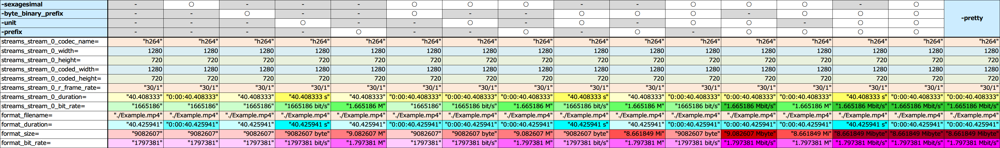

以前の記事で、Windows10 + Git SDK 環境に [CODEX FFMPEG (gyan.dev)](https://www.gyan.dev/ffmpeg/builds/) というビルド済の ffmpeg をインストールした。

- 過去記事：[ffmpeg で GPU エンコードできるようにする](/blog/2022/01/28-01.html)

この時、アーカイブを 7-Zip で解凍したところ、`ffmpeg.exe` の他に `ffplay.exe` と *`ffprobe.exe`* というファイルも格納されていた。この `ffprobe` というのは、動画ファイルの詳細情報を出力するための CLI ツールだそうなので、試してみた。

ffmpeg 同様、オプションがかなり豊富で、書き方や順序が難しかった。試行錯誤して、自分がよく使いそうなオプションを取り揃えたので以下に記載する。

```bash
$ ffprobe -hide_banner -loglevel error \
    -print_format flat=s=_ \
    -select_streams v:0 \
    -show_entries format=filename,size,duration,bit_rate:stream=width,height,coded_width,coded_height,duration,bit_rate,codec_name,r_frame_rate \
    -sexagesimal -byte_binary_prefix -unit -prefix -pretty \
    './Example.mp4'
```

- `-hide_banner` と `-loglevel error` で余計な出力をしない
- `-print_format` は `flat=s=_` とすると、次に書くように `キー=値` な並びで出力できる
  - `-print_format json` とすれば JSON 形式で出力できる。コチラも後述
- `-show_entries` オプションで出力したい項目を指定するのだが、イコール `=`、カンマ `,`、コロン `:` の使い方が難解。気合
- `-sexagesimal -byte_binary_prefix -unit -prefix` の4つは、ファイルサイズや再生時間などの出力形式を変更するオプション
  - どのオプションを書く・書かないでどういう変化があるかは後で一覧表を見せる
  - `-pretty` だけ書いておけば、この4つのオプションを指定したのと同じ効果が得られて、とりあえず人が読むには分かりやすい形式だと思う

Git SDK から `ffprobe.exe` コマンドを実行した時の出力結果例は次のとおり。

```bash
# オプションなし
streams_stream_0_codec_name="h264"
streams_stream_0_width=1280
streams_stream_0_height=720
streams_stream_0_coded_width=1280
streams_stream_0_coded_height=720
streams_stream_0_r_frame_rate="30/1"
streams_stream_0_duration="40.408333"
streams_stream_0_bit_rate="1665186"
format_filename="./Example.mp4"
format_duration="40.425941"
format_size="9082607"
format_bit_rate="1797381"

# -pretty オプション
streams_stream_0_codec_name="h264"
streams_stream_0_width=1280
streams_stream_0_height=720
streams_stream_0_coded_width=1280
streams_stream_0_coded_height=720
streams_stream_0_r_frame_rate="30/1"
streams_stream_0_duration="0:00:40.408333"
streams_stream_0_bit_rate="1.665186 Mbit/s"
format_filename="./Example.mp4"
format_duration="0:00:40.425941"
format_size="8.661849 Mibyte"
format_bit_rate="1.797381 Mbit/s"
```

ビットレートと再生時間は `format` セクションから取得するのと `stream` から取得するのとがあって、微妙に値に違いがあるのだが、どういう差なのかはよく分かっていない。エクスプローラでファイルのプロパティを見た時も、「ビットレート」と「総ビットレート」という項目が2つ存在するので、ファイル全体と、オーディオを除いたビデオ部分とかで、何か違うのかもしれない。

出力時の `-pretty` 周りのオプションは、どれがどう効くのかイマイチ分かりにくいところがあるので、4つのオプションの全組み合わせを一覧表にしてみた。やっぱりよー分からん。ｗ

[](./16-01-01.png)

- `-sexagesimal` : 再生時間 (Duration) など時間系の項目にだけ作用する、表示仕様の指定
- `-unit` : 単位を付与するだけ。単体で使うと `byte` とか `s` とか付く
- `-prefix` : ビットレートとファイルサイズの後ろに SI 単位が付く。「プレフィックス」とは言うものの単位は後ろに書いてあるので実質 Suffix な気がする
- `-byte_binary_prefix` : ファイルサイズがバイト単位での表示になる様子
- 参考：[ffprobe Documentation](https://ffmpeg.org/ffprobe.html)

自分は `-sexagesimal` だけ付けておいて、ビットレートやファイルサイズは詳細な値を出力するのが扱いやすいかな。

JSON 形式での出力はこんな感じ。

```bash
$ ffprobe -hide_banner -loglevel error \
    -print_format json \
    -select_streams v:0 \
    -show_entries format=filename,size,duration,bit_rate:stream=width,height,coded_width,coded_height,duration,bit_rate,codec_name,r_frame_rate \
    -sexagesimal \
    './Example.mp4'

{
    "programs": [

    ],
    "streams": [
        {
            "codec_name": "h264",
            "width": 1280,
            "height": 720,
            "coded_width": 1280,
            "coded_height": 720,
            "r_frame_rate": "30/1",
            "duration": "0:00:40.408333",
            "bit_rate": "1665186"
        }
    ],
    "format": {
        "filename": "./Example.mp4",
        "duration": "0:00:40.425941",
        "size": "9082607",
        "bit_rate": "1797381"
    }
}
```

`jq` コマンドを組み合わせてタブ区切りで出力とかしてみたら、`xargs` で複数ファイルのデータを出力させて Excel に貼っ付けて表で管理とかしやすそう。

```bash
$ ffprobe -hide_banner -loglevel error \
    -print_format json \
    -select_streams v:0 \
    -show_entries format=filename,size,duration,bit_rate:stream=width,height,coded_width,coded_height,duration,bit_rate,codec_name,r_frame_rate \
    -sexagesimal \
    './Example.mp4' \
  | jq -r '[.format.filename, .format.size, .format.duration, .format.bit_rate, .streams[0].width, .streams[0].height, .streams[0].r_frame_rate] | @tsv'

# ファイル名     サイズ     再生時間          bps         幅      高さ   FPS
./Example.mp4    9082607    0:00:40.425941    1797381     1280    720    30/1
```

よきよき。

- 参考：[get-video-dimensions/index.js at master ・ jongleberry-bot/get-video-dimensions](https://github.com/jongleberry-bot/get-video-dimensions/blob/master/index.js)
  - Node.js の `child_process.exec()` を用いて `ffprobe` コマンドを実行し、動画ファイルの幅・高さを取得する npm パッケージのソースコード
- 参考：[ffprobe の使い方 | ニコラボ](https://nico-lab.net/how_to_use_ffprobe/)
- 参考：[ffprobeで動画を解析する - Qiita](https://qiita.com/makotok7/items/0e7d2f941e5da8cec8d1)

<div class="ad-amazon">
  <div class="ad-amazon-image">
    <a href="https://www.amazon.co.jp/dp/B08KCP3Z42?tag=neos21-22&amp;linkCode=osi&amp;th=1&amp;psc=1">
      
    </a>
  </div>
  <div class="ad-amazon-info">
    <div class="ad-amazon-title">
      <a href="https://www.amazon.co.jp/dp/B08KCP3Z42?tag=neos21-22&amp;linkCode=osi&amp;th=1&amp;psc=1">Premiere Pro よくばり入門 CC対応（できるよくばり入門）</a>
    </div>
  </div>
</div>

<div class="ad-rakuten">
  <div class="ad-rakuten-image">
    <a href="https://hb.afl.rakuten.co.jp/hgc/g00q0722.waxyc9ff.g00q0722.waxyd017/?pc=https%3A%2F%2Fitem.rakuten.co.jp%2Fbook%2F16383296%2F&amp;m=http%3A%2F%2Fm.rakuten.co.jp%2Fbook%2Fi%2F20065376%2F">
      
    </a>
  </div>
  <div class="ad-rakuten-info">
    <div class="ad-rakuten-title">
      <a href="https://hb.afl.rakuten.co.jp/hgc/g00q0722.waxyc9ff.g00q0722.waxyd017/?pc=https%3A%2F%2Fitem.rakuten.co.jp%2Fbook%2F16383296%2F&amp;m=http%3A%2F%2Fm.rakuten.co.jp%2Fbook%2Fi%2F20065376%2F">Premiere Pro よくばり入門 CC対応 [ 金泉太一 ]</a>
    </div>
    <div class="ad-rakuten-shop">
      <a href="https://hb.afl.rakuten.co.jp/hgc/g00q0722.waxyc9ff.g00q0722.waxyd017/?pc=https%3A%2F%2Fwww.rakuten.co.jp%2Fbook%2F&amp;m=http%3A%2F%2Fm.rakuten.co.jp%2Fbook%2F">楽天ブックス</a>
    </div>
    <div class="ad-rakuten-price">価格 : 2948円</div>
  </div>
</div>
