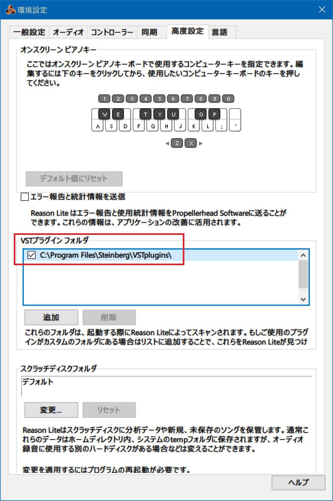
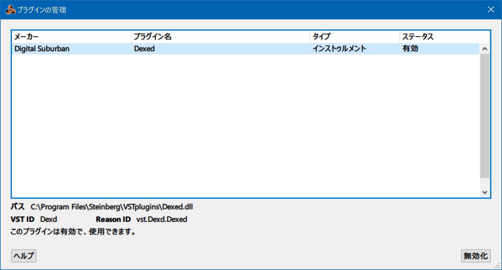
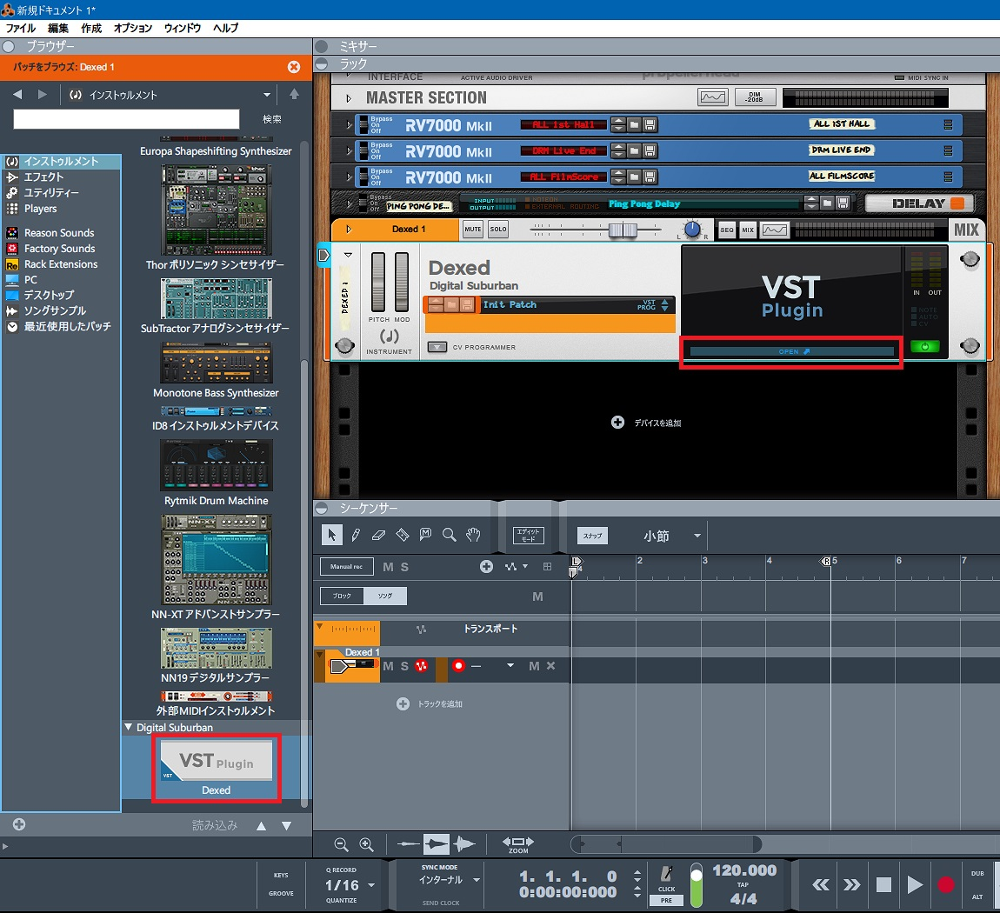
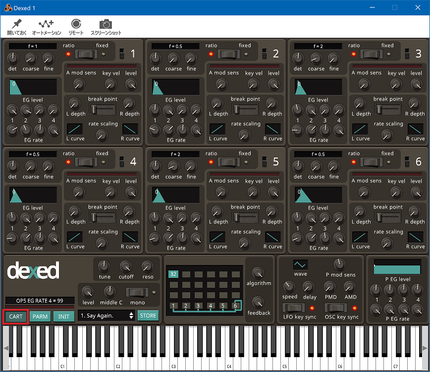
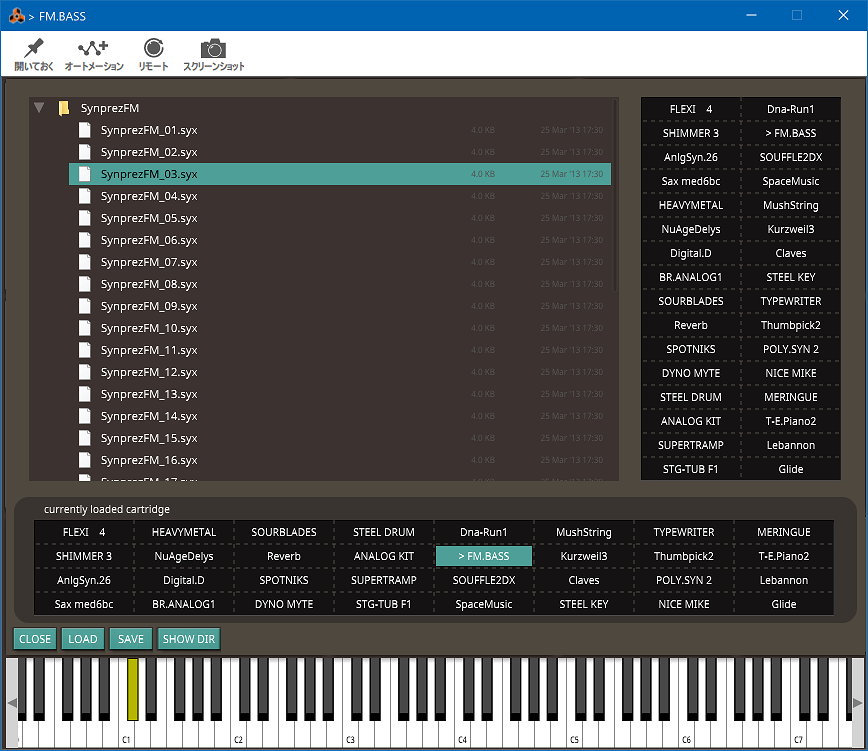

Korg microKEY Air-49 に付属していた Reason Lite 10 という DAW を使っている。デフォルトで様々なシンセが入っていて音作りの幅は広そうなのだが、DTM もシンセも素人なので「あの曲のアレっぽい音を出したい」と思うと作り込むのが難しい。

そこで調べていたところ、Yamaha DX-7 という有名なシンセを再現したフリーの FM 音源シンセ**「Dexed」**というモノを見つけた。

- [Dexed](https://asb2m10.github.io/dexed/)
- [asb2m10/dexed: DX7 FM multi plaform/multi format plugin](https://github.com/asb2m10/dexed)

GitHub で開発しているところが、う～んオープンソース。

## 現行最新版は VST3・Reason Lite 10 では使えず

試しに現行最新版の v0.9.6 をダウンロードしてみると、_VST3_ プラグインの形式らしい。`C:\Program Files\Common Files\VST3\Dexed.vst3` というパスにインストールされた。

しかし、Reason Lite 10 はコレを認識しなかった。

- [REASON STUDIOS Propellerhead 総合 62](https://egg.5ch.net/test/read.cgi/dtm/1583647207/76-78)

> **REASON10でvst3のプラグインって使えますか?**
> 
> Mac（OS 10.15）です。今まで純正かREしか使ってこなかったので、やり方がわからないです。
> Audioのplug-inフォルダにVST3フォルダがなかったので、自分でフォルダ切って、
> 拡張子がvst3のファイルはVST3フォルダへ、
> ComponentファイルはComponentsフォルダへ入れました。
> 
> そのあとREASONを起動させましたが、特に何も追加されていないようでした。
> 対象のVSTはAudecのtransientです
> 
> ---
> 
> **使えないよ**
> 
> ---
> 
> は？

そもそも VST が何なのかよく知らなかったのだが、Virtual Studio Technology の略で、多くの DAW で取り扱えるプラグインの形式のことらしい。狭義の VST (VSTe) はその中でもリバーブなどのエフェクト機能を指していて、VSTi と書くとインストゥルメント機能、すなわち音源を追加できたりする。

ちなみに規格は Steinberg 社が作っているようだ。現在は Yamaha の子会社。ASIO というオーディオドライバの規格もココが作っていて、DAW だと Cubase を作ってるところ。

- [スタインバーグ - Wikipedia](https://ja.wikipedia.org/wiki/%E3%82%B9%E3%82%BF%E3%82%A4%E3%83%B3%E3%83%90%E3%83%BC%E3%82%B0)

VST は長らくバージョン2系が普及していたが、2021年頃ぐらいから VST3 が普及しだして、段々コチラに移行している最中なようだ。

そんで、Reason Lite 10 というバージョンでは、VST3 は未対応で、VST2 なら使えるようであった。

## VST2 版を入れてみる

Dexed は GitHub で管理されているので、過去バージョンが残っているだろうと思い Releases を調べてみたら、あった。

- [Release Release 0.9.4 · asb2m10/dexed](https://github.com/asb2m10/dexed/releases/tag/v0.9.4hf1)
  - **v0.9.4 が、VST2 版がダウンロードできる最後のバージョンだった**

`dexed-0.9.4-win.zip` をダウンロード・解凍し、`dexed-0.9.4hf1-win.exe` をインストールすると、64bit 版の VST2 プラグインは `C:\Program Files\Steinberg\VSTPlugins\Dexed.dll` に配置された。VST2 は拡張子が `.dll` なのね～。

Reason Lite 10 を開いてみるとプラグインが自動認識された。

- 「編集」メニュー → 環境設定 → 高度設定 → 「VST プラグインフォルダ」欄

でプラグインがあるフォルダを指定できるようなので、もしも自動で追加されてなかったら自分で追加すれば良さそうだ。

- 「ウィンドウ」メニュー → プラグインの管理

を見ると、「Dexed」プラグインがちゃんと認識できたかどうか分かる。

「インストゥルメント」に Dexed が追加されていた。トラックに追加したあと、ラック内の「Open」を押すと Dexed のコントロール画面が開く。

以下の Dexed の画面は、Dexed のスタンドアローン版と同じ UI。左下の「Cart」ボタンから音色を変更できる。

`.syx` ファイルがいくつかの音色を格納するひとかたまりになっているので、色々試してみると良かろう。

Reason Lite 10 にある「Scales & Chords」も使えたのでよきよき。この「FM Bass」なんか、ケニー・ロギンスの「Danger Zone」のイントロまんまの音がするで。ｗ

---

ちなみに、VST2 は Steinberg がサポートを打ち切るとアナウンスしているようで、今後は VST3 に移行していくのだろう。

- [Release Release 0.9.5 · asb2m10/dexed](https://github.com/asb2m10/dexed/releases/tag/v0.9.5)
  > VST2 has been drop _because of licensing issues._ Because of this, we provides 64-bit builds only.

Dexed は v0.9.4 を最後に VST2 を取りやめ、v0.9.5 から VST3 に移行している。

- [VST2廃止！24か月以内のサポート終了を発表 | れれれP公式サイト【L3Project】](https://l3project.com/plugin/vst2/)
- [DX7を完全に再現するフリーのVSTプラグイン、DEXEDで遊ぼう | 藤本健の “DTMステーション”](https://www.dtmstation.com/archives/51921400.html)
- [DEXEDをダウンロードしよう！ | さあ、DTMを始めよう！](https://www.newdtm-rain.com/article/dexedwodaunro-do.html)
- [Reason Lite Rack PluginのMIDI OUTの使い方 | Chillout with Beats](https://chilloutwithbeats.com/reason-lite-rack-plugin-midi-out/)
- [【DTM】プラグイン規格VST2とVST3の違いとは？ | Katoten's Lab](https://katoten.com/dtm-plug-in-vst2-vst3-the-difference/)

まだまだ使いこなせていないけど、初めて Reason Lite 10 に VST2 プラグインを入れたのでメモがてら書いておいた。

  

    
  

  

    

      <a href="https://hb.afl.rakuten.co.jp/hgc/g00pjox2.waxyc961.g00pjox2.waxyd96a/?pc=https%3A%2F%2Fitem.rakuten.co.jp%2Fishibashi%2F80-modx7spset%2F&amp;m=http%3A%2F%2Fm.rakuten.co.jp%2Fishibashi%2Fi%2F10170147%2F">【あす楽対象商品】YAMAHA ヤマハ / MODX7【モニタースピーカーセット！】76鍵盤シンセサイザー【YRK】</a>
    

    

      <a href="https://hb.afl.rakuten.co.jp/hgc/g00pjox2.waxyc961.g00pjox2.waxyd96a/?pc=https%3A%2F%2Fwww.rakuten.co.jp%2Fishibashi%2F&amp;m=http%3A%2F%2Fm.rakuten.co.jp%2Fishibashi%2F">イシバシ楽器　WEB　SHOP</a>
    

    
価格 : 184800円

  

  

    
  

  

    

      <a href="https://www.amazon.co.jp/dp/B07JF4YKVW?tag=neos21-22&amp;linkCode=osi&amp;th=1&amp;psc=1">YAMAHA MODX7 + 純正ソフトケース SC-MODX7 セット</a>
    

  

