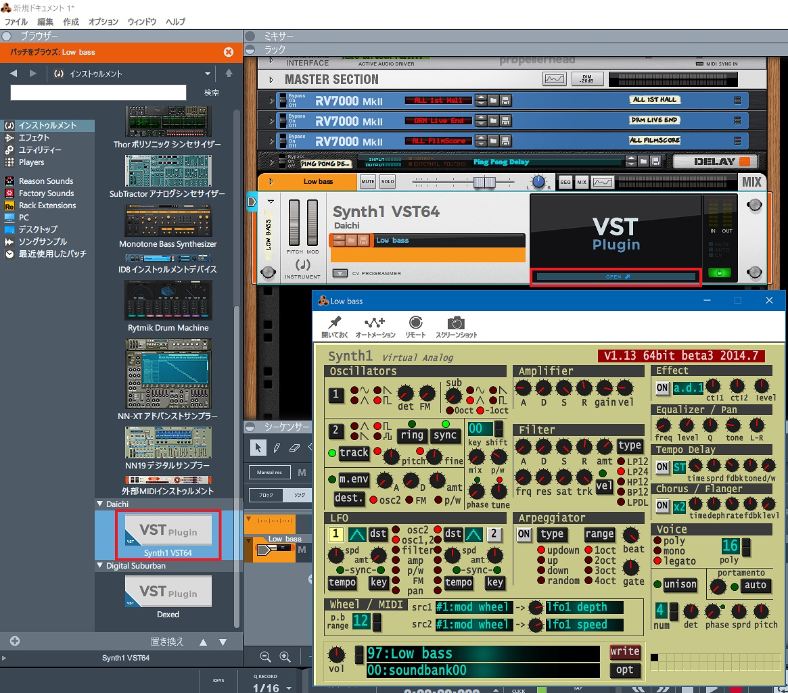

昨日の記事では Reason Lite 10 に Dexed という VST プラグインを導入したが、今日は **Synth1** というプラグインを入れてみる。

- [Software Synthesizer Synth1](https://daichilab.sakura.ne.jp/softsynth/)

Clavia Nord Lead 2 というシンセの再現らしい。

上のサイトから `Synth1V113beta3.zip` をダウンロード・解凍したら、`initsettings.exe` を実行する。最初から `zipbank/` にプリセット等も入っていたのでとりあえずこのまま実行。

そしたら `Synth1 VST64.dll` を `C:\Program Files\Steinberg\VSTPlugins\Synth1 VST64.dll` に配置する。すると、Dexed と同じ要領で Synth1 が Reason Lite 10 上に追加された。

ザ・シンセって感じの音がして面白い。昔持ってたオモチャのシンセキーボードでこんな音が出せたなーみたいなのもあって懐かしさがある。ｗ

  

    
  

  

    

      <a href="https://hb.afl.rakuten.co.jp/hgc/g00pvd82.waxyc33d.g00pvd82.waxydf63/?pc=https%3A%2F%2Fitem.rakuten.co.jp%2Fmarks%2Fclavia-nordleada1-a%2F&amp;m=http%3A%2F%2Fm.rakuten.co.jp%2Fmarks%2Fi%2F10007174%2F">CLAVIA nord lead A1（新品）【送料無料】</a>
    

    

      <a href="https://hb.afl.rakuten.co.jp/hgc/g00pvd82.waxyc33d.g00pvd82.waxydf63/?pc=https%3A%2F%2Fwww.rakuten.co.jp%2Fmarks%2F&amp;m=http%3A%2F%2Fm.rakuten.co.jp%2Fmarks%2F">マークスミュージック楽天市場店</a>
    

    
価格 : 209000円

  

  

    
  

  

    

      <a href="https://www.amazon.co.jp/dp/B00GDZOT8A?tag=neos21-22&amp;linkCode=osi&amp;th=1&amp;psc=1">CLAVIA Nord Lead 2</a>
    

  

