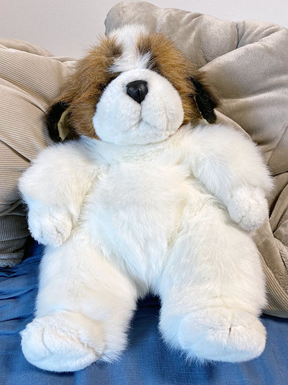
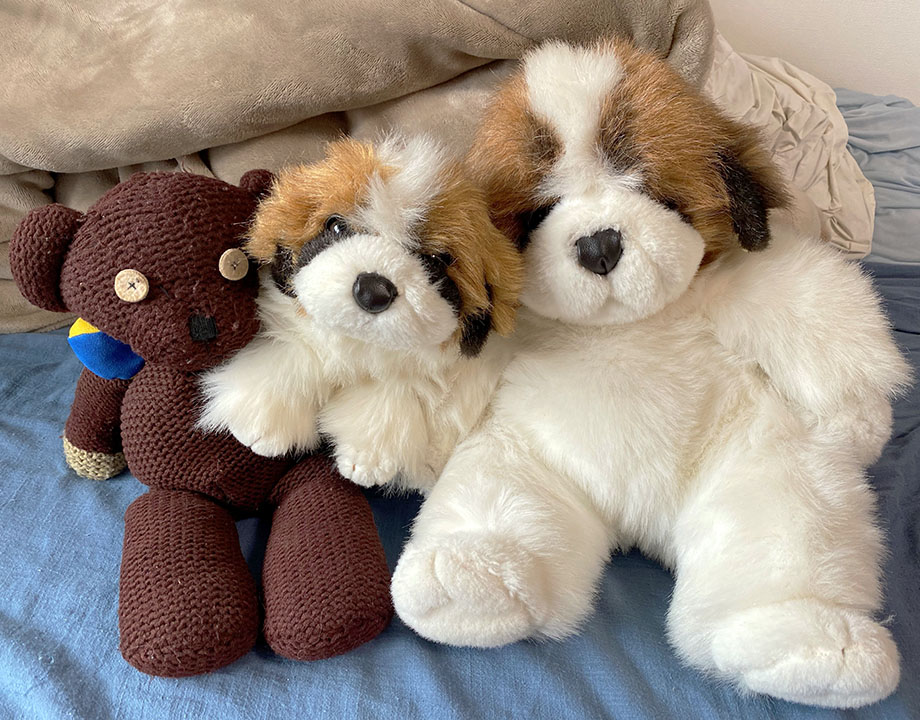
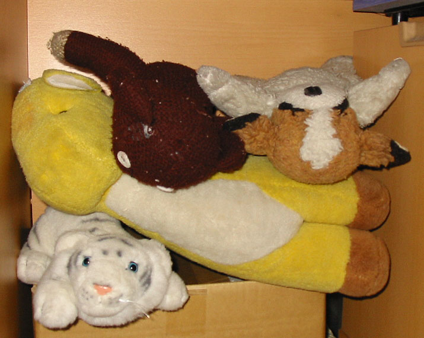
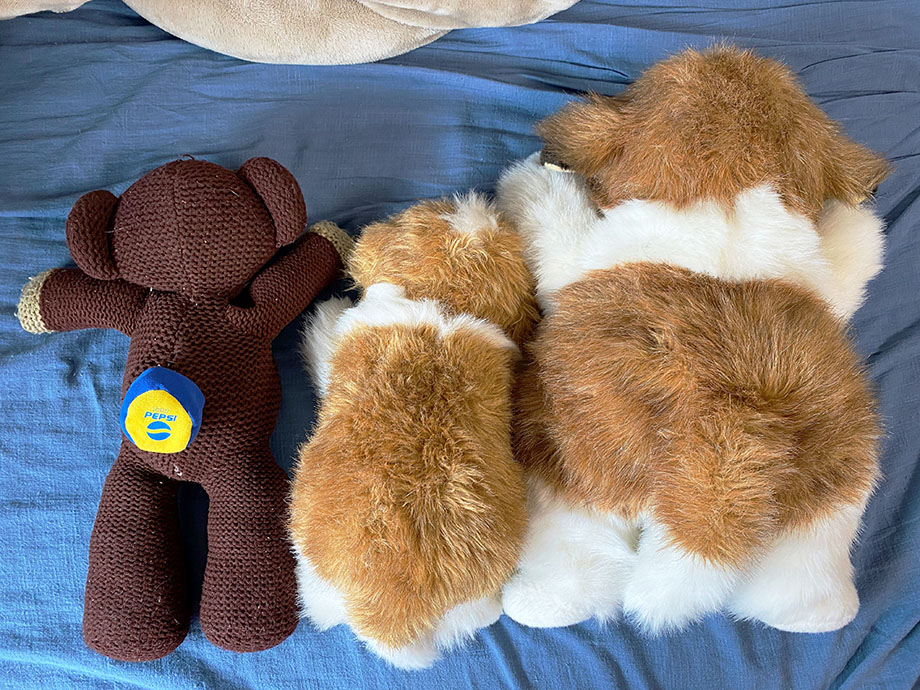
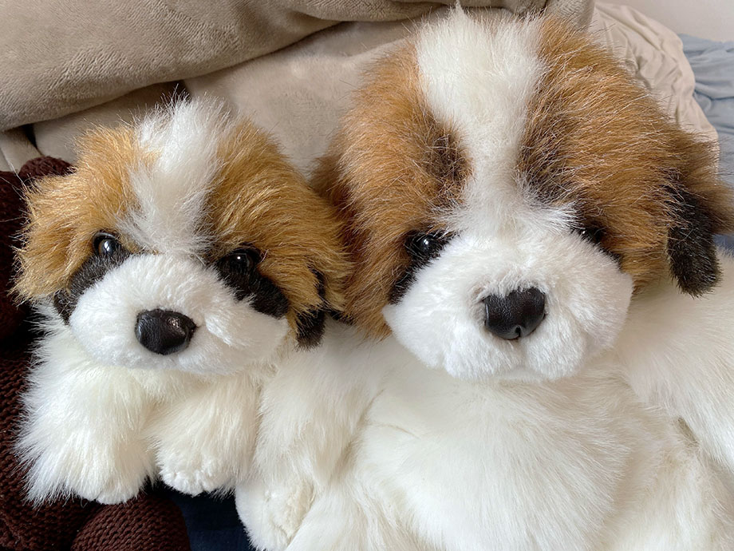

以前こんな記事を書いた。僕が1歳の誕生日に買ってもらった、オリエンタルトーイ社製のセントバーナード犬のぬいぐるみについての記事だ。

- 過去記事：[オリエンタルトーイの犬のぬいぐるみの詳細キボンヌ](/blog/2021/11/27-01.html)

過去記事の末尾に、同型のぬいぐるみを今もお持ちの方からご連絡をいただいた件を追記しているが、今回それから続報があるので今回まとめておく。

---

先日、上述のブログ記事を見ていただき、ぬいぐるみを譲りますというご連絡をメールでいただいた。僕の住まいからは遠方の方だったのだが、とても迅速かつ丁寧にご対応いただき、連絡してからすぐに届いた。

↑ コチラがその「3代目わんちゃん」。僕が持っていたタイプよりはちょっと大きいタイプと思われる。過去にヤフオクにサイズ違いの3種類が同時出品されていたので、オリエンタルトーイのセントバーナード犬は様々なタイプが存在したようだ。

ただ、やはり同じオリエンタルトーイ社製ということで、毛並みの感じや目、鼻の質感なんかは初代・2代目わんちゃんとホントに同じ。

↑ テディベア (左) と2代目わんちゃん (中央)、そして今回購入した3代目わんちゃん (右)。

↑ 20年前の 2002-02-04 に撮影した写真。テディベア (中央上) は前回の記事にも書いたが、7・8歳の頃に入手したモノで、初代わんちゃん (右上) 亡きあと、自分の所有ぬいぐるみの最年長だ。

ちなみに下段のホワイトタイガーは1998年にシンガポール旅行した時に購入したモノで、中央のキリンは僕が生まれた時にプレゼントしてもらったモノ。キリンのツノの部分は幼い弟がちぎって誤飲してしまい、このぬいぐるみを大事に思っていた母が涙していたことを覚えているｗ。ホワイトタイガーもキリンも残念ながら現存しないが、彼らも大切にしていたぬいぐるみ達だ。

案外、ぬいぐるみの背中側って写真記録が少なかったりするんじゃないか？と思って、今回撮っておいた。全体を360度撮影しておいて 3D モデルとして記録に残しておきたい欲もあるｗ。テディの背中に乗せているのは2003年頃にペプシツイストのオマケとして付いていた「フットバッグ (フットジャグ)」。

現存しない初代わんちゃんの代わりにと購入した2代目・3代目だが、彼らも新しい家族の一員。これからも大切にしていく。

一方で、できれば初代わんちゃんのドンズバ同型も再購入したいとはまだ思っている。残りの人生のささやかな楽しみというか、あの頃の思い出を回収するような思いで、ゆる～く探し続けて行こうと思っている。

ということで、このページをご覧の方で、オリエンタルトーイ社製のセントバーナード犬のぬいぐるみ、「初代わんちゃん」の商品に関する情報を御存知の方がいたら、ぜひ_[メール](/about/index.html#mail)_等で教えてください。

**せっかくメールをいただいていながら大変申し訳ないのですが、迷惑メールと誤検知されてメール確認が遅れてしまうことがあります。メール確認の催促をしたい場合は、お手数ですが [Instagram](https://www.instagram.com/Neos21/) か [Facebook](https://www.facebook.com/Neos21) の投稿コメントや DM でお知らせいただけますと大変助かります。**

  

    
  

  

    

      <a href="https://www.amazon.co.jp/dp/B09X9RSYPJ?tag=neos21-22&amp;linkCode=osi&amp;th=1&amp;psc=1">オリエンタルトーイ うめ吉 ぬいぐるみ レトロぬいぐるみ ピンクうさぎ</a>
    

  

  

    
  

  

    

      <a href="https://hb.afl.rakuten.co.jp/hgc/g00tpeb2.waxyc733.g00tpeb2.waxyd4b4/?pc=https%3A%2F%2Fitem.rakuten.co.jp%2Fsouthbank%2Fxae3ztl94kr1csdv%2F&amp;m=http%3A%2F%2Fm.rakuten.co.jp%2Fsouthbank%2Fi%2F10396238%2F">オリエンタルトーイ ミニチュアダックス クリーム</a>
    

    

      <a href="https://hb.afl.rakuten.co.jp/hgc/g00tpeb2.waxyc733.g00tpeb2.waxyd4b4/?pc=https%3A%2F%2Fwww.rakuten.co.jp%2Fsouthbank%2F&amp;m=http%3A%2F%2Fm.rakuten.co.jp%2Fsouthbank%2F">季節用品と生活雑貨のユニセール</a>
    

    
価格 : 3495円

  

