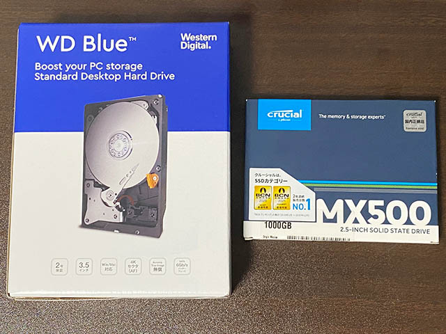
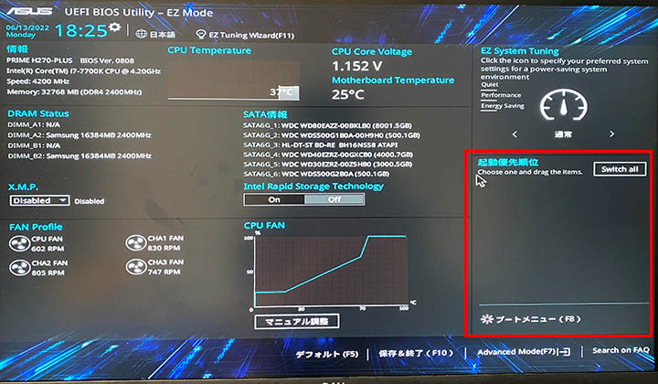
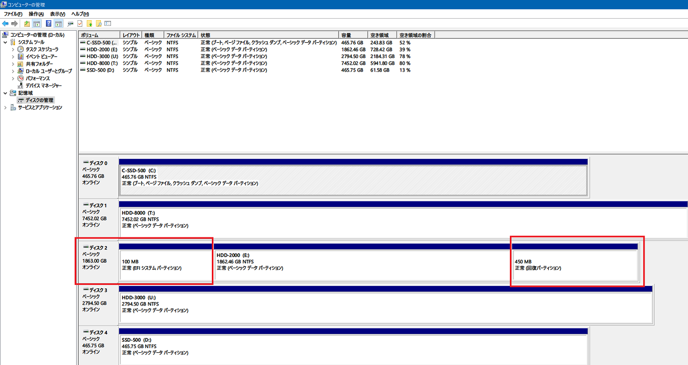
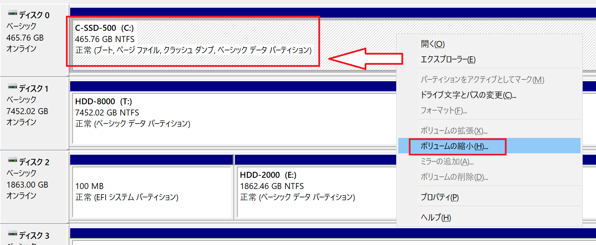
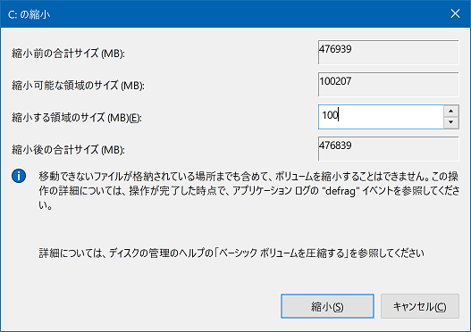
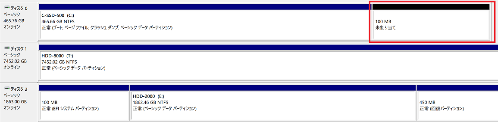
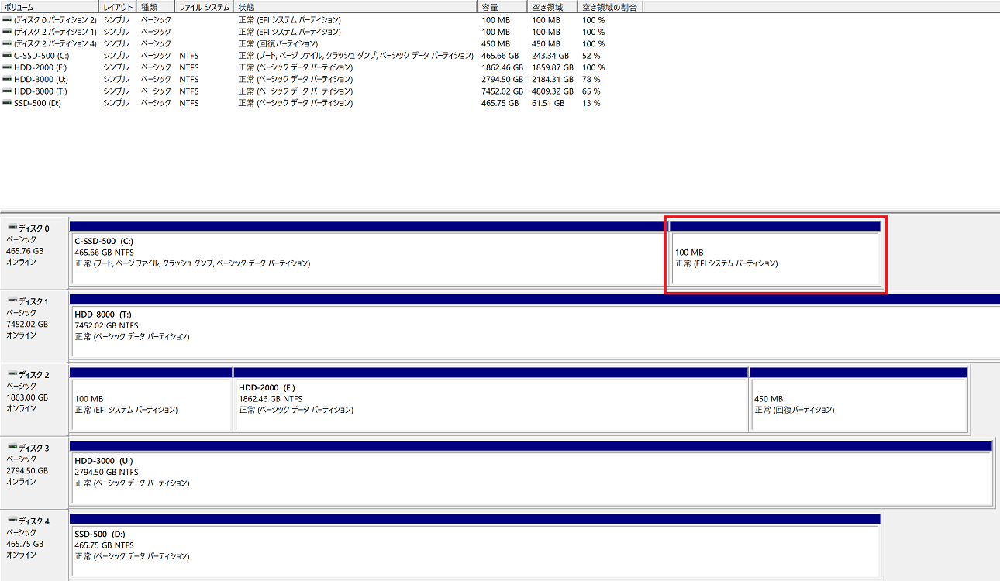
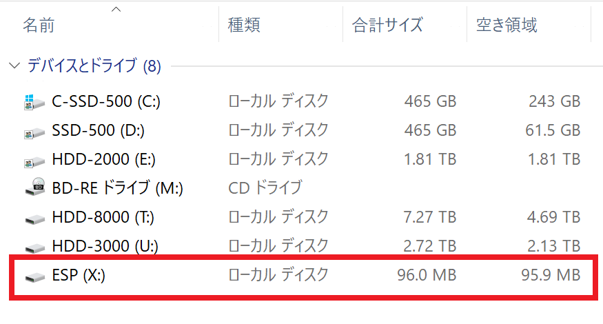
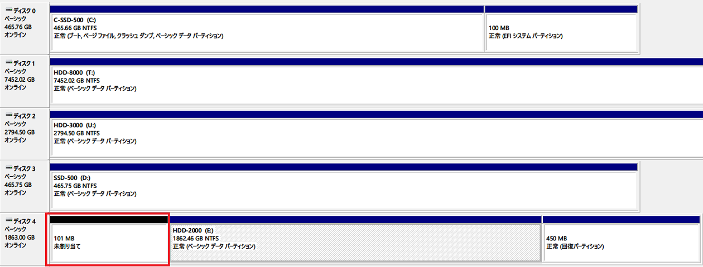

2年ぶりに母艦の内蔵 HDD と SSD を変更したところ、トラブルに遭遇。

## 目次

## いきさつ

2020年に、母艦のデスクトップ PC、Galleria XG に HDD と SSD を増設していた。

- 過去記事：[デスクトップ PC に内蔵 HDD と内蔵 SSD を増設したので手順を解説する](/blog/2020/06/07-03.html)

この PC ケースには3.5インチベイが5段あるのだが、現状は筐体の上から下 (底面) に向かって、次のような並び順にしていた。

1. *3TB HDD*
2. 500GB SSD
3. **2TB HDD**
4. 500GB SSD (システムドライブ)
5. 4TB HDD

用途別に 2・3・4TB の HDD をデータ用にし、高速にデータ転送をしたい時のために2つ目の SSD を積んでいる、という感じだった。

だが、SSD が 500GB × 2台だと動画編集などですぐにいっぱいになってしまうため、今回思い切って HDD と SSD の構成を変えることにした。

## 購入した SSD と HDD

秋葉原に行って安い店を色々探したのだが、結局はソフマップが最安値だったｗ。購入したのは以下の2つ。

- Western Digital WD Blue WD80EAZZ : 8TB HDD (3.5インチ) … 13,880円
- Crucial CT1000MX500 : 1TB SSD (2.5インチ) … 11,800円



<div class="ad-amazon">
  <div class="ad-amazon-image">
    <a href="https://www.amazon.co.jp/dp/B09LH9XLB9?tag=neos21-22&amp;linkCode=osi&amp;th=1&amp;psc=1">
      
    </a>
  </div>
  <div class="ad-amazon-info">
    <div class="ad-amazon-title">
      <a href="https://www.amazon.co.jp/dp/B09LH9XLB9?tag=neos21-22&amp;linkCode=osi&amp;th=1&amp;psc=1">Western Digital ウエスタンデジタル 内蔵 HDD 8TB WD Blue PC 3.5インチ(CMR) WD80EAZZ-EC 【国内正規代理店品】</a>
    </div>
  </div>
</div>

<div class="ad-rakuten">
  <div class="ad-rakuten-image">
    <a href="https://hb.afl.rakuten.co.jp/hgc/g00pajc2.waxycfed.g00pajc2.waxyd33d/?pc=https%3A%2F%2Fitem.rakuten.co.jp%2Fpcdepot%2F0718037894157%2F&amp;m=http%3A%2F%2Fm.rakuten.co.jp%2Fpcdepot%2Fi%2F10063106%2F">
      
    </a>
  </div>
  <div class="ad-rakuten-info">
    <div class="ad-rakuten-title">
      <a href="https://hb.afl.rakuten.co.jp/hgc/g00pajc2.waxycfed.g00pajc2.waxyd33d/?pc=https%3A%2F%2Fitem.rakuten.co.jp%2Fpcdepot%2F0718037894157%2F&amp;m=http%3A%2F%2Fm.rakuten.co.jp%2Fpcdepot%2Fi%2F10063106%2F">内蔵HDD WD80EAZZ [3.5インチ] WD80EAZZ＜メーカー2年保証＞</a>
    </div>
    <div class="ad-rakuten-shop">
      <a href="https://hb.afl.rakuten.co.jp/hgc/g00pajc2.waxycfed.g00pajc2.waxyd33d/?pc=https%3A%2F%2Fwww.rakuten.co.jp%2Fpcdepot%2F&amp;m=http%3A%2F%2Fm.rakuten.co.jp%2Fpcdepot%2F">PC DEPOT</a>
    </div>
    <div class="ad-rakuten-price">価格 : 14150円</div>
  </div>
</div>

HDD は個人的に安定の WD Blue。3・4TB HDD と2つの SSD はいずれも WD Blue である。今回は大容量の 8TB を購入した。Seagate BarraCuda もほぼ同じか若干安いぐらいのラインナップだったが、自分の中で実績のあるメーカで選んだ。

<div class="ad-amazon">
  <div class="ad-amazon-image">
    <a href="https://www.amazon.co.jp/dp/B077PSMJZS?tag=neos21-22&amp;linkCode=osi&amp;th=1&amp;psc=1">
      
    </a>
  </div>
  <div class="ad-amazon-info">
    <div class="ad-amazon-title">
      <a href="https://www.amazon.co.jp/dp/B077PSMJZS?tag=neos21-22&amp;linkCode=osi&amp;th=1&amp;psc=1">Crucial SSD 1000GB MX500 内蔵2.5インチ 7mm MX500 (9.5mmスペーサー付属) 5年保証 【PlayStation4 動作確認済】 正規代理店保証品 CT1000MX500SSD1/JP</a>
    </div>
  </div>
</div>

<div class="ad-rakuten">
  <div class="ad-rakuten-image">
    <a href="https://hb.afl.rakuten.co.jp/hgc/g00pajc2.waxycfed.g00pajc2.waxyd33d/?pc=https%3A%2F%2Fitem.rakuten.co.jp%2Fpcdepot%2F4988755041249%2F&amp;m=http%3A%2F%2Fm.rakuten.co.jp%2Fpcdepot%2Fi%2F10059612%2F">
      
    </a>
  </div>
  <div class="ad-rakuten-info">
    <div class="ad-rakuten-title">
      <a href="https://hb.afl.rakuten.co.jp/hgc/g00pajc2.waxycfed.g00pajc2.waxyd33d/?pc=https%3A%2F%2Fitem.rakuten.co.jp%2Fpcdepot%2F4988755041249%2F&amp;m=http%3A%2F%2Fm.rakuten.co.jp%2Fpcdepot%2Fi%2F10059612%2F">Crucial MX500 CT1000MX500SSD1/JP (1TB SATA600 SSD) 5年保証</a>
    </div>
    <div class="ad-rakuten-shop">
      <a href="https://hb.afl.rakuten.co.jp/hgc/g00pajc2.waxycfed.g00pajc2.waxyd33d/?pc=https%3A%2F%2Fwww.rakuten.co.jp%2Fpcdepot%2F&amp;m=http%3A%2F%2Fm.rakuten.co.jp%2Fpcdepot%2F">PC DEPOT</a>
    </div>
    <div class="ad-rakuten-price">価格 : 11338円</div>
  </div>
</div>

SSD の方は、初めてクルーシャル製品を選んだ。WD Blue の SSD にしようとすると数千円高くなるので、値段で選んだｗ。クルーシャルは MX500 よりわずかに安い BX500 というラインナップもあったが、筐体がプラパーツだか何だかで冷却性能が微妙、読み書き速度も若干遅くなるらしいので、だったら千円ちょっと出して良い方を買っておくか、ということで MX500 シリーズを選んだ。同価格帯には SanDisk の Plus だか Ultra だかいう製品もあり、良し悪しが一見して分かりにくいね。ｗ

ちなみに、Galleria XG のマザーボード、Asus Prime H270-Plus には M.2 SSD を挿せる場所も2つあるのだが、未経験の M.2 は避けて今までと同じく SATA 6Gbps 接続の2.5インチ SSD を選んだ。M.2 にしたらもっと速いんだろうけど、それは将来のメインマシン交換のときにとっとくわ。ｗ

## 換装

購入した HDD・SSD を換装していく。計画としては、既存の  2・3TB HDD の2つを取り除き、HDD 2台、SSD 3台を取り付けることにした。After は筐体の上から下 (底面) に向かって、次のような並び順。

1. *8TB HDD (今回購入)*
2. 500GB SSD (既存)
3. *1TB SSD (今回購入)*
4. 500GB SSD (既存・システムドライブ)
5. 4TB HDD (既存)

マザボの SATA ポートの番号は並び順どおりではなくグチャグチャなのだが、特に SATA ポートの番号の若い順に揃えたりしてもしなくても、動作には関係がなかった。ちなみに接続した SATA ポート番号順に書くとこんな感じ。

1. 8TB HDD
2. 500GB SSD (システムドライブ)
3. Blu-ray ドライブ (既存のまま)
4. 4TB HDD
5. 1TB SSD
6. 500GB SSD

今回はケーブル類は既に揃っているので、ドライブの取り外しと取り付けのみ。コレで上手くいくはずだったのだが…。

## BIOS 画面から先に進まない

**2TB HDD** と 3TB HDD を取り外し、8TB HDD と 1TB SSD を取り付けて起動したところ、**UEFI BIOS 画面から先に進まなくなってしまった**。よく見ると、SATA ポートに挿さっているドライブ類は全て認識しているのだが、ブート順序を選択できる画面でどのドライブも一覧に登場しない。システムドライブである SSD はケーブルを取り外したり移動したりしていないのだが、どうしてこのドライブがブートメニューに出てこないのだろうか？



↑ 本来はこの UEFI BIOS 画面の右下に、ブート順序を選択できる一覧が表示されるはずなのだが、赤枠部にどのドライブも出てこない。しかしその左側の SATA ポート一覧には HDD と SSD の製品名まで正しく表示されていて、新しい 8TB HDD・1TB SSD も認識はしているので、「システムドライブである SSD の接続を認識していない」ワケではないようだ。

SATA ポートの番号を変えてみたりなど色々したがダメ。仕方なく 2TB HDD と 3TB HDD を元に戻して取り付けてみると無事起動した。

## 強引にホットスワップで動かしていたら気付いた…

元の構成だととりあえず Windows10 が起動したので、OS が起動している状態で、強引に SATA 端子を抜いて新しい HDD に差し替えることで、無理やりホットスワップしてみたら、とりあえずは新しい HDD も SSD も認識した。ということで、今回購入したドライブが故障しているワケではなさそう。

ひとまずは既存の **2TB HDD** と 3TB HDD から、データを抽出して 8TB HDD に移動させていたのだが、ふと「コンピューターの管理」→「ディスクの管理」でディスクを眺めていたところ、異変に気が付いた。



↑ 一覧の一番上が、システムドライブである 500GB の SSD。そして2つ下、赤枠で囲っているのが **2TB の HDD** なのだが、ココに「**EFI システムパーティション**」なるパーティションと、「*回復パーティション*」なるパーティションが存在することに気付いた。

そこで調べてみると、この「**EFI システムパーティション**」という部分が最初に起動することで、ブート順序を決めたりするための UEFI 部分が動作するようだ。

そういえば引越し後にリカバリをした際、*一度 HDD 側に OS が再インストールされてしまうトラブルがあった*。その時は SSD 側に再インストールするようにして対応したのだが、どうやらその時に OS と一緒に EFI 関連のパーティションが **HDD 側にインストールされたまま動いていたようだ**。要するに **2TB の HDD を接続しておかないと PC が起動できない**状態になっていたワケである。システムドライブである SSD の手前に必要な「EFI ブートローダ」というプログラムが、HDD 側にインストールされていたワケだ。

もう一つの「*回復パーティション*」というのはリカバリ時に使用するようだが、自分は今後リカバリする際はクリーンインストールするつもりなので、「システムの復元」は使わないのでココは捨ててしまって良いか。

ということは、やるべきことは、*2TB HDD に存在している「EFI システムパーティション」(EFI System Partition、略して ESP) を、システムドライブである 500GB SSD の方に作り直す*という作業が必要になる。

## EFI システムパーティションの作成に関して参考になったサイト

最初は EFI システムパーティションとやらが何なのかすら分かっていない状態だったのだが、以下の記事が分かりやすかった。

- 参考：[【Win10】任意のディスクにEFIブートローダをインストールする - Qiita](https://qiita.com/rerymd/items/638a4fcf8f23ce8aab2d)

大まかな手順をまとめておく。

1. 「EFI システムパーティション」を作りたい SSD で「ボリュームの縮小」を行い、「EFI システムパーティション」用の未割り当て領域を作る
2. `diskpart` コマンドで SSD の未割り当て領域に対し、EFI システムパーティションを作る
3. 動作確認したら、HDD 側にある EFI システムパーティションを削除する

実質、必須なのは手順 1. と 2. だけで、手順 3. は後処理だ。

ちなみに色々調べたが、**ドライブのパーティションの「左右」を入れ替えるのは無理そう**。完全に全体をフォーマットして、左から順にパーティションを切り直さないといけないようだ。ググると「EaseUS Partition Master Free」といった専用ソフトがトップに出てきたりするが、こういうソフトでもパーティションの左右入れ替えなどは出来なかった。

綺麗にパーティションを切るなら、ドライブの左から「EFI システムパーティション」、システムパーティション、(任意で回復パーティション)、という風に並べたいところだが、今回はシステムパーティション → ESP という順番でパーティションを切り、動作上も問題なかったので、この手順で紹介する。

## ボリュームの縮小

まずはシステムドライブに EFI パーティション用の未割り当て領域を作る。「コンピューターの管理」→「ディスクの管理」と移動し、システムドライブを右クリックして「ボリュームの縮小」を選ぶ。



次に、ウィザードで作成する領域を指定するのだが、ココでは既存の EFI システムパーティションの容量に合わせて 100MB の領域を作ることにする。



上手くパーティションが区切れると、以下のように未割り当て領域が 100MB 分できるはずだ。



## `diskpart` コマンドで EFI システムパーティションを作成する

続いて、この未割り当て領域に「EFI システムパーティション」を作っていく。

管理者権限で PowerShell を起動し、`diskpart` コマンドを実行する。

```powershell
PS C:\WINDOWS\system32> diskpart

Microsoft DiskPart バージョン 10.0.19041.964

Copyright (C) Microsoft Corporation.
コンピューター: NEOS-GALLERIA

# 「ボリューム」の一覧を見るとこんな感じ
DISKPART> list volume

  Volume ###  Ltr Label        Fs    Type        Size     Status     Info
  ----------  --- -----------  ----  ----------  -------  ---------  --------
  Volume 0     M                       DVD-ROM         0 B  メディアなし
  Volume 1     C   C-SSD-500    NTFS   Partition    465 GB  正常         ブート
  Volume 2     T   HDD-8000     NTFS   Partition   7452 GB  正常
  Volume 3     E   HDD-2000     NTFS   Partition   1862 GB  正常
  Volume 4         SYSTEM       FAT32  Partition    100 MB  正常         非表示
  Volume 5         Windows RE   NTFS   Partition    450 MB  正常         非表示
  Volume 6     U   HDD-3000     NTFS   Partition   2794 GB  正常
  Volume 7     D   SSD-500      NTFS   Partition    465 GB  正常


DISKPART> list disk

  ディスク      状態           サイズ   空き   ダイナ GPT
  ###                                          ミック
  ------------  -------------  -------  -------  ---  ---
  ディスク 0    オンライン           465 GB   100 MB        *
  ディスク 1    オンライン          7452 GB  1024 KB        *
  ディスク 2    オンライン          1863 GB      0 B        *
  ディスク 3    オンライン          2794 GB  1024 KB        *
  ディスク 4    オンライン           465 GB  1024 KB        *
```

すると `DISKPART>` という専用のプロンプトが表示される。まずは `list volume` でエクスプローラに表示される相当のドライブ達を確認し、`list disk` で「ディスクの管理」相当の内容が見えていることを確認する。

`list volume` の方を見ると、`SYSTEM` と `Windows RE` という非表示のボリュームがある。コレが、2TB の HDD に作られてしまっている「EFI システムパーティション」と「回復パーティション」に相当する。

`diskpart` では、ディスク → パーティション、という入れ子構造で操作する要素を選択していく。今回はシステムドライブである 500GB の SSD の中にある、100MB 分の未割り当て領域を選択していく。

```powershell
# list disk の内容を見て、ディスク 0 を選択する
DISKPART> select disk 0

ディスク 0 が選択されました。

# ディスク 0 内の既存のパーティションを確認する。未割り当て領域はココには表示されない
DISKPART> list partition

  Partition ###  Type                Size     Offset
  -------------  ------------------  -------  -------
  Partition 1    プライマリ              465 GB  1024 KB

# 選択したディスク 0 の中にパーティションを作成する。size は MB 単位なので、100MB 単位でパーティションを作る
DISKPART> create partition EFI size=100

DiskPart は指定したパーティションの作成に成功しました。

# パーティションが作成できたことを確認する。行頭のアスタリスクで作成した Partition 2 が選択されていることを確認する
DISKPART> list partition

  Partition ###  Type                Size     Offset
  -------------  ------------------  -------  -------
  Partition 1    プライマリ              465 GB  1024 KB
* Partition 2    システム               100 MB   465 GB

# ボリューム一覧にも Volume 8 が新登場した。行頭のアスタリスクで作成した Volume 8 が選択されていることを確認する
DISKPART> list volume

  Volume ###  Ltr Label        Fs    Type        Size     Status     Info
  ----------  --- -----------  ----  ----------  -------  ---------  --------
  Volume 0     M                       DVD-ROM         0 B  メディアなし
  Volume 1     C   C-SSD-500    NTFS   Partition    465 GB  正常         ブート
  Volume 2     T   HDD-8000     NTFS   Partition   7452 GB  正常
  Volume 3     E   HDD-2000     NTFS   Partition   1862 GB  正常
  Volume 4         SYSTEM       FAT32  Partition    100 MB  正常         非表示
  Volume 5         Windows RE   NTFS   Partition    450 MB  正常         非表示
  Volume 6     U   HDD-3000     NTFS   Partition   2794 GB  正常
  Volume 7     D   SSD-500      NTFS   Partition    465 GB  正常
* Volume 8                      RAW    Partition    100 MB  正常         非表示
```

このように、まずはパーティションだけ切れた。引き続きこのパーティションをフォーマットし、UEFI ブートローダをインストールしていく。

```powershell
# 選択されている Volume 8 をフォーマットし、「ESP」というラベルを付けておく
DISKPART> format quick fs=fat32 label="ESP"

  100% 完了しました

DiskPart は、ボリュームのフォーマットを完了しました。

# フォーマットした Volume 8 = 「ESP」はこんな感じ
DISKPART> list volume

  Volume ###  Ltr Label        Fs    Type        Size     Status     Info
  ----------  --- -----------  ----  ----------  -------  ---------  --------
  Volume 0     M                       DVD-ROM         0 B  メディアなし
  Volume 1     C   C-SSD-500    NTFS   Partition    465 GB  正常         ブート
  Volume 2     T   HDD-8000     NTFS   Partition   7452 GB  正常
  Volume 3     E   HDD-2000     NTFS   Partition   1862 GB  正常
  Volume 4         SYSTEM       FAT32  Partition    100 MB  正常         非表示
  Volume 5         Windows RE   NTFS   Partition    450 MB  正常         非表示
  Volume 6     U   HDD-3000     NTFS   Partition   2794 GB  正常
  Volume 7     D   SSD-500      NTFS   Partition    465 GB  正常
* Volume 8         ESP          FAT32  Partition    100 MB  正常         非表示

# 選択中の Volume 8 に、一時的にドライブレターを割り当てる
DISKPART> assign letter=X

DiskPart はドライブ文字またはマウント ポイントを正常に割り当てました。

# ドライブレターとして「X」が正常に割り当てられたことを確認する
DISKPART> list volume

  Volume ###  Ltr Label        Fs    Type        Size     Status     Info
  ----------  --- -----------  ----  ----------  -------  ---------  --------
  Volume 0     M                       DVD-ROM         0 B  メディアなし
  Volume 1     C   C-SSD-500    NTFS   Partition    465 GB  正常         ブート
  Volume 2     T   HDD-8000     NTFS   Partition   7452 GB  正常
  Volume 3     E   HDD-2000     NTFS   Partition   1862 GB  正常
  Volume 4         SYSTEM       FAT32  Partition    100 MB  正常         非表示
  Volume 5         Windows RE   NTFS   Partition    450 MB  正常         非表示
  Volume 6     U   HDD-3000     NTFS   Partition   2794 GB  正常
  Volume 7     D   SSD-500      NTFS   Partition    465 GB  正常
* Volume 8     X   ESP          FAT32  Partition    100 MB  正常         非表示

# diskpart コマンドを終了する
DISKPART> exit

DiskPart を終了しています...
```

そしたら引き続き管理者権限で起動している PowerShell 上で、次のように `bcdboot` コマンドを実行する。

```powershell
PS C:\WINDOWS\system32> bcdboot C:\Windows /s X: /f UEFI
ブート ファイルは正常に作成されました。
```

割り当てたドライブレターである「X」を指定し、UEFI ブートローダをインストールできた。



↑ 「ディスクの管理」で確認すると、このように EFI システムパーティションが作成できているはずだ。



↑ ちなみにエクスプローラにも、ドライブレター「X」を割り当てたボリューム「ESP」が見えていることだろう。

## 動作確認する

ココまで作業できたら、一度 PC の電源を落として、今まで EFI システムパーティションが載っていた 2TB の HDD を取り外してマシンを起動してみる。SSD 側に新規作成した EFI システムパーティションを使って PC が起動してくれるか確認する。

自分は問題なく SSD のみで PC が起動するようになった。とりあえず必須の作業はココまでで、あとは残処理。

## 「ESP」ボリュームのドライブレターを削除する

「ESP」ボリュームが X ドライブとして見え続けている必要はないので、ドライブレターを削除する。管理者権限で起動した PowerShell で再び `diskpart` コマンドを起動する。

```powershell
DISKPART> list volume

  Volume ###  Ltr Label        Fs    Type        Size     Status     Info
  ----------  --- -----------  ----  ----------  -------  ---------  --------
  Volume 0     M                       DVD-ROM         0 B  メディアなし
  Volume 1     C   C-SSD-500    NTFS   Partition    465 GB  正常         ブート
  Volume 2     X   ESP          FAT32  Partition    100 MB  正常         非表示
  Volume 3     T   HDD-8000     NTFS   Partition   7452 GB  正常
  Volume 4     E   HDD-2000     NTFS   Partition   1862 GB  正常
  Volume 5         SYSTEM       FAT32  Partition    100 MB  正常         非表示
  Volume 6         Windows RE   NTFS   Partition    450 MB  正常         非表示
  Volume 7     U   HDD-3000     NTFS   Partition   2794 GB  正常
  Volume 8     D   SSD-500      NTFS   Partition    465 GB  正常

# Volume 2 を選択する
DISKPART> select volume 2

ボリューム 2 が選択されました。

# 割り当てていたドライブレター「X」を削除する
DISKPART> remove letter X

DiskPart はドライブ文字またはマウント ポイントを正常に削除しました。

# ドライブレターが消えたことを確認する
DISKPART> list volume

  Volume ###  Ltr Label        Fs    Type        Size     Status     Info
  ----------  --- -----------  ----  ----------  -------  ---------  --------
  Volume 0     M                       DVD-ROM         0 B  メディアなし
  Volume 1     C   C-SSD-500    NTFS   Partition    465 GB  正常         ブート
* Volume 2         ESP          FAT32  Partition    100 MB  正常         非表示
  Volume 3     T   HDD-8000     NTFS   Partition   7452 GB  正常
  Volume 4     E   HDD-2000     NTFS   Partition   1862 GB  正常
  Volume 5         SYSTEM       FAT32  Partition    100 MB  正常         非表示
  Volume 6         Windows RE   NTFS   Partition    450 MB  正常         非表示
  Volume 7     U   HDD-3000     NTFS   Partition   2794 GB  正常
  Volume 8     D   SSD-500      NTFS   Partition    465 GB  正常
```

## HDD 側の EFI システムパーティションなどを削除する

コレでシステムドライブがある SSD 側の対応は終わったので、あとは 2TB の HDD 側にある EFI システムパーティションと回復パーティションを削除してしまおう。

以降の作業では 2TB の HDD を一度初期化するので、当然ながら HDD 内のデータは事前に退避しておくこと。

```powershell
# ディスク 4 が 2TB HDD のこと
DISKPART> list disk

  ディスク      状態           サイズ   空き   ダイナ GPT
  ###                                          ミック
  ------------  -------------  -------  -------  ---  ---
  ディスク 0    オンライン           465 GB      0 B        *
  ディスク 1    オンライン          7452 GB  1024 KB        *
  ディスク 2    オンライン          2794 GB  1024 KB        *
  ディスク 3    オンライン           465 GB  1024 KB        *
  ディスク 4    オンライン          1863 GB      0 B        *

# Volume 6・7・8 の3つが 2TB の HDD に作られているパーティション達だ
DISKPART> list volume

  Volume ###  Ltr Label        Fs    Type        Size     Status     Info
  ----------  --- -----------  ----  ----------  -------  ---------  --------
  Volume 0     M                       DVD-ROM         0 B  メディアなし
  Volume 1     C   C-SSD-500    NTFS   Partition    465 GB  正常         ブート
  Volume 2         ESP          FAT32  Partition    100 MB  正常         システム
  Volume 3     T   HDD-8000     NTFS   Partition   7452 GB  正常
  Volume 4     U   HDD-3000     NTFS   Partition   2794 GB  正常
  Volume 5     D   SSD-500      NTFS   Partition    465 GB  正常
  Volume 6     E   HDD-2000     NTFS   Partition   1862 GB  正常
  Volume 7         SYSTEM       FAT32  Partition    100 MB  正常         非表示
  Volume 8         Windows RE   NTFS   Partition    450 MB  正常         非表示

# 2TB HDD を選択する
DISKPART> select disk 4

ディスク 4 が選択されました。

# 現在のパーティションを確認する
DISKPART> list partition

  Partition ###  Type                Size     Offset
  -------------  ------------------  -------  -------
  Partition 1    システム               100 MB  1024 KB
  Partition 2    予約                  16 MB   101 MB
  Partition 3    プライマリ             1862 GB   117 MB
  Partition 4    回復                 450 MB  1862 GB

# EFI システムパーティションに相当する Partition 1 を選択する
DISKPART> select partition 1

パーティション 1 が選択されました。

# Partition 1 が選択できていることを行頭のアスタリスクで確認する
DISKPART> list partition

  Partition ###  Type                Size     Offset
  -------------  ------------------  -------  -------
* Partition 1    システム               100 MB  1024 KB
  Partition 2    予約                  16 MB   101 MB
  Partition 3    プライマリ             1862 GB   117 MB
  Partition 4    回復                 450 MB  1862 GB

# パーティションを削除する
DISKPART> delete partition override

DiskPart は選択されたパーティションを正常に削除しました。

# 削除したパーティションは一覧に表示されなくなる
DISKPART> list partition

  Partition ###  Type                Size     Offset
  -------------  ------------------  -------  -------
  Partition 2    予約                  16 MB   101 MB
  Partition 3    プライマリ             1862 GB   117 MB
  Partition 4    回復                 450 MB  1862 GB
```

こんな感じで、HDD 側に作られていた EFI システムパーティションを「未割り当て」状態にできた。この時点で「ディスクの管理」を見ると、以下のようになっているだろう。



↑ EFI システムパーティションがあったところが「未割り当て」になっている。

```powershell
# 引き続き、回復パーティションも削除する
DISKPART> select partition 4

パーティション 4 が選択されました。

DISKPART> delete partition override

DiskPart は選択されたパーティションを正常に削除しました。
```

```powershell
# ついでに、データ部分のパーティションも削除する
DISKPART> select partition 3

パーティション 3 が選択されました。

DISKPART> delete partition override

DiskPart は選択されたパーティションを正常に削除しました。

DISKPART> list partition

  Partition ###  Type                Size     Offset
  -------------  ------------------  -------  -------
  Partition 2    予約                  16 MB   101 MB

```

```powershell
# ついでについでに、謎の「予約」パーティションも削除してまっさらにする
DISKPART> select partition 2

パーティション 2 が選択されました。

DISKPART> delete partition override

DiskPart は選択されたパーティションを正常に削除しました。

DISKPART> list partition

このディスクには表示するパーティションがありません。
```

こうして 2TB の HDD はまっさらになった。

```powershell
# 2TB の HDD がボリューム一覧から見えなくなった
DISKPART> list volume

  Volume ###  Ltr Label        Fs    Type        Size     Status     Info
  ----------  --- -----------  ----  ----------  -------  ---------  --------
  Volume 0     M                       DVD-ROM         0 B  メディアなし
  Volume 1     C   C-SSD-500    NTFS   Partition    465 GB  正常         ブート
  Volume 2         ESP          FAT32  Partition    100 MB  正常         システム
  Volume 3     T   HDD-8000     NTFS   Partition   7452 GB  正常
  Volume 4     U   HDD-3000     NTFS   Partition   2794 GB  正常
  Volume 5     D   SSD-500      NTFS   Partition    465 GB  正常

# ディスク一覧には存在している
DISKPART> list disk

  ディスク      状態           サイズ   空き   ダイナ GPT
  ###                                          ミック
  ------------  -------------  -------  -------  ---  ---
  ディスク 0    オンライン           465 GB      0 B        *
  ディスク 1    オンライン          7452 GB  1024 KB        *
  ディスク 2    オンライン          2794 GB  1024 KB        *
  ディスク 3    オンライン           465 GB  1024 KB        *
* ディスク 4    オンライン          1863 GB  1863 GB        *

DISKPART> exit

DiskPart を終了しています...
```

さて、ココまで作業できたら、「ディスクの管理」で 2TB の HDD 全体が一つの「未割り当て領域」になっていることが確認できるだろう。


あとは前回のブログ記事でもやったように、GPT 方式でディスクの初期化をして、NTFS とかでフォーマットすれば、このドライブは再び 2TB のデータ用 HDD として機能するようになる。おまけに余計な EFI システムパーティションや回復パーティションも削除できたワケだ。

## 謎に苦労したけどなんとかなった

…というワケで、「EFI システムパーティション」とかいう思いもよらぬモノのせいで慌てたが、ひとまずコレで SSD・HDD の移設が完了した。

- システムドライブを担う 500GB の SSD に「EFI システムパーティション」が載り、この PC はこの SSD が1台繋がっていれば、とりあえず OS は起動する状態になった。
- そして既存の 500GB の SSD (2つ目) と、今回購入した 1TB の SSD とを、高速なデータ転送が必要なデータ置き場として利用する。
- 既存の 4TB の HDD と、今回購入した 8TB の HDD は、その他のデータを全て保存している。
  - あとは USB で外付けの 4TB HDD も繋いでいるので、4TB の内蔵 HDD はコチラとデータを二重化してある
  - 8TB HDD に保存しているデータのバックアップができていないが、まぁココはネットで拾ったデータ置き場なので最悪は失ってもいいかと思っている

取り外した 2TB と 3TB の HDD は、それぞれ 8TB HDD にデータを移動したので、空っぽな状態で持て余している。内蔵 HDD を USB 接続できるようにするアダプタなんかを使えばデータ置き場として利用したりもできるし、NAS だか裸族のタワーケースだかでも買えば使えるんだろうけど、今のところそこまでして置きたいデータもないので、押し入れにしまっておく。ｗ
