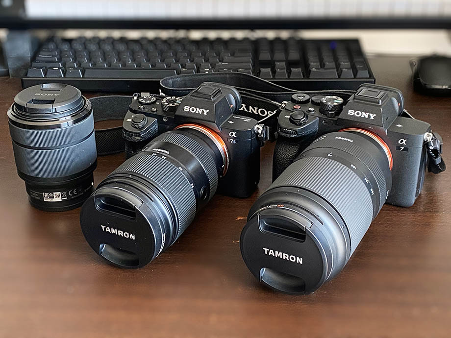

コレまで自分は以下のようなカメラを使ってきた。

- Nikon D5600 ダブルズームレンズキット
  - 過去記事 : 2017-01-02 [Nikon D5600 ダブルレンズキットを買った](/blog/2017/01/02-01.html)
  - レンズは色々買ったけど最後はキットレンズ2本に戻った
  - (その前に Nikon D3100 を持ってた)
- Olympus OM-D E-M10 Mark II + Panasonic Lumix G Vario 14-140mm F3.5-5.6 ASPH./POWER O.I.S.
  - 過去記事 : 2019-03-28 [Olympus OM-D E-M10 Mark II と Panasonic Lumix G Vario 14-140mm F3.5-5.6 ASPH./POWER O.I.S. を手に入れた](/blog/2019/03/28-01.html)
  - D5600 より軽量な構成を求めて買った
- GoPro Hero 7 Black
  - 過去記事 : 2019-03-21 [GoPro7 Black を手に入れた](/blog/2019/03/21-01.html)
  - アクションカム・我が子の出産の瞬間はこのカメラで撮られた

D5600 付属の AF-P レンズは爆速 AF だし、Olympus と Lumix のコンボは軽量で10倍ズームまで行けたので満足はしていたのだが、いずれも*暗所性能が厳しめ*だった。

音楽をやっている弟に、コンサートの撮影を頼まれることがあり (ガチの仕事カメラマンではなく記録担当として)、その際にせっかくなら良い写真・動画を撮りたいと思っていたのだが、どうしても機材のスペック上、それ以上明るさを稼げなくてノイズが多くなってしまうことが、撮る側としては我慢ならなかった。依頼してきた弟は、出来上がった写真を見て「こんなんで全然オッケー」と言ってくれるが、撮っている側が満足いかないのである。

そこで、*カメラを買い替えた*。Sony α7 Basic シリーズの現行最新機種である **α7IV** と、高感度に強い S シリーズの1世代前の型である *α7SII* だ。

本当は α7SIII (高感度版の最新機種) が欲しいところではあったが、40万以上するので断念。α7SII はタッチパネルではないのでタッチフォーカスができずもどかしいが、MF も交えて頑張ることにした。サブ機という意味ではタッチパネルが付いている α7C か α7III もアリな値段だ (中古市場)。特に α7C の方はバリアングル液晶で、液晶を裏面にして保護できる仕組みなのが良い。

  

    
  

  

    

      <a href="https://www.amazon.co.jp/dp/B09MVW1VMX?tag=neos21-22&amp;linkCode=osi&amp;th=1&amp;psc=1">ソニー/フルサイズ/ミラーレス一眼カメラ / α7M4 / ボディ(レンズなし) / ブラック/ILCE-7M4</a>
    

  

  

    
  

  

    

      <a href="https://hb.afl.rakuten.co.jp/hgc/g00prnm2.waxycfcf.g00prnm2.waxyda61/?pc=https%3A%2F%2Fitem.rakuten.co.jp%2Fmapcamera%2F4548736133730%2F&amp;m=http%3A%2F%2Fm.rakuten.co.jp%2Fmapcamera%2Fi%2F11787495%2F">《新品》 SONY (ソニー) α7IV ボディ ILCE-7M4 [ ミラーレス一眼カメラ | デジタル一眼カメラ | デジタルカメラ ]【KK9N0D18P】【メーカーキャンペーン対象】</a>
    

    

      <a href="https://hb.afl.rakuten.co.jp/hgc/g00prnm2.waxycfcf.g00prnm2.waxyda61/?pc=https%3A%2F%2Fwww.rakuten.co.jp%2Fmapcamera%2F&amp;m=http%3A%2F%2Fm.rakuten.co.jp%2Fmapcamera%2F">マップカメラ楽天市場店</a>
    

    
価格 : 338688円

  

そしてレンズだが、F2.8 通しの、いわゆる大三元レンズの標準レンズと望遠レンズを、タムロン製で揃えることにした。Sony 純正のレンズは高すぎるｗ。

- Tamron 28-75mm F/2.8 Di III VXD G2 (Model A063)

  

    
  

  

    

      <a href="https://www.amazon.co.jp/dp/B09HL44W23?tag=neos21-22&amp;linkCode=osi&amp;th=1&amp;psc=1">タムロン 28-75mm F/2.8 Di III VXD G2 ソニーEマウント用（Model A063）</a>
    

  

  

    
  

  

    

      <a href="https://hb.afl.rakuten.co.jp/hgc/g00r7ld2.waxycfeb.g00r7ld2.waxyddc5/?pc=https%3A%2F%2Fitem.rakuten.co.jp%2Fbiccamera%2F4960371006796%2F&amp;m=http%3A%2F%2Fm.rakuten.co.jp%2Fbiccamera%2Fi%2F13632956%2F">タムロン｜TAMRON カメラレンズ 28-75mm F/2.8 Di III VXD G2（Model A063） [ソニーE /ズームレンズ]</a>
    

    

      <a href="https://hb.afl.rakuten.co.jp/hgc/g00r7ld2.waxycfeb.g00r7ld2.waxyddc5/?pc=https%3A%2F%2Fwww.rakuten.co.jp%2Fbiccamera%2F&amp;m=http%3A%2F%2Fm.rakuten.co.jp%2Fbiccamera%2F">楽天ビック（ビックカメラ×楽天）</a>
    

    
価格 : 95969円

  

- Tamron 70-180mm F/2.8 Di III VXD (Model A056)

  

    
  

  

    

      <a href="https://www.amazon.co.jp/dp/B086QC7XRP?tag=neos21-22&amp;linkCode=osi&amp;th=1&amp;psc=1">タムロン 70-180mm F/2.8 Di III VXD（Model：A056）※FEマウント用レンズ（フルサイズミラーレス対応） TA70-180DI3ソニ-A056</a>
    

  

  

    
  

  

    

      <a href="https://hb.afl.rakuten.co.jp/hgc/g00r7ld2.waxycfeb.g00r7ld2.waxyddc5/?pc=https%3A%2F%2Fitem.rakuten.co.jp%2Fbiccamera%2F4960371006680%2F&amp;m=http%3A%2F%2Fm.rakuten.co.jp%2Fbiccamera%2Fi%2F13020139%2F">タムロン｜TAMRON カメラレンズ 70-180mm F/2.8 Di III VXD（Model A056） [ソニーE /ズームレンズ]</a>
    

    

      <a href="https://hb.afl.rakuten.co.jp/hgc/g00r7ld2.waxycfeb.g00r7ld2.waxyddc5/?pc=https%3A%2F%2Fwww.rakuten.co.jp%2Fbiccamera%2F&amp;m=http%3A%2F%2Fm.rakuten.co.jp%2Fbiccamera%2F">楽天ビック（ビックカメラ×楽天）</a>
    

    
価格 : 136121円

  

F2.8 というレンズはコレまで使ったことがなかったのだが、昼の景色も夜の景色も別次元に感じる。勿論、マイクロフォーサーズだった Olympus、APS-C だった Nikon D5600 と比べて、α7 シリーズはフルサイズのイメージセンサーである点も大きいと思うが、それも含めて「光をどれだけ取り込めるか」という受光部の広さはこんなに影響するかとビックリした。

Sony αE マウントの難点は、超望遠レンズの製品ラインナップが少ない点だろうか。300mm 以上のラインナップは Nikon の方が多かったと思う。コレも APS-C 機で考えてたからかな？

カメラやギター関連の機材を手放して予算を作ったとはいえ、全てがペイできる金額ではなかったが、今回は奮発することにした。というのは、「明るいカメラ」はかねてより欲しいと思ってはいたが、「弟のコンサートでたまに使うくらいなら買わなくてもいいか」「*今じゃなくても別にいいか*」と考えていると**何もできなくなってしまう**、と感じたからである。「今やらなくたっていい」なんて言い始めたら何もやらない、何も持たないつまらない人間になってしまう。それではいかんと思い、まずは奮発して欲しいモノを買ってみて、使ってみて、何かしら自分の糧にしてやるんだ、と思った次第である。

まだコンサートでの撮影機会がないので真の実力は試せていないが、もう機材面で言い訳が立たなくなるほどの良い買い物をした。良い写真・動画が撮れるかどうか、あとは自分のカメラの腕次第である。頑張ろうではないか。

  

    
  

  

    

      <a href="https://www.amazon.co.jp/dp/B07B49TM91?tag=neos21-22&amp;linkCode=osi&amp;th=1&amp;psc=1">ソニー / フルサイズ / ミラーレス一眼カメラ / α7M3 / ボディ(レンズなし) / ブラック / ILCE-7M3</a>
    

  

  

    
  

  

    

      <a href="https://hb.afl.rakuten.co.jp/hgc/g00q3om2.waxyc8ad.g00q3om2.waxyd20f/?pc=https%3A%2F%2Fitem.rakuten.co.jp%2Femedama%2F4548736121331%2F&amp;m=http%3A%2F%2Fm.rakuten.co.jp%2Femedama%2Fi%2F10557345%2F">ソニー α7S III ボディ [ILCE-7SM3]</a>
    

    

      <a href="https://hb.afl.rakuten.co.jp/hgc/g00q3om2.waxyc8ad.g00q3om2.waxyd20f/?pc=https%3A%2F%2Fwww.rakuten.co.jp%2Femedama%2F&amp;m=http%3A%2F%2Fm.rakuten.co.jp%2Femedama%2F">カメラのキタムラ</a>
    

    
価格 : 449963円

  

