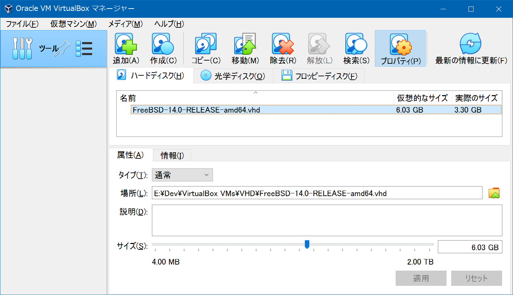
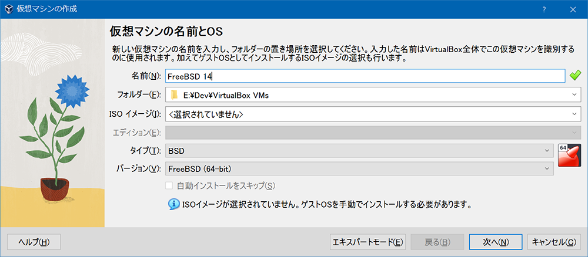
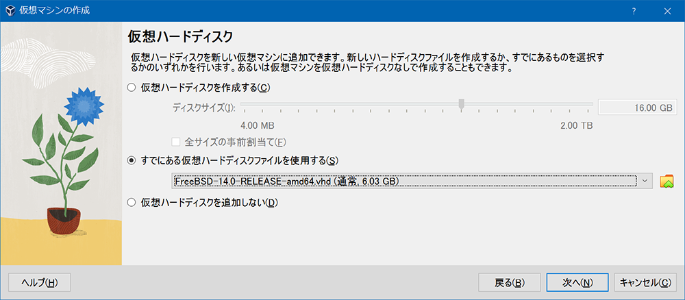
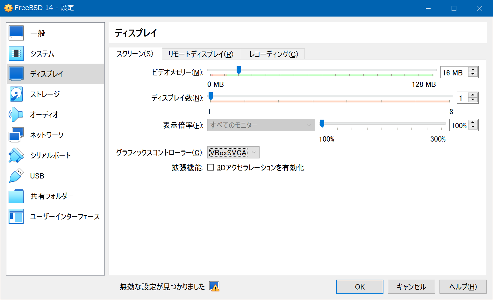

Linux 環境は色々と触ってきたけど、macOS (Darwin) 以外の BSD 環境を触ったことがないなーと思い、初の UNIX 環境として FreeBSD を触ってみることにする。

ホストマシンは Windows 10、VirtualBox 7.0.14 にて検証した。

- VirtualBox 7.0.14 をインストールする `VirtualBox-7.0.14-161095-Win.exe`
- VirtualBox Extension Pack をインストールする (ダブルクリックで実行すればインストールできる) `Oracle_VM_VirtualBox_Extension_Pack-7.0.14.vbox-extpack`

FreeBSD のイメージは公式ページで配布されている。

- [Index of /ftp/releases/VM-IMAGES/](https://download.freebsd.org/ftp/releases/VM-IMAGES/)

今回は v14.0 の、VHD 形式のイメージを選択した。

- `https://download.freebsd.org/ftp/releases/VM-IMAGES/14.0-RELEASE/amd64/Latest/FreeBSD-14.0-RELEASE-amd64.vhd.xz`
  - 7-Zip で解凍 `FreeBSD-14.0-RELEASE-amd64.vhd`

VirtualBox で仮想メディアを作成していく。

- ファイル → 仮想メディアマネージャー → 追加 → 先ほど解凍した `FreeBSD-14.0-RELEASE-amd64.vhd` を追加する
  - 

そしたら仮想マシンを作成していく。

- 仮想マシン → 新規
  - 
  - 

仮想マシンを作成後、設定 → ディスプレイ → グラフィックスコントローラーを「VBoxSVGA」にする。

- 

仮想マシンを起動する。`login:` プロンプトが出たら `root` ユーザ名を入力すると、パスワードなしでログインができる。`root0freebsd:~ #` というプロンプトに変わったら、あとは自由に FreeBSD 環境を触れる。

ちょっと触った感じ、`vi` も入っているし、MacOS のターミナルと同じような雰囲気で使えそう。

- 参考 : [FreeBSD公式仮想イメージをVirtualBox で動かす #VirtualBox - Qiita](https://qiita.com/s_mitu/items/8943a97d755d3ef9212f)

  

    
  

  

    

      <a href="https://www.amazon.co.jp/dp/B00CPG04JE?tag=neos21-22&amp;linkCode=osi&amp;th=1&amp;psc=1">実践FreeBSDサーバ構築・運用ガイド</a>
    

  

  

    
  

  

    

      <a href="https://hb.afl.rakuten.co.jp/hgc/g00s3032.waxyce78.g00s3032.waxyd6b5/?pc=https%3A%2F%2Fitem.rakuten.co.jp%2Fbooksdream%2F1-24f2210204sp-2329%2F&amp;m=http%3A%2F%2Fm.rakuten.co.jp%2Fbooksdream%2Fi%2F10309532%2F">FreeBSD徹底入門 改訂版 [単行本] 衛藤 敏寿</a>
    

    

      <a href="https://hb.afl.rakuten.co.jp/hgc/g00s3032.waxyce78.g00s3032.waxyd6b5/?pc=https%3A%2F%2Fwww.rakuten.co.jp%2Fbooksdream%2F&amp;m=http%3A%2F%2Fm.rakuten.co.jp%2Fbooksdream%2F">参考書専門店 ブックスドリーム</a>
    

    
価格 : 2656円

  

