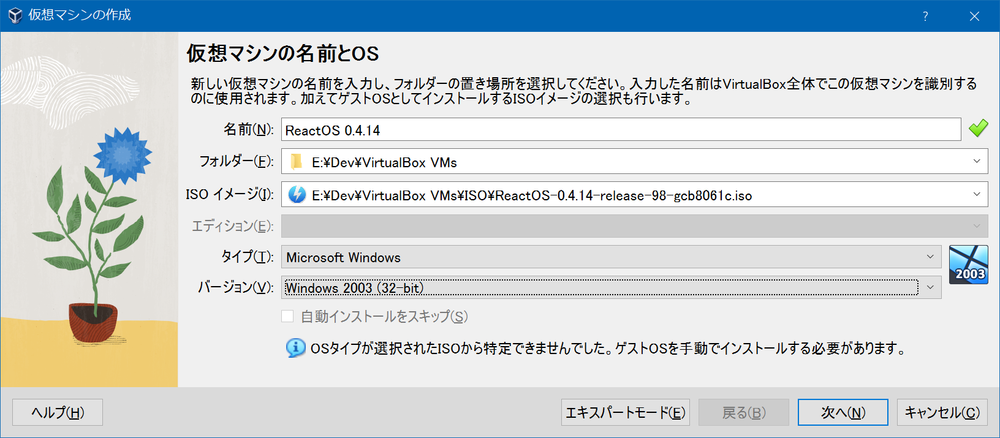
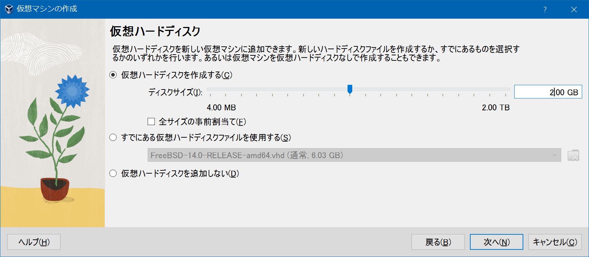
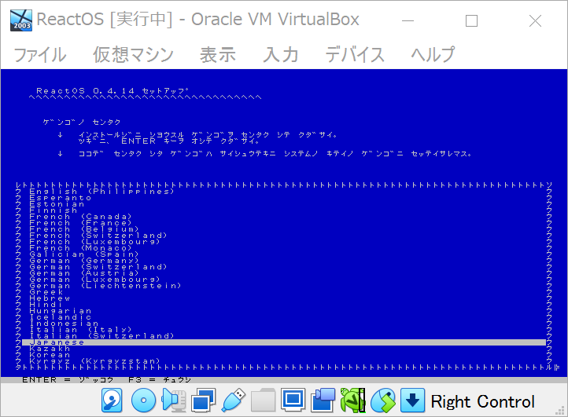
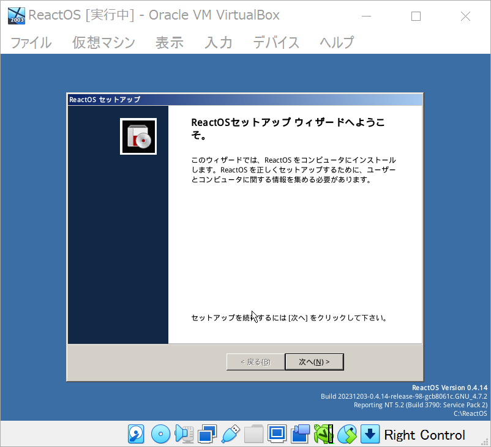
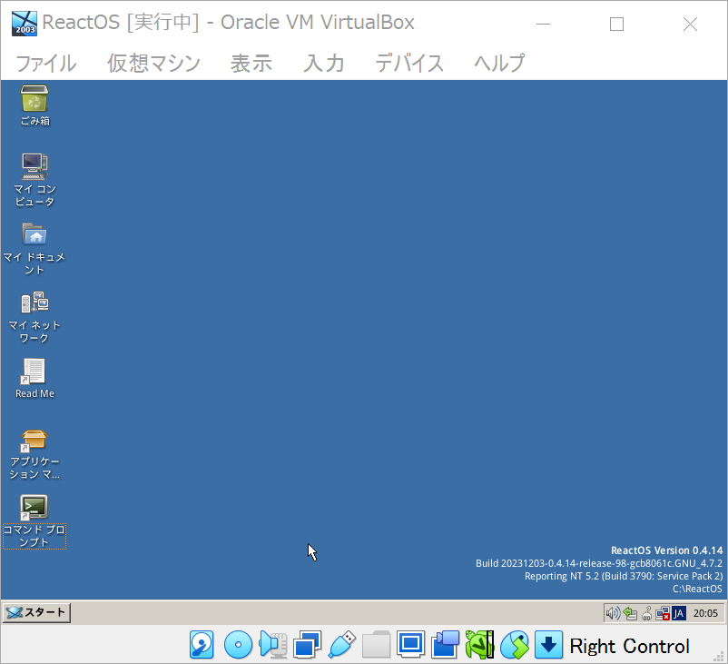

Windows 互換を目指す ReactOS というモノがある。存在は知っていたが触ったことがなかったので、今回 VirtualBox で環境構築してみた。

- 参考 : [VirtualBox - ReactOS Wiki](https://reactos.org/wiki/VirtualBox)
  - 英語だが公式サイトに VirtualBox での環境構築手順が記載されている
- 参考 : [VirtualBoxにReactOSをインストールして利用する | mebee](https://mebee.info/2020/09/18/post-12146/)

まずは ReactOS の公式 ISO イメージをダウンロードする。

- [Download | ReactOS Project](https://reactos.org/download/)
  - `https://downloads.sourceforge.net/reactos/ReactOS-0.4.14-release-98-gcb8061c-iso.zip`
  - `ReactOS-0.4.14-release-98-gcb8061c.iso` を解凍して取得しておく

VirtualBox より新規仮想マシンを作成していく。

- 
  - ISO イメージ : 先ほど解凍した ISO ファイルを指定する
  - タイプ : Microsoft Windows
  - バージョン : Windows 2003 (32-bit)
- 
  - 仮想ハードディスクを作っておく必要がある

仮想マシンを起動すると、初回は青い TUI 画面が開く。日本語設定ができるので、日本語に設定してドライブのフォーマットなどを行っていく。

- 

ドライブのフォーマット後、マシンが再起動したら「Press any key…」と表示されるが、ココは何も押さずに放置する。すると GUI のセットアップウィザードが開く。

- 

画面どおりに進めていき再起動すれば、デスクトップが無事開く。

- 

デスクトップのアイコンは Xfce で見たことのあるような、Linux 風なアイコンなのだが、「ターミナル」ではなく「コマンドプロンプト」となっているように、`ls` コマンドではなく `dir` コマンドが効くようになっていて、かなり Windows 風味。どうやって作られてるんだろう？

Linux の Wine プロジェクトと協力して、Windows 向けのソフトが動く環境になっているようなので、色々遊んでみるとしよう。

  

    
  

  

    

      <a href="https://www.amazon.co.jp/dp/B09XPTNBQ1?tag=neos21-22&amp;linkCode=osi&amp;th=1&amp;psc=1">ひと目でわかるWindows Server 2022</a>
    

  

  

    
  

  

    

      <a href="https://hb.afl.rakuten.co.jp/hgc/g00q0722.waxyc9ff.g00q0722.waxyd017/?pc=https%3A%2F%2Fitem.rakuten.co.jp%2Fbook%2F17122020%2F&amp;m=http%3A%2F%2Fm.rakuten.co.jp%2Fbook%2Fi%2F20645736%2F">ひと目でわかるWindows Server 2022 （マイクロソフト関連書） [ 天野 司 ]</a>
    

    

      <a href="https://hb.afl.rakuten.co.jp/hgc/g00q0722.waxyc9ff.g00q0722.waxyd017/?pc=https%3A%2F%2Fwww.rakuten.co.jp%2Fbook%2F&amp;m=http%3A%2F%2Fm.rakuten.co.jp%2Fbook%2F">楽天ブックス</a>
    

    
価格 : 3300円

  

