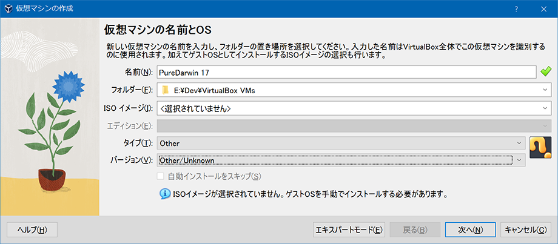
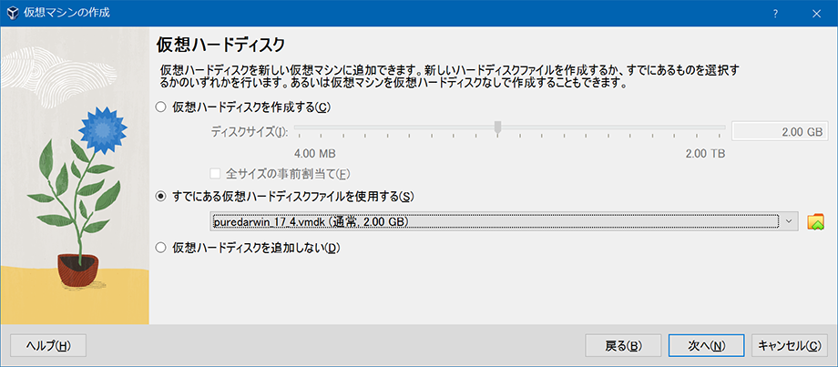
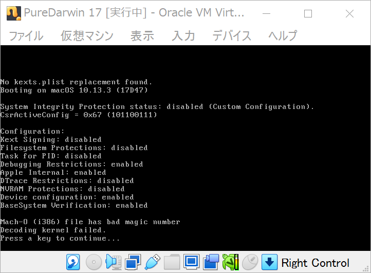
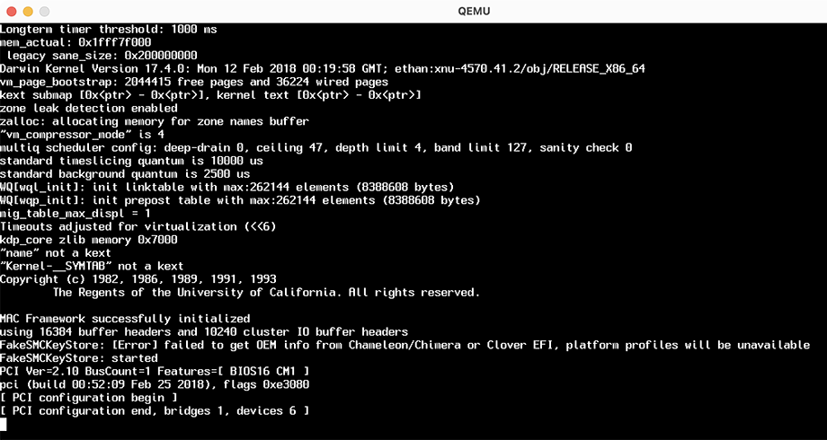
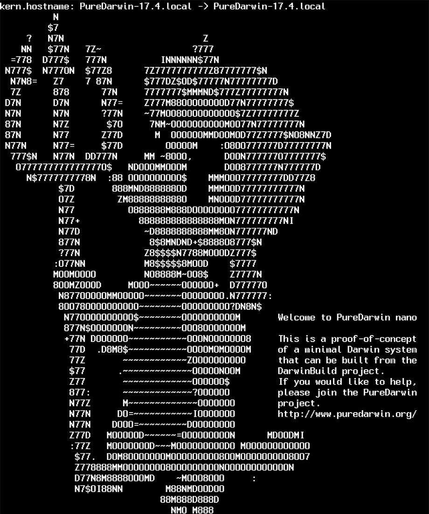
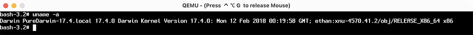

MacOS の根幹である Darwin の、オープンソース版である PureDarwin というモノを触ってみる。この前試した FreeBSD みたいな感じで簡単に導入できるかと思ったら上手く行かなくて、QEMU という別のエミュレータを試してみた。

## VirtualBox では起動できず

PureDarwin の VMDK ファイルを以下からダウンロードする。

- [PureDarwin | Moving the Darwin community in the right direction!](https://www.puredarwin.org/)
- [PureDarwin/PD-17.4-Beta: Beta vmdk for the community](https://github.com/PureDarwin/PD-17.4-Beta?tab=readme-ov-file)
  - `https://www.pd-devs.org/Beta/pd_17_4.vmdk.xz` → 解凍する

Windows 10 上の VirtualBox で VMDK ファイルを基に仮想ディスクを作り、それを利用する形で仮想マシンを立ててみた。

- 
  - タイプ : Other
  - バージョン : Other/Unknown
  - (後に色々試すが MacOS を選択してもダメだった)
- 

起動してみると、次のようなエラーが出た。



```
No kexts.plist replacement found.
Booting on macOS 10.13.3 (17D47)

(中略)

Mach-0 (i386) file has bad magic number
Decoding kernel failed.
```

なんか CPU が合わない雰囲気のエラーメッセージだが、どうしたらいいか分からず。

## QEMU を使ってみる

PureDarwin の GitHub README には、QEMU という別のエミュレータを使った起動コマンドが書かれていたので、QEMU とやらを試してみる。

- [Download QEMU - QEMU](https://www.qemu.org/download/)

コチラによると Windows では `pacman` でインストールできるっぽいので、Git SDK の `pacman` コマンドでインストールを試みたが上手くインストールできず断念。素直に MSYS2 を使えば行けると思うけど、面倒臭がってやらなかった。ｗ

MacOS だと Homebrew でインストールできるようなので、Mac で試してみた。

```bash
$ brew install qemu

$ qemu-system-x86_64 --version
QEMU emulator version 8.2.1
Copyright (c) 2003-2023 Fabrice Bellard and the QEMU Project developers

# 以下で VMDK ファイルを指定して PureDarwin を起動する
$ qemu-system-x86_64 -m 8192 -cpu Penryn -smp 2 -netdev user,id=network0 -device rtl8139,netdev=network0 -serial stdio -drive format=vmdk,file=pd_17_4.vmdk
```

起動させてみるとこんな感じでウィンドウが開いた。



可愛らしい起動ロゴも一瞬見えた。



ターミナルが起動した。`$ uname -a` で確認してみると、確かに PureDarwin v17.4 が起動していた。



起動してみれば MacOS のターミナルと大して変わらないので、特別な感動はなく。ｗ

<div class="ad-amazon">
  <div class="ad-amazon-image">
    <a href="https://www.amazon.co.jp/dp/B0BCTZT9ZW?tag=neos21-22&amp;linkCode=osi&amp;th=1&amp;psc=1">
      
    </a>
  </div>
  <div class="ad-amazon-info">
    <div class="ad-amazon-title">
      <a href="https://www.amazon.co.jp/dp/B0BCTZT9ZW?tag=neos21-22&amp;linkCode=osi&amp;th=1&amp;psc=1">Apple MacBook Pro M2 2022 (13インチ,8GB RAM,256GB SSD,8コアCPU/10コアGPU) スペースグレイ (整備済み品)</a>
    </div>
  </div>
</div>

<div class="ad-rakuten">
  <div class="ad-rakuten-image">
    <a href="https://hb.afl.rakuten.co.jp/hgc/g00t6qc2.waxyc342.g00t6qc2.waxyd986/?pc=https%3A%2F%2Fitem.rakuten.co.jp%2Finateck%2Flb02006%2F&amp;m=http%3A%2F%2Fm.rakuten.co.jp%2Finateck%2Fi%2F10000250%2F">
      
    </a>
  </div>
  <div class="ad-rakuten-info">
    <div class="ad-rakuten-title">
      <a href="https://hb.afl.rakuten.co.jp/hgc/g00t6qc2.waxyc342.g00t6qc2.waxyd986/?pc=https%3A%2F%2Fitem.rakuten.co.jp%2Finateck%2Flb02006%2F&amp;m=http%3A%2F%2Fm.rakuten.co.jp%2Finateck%2Fi%2F10000250%2F">360°超強保護 PC バッグ ノートパソコン ノートPC パソコン ケース スリーブ PCケース PCバッグ 収納 13 13.3 13.6 14 15 15.6 16 インチ 型 手提げ インナーケース Macbook air Pro M1 M2 M3 2023 Surface 2022 撥水 持ち手 取っ手 大人 かわいい おしゃれ 衝撃防止</a>
    </div>
    <div class="ad-rakuten-shop">
      <a href="https://hb.afl.rakuten.co.jp/hgc/g00t6qc2.waxyc342.g00t6qc2.waxyd986/?pc=https%3A%2F%2Fwww.rakuten.co.jp%2Finateck%2F&amp;m=http%3A%2F%2Fm.rakuten.co.jp%2Finateck%2F">Inateck楽天市場店</a>
    </div>
    <div class="ad-rakuten-price">価格 : 1880円</div>
  </div>
</div>
