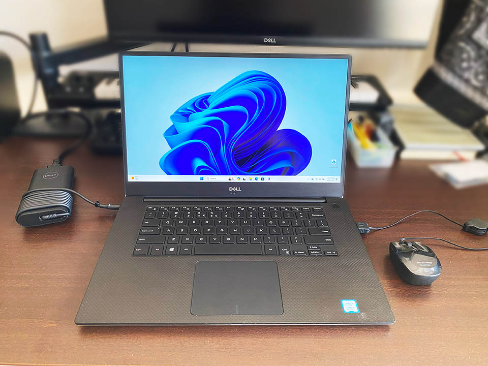

久々にノートパソコンを買った。

当初はグラボ付きの「ゲーミングノート」を買おうと思っていたのだが、どれもバカデカい専用端子の AC アダプタばかりで嫌になった。USB PD 給電に対応している「クリエイター向けノート」みたいなのを探すことにした。

自分は US 配列キーボードじゃないとダメなので、日本で US 配列モデルが買えるモノというと選択肢が限られた。Lenovo (ThinkPad)、Dell、あとマウスコンピュータの DAIV S14 というモデルくらいしかなかった。

新品を探すのは値段的に厳しかったので、ヤフオクやヤフーフリマを見ていたところ、**Dell XPS15 9570** という丁度良いモデルの美品を見つけたので購入することにした。2024-02-16 ポチり。98,500円。2024-02-18 に届いた。

スペックはこんな感じ。

- モデル名 : Dell XPS15 9570
- CPU : Intel Core i7-8750H (6コア12スレッド)
- GPU : NVIDIA GeForce GTX1050Ti With Max-Q Design (4GB GDDR5)
- RAM : 16GB (2x8GB) DDR4 SK Hynix 2666MHz → **32GB** (2x16GB) DDR4 Corsair Vengeance 2666MHz Dual Channel
- SSD : SK Hynix 512GB PCIe M2 → Samsung 980 **1TB** PCIe M2
- ポート : Thunderbolt 3 x1、USB Type-A 3.2 x2、HDMI 2.0、オーディオ入出力、SD カードスロット
- Wi-Fi : Killer 802.11ac → Intel AX210NGW Wi-Fi6E
- Bluetooth : Bluetooth 4.1 → Bluetooth 5.2
- ディスプレイ : 15.6インチ FHD (1920x1080) IPS タッチ非対応
- Size : 幅 35.7cm × 奥行 23.5cm × 高さ 1.7cm
- Weight : 1.8kg
- OS : Windows 11 Pro

…ということで、前オーナーの手によって RAM や SSD がアップグレードされており、自分が使っているデスクトップマシン Galleria XG とも遜色ないレベルのノートパソコンが、かなり格安で手に入った。

筐体は高級感があって所有欲が満たされる。動画編集も 1080p レベルならサクサクできて、スペック的には余裕があるくらい。素晴らしい。専用の AC アダプタも付いているが、USB PD 充電もできるようなので、外出時は USB-C アダプタだけ持って行けば手軽に済む。

XPS15 9570 は2019年頃に売られていたモデルのようだが、自分のデスクトップ機は2017年購入のマシンなので、日常用途の範囲では本当にデスクトップ機と遜色ない速度で動作してくれる。

Windows 11 Pro は Asus ZenBook3 にも導入済みだが、Copilot がタスクバーに居たりして、コレもなかなか面白い。

デスクトップマシンを頻繁に起動しなくても済むようにと思って購入したが、大変良い買い物になった。

- 参考 : [Dell XPS15 9570 設定と仕様](https://dl.dell.com/topicspdf/xps-15-9570-laptop_specifications_ja-jp.pdf)

  

    
  

  

    

      <a href="https://www.amazon.co.jp/dp/B0CG1CS96W?tag=neos21-22&amp;linkCode=osi&amp;th=1&amp;psc=1">Dell ノートパソコン XPS 13 9315 13.4インチ Intel 第12世代 Core i5-1230U メモリ8GB SSD256GB Windows11 重量1.1kg スカイ MX95A3A-DNLBL</a>
    

  

  

    
  

  

    

      <a href="https://hb.afl.rakuten.co.jp/hgc/g00qeqn2.waxyc82f.g00qeqn2.waxyd944/?pc=https%3A%2F%2Fitem.rakuten.co.jp%2Fpc-bank%2Fkk2718%2F&amp;m=http%3A%2F%2Fm.rakuten.co.jp%2Fpc-bank%2Fi%2F10014143%2F">ノートパソコン Webカメラ内蔵 中古パソコン DELL XPS 13 9380 13.3型タッチパネル 超高解像度3840x2160(4K) 8世代Core i7-8565U メモリ16GB NVMeSSD512GB キーボードバックライト Type-C Thunderbolt3 Office Windows11 送料無料</a>
    

    

      <a href="https://hb.afl.rakuten.co.jp/hgc/g00qeqn2.waxyc82f.g00qeqn2.waxyd944/?pc=https%3A%2F%2Fwww.rakuten.co.jp%2Fpc-bank%2F&amp;m=http%3A%2F%2Fm.rakuten.co.jp%2Fpc-bank%2F">ALEX PC 楽天市場店</a>
    

    
価格 : 69300円

  

