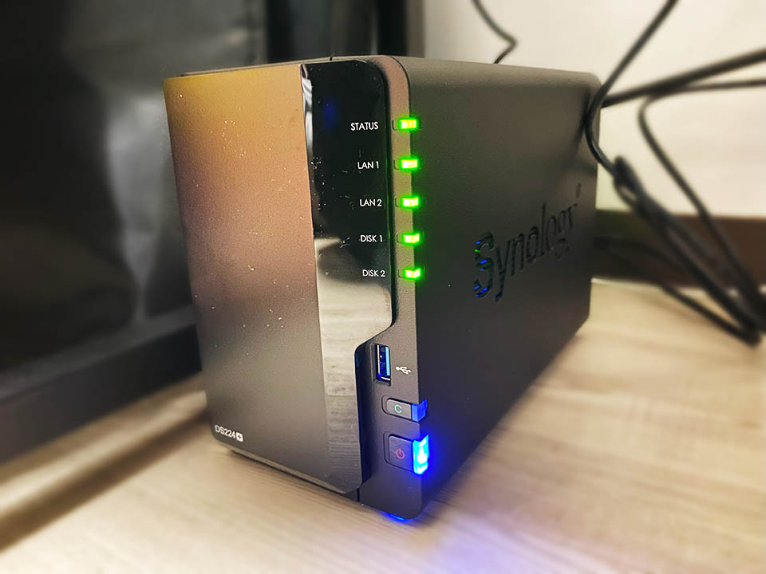

自分はコレまで、デスクトップ PC の内蔵 HDD に全てのデータを保管していた。そのため、ノート PC で作業する時のデータ受け渡しが煩雑になっていた。

先日 Dell XPS15 9570 というノート PC を買って、いい加減煩雑さにもウンザリしてきたので、勢いで NAS をポチった。**Synology DS224+** というモデル。2024-02-18 に Amazon でポチり。新品 48,218円だったところ、ポイント割引などを利用して 43,688円で購入。2024-02-19 に届く。

2ベイの NAS で、スペックは以下のとおり。

- CPU : Intel Celeron J4125 (4 Core 2.0GHz / Burst 2.7GHz)
- RAM : 2 GB DDR4 Non-ECC
  - 空きスロットが1つあり、4GB を挿して最大 6GB で運用できる
- RJ-45 1GbE LAN ポート : **2ポート**
  - Link Aggregation・フェイルオーバー対応。LAN ケーブルも2本付属している
- Size : 幅 16.5cm × 奥行 23.2cm × 高さ 10.8cm
- Weight : 1.3kg

どうも、安いモデルの NAS を買うと、CPU・RAM の貧弱さでアクセス速度がかなり悪いらしかったので、そこそこのスペックのモノを選んだ。

高い NAS を選んだ代わりに、HDD は新規購入せず。RAID や SHR といった冗長化構成は組まずに、手持ちの HDD を挿して次のように設定した。

- スロット1 : 8TB HDD … BASIC
- スロット2 : 4TB HDD … BASIC

要するにフツーに2台の外付け HDD があるような状態。スロット1・2とで全く別々のデータを保管しており、ミラーリングなどはしていない。

一方、デスクトップマシンには、外してあった古い HDD を取り付け直し、コチラに手動で (SyncToy というフリーソフトを用いて) バックアップを取ることにした。

- 500GB SSD … C ドライブ・システム領域のため放置
- 500GB SSD … デスクトップ PC でのみ扱う一時データの置き場なので放置
- 1TB SSD … スロット1 (8TB) と同期
- 2TB HDD … スロット1 (8TB) と同期
- 3TB HDD … スロット1 (8TB) と同期
- 4TB 外付け HDD … スロット2 (4TB) と同期

こんな感じ。内蔵 SSD・HDD の合計が 6.5TB なので、8TB のスロット1側にはもう少し余裕がある状態だ。今のところ目一杯容量を使っているワケではないので、コレで当面は運用していける。

LAN ポートが2つあって、リンク・アグリゲーションに対応している。CPU・RAM も余裕のあるスペックなので、アクセスはかなり高速。LAN 経由であることを実感させない速度でアクセスできている。

静音性も良い。HDD へのアクセス音ぐらいで、ファンの音は全然うるさくない。電源やステータスを表す LED ランプの輝度も設定で調整できるので、夜間つけっぱなしでも問題なし。

特殊なツールを PC 側にインストールする必要がなく、ブラウザ上から全ての操作が行える。コレが便利である。もちろん、Windows エクスプローラなどに「ネットワークドライブ」として紐付けることもできるので、使い勝手は外付け HDD と変わらない。

Synology QuickConnect によって、インターネット経由からでも NAS にアクセスできるので、自宅サーバ・プライベートクラウドが出来たワケである。やろうと思えば Docker を入れたりもできるみたいなので、気が向いたらそういう開発もやってみようかなと思う。

  

    
  

  

    

      <a href="https://www.amazon.co.jp/dp/B0CBP7P6DG?tag=neos21-22&amp;linkCode=osi&amp;th=1&amp;psc=1">Synology NASキット 2ベイ DS224+/G【ガイドブック付】 クアッドCPU 2GBメモリ搭載 スタンダードユーザー向け 国内正規代理店フィールドレイク取扱品 電話サポート対応品 DiskStation</a>
    

  

  

    
  

  

    

      <a href="https://hb.afl.rakuten.co.jp/hgc/g00r7ld2.waxycfeb.g00r7ld2.waxyddc5/?pc=https%3A%2F%2Fitem.rakuten.co.jp%2Fbiccamera%2F4537694330947%2F&amp;m=http%3A%2F%2Fm.rakuten.co.jp%2Fbiccamera%2Fi%2F14302112%2F">SYNOLOGY｜シノロジー NASキット [ストレージ無 /2ベイ] DiskStation DS224+ DS224+</a>
    

    

      <a href="https://hb.afl.rakuten.co.jp/hgc/g00r7ld2.waxycfeb.g00r7ld2.waxyddc5/?pc=https%3A%2F%2Fwww.rakuten.co.jp%2Fbiccamera%2F&amp;m=http%3A%2F%2Fm.rakuten.co.jp%2Fbiccamera%2F">楽天ビック（ビックカメラ×楽天）</a>
    

    
価格 : 48283円

  

