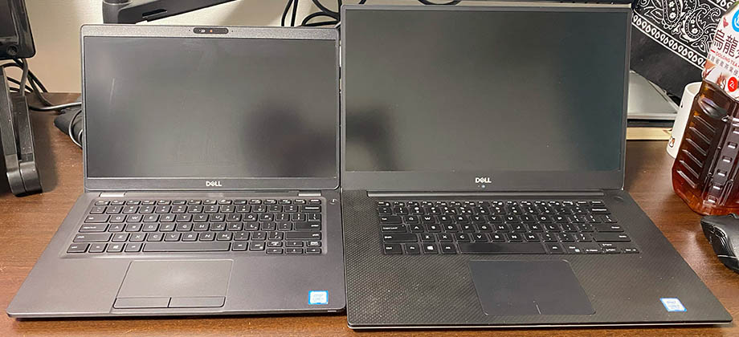
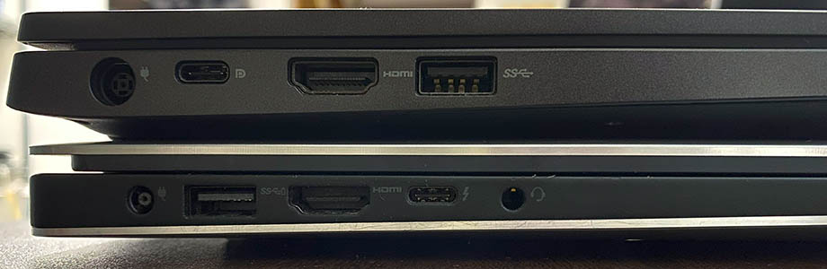
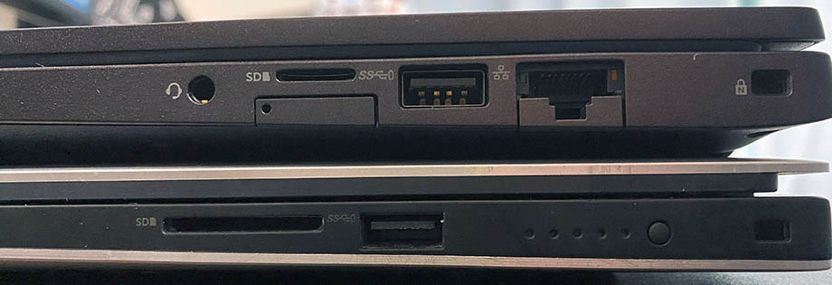
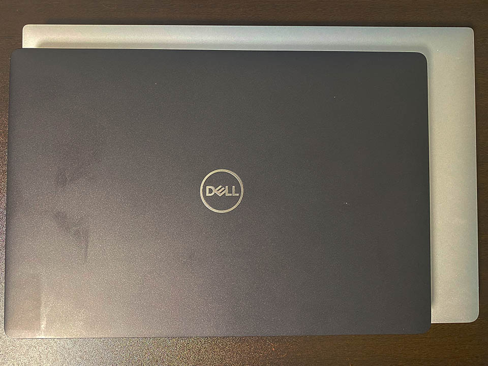
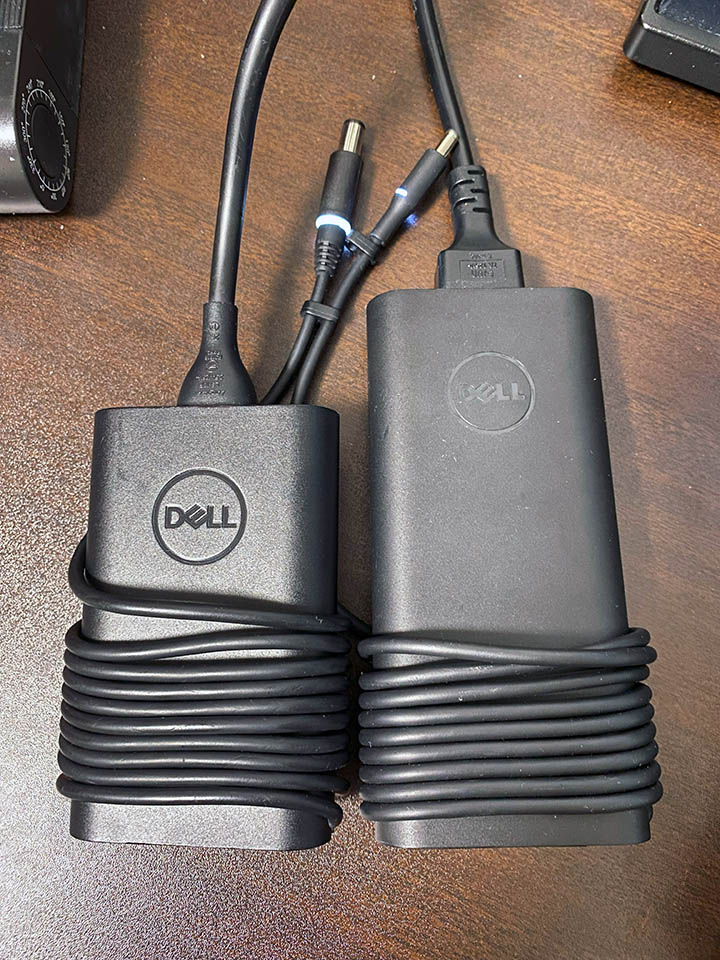

Dell XPS15 9570 を買ったとほぼ同時に、**Dell Latitude 5300** という別のノート PC も買ってしまった。

- 過去記事 : 2024-02-21 [Dell XPS15 9570 を買った](./21-01.html)

Dell XPS15 9570 の方は、デスクトップの GalleriaXG を頻繁に立ち上げなくて済むよう、デスクでの作業用に買った。

Dell Latitude 5300 は、ベッドで寝ながら触る用のゴロ寝 PC として買った。ヤフーフリマで40,000円ちょうど、2024-02-17 にポチり 2024-02-21 に届いた。

スペックはこんな感じ。

- モデル名 : Dell Latitude 5300
- CPU : Intel Core i7-8665U
- GPU : (内蔵 GPU) Intel UHD Graphics 620
- RAM : 32GB
- SSD : 256GB
- ポート : USB Type-C 3.1 Gen2 x1、USB Type-A 3.1 Gen1 x2、HDMI 1.4、RJ45 LAN ポート、オーディオ入出力、SD カードスロット
- ディスプレイ : 13.3インチ FHD (1920x1080) タッチ非対応
- Size : 幅30.57cm × 奥行 20.75cm × 高さ 1.69cm
- Weight : 1.24 kg
- OS : Windows 11 Pro

ココからは Dell XPS15 9570 と外観を比較していく。

左が Latitude 5300、右が XPS15 9570。安定の英語配列キーボードである。ピッチ間は大体同じかな？打ち心地は大して変わらないので助かる。ただ、Latitude 5300 の方はキーボードのバックライトがなく、コレが暗い部屋では意外と不便することが分かった。タッチパッドにもクリック感がないタイプで、感触は XPS15 9570 と若干異なる感じ。まぁ慣れでなんとかなる範囲。

↑ 左側面。HDMI のバージョンが厳密には異なる。

↑ 右側面。オーディオ入出力端子の位置が左右で違うが大した問題ではないか。Latitude 5300 の方には LAN ポートが付いている。

重ねてみた感じ。まぁ、13インチと15インチの差、という感じである。

最後に AC アダプタの比較。左の Latitude 用は 65W・7.4mm バレルの DC 入力。右の XPS15 9570 用は 130W・4.5mm バレルの DC 入力。なんと、AC アダプタのコネクタ寸法が異なり、互換性がないようである。

- 参考 : [Latitude 13 5000シリーズ（5300） - dell e-catalog](https://japancatalog.dell.com/pd/latitude-5300.html)

第7世代 i7-7500U の CPU なのに、何故か Windows 11 にアップデートされていた Asus ZenBook3 くんとともに、3台の Windows 11 Pro 機をガッツリセットアップして設定同期した。コレで Windows 10 Pro なのはデスクトップの GalleriaXG くんだけとなった。いつまで使えるかのう。

Latitude 5300 くんは SSD が 256GB しかないので容量少ないかな？と思ったが、ひととおりのセットアップを済ませても 130GB くらいしか使っていなかったので一安心。写真・動画等のデータは先日購入した NAS・Synology DS224+ にて保管・共有しているので問題なし。

- 過去記事 : 2024-02-22 [念願の NAS。Synology DS224+ を買った](./22-01.html)

コレにあと12インチ MacBook くんがいて、現時点での所有パソコンは全部で5台となった。おまけに会社貸与のノート PC が2台あるので、仕事中は机の上がパンパンになる…。嬉しい。ｗ

この機会に、Microsoft アカウントを見直し、OneDrive 共有や Copilot の活用を始めてみようと思う。新たな Windows ライフを楽しむぜ～v

  

    
  

  

    

      <a href="https://www.amazon.co.jp/dp/B0C1P1HKNB?tag=neos21-22&amp;linkCode=osi&amp;th=1&amp;psc=1">デル Latitude 5300 ノートパソコン DELL Office搭載 Windows11 13.3型 高性能第8世代Core i5 無線LAN (SSD:256GB メモリ:8GB)</a>
    

  

  

    
  

  

    

      <a href="https://hb.afl.rakuten.co.jp/hgc/g00rzdv2.waxycd41.g00rzdv2.waxyd86b/?pc=https%3A%2F%2Fitem.rakuten.co.jp%2Fpc-sadashi%2F100000840%2F&amp;m=http%3A%2F%2Fm.rakuten.co.jp%2Fpc-sadashi%2Fi%2F10000851%2F">純正 DELL ACアダプター19.5V 3.34A 65W 充電器 Dell Dell Latitude 3480 3580 5280 5289 5300 5310 5495 Latitude 7300 E7250 7280 7380 7390 7470 7480 など用電源ACアダプター 電源ケーブル付属</a>
    

    

      <a href="https://hb.afl.rakuten.co.jp/hgc/g00rzdv2.waxycd41.g00rzdv2.waxyd86b/?pc=https%3A%2F%2Fwww.rakuten.co.jp%2Fpc-sadashi%2F&amp;m=http%3A%2F%2Fm.rakuten.co.jp%2Fpc-sadashi%2F">PC-SADASHI 楽天市場店</a>
    

    
価格 : 2980円

  

