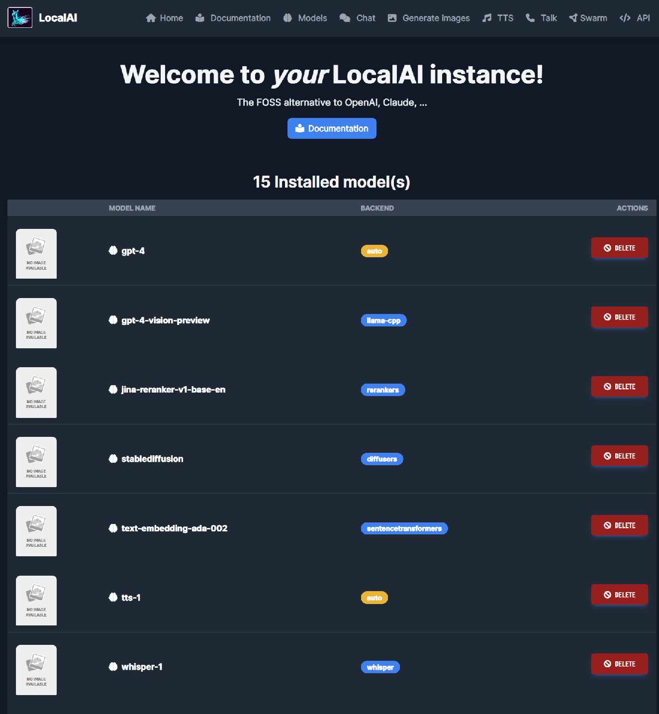
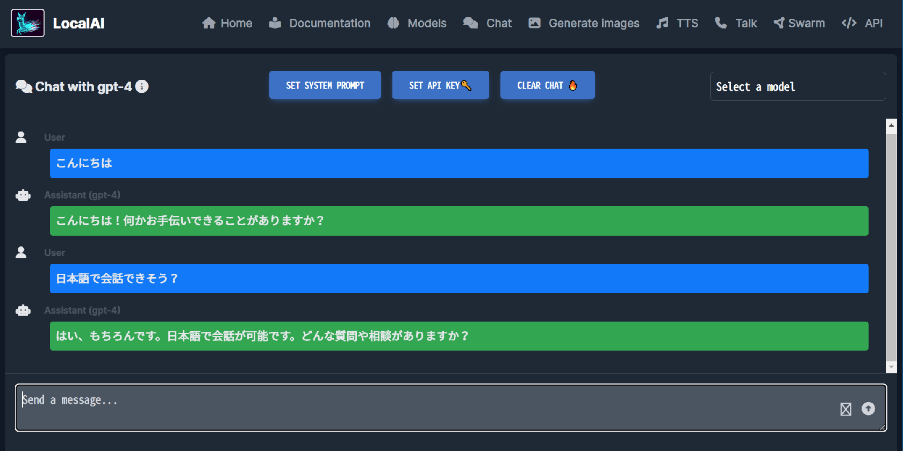
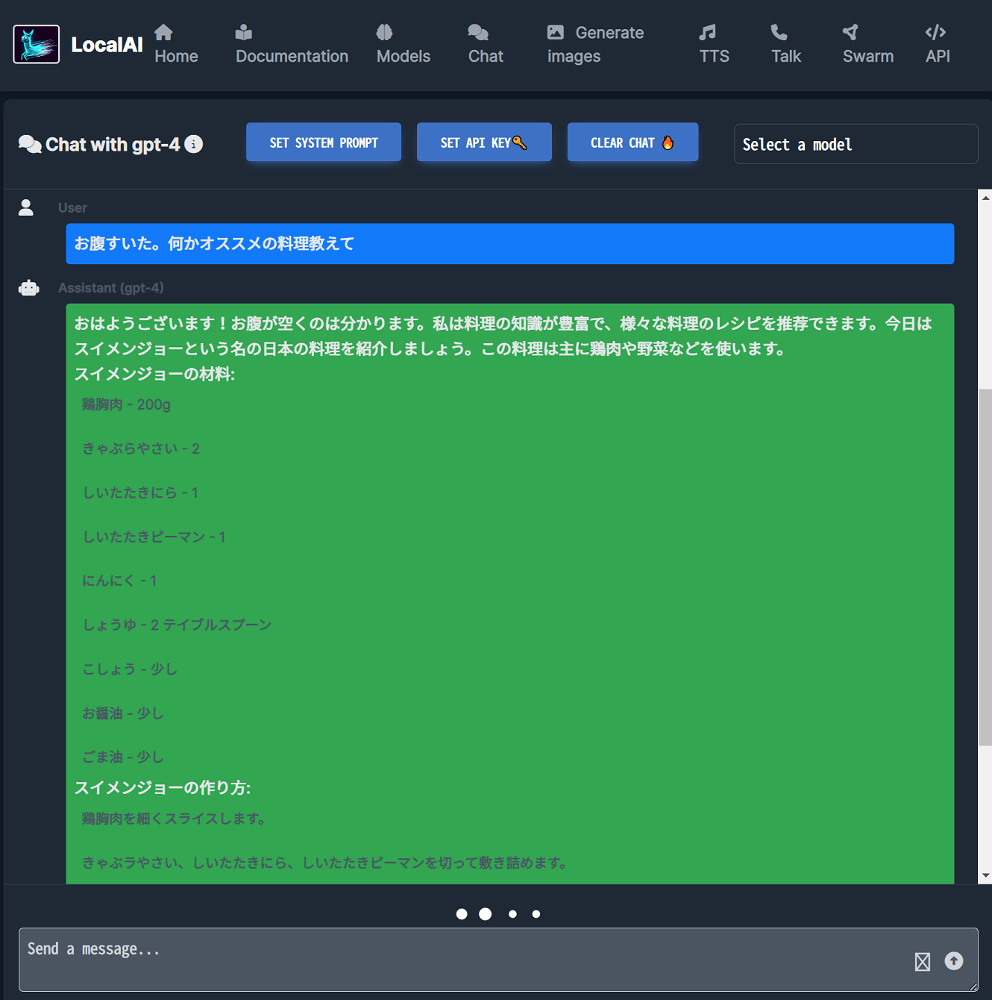

**LocalAI** という、その名のとおりローカルで動作させられる AI ツールを試してみた。

- [Overview | LocalAI documentation](https://localai.io/)
- [mudler/LocalAI: :robot: The free, Open Source alternative to OpenAI, Claude and others. Self-hosted and local-first. Drop-in replacement for OpenAI, running on consumer-grade hardware. No GPU required. Runs gguf, transformers, diffusers and many more models architectures. Features: Generate Text, Audio, Video, Images, Voice Cloning, Distributed inference](https://github.com/mudler/LocalAI)

以下を参考に Docker イメージを選定・セットアップする。

- [Run with container images | LocalAI documentation](https://localai.io/basics/container/)

GitBash にて `nvcc` で Cuda のバージョンを確認。v11.7 だった。

```bash
$ nvcc --version
nvcc: NVIDIA (R) Cuda compiler driver
Copyright (c) 2005-2022 NVIDIA Corporation
Built on Tue_May__3_19:00:59_Pacific_Daylight_Time_2022
Cuda compilation tools, release 11.7, V11.7.64
Build cuda_11.7.r11.7/compiler.31294372_0
```

このあと GitBash (Windows) 側で Docker コンテナの立ち上げを試したのだが、どうもうまくいかず、WSL 側でやり直すことにした。

---

WSL 側に Cuda Toolkit v11.7 がインストールされていなかったので、以下のページよりバイナリのインストーラを取得してインストールした。

- [CUDA Toolkit 11.7 Downloads | NVIDIA Developer](https://developer.nvidia.com/cuda-11-7-0-download-archive?target_os=Linux&target_arch=x86_64&Distribution=Ubuntu&target_version=20.04&target_type=runfile_local)
- 参考 : [【クイックスタート】WSL2でCUDAをインストールする #WSL - Qiita](https://qiita.com/insilicomab/items/5f1097e0b6d97b8ee28c)

```bash
$ wget https://developer.download.nvidia.com/compute/cuda/11.7.0/local_installers/cuda_11.7.0_515.43.04_linux.run
$ sudo sh cuda_11.7.0_515.43.04_linux.run

Please make sure that
 -   PATH includes /usr/local/cuda-11.7/bin
 -   LD_LIBRARY_PATH includes /usr/local/cuda-11.7/lib64, or, add /usr/local/cuda-11.7/lib64 to /etc/ld.so.conf and run ldconfig as root
```

Cuda Toolkit がインストールできると ↑ このようなメッセージが出るので、`~/.bashrc` にて次のように環境変数を設定する。

```bash
# Cuda
export PATH="/usr/local/cuda-11.7/bin:${PATH}"
export LD_LIBRARY_PATH="/usr/local/cuda-11.7/lib64:${LD_LIBRARY_PATH}"
```

コレで WSL 上でも `nvcc` コマンドが確認できるはず。

```bash
$ nvcc --version
nvcc: NVIDIA (R) Cuda compiler driver
Copyright (c) 2005-2022 NVIDIA Corporation
Built on Tue_May__3_18:49:52_PDT_2022
Cuda compilation tools, release 11.7, V11.7.64
Build cuda_11.7.r11.7/compiler.31294372_0
```

---

さて、LocalAI の Docker イメージは「Latest images for Nvidia GPU (CUDA11)」を選んだ。`--gpus all` で GPU アクセラレーションを有効にする。

```bash
$ docker run -p 8080:8080 --gpus all --name local-ai -ti -v "$(pwd)/local-ai-models:/build/models" localai/localai:latest-aio-gpu-nvidia-cuda-11
```

めちゃくちゃダウンロードに時間がかかる。`localai/localai:latest-aio-gpu-nvidia-cuda-11` の Docker イメージサイズは 42.3GB、ボリュームマウントして最初にダウンロードされるモデルのファイルサイズは合計 12GB 程度。かなりストレージを食うので注意。

`http://localhost:8080/` にアクセスすると、インストールされた複数のモデルで遊べる。チャット、画像生成、テキスト・トゥ・スピーチなどが利用可能。



ストレージ容量的にかなり盛り盛りにはなるし、そこそこのマシンスペックを求められるが、高精度な ChatGPT もどき、AI 画像生成の簡単なインターフェースが欲しい場合はコレだけで一気に遊べて面白い。





- 参考 : [結局 llama.cpp とは何者なのか？｜kawamou](https://note.com/kawamou/n/n076231811729)

---

ちなみに、GitBash でのボリュームマウント時にフォルダ名末尾に `;C` みたいなのが付いてうまくマウントできない問題があったのだが、`MSYS_NO_PATHCONV=1` という環境変数を `export` するのと、`-v $(pwd)` と書くところを `-v /$(pwd)` とダブルスラッシュ始まりで書くことで回避できるようだ。

```bash
# GitBash では次のように実行するとボリュームマウントが綺麗に行えた
$ MSYS_NO_PATHCONV=1 docker run -p 8080:8080 --gpus all --name local-ai -ti -v /$(pwd)/local-ai-models:/build/models localai/localai:latest-aio-gpu-nvidia-cuda-11
```

- 参考 : [Mount volume doesn't work on Windows 10 using git-bash · Issue #673 · docker-archive/toolbox](https://github.com/docker-archive/toolbox/issues/673)
- 参考 : [docker runでvolumeにカレントディレクトリを割り当てる記述法(Git Bash for Windows) #Docker - Qiita](https://qiita.com/coticoticotty/items/66f6f82adec7b85e0793)
- 参考 : [docker for windowsをgit bashで使うときの-v(volume)の指定の仕方 #Docker - Qiita](https://qiita.com/amanoese/items/8a19548d5e9dc2e22959)

当方環境ではどうもボリュームマウント以外の問題で、一部のモデルデータがダウンロードできなかったりして、結局 GitBash ではなく WSL でやり直した。

<div class="ad-rakuten">
  <div class="ad-rakuten-image">
    <a href="https://hb.afl.rakuten.co.jp/hgc/g00reb42.waxycf23.g00reb42.waxyd080/?pc=https%3A%2F%2Fitem.rakuten.co.jp%2Frakutenkobo-ebooks%2Feaf30e5887d43514ae332c9a17b9e243%2F&amp;m=http%3A%2F%2Fm.rakuten.co.jp%2Frakutenkobo-ebooks%2Fi%2F22485740%2F&amp;rafcid=wsc_i_is_1051972513434300252">
      
    </a>
  </div>
  <div class="ad-rakuten-info">
    <div class="ad-rakuten-title">
      <a href="https://hb.afl.rakuten.co.jp/hgc/g00reb42.waxycf23.g00reb42.waxyd080/?pc=https%3A%2F%2Fitem.rakuten.co.jp%2Frakutenkobo-ebooks%2Feaf30e5887d43514ae332c9a17b9e243%2F&amp;m=http%3A%2F%2Fm.rakuten.co.jp%2Frakutenkobo-ebooks%2Fi%2F22485740%2F&amp;rafcid=wsc_i_is_1051972513434300252">大規模言語モデルは新たな知能か　ChatGPTが変えた世界【電子書籍】[ 岡野原大輔 ]</a>
    </div>
    <div class="ad-rakuten-shop">
      <a href="https://hb.afl.rakuten.co.jp/hgc/g00reb42.waxycf23.g00reb42.waxyd080/?pc=https%3A%2F%2Fwww.rakuten.co.jp%2Frakutenkobo-ebooks%2F&amp;m=http%3A%2F%2Fm.rakuten.co.jp%2Frakutenkobo-ebooks%2F&amp;rafcid=wsc_i_is_1051972513434300252">楽天Kobo電子書籍ストア</a>
    </div>
    <div class="ad-rakuten-price">価格 : 1540円</div>
  </div>
</div>
