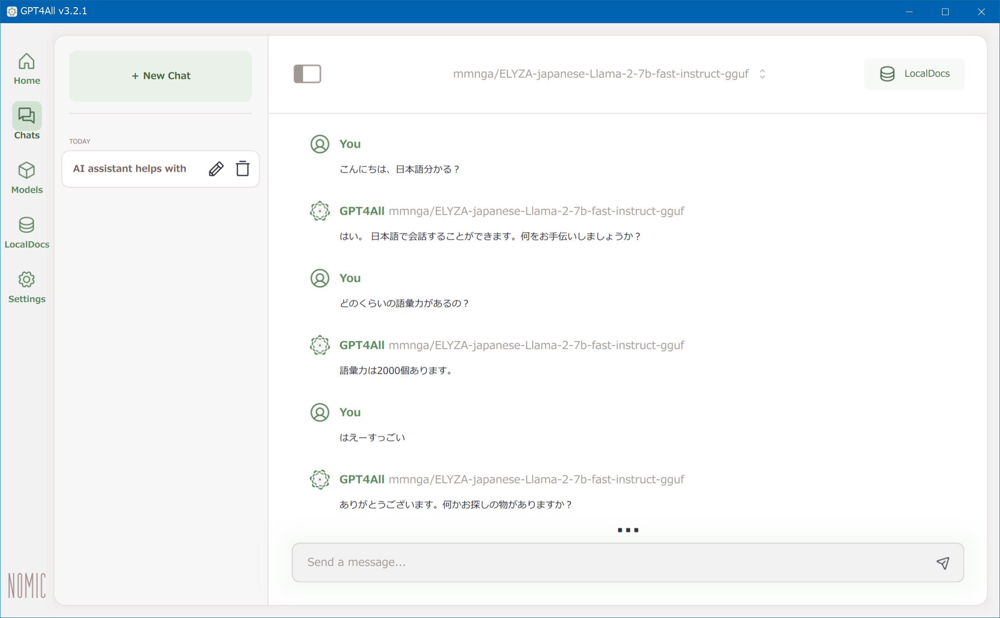

GPT4All という GUI ツールを使うと、色々な言語モデルを簡単に差し替えて利用できるようなので試してみた。

- [GPT4All](https://www.nomic.ai/gpt4all)
- [nomic-ai/gpt4all: GPT4All: Chat with Local LLMs on Any Device](https://github.com/nomic-ai/gpt4all)

`gpt4all-installer-win64.exe` をダウンロードしてインストールする。

インストールできたら、`bin\chat.exe` を実行すれば開く。

最初は何も言語モデルがインストールされていないので、「Explore Models」より任意のモデルを検索してインストールしてやる。

今回は日本語対応のモデル、「ELYZA-japanese-Llama-2-7b」シリーズの中から「elyza/ELYZA-japanese-Llama-2-7b-fast-instruct」を試してみる。厳密にはコレの gguf フォーマット版「mmnga/ELYZA-japanese-Llama-2-7b-fast-instruct-gguf」というモノだ。「japanese」と検索したら一番上に出てきたので分かりやすい。

- [Metaの「Llama 2」をベースとした商用利用可能な日本語LLM「ELYZA-japanese-Llama-2-7b」を公開しました｜ELYZA, Inc.](https://note.com/elyza/n/na405acaca130)
- [elyza/ELYZA-japanese-Llama-2-7b-fast-instruct · Hugging Face](https://huggingface.co/elyza/ELYZA-japanese-Llama-2-7b-fast-instruct)
- [mmnga/ELYZA-japanese-Llama-2-7b-fast-instruct-gguf · Hugging Face](https://huggingface.co/mmnga/ELYZA-japanese-Llama-2-7b-fast-instruct-gguf)

実行してみたところ、驚くほど高速。くだけた日本語でも難なく認識して即座に回答してくれる。なかなか優秀なモデルだ。

GPT4All 自体はモデルを有していないのでインストールは比較的サクッと終わるし、お好みのモデルを比較検討しながら GUI からインストールして試せるので、かなり便利なローカル LLM だ。

  

    
  

  

    

      <a href="https://hb.afl.rakuten.co.jp/hgc/g00rk0p2.waxyc5ae.g00rk0p2.waxyd63d/?pc=https%3A%2F%2Fitem.rakuten.co.jp%2Fbookfan%2Fbk-4299047931%2F&amp;m=http%3A%2F%2Fm.rakuten.co.jp%2Fbookfan%2Fi%2F12878050%2F&amp;rafcid=wsc_i_is_1051972513434300252">ChatGPT 120%質問(プロンプト)術 仕事10倍速!会話型AIの超便利ワザ／ChatGPTビジネス研究会【1000円以上送料無料】</a>
    

    

      <a href="https://hb.afl.rakuten.co.jp/hgc/g00rk0p2.waxyc5ae.g00rk0p2.waxyd63d/?pc=https%3A%2F%2Fwww.rakuten.co.jp%2Fbookfan%2F&amp;m=http%3A%2F%2Fm.rakuten.co.jp%2Fbookfan%2F&amp;rafcid=wsc_i_is_1051972513434300252">bookfan 2号店 楽天市場店</a>
    

    
価格 : 1430円

  

