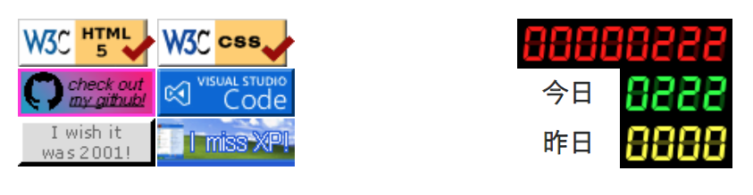

古のホームページに必ず設置されていた、アクセスカウンタ。当サイトも XREA がレンタルしていたアクセスカウンタを設置していたが、いつの間にかサービス終了してしまった。

そこで今回、当時設置していたアクセスカウンタのデザインを再現したモノを、[node-canvas](https://github.com/Automattic/node-canvas) というパッケージを用いて作ってみた。

## 目次

## デモ

2024-10-21 より、当サイトのトップページ下部にのみ、アクセスカウンタを配置している。スクリーンショットはこんな感じ。



右半分の3行のデジタル時計みたいな表示のヤツが、今回お話するアクセスカウンタ。

- 1行目・赤文字 → トータル PV 数
- 2行目・緑文字 → 今日の PV 数
- 3行目・黄文字 → 昨日の PV 数

という形で表示してある。

左側の 88x31px のバナーは全く関係ないお遊びなのでお気になさらずｗ

## ソースコード

ソースコードは以下。

- [Neos21/access-counter: Access Counter Made With NestJS](https://github.com/Neos21/access-counter)

## 実装内容

当時のアクセスカウンタの多くは、恐らく `img[src]` に指定した URL が CGI で、GET リクエストを検知したらアクセス数を集計し、レスポンスとして描画した画像を返す、という仕組みだったと思う。画像の生成には ImageMagick などを使用していたのだと思われる。

- 参考 : [DREAM COUNTER（夢カウンター） : KENT-WEB CGI/Perl フリーソフト](https://www.kent-web.com/count/dream.html)

今回は「カウンタ画像の表示」と「PV のカウント処理」を分離してみたいなと思ったので、分離した。

### カウント方法

このサイトは 2024-09-15 にダークテーマ対応した時から、サイト内の全ページで共通の JS ファイルを読み込むようにしている。その中に、以下のような単純な Fetch を書いた。

```javascript
fetch('https://【カウンタ API】/ct/pv?id=【サイト ID】').catch(error => console.error(error));
```

ただの GET リクエスト。コレを API サーバが受け取ったら、SQLite DB にアクセス数を加算して保存する、という流れだ。

要はこの Fetch を呼び出したらインクリメントされるので、セッションやユーザの単位は考慮していない、本当に純粋な PV 数ということになる。

実際にはオマケで、リファラや開いたページのタイトルなどもクエリパラメータに乗せて、簡単なアクセスログも拾えるようにした。ココはお好みで。

### カウンタ画像の描画方法

カウンタ画像の描画には、前述のとおり node-canvas というパッケージを使用した。コチラは Node.js 上で HTML5 の Canvas が作成できるというモノなのだが、特にブラウザやネイティブパッケージへの強い依存というのがなくて、単純な `npm install` ですぐに動かせたので、気軽に画像生成できて良さそうである。

デジタル時計のような表示は、以前「Neo's Timer」という簡単なアプリを作る時にも使った、ClockIcons という Web フォントを用いている。ココはお好みで。

- 過去記事 : 2022-04-04 [久々にコーディング。「Neo's Timer」を作った](/blog/2022/04/04-01.html)

`node-canvas` で `createCanvas()` をしたら、あとは `Canvas#getContext('2d')` を引っ張ってきて、図形を置いたり文字をレンダリングしたりできる。ココは実際のコードもご覧いただくと、HTML5 Canvas と違いなく扱えていることが分かるかと思う。

- [access-counter/src/canvas.service.ts at master · Neos21/access-counter](https://github.com/Neos21/access-counter/blob/master/src/canvas.service.ts)

こうして作成した Canvas を PNG 形式に変換し、`node:stream` を用いて FileStream に変換してやることで、HTTP リクエストに対するレスポンスとして画像を流せるようにしている。

```typescript
const fileBuffer = canvas.toBuffer('image/png');
const fileStream = stream.Readable.from(fileBuffer);
```

### NestJS で画像をレスポンスするエンドポイントを作る

さて、今回 API サーバ部分は、個人的にお気に入りの NestJS で作っている。コチラは Express.js をラップしているモノなので、恐らく Express.js でも同等のことが出来ると思う。

GET リクエストに対して、先程生成した FileStream の画像データをレスポンスするには、次のように `FileStream#pipe()` を用いる。

```typescript
export class CounterController {
  public responseImage(@Res() response: Response): void {
    // 前述の手順で node-canvas で画像を生成し、FileStream を用意する
    const fileStream = stream.Readable.from(fileBuffer);
    
    // Response に pipe() する
    fileStream.pipe(response.status(HttpStatus.OK));
  }
}
```

- [access-counter/src/counter.controller.ts at master · Neos21/access-counter](https://github.com/Neos21/access-counter/blob/master/src/counter.controller.ts)

FileStream を取り扱ったのがほとんど初めてで、ちょっとおもしろい書き方だなーと思ったが、コレで良いらしい。

コレで、このエンドポイントにアクセスすれば画像が返されるようになったので、この URL を `img[src]` に設定してやれば良い。

## 以上

ちょっと雑な解説になってしまったが、詳しくはソースコードを見ていただきたい。そんなに文量ないので…。

懐かしのアクセスカウンタを、Node.js で再現できて楽しかったです。

<div class="ad-amazon">
  <div class="ad-amazon-image">
    <a href="https://www.amazon.co.jp/dp/4873110440?tag=neos21-22&amp;linkCode=osi&amp;th=1&amp;psc=1">
      
    </a>
  </div>
  <div class="ad-amazon-info">
    <div class="ad-amazon-title">
      <a href="https://www.amazon.co.jp/dp/4873110440?tag=neos21-22&amp;linkCode=osi&amp;th=1&amp;psc=1">CGIプログラミング</a>
    </div>
  </div>
</div>

<div class="ad-rakuten">
  <div class="ad-rakuten-image">
    <a href="https://hb.afl.rakuten.co.jp/hgc/g00qs412.waxycd58.g00qs412.waxyd79c/?pc=https%3A%2F%2Fitem.rakuten.co.jp%2Fcomicset%2F4798001228%2F&amp;m=http%3A%2F%2Fm.rakuten.co.jp%2Fcomicset%2Fi%2F10985813%2F&amp;rafcid=wsc_i_is_1051972513434300252">
      
    </a>
  </div>
  <div class="ad-rakuten-info">
    <div class="ad-rakuten-title">
      <a href="https://hb.afl.rakuten.co.jp/hgc/g00qs412.waxycd58.g00qs412.waxyd79c/?pc=https%3A%2F%2Fitem.rakuten.co.jp%2Fcomicset%2F4798001228%2F&amp;m=http%3A%2F%2Fm.rakuten.co.jp%2Fcomicset%2Fi%2F10985813%2F&amp;rafcid=wsc_i_is_1051972513434300252">【中古】 はじめての人のためのかんたんPerl／CGI入門 / 紙谷 歌寿彦 / 秀和システム [単行本]【メール便送料無料】【最短翌日配達対応】</a>
    </div>
    <div class="ad-rakuten-shop">
      <a href="https://hb.afl.rakuten.co.jp/hgc/g00qs412.waxycd58.g00qs412.waxyd79c/?pc=https%3A%2F%2Fwww.rakuten.co.jp%2Fcomicset%2F&amp;m=http%3A%2F%2Fm.rakuten.co.jp%2Fcomicset%2F&amp;rafcid=wsc_i_is_1051972513434300252">もったいない本舗　楽天市場店</a>
    </div>
    <div class="ad-rakuten-price">価格 : 602円</div>
  </div>
</div>
