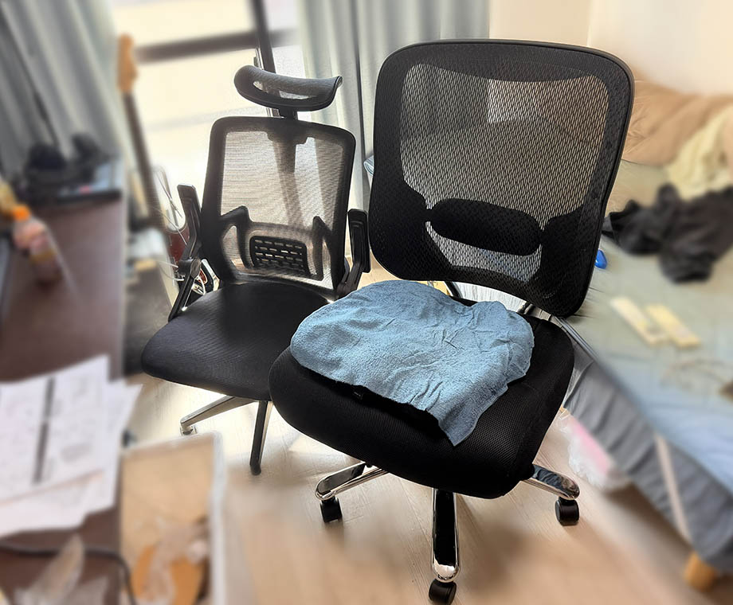

2021年11月に、それまで使っていた椅子のくさみがひどくなったので、ゲーミングチェアを購入した。

- 過去記事 : 2021-11-10 [椅子買った](/blog/2021/11/10-01.html)

ゲーミングチェアのフットレスト部分を早々に破壊してしまい、だましだまし使っていたが、いよいよボロボロになってしまったので、2025年1月に「[HLife](https://www.amazon.co.jp/dp/B0D95XHYSP)」というところのデスクチェアに買い替えた。コレが Amazon で7,000円くらいだった。

特に不満なく使っていたのだが、2026年2月22日、前触れなく突然デスクチェアの足が折れた。**俺がデブだって言うのか！！** ← *いやデブだろ*

ということで (？)、その日に耐荷重 200kg のオフィスチェアを注文、翌日届いた。*サンワサプライの 150-SNCM001* という型番のオフィスチェアで、ヤフーショッピングにて29,800円で購入。

サイズ感は前のデスクチェア (耐荷重は 150kg だった) で十分だったんだけど、耐荷重 200kg となると色々ビッグサイズになっていて、ちょっと取り回しがダルい。まぁでも安心感はあるかな？デブ改善します…。

…えーと、高い買い物をしました、という話だけです。以上。ｗ
