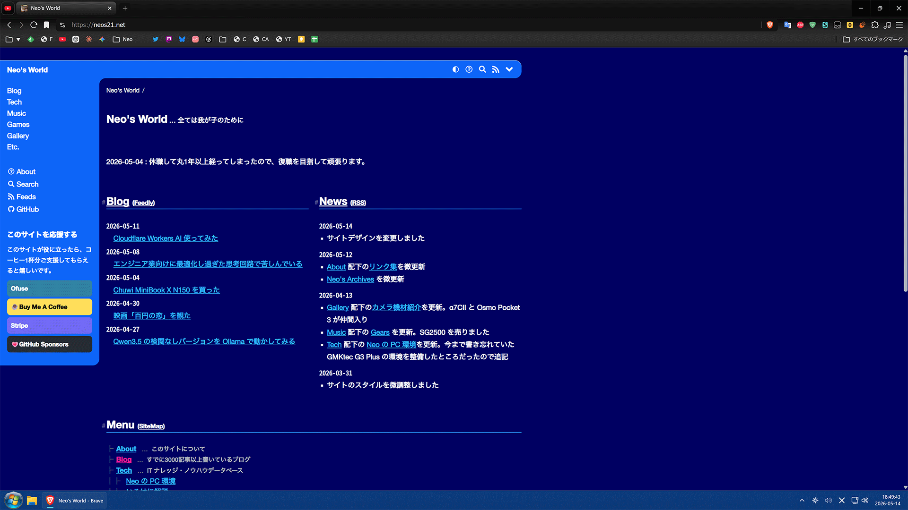
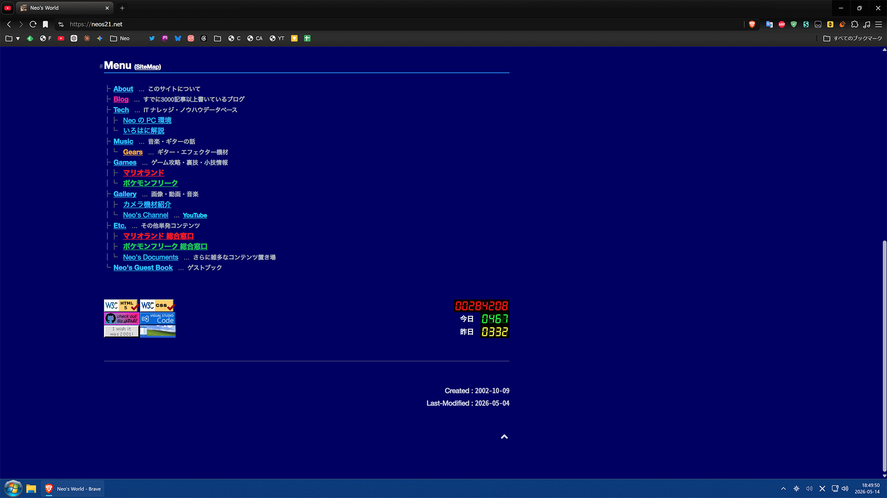
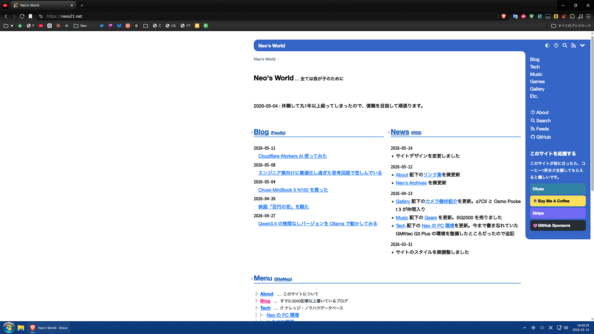
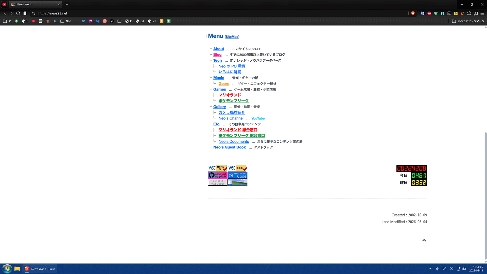

2024年にサイトデザインを更新してから2年ほど経過したので、なんとなくデザインを変更してみた。前回が「2024 Style」というひねりのないテーマ名だったので、今回は「*2026 Style*」というまたひねりのない名前にした。

2024～2026年までのデザインは以下に残してある。

- [Neo's Archives - 2026-05-12 Neo's World](/documents/neos-archives/neo-s21-design/20260512/index.html)

今回作ったデザイン「2026 Style」のスクリーンショットを以下に貼っておく。Windows 11 Pro 上の Brave ブラウザを使っていることも記録として残しておこうと思い、デスクトップ全体のスクショを載せておく。ｗ

画面左端にくっついた、2000年前後のウェブサイトによくあったようなデザインにしてみた。ヘッダ部分の角丸デザインも「Photoshop で作ったデザイン画像をスプライト化して構成してたサイト」にありがちだったデザインをオマージュしている。

スマホファースト・ダークテーマ優先でデザインしている。PC のような幅広なデバイスでは久々に2カラムレイアウトで表示されるようにした。CSS Grid で HTML 構造から順序を入れ替えて配置したりしている。

ライトテーマに切り替えると、今度は画面右端にくっつくようにしている。2004年頃の「HTML タグ小技集」みたいなサイトは、オシャレ感を演出するためによくサイト全体が右端に寄っていたので、そのオマージュ。

テーマを動的に切り替える部分だけは JavaScript を使っていて、ルート要素の `data` 属性を `:root[data-theme="light"]` と `:root[data-theme="dark"]` とで切り替えるようにしてある。今回は `color-scheme` や `light-dark()` などをフル活用して、なるべくテーマ切り替えで CSS が肥大化・複雑化しないように注意した。

これまでは [clean-css-cli](https://github.com/clean-css/clean-css-cli) という npm パッケージで CSS をバンドルしていたのだが、このパッケージは2022年頃からメンテナンスモードになっており、CSS Nesting などの最近の構文に追従していなかった。

そこで CSS プリプロセッサの [postcss](https://github.com/postcss/postcss) と、`@import` 部分のバンドルと圧縮を行うためのプラグインとして [cssnano](https://github.com/cssnano/cssnano) を使うように切り替えた。

ザックリ文字数でいうと、2024 Style のバンドル・Beautify 後の文字数が 31,571 文字だった。今回の 2026 Style は、バンドル・圧縮後が 33,086 文字、Beautify すると 38,926 文字となって、全体的には若干肥大化した。元々 CSS 内に SVG の Data URL もベタ書きしてるので 33KB 規模になっている。Beautify すると CSS Nesting の2スペースインデントが階層化していくので 38,926 文字まで増えて見える。前回は clean-css-cli が軽く Beautify したモノを配信していたが、今回は cssnano で圧縮して、2行・33,086 文字 (33,118 Bytes) の CSS ファイルとして配信している。こう見れば大体 2KB 程度の増加で、まぁボチボチかな…。

HTML 構造はほとんど変えていないのだが、CSS Grid で親要素を透過するため `display: contents` を指定した場所がいくつかあってその都合でフッターに遷移するアイコンのリンク先を調整したり、寄付を募るセクションのバナーリンクを再構築したりしたので、実はサイト全体の HTML も再ビルドしていたりする。

Windows の Chrome 系ブラウザ (Brave) と iPhone Safari でしか表示確認しなかったので、Firefox や Android でデザインが狂う、文字色が見づらい、などあれば教えていただきたい。

久々に AI を使わず、全て手書きで作って、コーディングが楽しかった。

  

    

      <a href="https://www.amazon.co.jp/dp/429711173X?&linkCode=ll2&tag=neos21-22&linkId=7fedb8de0c2b7e4a099bdbf20fb2457e&ref_=as_li_ss_tl">CSS設計完全ガイド ~詳細解説+実践的モジュール集</a>
    

  

  

    
  

  

    

      <a href="https://hb.afl.rakuten.co.jp/hgc/g00reb42.waxycf23.g00reb42.waxyd080/?pc=https%3A%2F%2Fitem.rakuten.co.jp%2Frakutenkobo-ebooks%2F7ac1a3bec0573e59a1d4c30751c54475%2F&amp;m=http%3A%2F%2Fm.rakuten.co.jp%2Frakutenkobo-ebooks%2Fi%2F18985813%2F&amp;rafcid=wsc_i_is_c80a44f7-e2d0-44c7-a1e6-750af3f15e55">CSS設計完全ガイド　〜詳細解説＋実践的モジュール集 【電子書籍】[ 半田惇志 ]</a>
    

    

      <a href="https://hb.afl.rakuten.co.jp/hgc/g00reb42.waxycf23.g00reb42.waxyd080/?pc=https%3A%2F%2Fwww.rakuten.co.jp%2Frakutenkobo-ebooks%2F&amp;m=http%3A%2F%2Fm.rakuten.co.jp%2Frakutenkobo-ebooks%2F&amp;rafcid=wsc_i_is_c80a44f7-e2d0-44c7-a1e6-750af3f15e55">楽天Kobo電子書籍ストア</a>
    

    
価格 : 3608円

  

