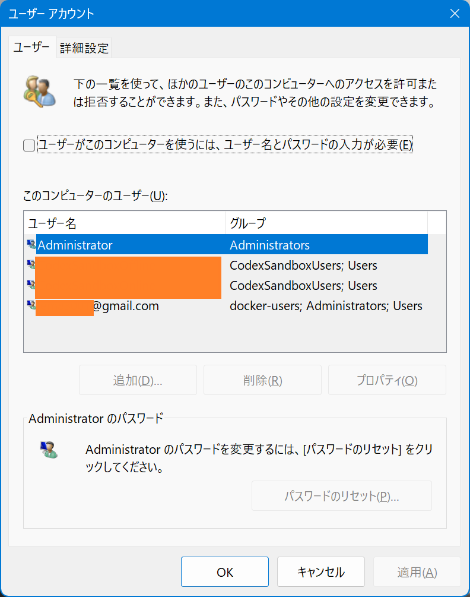
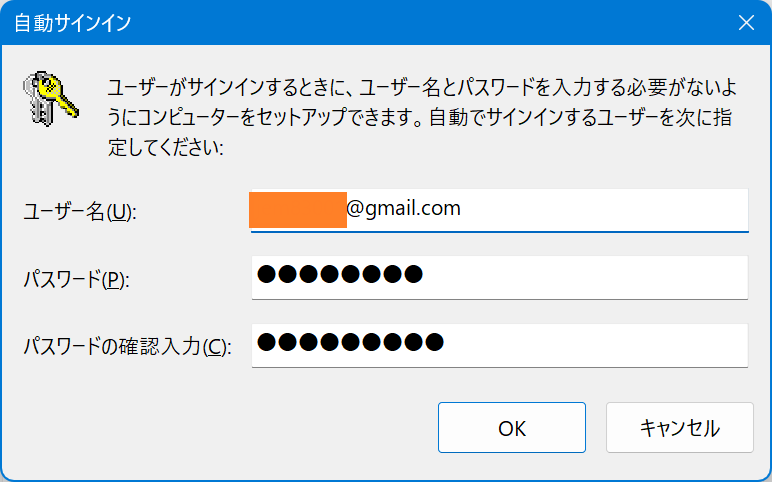

Windows 11 Pro にて、サインイン時のパスワード入力を省略したくなった。

- 普段使っているアカウントは Microsoft アカウントであり、ローカルアカウントではない
- PC 起動時のサインインでは、MS アカウントへのログインパスワードではなく、「設定」アプリで設定した PIN (任意のパスワード) を入力している

このような前提で、`netplwiz` (Network Places Wizard の略らしい) を開いてサインイン時のパスワードを設定する時、「PIN」を入れておけばいいのかというとそれではサインインできず、**MS アカウントにログインする際のパスワード**を入れる必要があった。

↑ この画面で `@gmail.com` なメインアカウントが見えていると思う。「*ユーザーがこのコンピューターを使うには、ユーザー名とパスワードの入力が必要*」にチェックを入れて「OK」ボタンを押すと、以下のダイアログが出るが、ココで入力するパスワードが重要。

「ユーザー名」は前述の画面で見えていた `@gmail.com` なアカウント名そのまま。そしてパスワードの方には PIN ではなく MS アカウントのパスワードを入力する必要がある、というワケ。

以前、リモートデスクトップで接続する際のパスワード設定でもつまづいたことがあり、SMB でドライブ共有する際のパスワードも毎回分からなくなる。この辺本当に分かりにくい。

- 過去記事 : 2022-02-11 [Microsoft アカウントのユーザにリモートデスクトップ接続でログインする際は変な初期設定が要る](/blog/2022/02/11-01.html)
