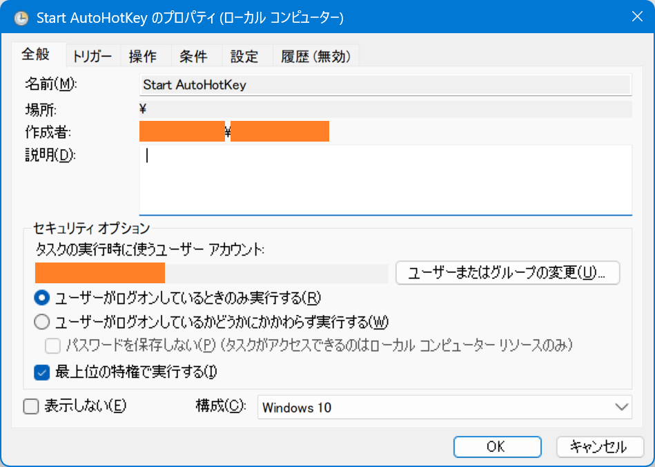
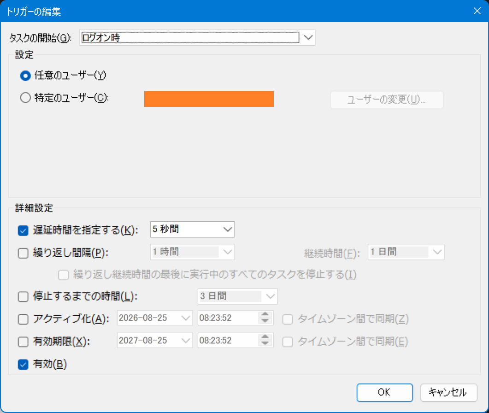
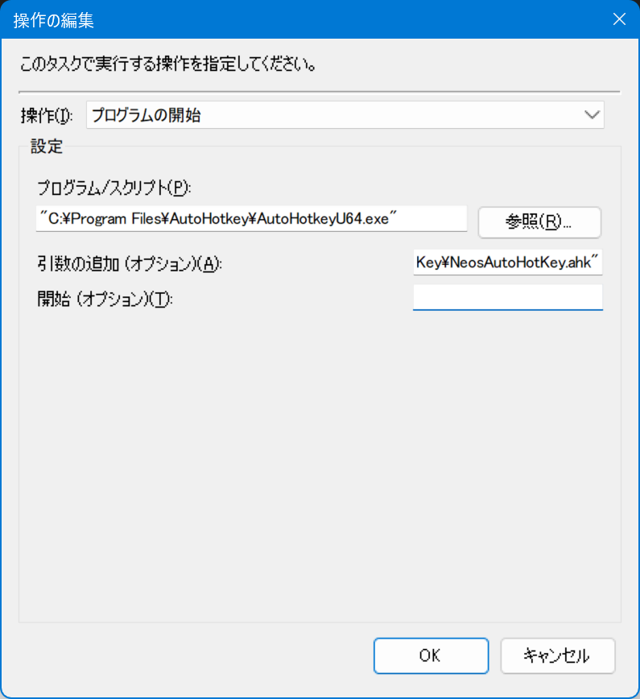
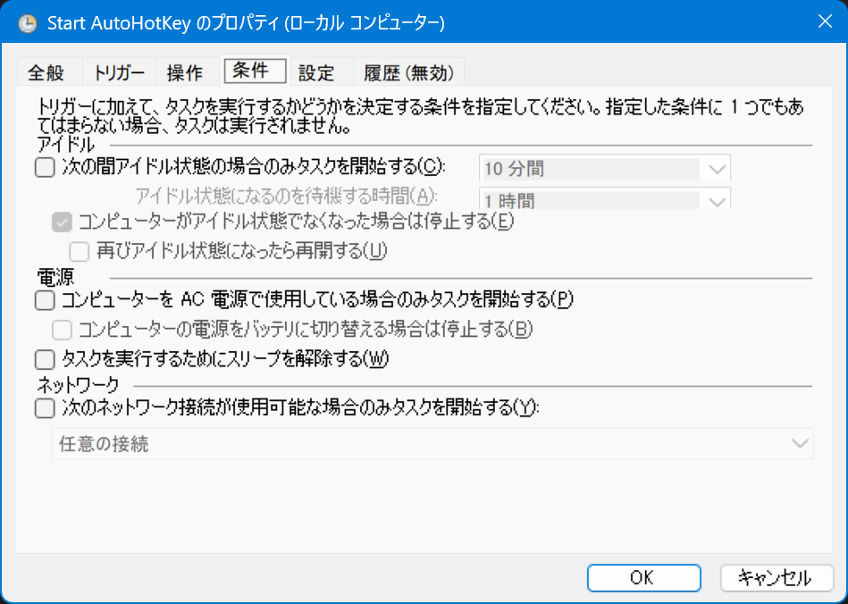
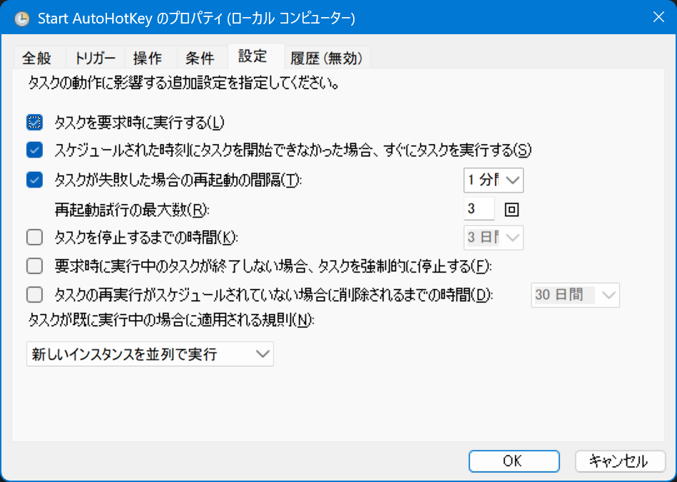

自分は US キーボード使いなので、AutoHotKey の `alt-ime-ahk` というスクリプトを使って、左右 Alt キーの空打ちで IME を切り替えている。

この AHK スクリプト、管理者権限で起動してあげないと、例えば Windows Terminal のウィンドウなんかで発動できないため、単にスタートアップに `.ahk` ファイルを置いておくだけでは管理者権限で起動できず困っていたのだ。

そこで、デスクトップ上に `.ahk` ファイルのショートカットを作り、このショートカットの設定から「管理者として実行」オプションを付けて置いておき、マシン起動時に自分でショートカットを開いて AutoHotKey を実行するようにしていた。

当然ながら、マシン起動時に自分で AutoHotKey スクリプトを起動する手間が増えて面倒臭い。

そこで調べたところ、タスクスケジューラを使うことで、*管理者権限で AutoHotKey スクリプトを自動起動*できた。

`Win + R` から `taskschd.msc` を入力してタスクスケジューラを起動する。「タスクの作成...」というメニュー項目から、以下のようにタスクを作成すれば良い。



- 「ユーザーがログオンしているときのみ実行する」にチェックを入れないとうまくいかなかった。どうもサインイン前に裏で起動してしまい、そのログも残らないみたい
- 「最上位の特権で実行する」にチェックを入れることで、管理者権限起動できるようにする
  - 設定時にパスワードを求められたので、サインインユーザである Microsoft アカウント (`XXX@gmail.com`) と MS パスワードを入力した (普段のサインイン時に使っている PIN ではないことに注意)



↑ トリガーの設定はログオン時とし、念のために5秒程度の遅延を入れておいた。



↑ 「プログラムの開始」の設定は以下のようにする。

- プログラム/スクリプト : `"C:\Program Files\AutoHotkey\AutoHotkeyU64.exe"` (スペース含むためダブルクォート必要)
- 引数の追加 (オプション) : `"C:\PATH\TO\MyAutoHotKey.ahk"` (スペース含む場合も考慮してダブルクォート付けておく)
- 開始 (オプション) : ショートカットファイルでいう「作業フォルダー」の指定。必要に応じて入力する

「開始 (オプション)」は、実行されるプログラム・スクリプトにとってのカレントディレクトリの指定となる。例えば `.ahk` ファイル内で `Include` を使って、*相対パスで別の `.ahk` ファイルを読み込んでいる*ような場合は、ココにディレクトリパスを指定しておかないと対象のファイルが認識できなくなってしまう。

逆に「開始 (オプション)」は空欄にしたまま、`.ahk` 内の `Include` 指定でフルパス指定する方法もある。

```
; 作業フォルダを自身の位置に固定する
SetWorkingDir %A_ScriptDir%

; この AHK ファイルと同じ階層にある別の AHK ファイルを Include する
#Include %A_ScriptDir%\my-another-ahk-file.ahk
```

こんな風に `SetWorkingDir` 指定を入れておけば良い。



↑ 「条件」タブは、ノート PC でバッテリー駆動時はどうする、みたいなオプションなので、どんな場合でも必ずこのタスクが実行できるように調整する。



↑ 「設定」タブでは、「タスクを停止するまでの時間」にチェックを入れないことが重要。タスクを開始させたら、勝手に終了させず、実行させっぱなしにさせておかないと、AHK ファイルが閉じられるような挙動になってしまう。

以上。2026年にしてようやくタスクスケジューラの動きや使い方が分かってきた。
