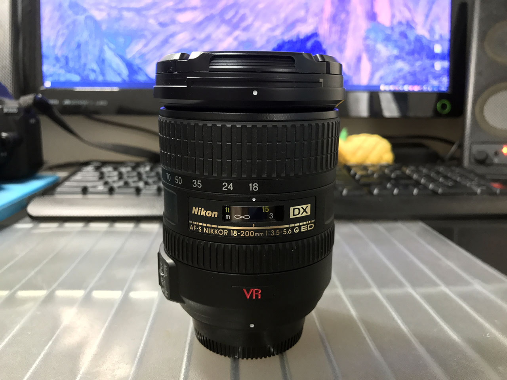
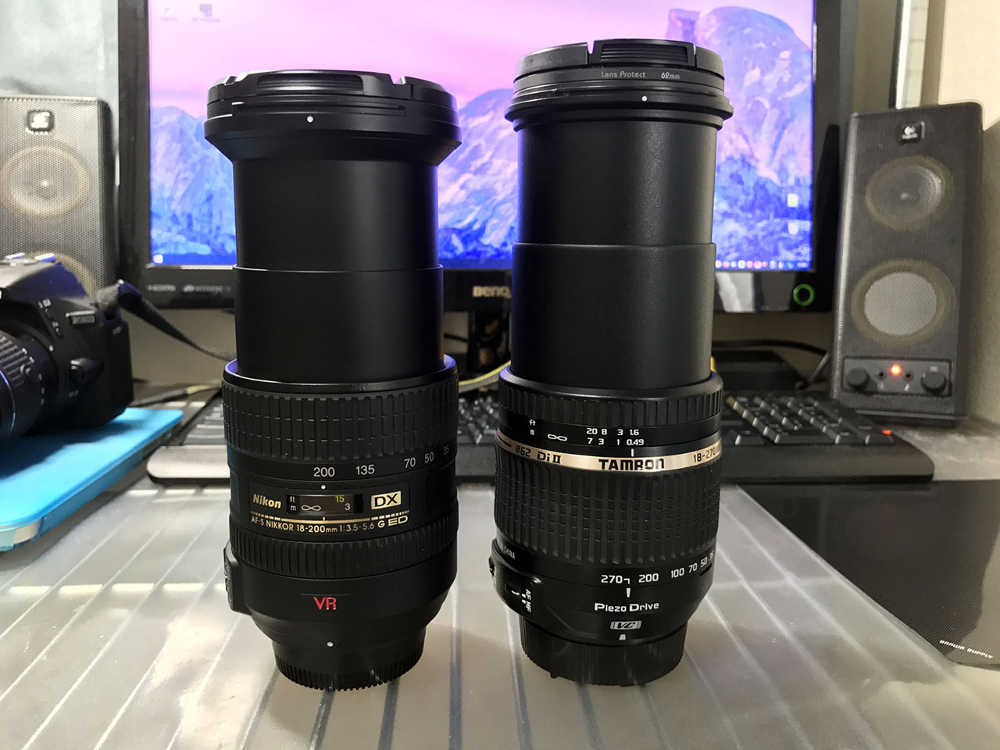

ついこの前 Tamron 18-270mm を買った記事を書いたが、どうもピント合わせのモタつき感じと解像感のなさが嫌で、また高倍率レンズを買ってしまった。__Nikon AF-S DX 18-200mm F3.5-5.6 G IF ED VR__ だ。2017年6月26日、ヤフオクで買った中古で17,500円なり。レンズの口径は 72mm。

自分が買ったのは前モデルの「VR I」で、現在は VR II という後継機種が出ているが、この「II」とは VR の性能が上がってるという意味の「II」ではないようで、基本性能はほとんど変わらないようだ。

違いはというと、ロックスイッチが付いたのと若干逆光に強くなった？程度の差みたい。なのでカメラ性能としてら前モデルでもほぼ変わりなし。VR の文字が赤くて、これはこれでカッコイイ。

  

    
  

  

    

      <a href="https://www.amazon.co.jp/dp/B002JM0LM4?tag=neos21-22&amp;linkCode=osi&amp;th=1&amp;psc=1">Nikon 高倍率ズームレンズ AF-S DX NIKKOR 18-200mm f/3.5-5.6G ED VR II ニコンDXフォーマット専用</a>
    

  

↑コッチが VRII。

今回も使ってみた感想を。

## タムロンよりはシャープに見える

気になる画質は、タムロンと比べると若干シャープに写っているかな？という感じ。全体的には眠たい感じが拭えず、便利ズームってやっぱりこれが限界なのかな、と思った。なんとなく後ピンっぽく見えるというか。

↑左が Nikon 18-200mm、右がタムロン 18-270mm。焦点距離は違うが、伸ばしきったところの長さはあまり変わらない。

## オートフォーカスは良い感じの速さ

オートフォーカスは常用に十分なスピード。望遠側でもタムロンほど迷うことなく合ってくれて使いやすい。

## ロックスイッチはなくても気にならない

ロックスイッチがないので鏡胴が伸びることがあるかもなー、と思っていたが、首から下げて歩いているレベルでは大丈夫だった。多分もっと使い込まれた中古品だと、もう少しリングが甘くなっててずり落ちやすくなったりするかも。

## 中古故にマニュアルフォーカスリングがイマイチ…

中古品のためか、マニュアルフォーカスリングの回し心地が悪く、時々上手くテレ端・ワイド端まで回せないことがある。これは個体の選別ミスか。

## できれば新品を買ったほうがより良さが分かるモデル

全体的には使い勝手が良く、サードパーティのタムロンと比べると、さすがニコン純正なだけある。機種自体に大きな不満や問題は感じないので、できればちゃんと新品を買った方が、良さが実感できそうだなと思った。

今から新品の後継モデルを買うかどうしようか悩むのう……。

  

    
  

  

    

      <a href="https://www.amazon.co.jp/dp/B00JL64FZU?tag=neos21-22&amp;linkCode=osi&amp;th=1&amp;psc=1">Nikon 高倍率ズームレンズ AF-S DX NIKKOR 18-300mm f/3.5-6.3G ED VR ニコンDXフォーマット専用</a>
    

  

