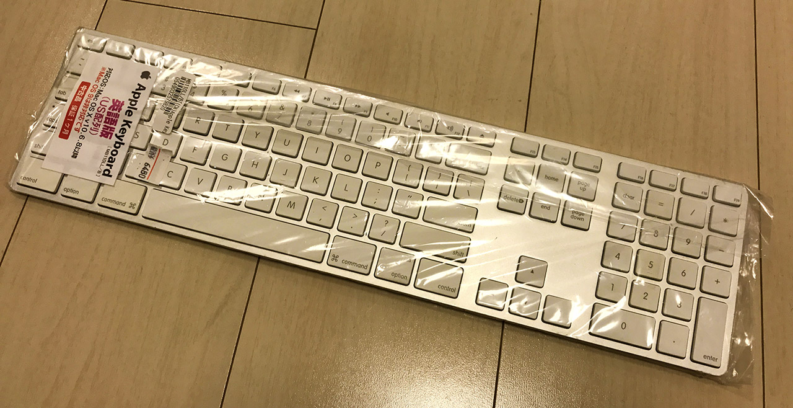
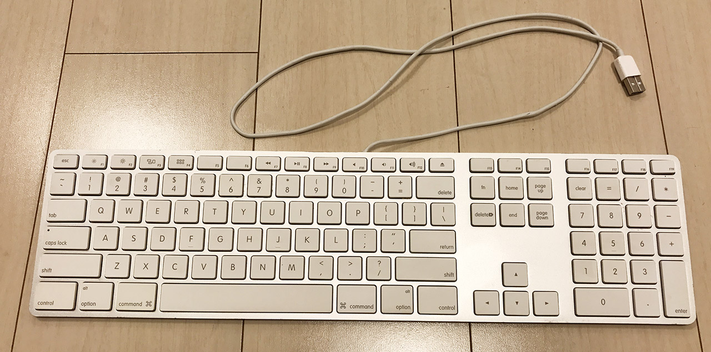
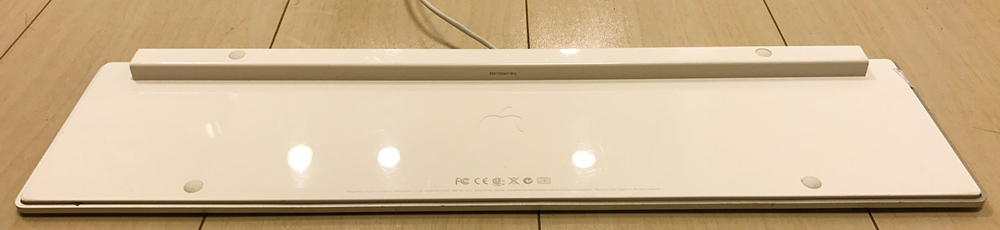
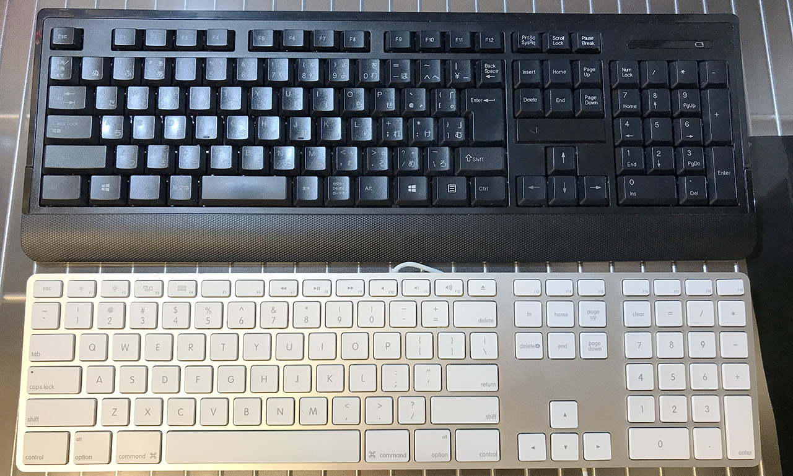

絶対どっかで記事書いてるだろと思ったら書いていなかったっぽいので改めて紹介。

2017年9月、__Apple Keyboard ML110LL/B__ という型番のキーボードを買った。US 配列。

個人的にはテンキーが欲しくて、薄いヤツが良かったのだが、最新の Magic Keyboard は無線。

諸事情で有線タイプでないといけなかったので、有線のモノがないかなーと思って探してみると、Magic Keyboard と似た形の有線タイプが過去に出ていたようなので、中古を探して買ってきた。

コレは秋葉原にある秋葉館の Mac 専門店で買った。6480円。中古が積んでゴロッゴロ置いてあったので、動作するのか心配になったが、動作確認済だそうで、無事に動作している。何個か買っておこうかしら。ｗ

MB110LL/A という以下の商品とほとんど変わりないが、動作保証する OS のバージョンが一世代古く、ファンクションキーが若干違う。

- 参考：[Apple Keyboard 3代前からMB110J/Aまで - ViViたる思い](http://www.dwdem.com/omo-i/2012/06/keyboard-mb110ja.html)

> 見た目では現在売られている最新のキーボード MB110J/Bと変わりませんが、MB110J/Aは Intel以前の Macintosh でそのまま使える最後のキーボードということになります。  
> MB110J/Bを Intel以前の Macintosh で使うと一部のキーで別の文字がタイプされるそうです。

裏面。__出っ張り部分の左右端に、USB ポートが合計2つ付いている。__これは地味に便利！このキーボードを収納する時も、片方のポートに自分自身の USB 端子を挿しておけば、コードの先端が固定できる。

サイズ感は通常のキーボードだが、薄くて軽くて使いやすい。とても重宝している。

  

    
  

  

    

      <a href="https://hb.afl.rakuten.co.jp/hgc/g00rye72.waxyc605.g00rye72.waxydb39/?pc=https%3A%2F%2Fitem.rakuten.co.jp%2Fpc-max-shop%2Fns-88%2F&amp;m=http%3A%2F%2Fm.rakuten.co.jp%2Fpc-max-shop%2Fi%2F10001940%2F">Apple 日本語キーボード(テンキー付き) マウス セット Keyboard A1243 Mighty Mouse A1152 USB接続 純正品</a>
    

    

      <a href="https://hb.afl.rakuten.co.jp/hgc/g00rye72.waxyc605.g00rye72.waxydb39/?pc=https%3A%2F%2Fwww.rakuten.co.jp%2Fpc-max-shop%2F&amp;m=http%3A%2F%2Fm.rakuten.co.jp%2Fpc-max-shop%2F">BTOパソコン専門店のPC-MAX</a>
    

    
価格 : 5999円

  

