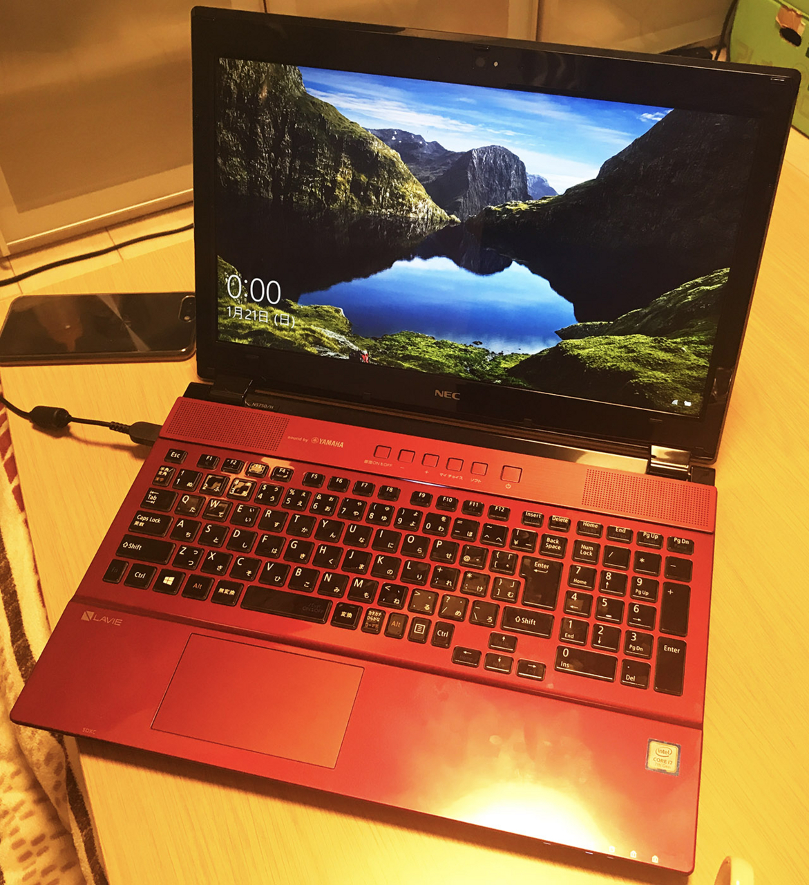
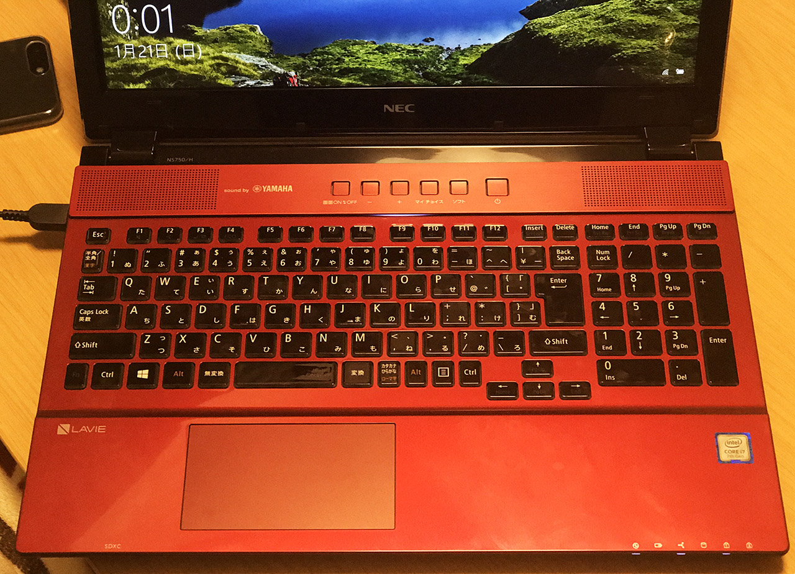
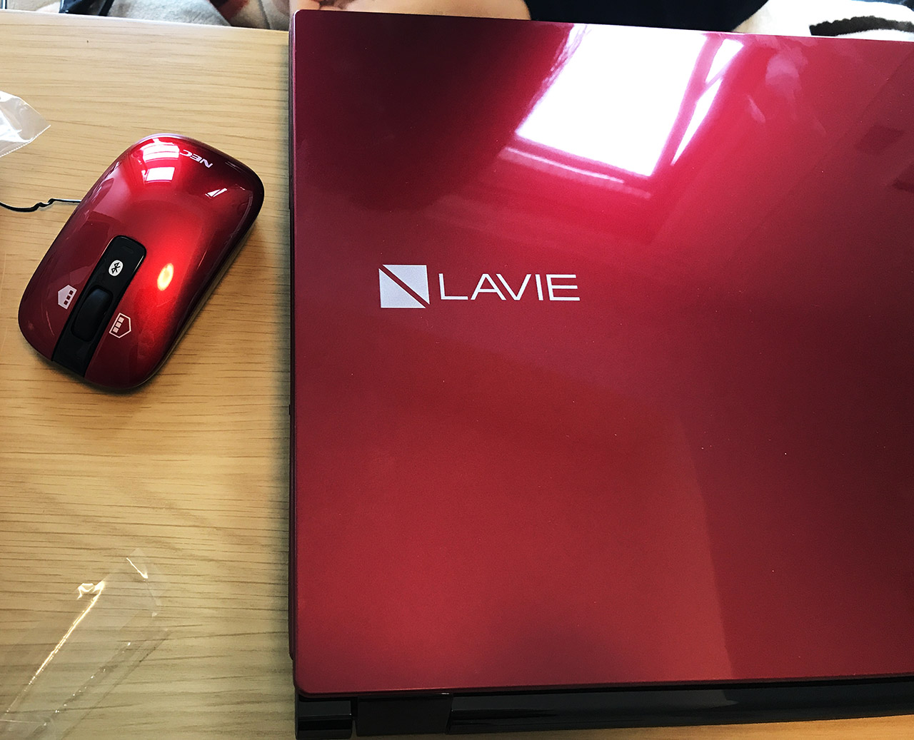

2018年1月、彼女がノート PC を買い替えた。__NEC LAVIE Note Standard PC-NS750GAR__ という、__クリスタルレッド__カラーが特徴のマシンだ。

スペックはこんな感じ。

- Windows 10 Home 64bit
- 15.6 インチ
- Core i7 7500U (Kaby Lake) 2.7GHz 2コア
- 1TB __SSHD__ (HDD + NAND 型フラッシュメモリ)
- 8GB RAM
- ブルーレイドライブ

SSHD というのが気になるところだが、今のところ不満はない様子。SSHD というのは、64～128GB 程度の SSD と HDD の組み合わせで、Mac における Fusion Drive みたいなもの。

あと _YAMAHA のスピーカーが内蔵_されていて、音質が Good。キーボードも日本語配列にしては綺麗にまとまっていて使いやすそう。

TDS 15周年の__クリスタル・ウィッシュ・ジャーニー__にならって__クリスタルレッド__カラーを選択したようだ。光沢があるが、指紋が付きやすいのがタマにキズ。

[ディズニーはプログレ - El Mylar](http://neos21.hateblo.jp/entry/2017/02/11/011858)

ディズニーの余韻を残しつつ、快適な PC ライフが始まる…！
