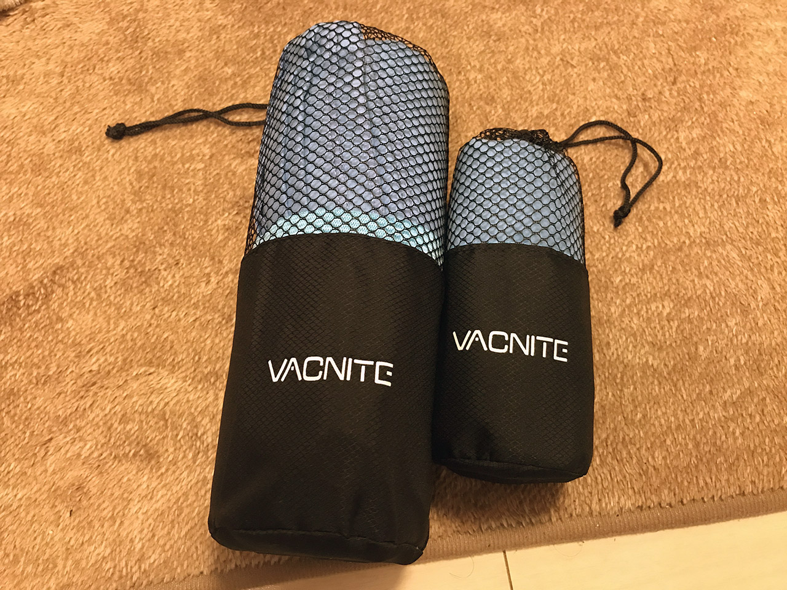

ジムに行くための準備計画、第3弾。今回はジムで使うためのタオルを買った。

トレーニングジムに関する知識が全然なくて想像もできていなかったのだが、人間は運動すると汗をかくので、みんなハンドタオルを持っていくらしい (笑)。また、ジムに備え付けのシャワー室があるので、シャワーで汗を流して身体を拭いて帰るのがデフォなようだ。

ということは、自分用のハンドタオルと、バスタオルが要るということだ。

しかし、バスタオルなんてあんなかさばるもの、持っていけなくない？

…と思っていたら、吸水・撥水性に優れた、コンパクトなスポーツ用のタオルが世にはあるらしい。例えば以下のようなモノだ。

大抵はサイズ違いで2つのタオルがセットで売られている。いずれもくるくるっと丸めてコンパクトに持ち運びできるようになっている。

サイズを見てみると、ハンドタオルのの方は 30x80cm 程度で、バスタオルになりそうなのは 60x140cm 前後が多い。軽くシャワーを浴びて、サッと拭く程度ならこのサイズで十分だろう。

実際に _Vacnite_ というブランドのタオルを買ってみたが、通常のタオルとは材質が違う。

これでようやく、ジムで汗をかいても汗が拭けるようになったし、シャワーも浴びられるようになった (笑)。タオルに関してはめでたしである。

しかし、既にウェアとシューズを持っていて、コンパクトとはいえタオル類も持ち運ぶとなると、それを入れるバッグなりリュックなりが必要になる。会社帰りにジムに寄りたいが、会社用のカバンには入らないし…。

ということで、次回はビジネスでも使える、容量大きめのリュックを探しに行く。
