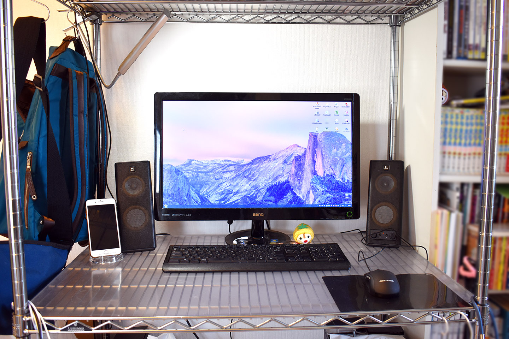
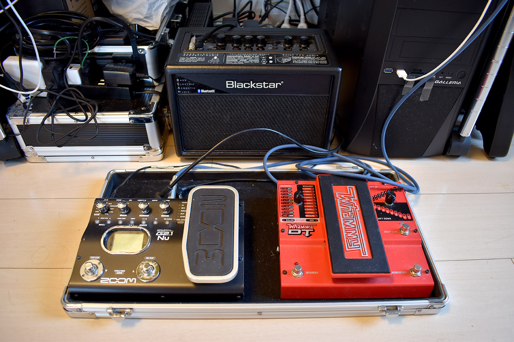

どうも Neo です。

最近、「[#わたしのブログ環境](https://tobalog.com/2018/04/blog-watashi/)」というハッシュタグが流行っている。世のブロガーたちが自身の執筆環境を晒すというモノで、雑記ブログでアフィるネタとしては手っ取り早いところだなーと思ったが、魂胆がどうあれ僕は他人のパソコン環境を見るのが結構好きなので、ついつい見てしまっている。

他の人がどんなブログを書いているのか全然知らないが、とりあえず環境だけは見させてもらったことだし、_じゃあ自分も環境を晒してみようかなー_と思い、色んな面からブログを執筆する環境を紹介してみようと思う。

## 目次

## 僕はどんなブログを書いている人？

タイトルで__「月間10万 PV 突破」__とかなんとか言っているが、そもそもコイツはどんなブログを書いているヤツなのか？まずは運営サイトを紹介する。

一番最初の話をすると、僕は1998年頃に「ホームページ」を作り始めた。2002年に開設した「[Neo's World](http://neo.s21.xrea.com/)」が現存する最古のサイトであり、今でも一応コレがメインサイト。当初は趣味のゲームに関する攻略情報や裏技などを扱っていたが、最近はギター機材の話とか自作の写真・動画の紹介とかもしている。2003年頃はポケモン攻略サイトとしてそれなりに知られていて、マリオシリーズの攻略情報サイトとして Yahoo! カテゴリにも掲載されていたのだが、最近のアクセス数は1日100 PV 行かないレベル。

SE として就職して数年経った2016年1月、今まで自分が学んできたことをアウトプットする場が欲しいと思い、__技術ブログ「[Corredor](http://neos21.hatenablog.com/)」__を開設。__「月間10万 PV」__と言っているのはこのブログのこと。

2016年2月、SE 業界や仕事に関する愚痴・文句・主観・主義・主張を書き散らかす場所として「[Murga](http://neos21.hatenablog.jp/)」を開設。次いで2016年5月、映画・音楽など趣味に関する_雑記ブログ_として_「[El Mylar](http://neos21.hateblo.jp/)」_を開設。この2つのブログのアクセス数は月間1万 PV 程度。

2017年に入って、これらのブログで Google AdSense、Amazon アソシエイト、楽天アフィリエイトを始めたのをきっかけに、アフィネタやポイントサイトに関する話題を書く場所として「[Bit-Archer](http://bit-archer.hatenablog.com/)」を開設。コチラは Google AdSense や Amazon アソシエイトなどを利用していないので、もう少し自由に書いている。

…というのが、ザックリとした僕の運営サイト紹介。メインサイトは「[Neo's World](http://neo.s21.xrea.com/)」と言ったが、最近のアクティブさで言えば、__「[Corredor](http://neos21.hatenablog.com/)」__「[Murga](http://neos21.hatenablog.jp/)」_「[El Mylar](http://neos21.hateblo.jp/)」_が3強。

基本的にアクセス数や収入を求めてブログを執筆しているワケではなく、あくまで_趣味に関する情報のアウトプット_として、ウェブサイトとかブログとかいった媒体を利用しているだけ。ウェブサイトを作り始めた1998年というと僕はまだ7歳で、富や名声はモチベーションになっていないのだ。今となっては何で続けているのか分からないし、「別に個人的なメモ帳で良くない？」とすら思う。

それでも、ただ何となく毎日、技術ブログ「[Corredor](http://neos21.hatenablog.com/)」に勉強したことを執筆し、生活や仕事のことで愚痴りたくなったら「[Murga](http://neos21.hatenablog.jp/)」に書き散らし、楽しいことがあれば「[El Mylar](http://neos21.hateblo.jp/)」に感想を書く、という感じで生活している。

## わたしのブログ環境 自宅デスク環境・ハードウェア編

そんな Neo が、それぞれのブログネタをどんな環境で執筆しているか。本題である。

まずは自宅でどんなハードウェアを利用しているか、どんなデスク環境かを紹介しよう。

↑自宅のデスクはこんな感じ。メタルラックを組んで、上の段にはノート PC や色んな荷物を置いておけるようにしてある。ラックの横にはリュックやバッグを置いている。この前買った Aer の Flight Pack もラックの手前、床に置いてある。

- [ジムに行こうと思って通勤にも使えるビジネスリュックを新調した - El Mylar](http://neos21.hateblo.jp/entry/2018/04/26/113000)

以降、デスクトップパソコンとノートパソコンの詳細を紹介する。

### Galleria XG

メインとなるデスクトップパソコンは、ドスパラの「ガレリア」シリーズである__「Galleria XG」__というモデル。

PC 本体の上には後述するコンデジやモバイルバッテリーなども置いている。

購入時の記事は以下。↓

- [ドスパラのデスクトップゲーミング PC「Galleria XG」を買った！ - Corredor](http://neos21.hatenablog.com/entry/2017/08/08/132015)

主なスペックは以下のとおり。

- CPU：Intel Core i7-7700K 4.2GHz
- GPU：NVIDIA GeForce GTX1080 8GB
- RAM：32GB DDR4
- SSD：500GB
- HDD：2TB
- ブルーレイドライブ (読み書き可能)

コレで購入価格は約24万円。

CPU・メモリ・GPU、いずれも文句なしのスペックをつぎ込んだので、ブログ執筆の他、Adobe Photoshop を使った画像編集、Adobe Premiere Pro を使った動画編集、GTAV や PUBG などのゲームもサクサク動く。

この前には Acer ASM5811-A61 というデスクトップ PC を利用していて、モニタやスピーカーはその時から引き続き利用している。

モニタは _BenQ の24インチモニタ「VW2424H」_。2012・3年頃に購入したモノ。そして__スピーカーは Logicool X-140__。コレも特に拘りなく買ったが、トーンツマミが付いていて良い感じ。

ディスプレイの足元には、後述するカメラの SD カードを PC に繋ぐための USB とか、iPhone7Plus にイヤホンを挿すための Lightning コネクタとか、小物を置いている。ホコリとかそのまんまでスンマセン…。

キーボードは_サンワサプライの「SKB-WL24SETBK」_というモノ。無線キーボードで、マウスとのセット。僕は_日本語キーボードは Windows キーが左右に2つある109キーボード_と決めているので、フルサイズキーボードで無線のモノを探して買った。あまり変形タイプは好きではないのである。

購入時の記事は以下。↓

- [日本語109配列の無線キーボード & マウス！「Sanwa Supply SKB-WL24SETBK」を買った - Corredor](http://neos21.hatenablog.com/entry/2017/02/23/000000)

無線マウスもセットだったが、最近壊れてしまったので、前述の PC 本体、ガレリアに付属していた有線マウスに切り替えた。マウスもキーボードと同じく、複数ボタンが付いているような変形タイプは好きではない。よくあるノーマルでシンプルなモノが一番である。

外付け HDD は現在3台あって、アクティブに利用しているのは1台だけ。_Buffalo の 3TB_ のモノ。主なデータはほとんど外付け HDD に入れているので、PC 本体よりもこの HDD が吹っ飛んだ時の方が泣く。ｗ

↑ホコリっぽくてスミマセン…

ガレリアの OS は Windows 10 Home Edition。どんなツールを使ってブログ執筆しているか、などソフトウェアに関する話は後述。

### Apple MacBookPro (13インチ・Early 2015)

次に、2016年5月に人生で初めて買ったノートパソコン。Apple の __MacBookPro・13インチ・2015年モデル__だ。

購入時の記事は以下。↓

- [MacBook Pro Retina 13インチ (Early 2015) 届きました！ - Corredor](http://neos21.hatenablog.com/entry/2016/05/08/041357)

主なスペックは以下のとおり。

- CPU：3.1GHz デュアルコア Intel Core i7 (Turbo Boost 使用時最大 3.4GHz)、4MB 共有 L3 キャッシュ
- GPU：Intel Iris Graphics 6100
- RAM：16GB 1,866MHz LPDDR3 オンボードメモリ
- SSD：512GB PCIe ベースフラッシュストレージ
- US キーボード

_初の US キーボードだったが、コレは大正解。_Mac の JIS 配列は特に使いづらい。`CapsLock` と `Control` の位置が普通の JIS 配列と比べると逆だったり、`fn` キーの位置が US 配列と違って右側にあったり、とにかく使いづらい。US キーボードはとても使いやすい。

_Core i7・16GB RAM_ と申し分ないスペックだが、重量は 1.58kg と、今となっては少々重め。最初はコレを持ち歩いていたが、最近はあまり持ち歩かなくなった。ブログ執筆の他、Cordova を使った iOS アプリ開発に利用している。

### Asus ZenBook3 UX390UA-512GP

12インチ MacBook の重量が 920g と知り、MacBook 欲しいけど、MacBookPro は持ってるし、高いし、同等のスペックで Windows マシンはないかなー、と思い探していると、まさに12インチ MacBook のクローンといえる、__Asus ZenBook3 UX390UA__ というモデルを発見。

今回も US キーボードが欲しかったので、2017年11月末に米国の Amazon.com より輸入して購入。ブラックフライデーセールのおかげで $999、約11万円程度で購入できた。

購入時の記事は以下。↓

- [Asus ZenBook3 UX390UA-512GP を買いました - Corredor](http://neos21.hatenablog.com/entry/2017/12/06/080000)
- [Asus ZenBook3 UX390UA-512GP のアクセサリを色々買った - El Mylar](http://neos21.hateblo.jp/entry/2017/12/13/173926)

主なスペックは以下のとおり。

- CPU：Core i7 7500U (Kaby Lake) 2.7GHz / 2コア
- GPU：Intel HD Graphics 620
- RAM：16GB LPDDR3 PC3-17000
- SSD：512GB
- US キーボード

_Core i7・16GB RAM_ というところは個人的には外せないスペックだが、キチンとクリアしている。OS は Windows 10 Pro。元々英語版だったが日本語化して利用している。_Windows での US キーボードは初めてだったが、とても使いやすい。_無変換キーなどの余計なキーがなくなったことでスペースキー付近のキー配置にゆとりができ、押し間違いが減って助かっている。

__重量は12インチ MacBook より 10g 軽い 910g。__とにかく軽いので、最近持ち運びするのはもっぱらこの ZenBook3 ばかりだ。

### iPhone7Plus

デスクトップパソコンとノートパソコンについてはココまで。

次に、普段使っているスマホだが、__iPhone7Plus__ を2年ぐらい使っている。

この前は iPhone6Plus、その前は iPhone4 を2台使ってきた、根っからの iPhone ユーザである。

色はシルバー、容量は 128GB。

写真のスマホスタンドは Elecom のモノ。

iPhone 用のモバイルバッテリーとしては、Anker 第2世代 Astro1 (6400mAh)、Anker 第2世代 Astro E5 (16000mAh) の2つを持っている。普段は小さな Astro1 で事足りていて、旅行の時とかに Astro E5 を持って行っている。

### ギター・エフェクター・アンプ

ブログ執筆とは関係ないが、僕のデスクの足元にはギターアンプとエフェクターが置いてある。

所有しているギターについては、メインサイト「[Neo's World](http://neo.s21.xrea.com/)」内で全て紹介しているが、現在自宅に置いているギターは以下の2本。

- [Hohner G2T - Black](http://neo.s21.xrea.com/music/gears/guitar-03.html#hohnerg2t)
- [Steinberger Spirit GT-Pro Deluxe - Black](http://neo.s21.xrea.com/music/gears/guitar-03.html#steinbergerspiritgtprodeluxe)

両方ともスタインバーガーというヘッドレスギターの廉価版なのだが、ボリュームツマミの位置とか細かな差異があって、より使いやすい _Hohner G2T_ をよく使っている。

エフェクターは Mooer 系で揃えたペダルボードがあるが、最近はあまり使っていない。

- [Zoom G2.1Nu だけで足りるやんけ！と言っていたのにこの有様… #Pedalboard #Mooer #Xotic #Blackstar](https://www.instagram.com/p/BPrDBNnAdpV/)

普段は __[DigiTech Whammy DT](http://neo.s21.xrea.com/music/gears/effector-03.html#digitechwhammydt)__ というピッチシフターと、_[Zoom G2.1Nu](http://neo.s21.xrea.com/music/gears/effector-03.html#zoomg21nu)_ というマルチエフェクターをよく使っている。Zoom G2.1Nu は値段・サイズ・性能いずれをとっても「ちょうど良い」ので、代わりが見当たらない。

アンプは _[Blackstar Core ID BEAM](http://neo.s21.xrea.com/music/gears/amp-01.html#blackstarcoreidbeam)_ という、エレキギターもベースもエレアコも対応しているヤツ。音がこもりがちなので Marshall アンプで小さいヤツが欲しい…。

ブログ執筆の合間だったり、気が向いた時に爪弾いたりしている。

### カメラ

日常の写真は iPhone7Plus で事足りている。それ以外に写真撮影をちゃんとやる時は、__Nikon D5600__ というデジタル一眼を使っている。

- [Nikon D5600 ダブルレンズキットを買った - El Mylar](http://neos21.hateblo.jp/entry/2017/01/02/212029)

レンズもいくつか買ってみたが、結局レンズキットの AF-P が爆速オートフォーカスで優秀なので、コレに戻ってしまう。ｗ

- [安いレンズで便利ズームが多いけど楽しくやってます。#Nikon #NikonD3100 #D3100 #NikonD5600 #D5600](https://www.instagram.com/p/BV4eztygLot/)

コレ以前は _Nikon D3100_ というヤツを使っていたが、最近はメタルラックの上の方で眠っている。それと _Sony Cyber-Shot DSC-TX300V_ というコンデジも持っているが、最近はあまり使わないかな。旅行とかで何かあった時のサブ用として、今も一応持っている、という感じ。

### その他

あと、最近もう使わなくなったモノで、_Asus ChromeBook Flip C100PA-DB02_ という ChromeBook がある。

- [Asus ChromeBook Flip C100PA-DB02 を買いました - Corredor](http://neos21.hatenablog.com/entry/2016/11/07/021635)

主なスペックは以下のとおり。

- CPU：Rockchip RK3288 1.8GHz Processor
- RAM：4GB DDR3
- SSD：16GB

MacBookPro が重たくて2016年11月に購入したが、重量が 890g で、この後買った ZenBook3 と 20g しか変わらないので、いつの間にか使わなくなっていた。コレも海外版の US キーボードのモデルで、日本で買うヤツはメモリが 2GB だったりするので、性能的には申し分ない。ただ、同等の重さで Windows OS が使えるなら、別に Chrome OS を使わなくてもいいかな、という…。欲しい人がいましたら売ります。

デスクトップのガレリアでも US キーボードが欲しくなってきたこの頃。また、重たい MacBookPro も買ってから3年経つし、次の12インチ MacBook が発表されたらそれに買い替えたいなと思っている。

## わたしのブログ環境 職場で使うアイテム編

ココまでが自宅でのブログ執筆環境。続いて職場で使っているアイテムを紹介する。

職場では、仕事がてら、ブログのネタになりそうなメモを残したりすることもあるので、会社支給の MacBook (JIS 配列) には自前の_マウスと US キーボード_を繋いでいる。

マウスは __Logicool M558__ という Bluetooth マウス。

- [MacBookPro 用に Logicool M558 Bluetooth マウスを買った - Corredor](http://neos21.hatenablog.com/entry/2017/03/11/175215)

キーボードは、以前は _Apple Wireless Keyboard (A1016) M9270LL/A_ という Apple 最初の Bluetooth キーボード (US 配列) を使っていた。

- [Apple Wireless Keyboard (A1016) M9270LL/A を買った - Corredor](http://neos21.hatenablog.com/entry/2017/03/05/002948)
- [ただのアクリル角棒を使うとノートパソコンのキーボード上に外付けキーボードが置ける - El Mylar](http://neos21.hateblo.jp/entry/2017/07/03/005950)

ただ、コレが経年のせいか、ペアリングが時々切れてしまい、使い勝手が悪いので、最近は __Apple Keyboard ML110LL/B__ という有線のキーボードを使っている。コチラも US 配列。

- [Apple Keyboard ML110LL/B を買った・というか買って半年経った - El Mylar](http://neos21.hateblo.jp/entry/2018/02/26/203600)

現在会社で支給されているパソコンは MacBook なので、このようなアイテムを使っているが、Windows マシンを支給されていた時は、_Logicool MK275_ という無線キーボード・無線マウスのセットを使っていた。

- [初のワイヤレスマウス・キーボード「Logicool MK275」を買った - Corredor](http://neos21.hatenablog.com/entry/2016/05/03/000000)

Windows 環境では日本語配列キーボードを使ってきたのでコレで問題なかったのだが、ZenBook3 以降、Windows でも英語配列が使いたくて、次回 Windows マシンを使うことになった時はどうしようかな…と考えている。ｗ

あと、通勤中に iPhone7Plus でブログ記事を書いたりしながら、__iPod nano 7G__ に _Audio-Technica Solid Bass ATH-CKS77_ というイヤホンで音楽やラジオの録音を聴いていたりする。コレも環境づくりとして必要なモノ。

## わたしのブログ環境 PC ソフトウェア編

さて、僕の PC 環境は

- デスクトップ：ドスパラ ガレリア XG … Windows 10 Home
- ノート：Apple MacBookPro 13" Early 2015 … MacOS High Sierra
- ノート：Asus ZenBook3 UX390UA-512GP … Windows 10 Pro

の3台と紹介したが、これらでどのようにブログを書いているか紹介しよう。

ブログを執筆する際は、いつも __Markdown 記法__で書いている。はてなブログが Markdown 記法に対応しているためだ。

小さい頃からウェブサイトを作ってきたこともあり、HTML や Markdown 記法は_脳内でレンダリングできる。_従って、特に __Markdown プレビューができるエディタなどは使っていない。__

IME については__「Google 日本語入力」__を入れている。ユーザ辞書で自分のサイトの URL とかを打ちやすくしているが、それぐらい。

普段は__直接ブラウザ上で「はてなブログ」の管理画面を開いて執筆している__。メインで使うブラウザは _Firefox_。次いで Chrome を使うぐらい。

ブラウザ上で執筆しない時は、Windows では __Notepad++__、Mac では _CotEditor_ というシンプルなエディタを使って執筆している。

Notepad++ か CotEditor で Markdown 記法を使って記事を執筆したら、Firefox で「はてなブログ」の管理画面を開いてソレを貼り付けて、画像やアフィリエイトをその場で付け加えて終わり、である。

__特にブログ執筆のための特殊なツールは使っていない__ので、なんとも紹介しづらいというか、これ以上紹介することがないというか…。

ブログに載せる画像は Adobe Photoshop で編集している。上の3台の PC 全てに入れてあるが、普段は性能の良いガレリア XG で編集して貼り付けている。

あと、たまにブログのデザインを編集する時は、VSCode というエディタで CSS・JS を書いている。開発環境は以下の GitHub リポジトリに置いているモノが全て。コードを書いたら直接ブログに適用して、問題の箇所を調整していく、という感じで作っている。昔から手打ちでウェブサイトを作っていたので、ほとんどは脳内レンダリングどおりに作れる。だから別に大したツールは必要なくて、VSCode はターミナルとエディタが1ウィンドウに収まるから使っているだけ、という感じ。

- [GitHub - Neos21/HatenaBlogs: はてなブログのテーマやカスタム HTML などを保存しておくリポジトリ。](https://github.com/Neos21/HatenaBlogs)

## わたしのブログ環境 スマホソフトウェア編

次に、スマホでブログ記事を執筆する際に使っているアプリたち。

はてなブログの確認には__「はてなブログ」アプリ__を使っている。記事の編集や訂正もコレでその場で行っている。記事の下書きを書く際もこのアプリで行っている。Amazon アソシエイトのコード貼り付けは出来るのだが、楽天アフィリエイトのコード貼り付けができないのが残念。結局清書と最終確認は PC が必要になる。

執筆用のアプリとして最近使い始めたのは __Drafts5__ というアプリ。Markdown 記法を WYSIWYG に表示してくれるので、視認性が良く、記事の管理がしやすい。

なお、スマホキーボードは _Simeji_ を使っている。デフォルトのかなキーボードよりも若干変換が優秀かな？と思うぐらいで、特に機能を使いこなしたりしているワケではない。

書いた記事をパソコンと連携する際は、_Google Keep_ に貼り付けて転送している。元々は Google Keep 上でネタを書いていて、下書きとして移せそうなら「はてなブログ」アプリにコピペしていた。

GitHub のソースは Git2Go で参照して、簡単なレベルならその場で更新している。

その他 Dropbox・Google Drive で各 PC とファイル共有しているので、技術ブログ「[Corredor](http://neos21.hatenablog.com/)」にコードを貼り付けたい時なんかはコレでファイルを参照したりしている。

どうしても外出先で自宅の PC を触りたくなった時は「Google リモートデスクトップ」アプリを利用している。

ブラウザは iPhone 標準の Safari を主に利用しているが、自宅 PC の Firefox でブックマークしたページを参照する際は「Firefox」ブラウザを利用している。ブラウザの同期機能便利。

アクセス解析は Google Analytics、AdSense 収益は Google AdSense アプリでそれぞれ確認している。Amazon アソシエイトや楽天アフィリエイトの確認は Safari ブラウザにて。

ついでに日々のスケジュールは Lifebear で Google カレンダーを連携させていて、ToDo リストは Wunderlist を利用。

情報収集関連では Feedly で RSS チェック、グノシーとはてなブックマークでバズったモノを閲覧。BB2C と Echofon (Twitter)・Instagram は娯楽用、といったところ。

最近 Drafts5 を使い始めたものの、それ以外でブログ執筆に直接利用していたのは「はてなブログ」アプリと「Google Keep」ぐらいで、コチラもひたすらシンプルな環境。

## わたしのブログ環境 職場とプライベート編

職場の MacBook でブログのネタを書く時も、基本は _CotEditor_ という Mac 向けのシンプルなテキストエディタを使っている。

そしてコレをプライベートな環境に移送する際は、_Google Keep_ に繋いでテキストをコピペして移している。さすがに職場から「はてなブログ」の管理画面にアクセスしたりするのはアレかな、と思い、Google Keep に貼り付けるまでとしている。

自宅に帰ったら、Google Keep に貼り付けたテキストをはてなブログに貼り付けて投稿、という流れだ。

## 以上

PC のスペックにはそれなりにこだわりがあるが、その性能は普段の快適さのために求めているモノだ。ブログの執筆のためにこだわっているのはキーボードぐらい。

ソフトウェアに関しても、基本はブラウザで「はてなブログ」の管理画面さえ開ければ、正直何でもいい。職場の PC やスマホ、いくつかのパソコンで執筆作業を共有するため、Google Keep を利用しているぐらいで、執筆中のテキストエディタとかにはこだわりがない。

Markdown も HTML も、別に補助ツールは要らない。リッチなエディタは不要だ。それよりはそもそもの執筆速度を上げるために、キーボードの配列を吟味したり、余裕のあるマシンスペックを選んだりするだけ。

これは多分、ブログ執筆を生業としているワケでもなく、これ以上作業速度を上げて大量の記事を書いたりする必要がないからだと思う。本業がブロガー、アフィリエイターな人はもしかしたらもっと色んなツールを使わないといけないのかもしれないが、それは分からない。

趣味でブログを書いている人間は、こんな感じで、特にコダワリも特殊な設定もなく、のんびりとカキカキしているのである。
