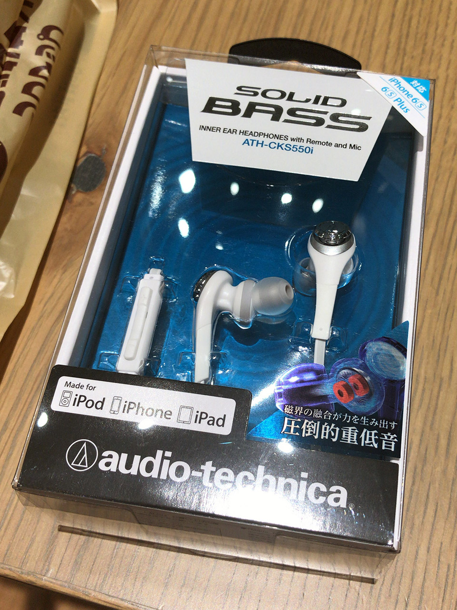
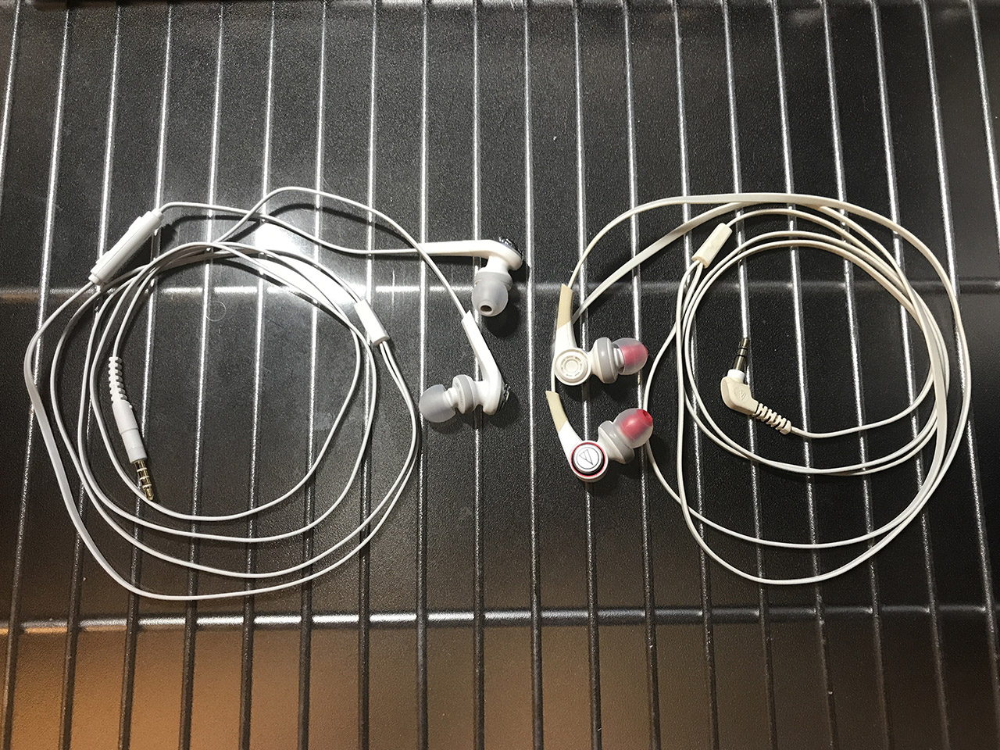

これまで使っていた _Audio Technica CKS770_ というカナル型のイヤホンが、今朝急に左側だけ音が出なくなってしまったので、その日のうちに __Audio Technica CKS550i__ という別のイヤホンを買ってきた。4200円程度だった。

僕は CKS770 以前も Audio Technica の Solid Bass シリーズのカナル型イヤホンを代々使ってきた。

今回も安定の Soild Bass シリーズである。大体いつも4・5000円程度の Solid Bass シリーズのイヤホンを適当に選んでいる。今回も性能面はそんなに差はない。

CKS770 はケーブルのシリコンの滑りが悪く、束ねているとケーブル同士が絡まって、凄く外れにくくて困っていた。今回買った CKS550i は、CKS770 よりはサラサラとした質感のケーブルで、もう少しほどけやすい感じ。

↑左が今回買った CKS550i、右がこれまで使っていた CKS770。

あと CKS550i の方は、右側のケーブルに音量調整ボタンが付いている。iPod や iPhone に対応しているようだ。地味に便利かも。

イヤホンジャック部分は、CKS770 は L 字だったが、CKS550i は I 字。この辺は使用している音楽プレイヤーの形状や好みに関わると思うので要注意か。僕は iPod nano 7G を使っていて、あまり気にならない。

よくよく見ると、CKS770 のホワイトな外見がだいぶ黄ばんでいる。いつ買ったかは忘れたがそれなりに長く使ったのだろう。引き続き Solid Bass シリーズを使っていく所存。
