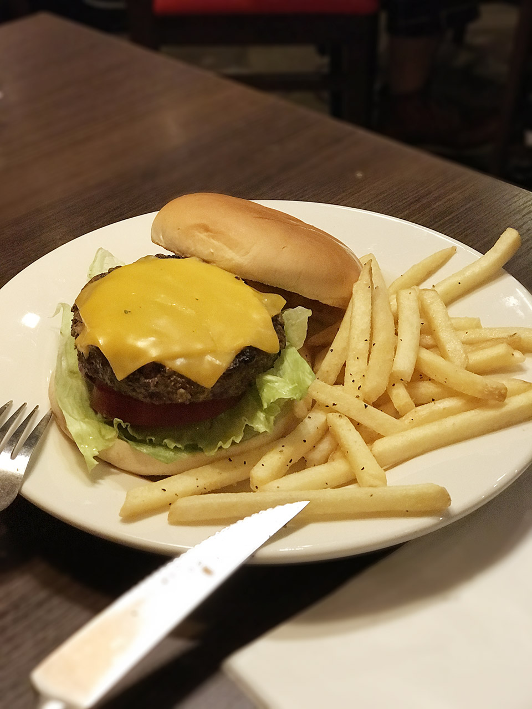
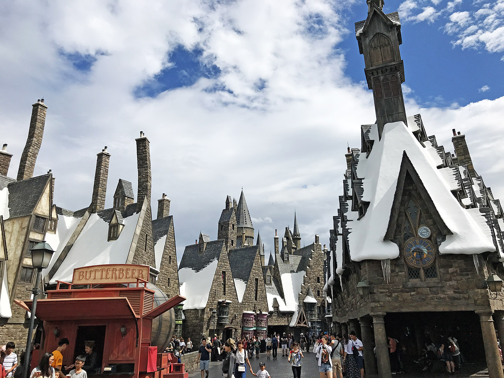
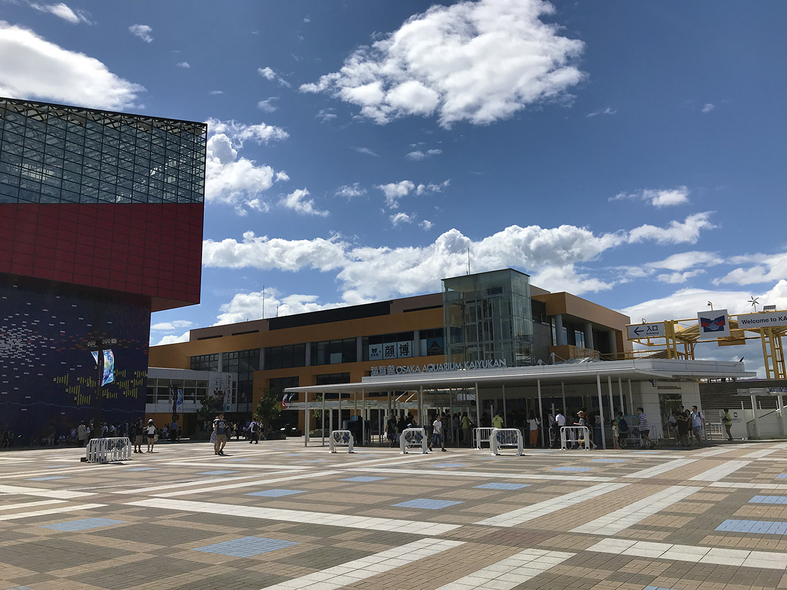
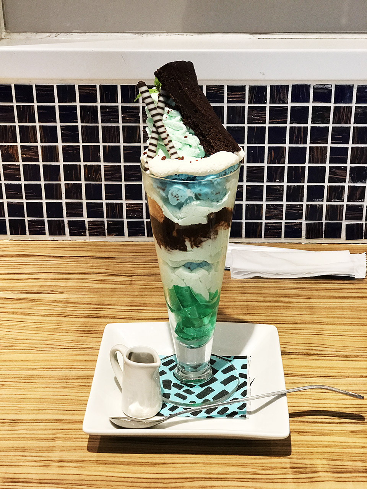
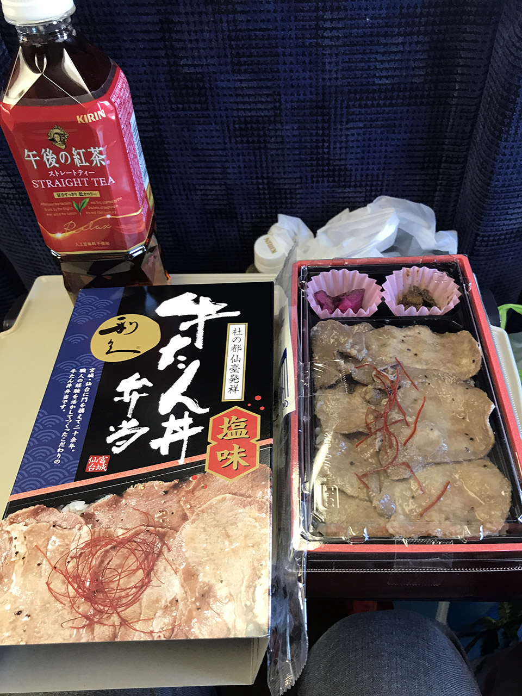

2018-07-28 から 2018-07-30 にかけて、妻と大阪に旅行してきた。

## 2018-07-28 (土)

ちょっとゆったり、昼頃出発。品川駅で駅弁を買い、新幹線に乗り込む。3列席だったが、残りの1席は最後まで誰も来なくて快適だった。

夕方、新大阪に到着。USJ 前の「ユニバーサルシティ駅」まで行くための電車の乗り方がよく分からずちょっと困ったが、ココは香港ではなく日本なので、日本語の標識もあるし聞けば分かると思えばなんともなかった。

新大阪から30分くらいでユニバーサルシティ駅に到着。駅を出てすぐのところにあるホテルにチェックインした。ホテル自体は USJ 開園当初からある、少し古くなってきたホテルで、部屋はまぁまぁ狭かった。

少し休憩して、荷物を置いて、大阪の街に繰り出してみた。地下鉄で「あべのハルカス」に行ってみたが、60階の展望台まで行くのは金がかかるので、16階の中庭からの風景で終わりにした。16階からの風景を見る限り、60階まで登ってもあんまり見るものなさそう。

他のフロアで夕飯の店を物色していたが、あまりしっくりこなくて止めた。心斎橋駅まで移動して、グリコの看板がある道頓堀付近をウロウロしてみた。写真は撮れたものの、やっぱりしっくりこなかった。妻は路上でカメラのレンズを落としてしまい、フィルタが割れてしまう有様。なんかしっくりこない。

ちょうど台風が近付いていた頃だったので、最終電車も早めに終わるということだったから、21時過ぎに断念してホテルに戻ることにした。駅前に TGI Fridays があったので、そこで飯を食った。念願の TGI でご満悦。

ガッツリ食べてホテルに戻り、なんとなく夜更かしして寝た。

## 2018-07-29 (日)

7時頃起床。8時半の開園に合わせ、USJ に入場。天気は晴れ。少し雲があるか。

最初に「ウィザーディングワールド・オブ・ハリーポッター」エリアに行き、ハリポタのライド「フォービドゥン・ジャーニー」に乗った。今となってはだいぶ幼い頃のダニエル・ラドクリフたちの映像が使われていたが、ぐわんぐわん動く筐体に、それを覆い隠すような大きな半球体のスクリーンに映る映像がマッチしていて、興奮と感動を覚える。ワォ。

ライドを降りると晴天になっていた。店を回ったり、バタービールを飲んだりした。

そこから園内を反時計回りに回った。ジョーズに乗り (ガイドの西尾さんナイス)、ウォーターワールドを見て (飛行機突っ込んで来なくなってた)、ジュラシックパークのエリアに入った。フライング・ダイナソーに乗ってめっちゃ興奮したものの、妻はボロ泣きでゲロを吐きかける事態に。

中華レストランで休憩しながら食事をとり (妻はどんなに具合が悪くても僕以上に飯を食う)、バックドラフトに参加。消防士の使命感に感動しつつ、映画の舞台裏も見られて楽しいよなコレ。

それからジュラシックパーク・ザ・ライドに乗り、カフェで一休み。急に大雨が降ったり、でもすぐに止んでド晴天になったりと、天気が安定しなかったものの、概ね晴れていた。

スパイダーマンに乗り、ターミネーター2 : 3D を見て (映像は1996年のものなのね)、ミニオンパークを物色して、アメリカンダイナーでまた休憩。

そろそろ夕方になってきたので、夜のパレードコースを確認して、コースの最後の方に通る公園の芝生に陣取って1時間ほど仮眠した。

ナイトパレードは面白かった。パレードコースのあちこちでプロジェクションマッピングを組み合わせた演出がなされていて、ハリポタ、トランスフォーマー、ジュラシックワールドなどが堪能できた。

最後にお土産を買い込んで22時に退園。タコ焼きを買うか悩んでいたら店が閉まってしまい、コンビニで夜食のおにぎりを買ってホテルに戻った。なんとなく夜更かしして寝た。

## 2018-07-30 (月)

10時にチェックアウト。台風は過ぎ去ってド晴天。昨夜買えなかったタコ焼きを買い食いし、ユニバーサルシティ駅付近から出ている船に乗って10分ちょっと、海遊館という水族館に行った。

平日ではあったが、夏休みだったためか、人でごった返していた。人のことを気にせず、我先にと押しのけて行くメンタルが必要。

階段はないが、スロープ状に上り下りしながら水槽の上から下まで眺められる作りで、水上にプカプカ浮いているアシカから、水中を泳ぐペンギン、水底で静かにしているサメまで見られた。楽しいのだが、車椅子の人はあの順路は大変かも〜。

かなり大きな施設で、昼過ぎまでたっぷり楽しめた。ラムネの乗ったソフトクリームを食べたが、外の暑さで一瞬で溶けた。

あまりに堪能しすぎて、大阪城に行こうかという計画は断念。梅田駅に行き、ブラザーズカフェでパフェを食べた。うまし。

何もしないにしては時間が余るが、何かするには時間が足りない状況だったので、モヤモヤとしながら新大阪駅へ。お土産を物色していたら激ウマな漬物屋を見つけて、トマトキムチとナスの漬物を購入。バリうまい。

18時頃に新幹線に乗る。1番席だったので先頭かな？と思っていたが、新幹線は上りと下りで180度向きを変えて運行するワケではなく、進行方向に合わせて座席のみをクルッと回転させていることを思い出す。案の定、乗り込んでみたら最前列ではなく最後尾だった。3列席で、隣に一人いたものの、買い込んでいたタコ焼きを食べ、牛タン弁当を食べ、寝まくって過ごした。

品川に着いたのは22時前。無事自宅に帰り、なんとなく夜更かしして寝た。

## 総評

昨年2017年は GW に香港へ海外旅行したが、今年は夏休みに大阪へ国内旅行と相成った。大阪は、言語が通じる安心感はあったものの、文化的にはほとんど異国だと思う。

エスカレーターは右側に並ぶし、エレベーターを乗り降りする時に「開く」ボタンを押さない奴が多い。列の並び方もなんか汚らしく、「我が我が」な世界。夢の国 USJ でも、「コレが売れてます」だの「私もこのパーカー買いました」だの、あきんど風情が過ぎる。京都に引っ越していた中学生時代を思い出したが、やはり関西の文化は慣れない。嫌い。

あと僕は、「少し疲れて腹が減るとかなり怒りっぽくなる」と分かった。些細なことでイライラしたり妻にきつくあたって喧嘩してしまったりして妻の迷惑になるので、旅行の時は僕だけでも食事の回数を増やして、空腹な状態を作らないようにしようと誓った。子供か俺は。

新幹線は思ったよりは快適に感じた。小さい頃は父が運転するクルマでしか旅行しなかったので、公共の乗り物が全般苦手なのだが、新幹線はそれなりに自由空間があってなんとかなった。隣や後ろの近い席で騒がしい奴がいると困るが、快適さは金で買うしかなかろう。

以上。天気にもなんとか恵まれ、のんびり楽しめた旅行だった。
