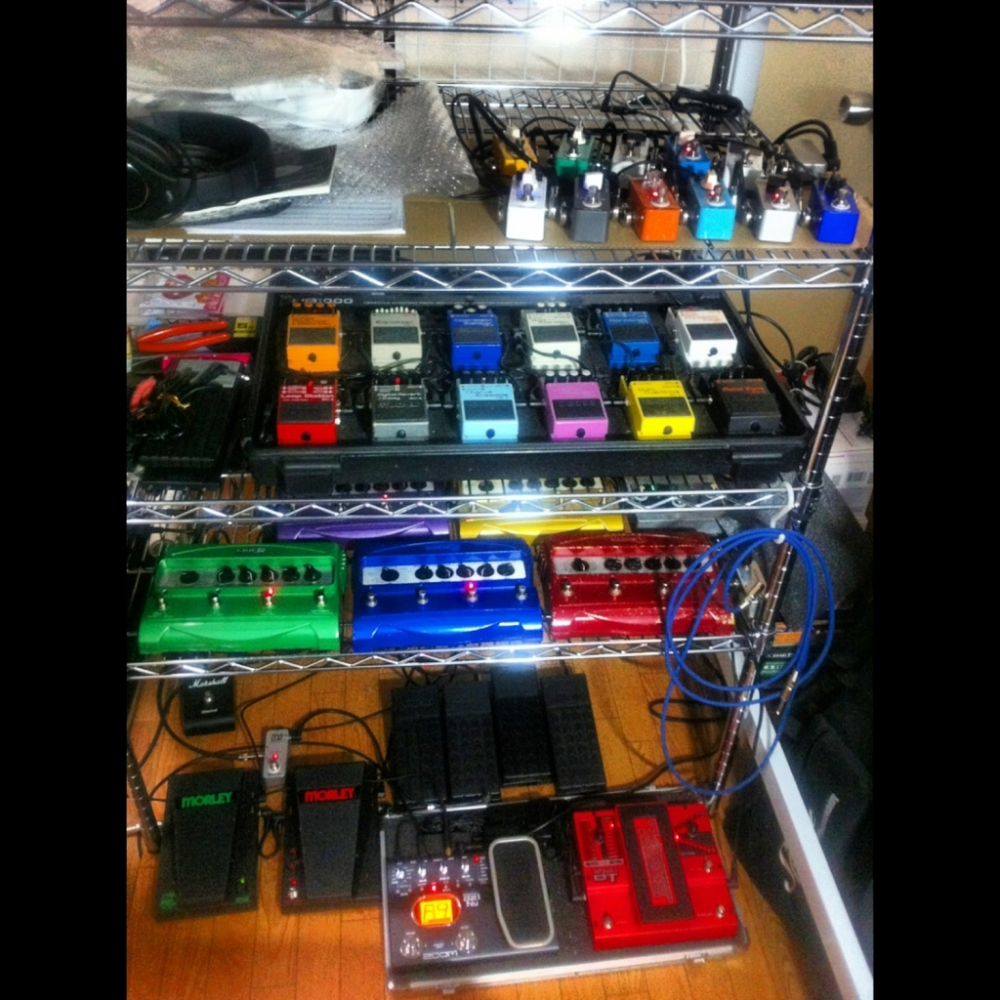

前回の記事に書いた「ミニマリズム 本当に大切なもの」を観て以来、ミニマリズムというものに興味が湧いてきた。

- [Netflix で「ミニマリズム 本当に大切なもの」を観た - El Mylar](http://neos21.hateblo.jp/entry/2018/09/14/193719)

僕はかなり幼い頃から、手持ちは少なく、__できるだけ手ブラで過ごしたい性__だったので、ミニマリストのシンプルな生活は心地よさそうだなぁと思う。

しかし同時に、僕は元来神経質で心配性で、_同じものは最低2つ用意しておかないと心配_だったりする。最近は「最悪近くのコンビニで買えばなんとかなる」と思えるようになったので、ある程度モノを減らせているが、酷いときは折りたたみ傘を2つ持ち歩いたりしていた。

また、自分にはその時々で_コレクション癖_があるので、小さい頃はポケモンカード、大学時代はギターとエフェクターなどを集めまくっていて、家の中はそれなりに物がある。

↑ 収集癖の例 (全部ギターエフェクター・直列繋ぎ)

そんなワケで、手持ちは減らしたいのに「あれも要るかも」「万が一に備えて…」などといって色々携帯しようとしてしまい、家の中も買うだけ買って使わなくなったモノが比較的多い。

その矢先に先述の「ミニマリズム」を観たので、ここはひとつ断捨離や、と奮起し始めた次第。

---

しかし、自分みたいな「スペアがないと心配な人」がミニマリストとして生きるのって、どうしたらいいんだろうか。モノを持たないことで迷いも少なくなり、思考もシンプルに保てる面は分かるのだが、モノを減らすために集約させた「多機能財布」を万が一なくしたらどうするんだろう？とか、カバンを1つにしてそれが出先で壊れたら翌日使えないしどうしたら？とか心配になる。その時その時で書い直せばいいのかもしれないが、「もしこんなことが起こったら…」という不安を常に抱えながら生活することになりそうで、そこをうまく解決したい。

収集癖に関しては、最近はだいぶ落ち着いてきたので新たに集めることはないが、自分の中でキレイに集めきったモノたちを手放すのが惜しい。かといってそれらを毎日眺めていたり使っていたりするワケではないので、こういう所有欲に縛られた考え方は良くないよなぁと思っているのだが、なんだか…。

ココらへん、考え方と、収納的な意味でのまとめ方にかかってくると思うので、世のミニマリストたちから思想やノウハウを集めて、自分なりにまとまった生活にしたいなと思う。
