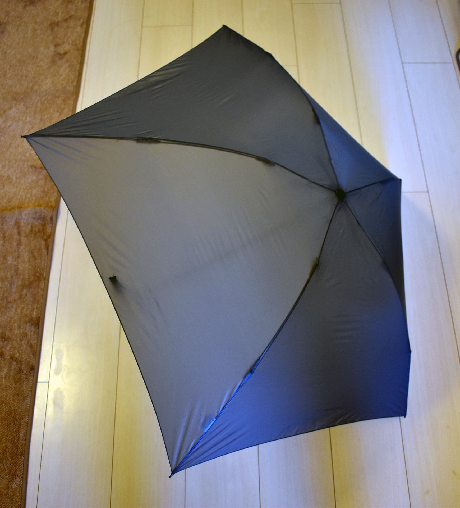
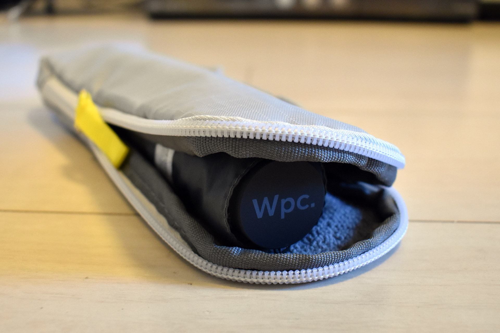

普段、通勤用のリュック_「Aer Flight Pack」_に、折りたたみのジャンプ傘を入れっぱなしにしている。

- [ジムに行こうと思って通勤にも使えるビジネスリュックを新調した - El Mylar](http://neos21.hateblo.jp/entry/2018/04/26/113000)

確かドンキホーテで買ったこの折りたたみ傘、開いた時の幅が広く、ワンタッチで開くので重宝しているものの、雨が少ない時期は連日持ち運んでいるだけで、その重さが気になってくる。自宅から職場までの間で傘をさす時間なんて10分ちょっとぐらいしかないし、その間の雨さえ防げれば良いなら、_折りたたみ傘はもっと小さくて簡素なモノでもいいのかな_、と思うようになってきた。

そんな折、どこかのブログで__「重さ 76g の折りたたみ傘がある」__という話を仕入れた。ちょっと雨をしのぐぐらいなら使えそうだと思い、買ってみることにした。Amazon にも売っていたが、たまたまロフトを見ていた時に雨にふられ、その場で傘が必要になったので、ロフトで購入して、その傘をさして帰ってきた。w

商品名は__「w.p.c. Super Air-Light」__。幅は 50cm のタイプと 55cm のタイプと2種類あり、50cm タイプが重さ 70g、55cm タイプが 76g ということだった。さすがに 50cm だと男性には小さいので、_幅 55cm・重さ 76g_ のタイプの、グレーのヤツを買った。

嘘みたいな軽さだが、開いてみれば普通に折りたたみ傘だ。普通に使える。さすがに骨組みが細く、台風が近付いてきた時のような強風だと、あおられて折れそうに感じるので故障が怖いが、小雨が降ってきた中でちょっとさすぐらいの用途なら十分使える。

↑ 開いてみた感じの様子。

↑ 骨組み中央部分のアップ。ワンタッチで開くジャンプ傘ではないが、この細さにしてはちゃんとした作り。

妻の勧めで、ついでに折りたたみ傘の水滴を吸い取ってくれるケースも買うことにした。たまたまピッタリのサイズのモノがあり、ケースも軽量で良かった。

↑ 中は水滴を吸収してくれる素材。

↑ サイズピッタリ！

↑ iPhone7Plus と比較。なんとコンパクトなんだろう…！

コレならカバンに入れっぱなしにしていても全くその存在を感じず、大概の雨になら対応できる、素晴らしい商品だ。
