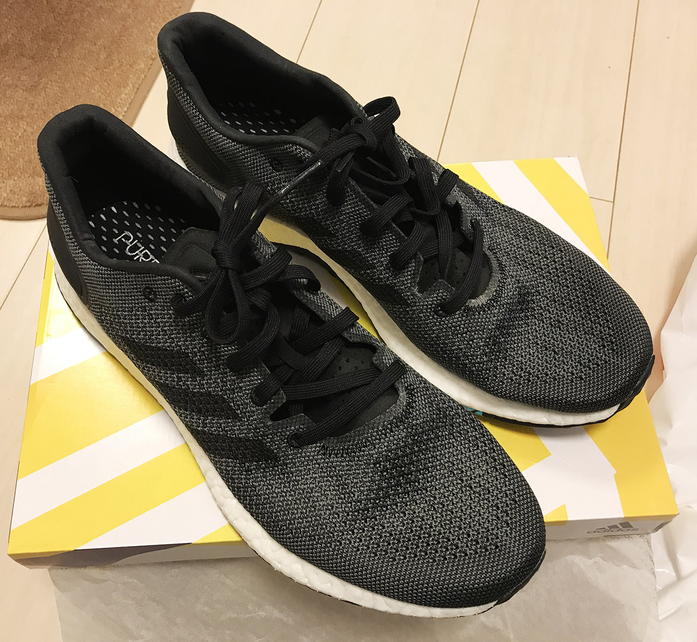
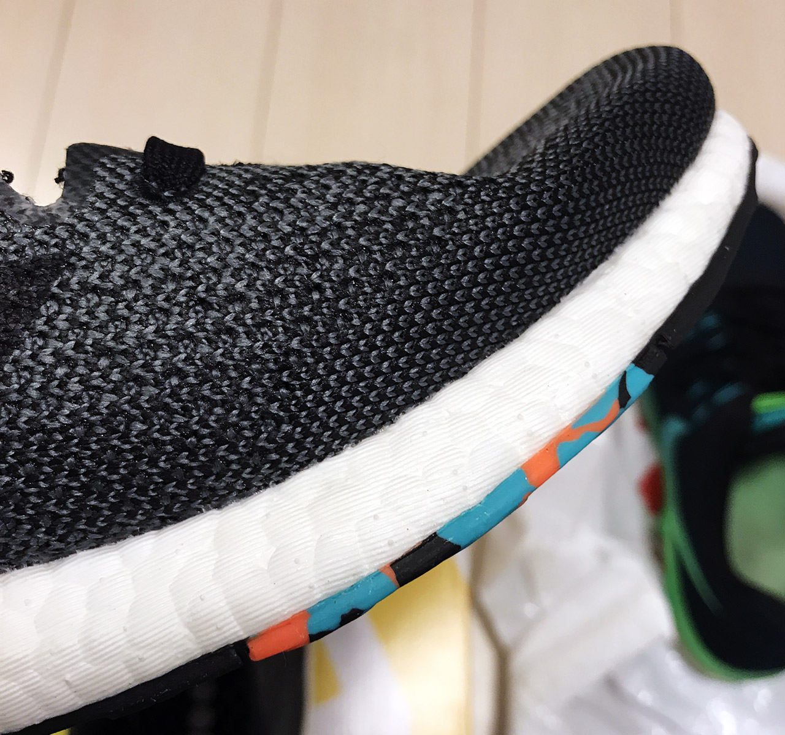
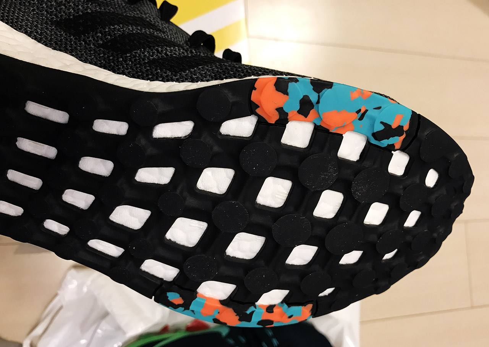
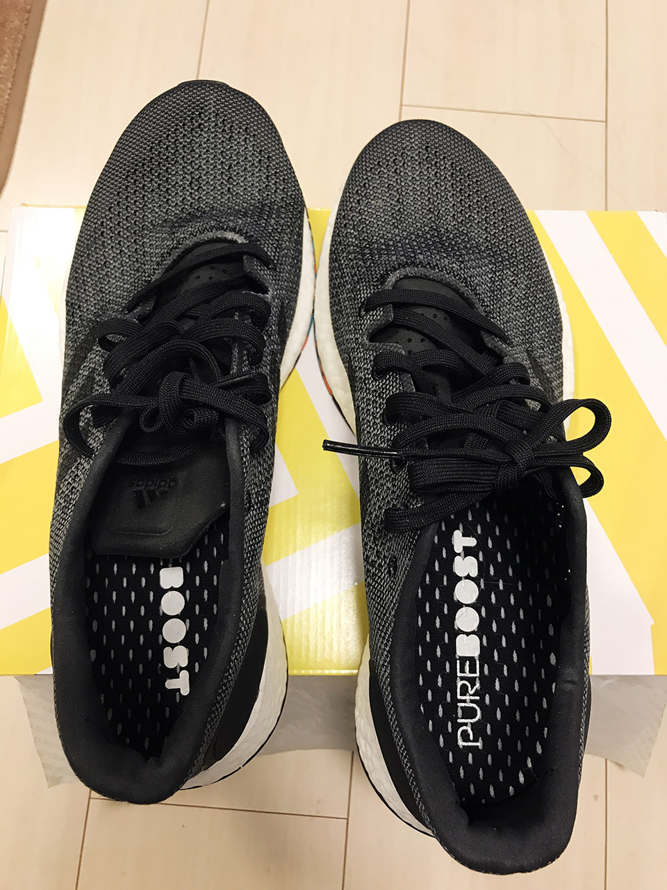

3年ほど履いていたアディダスのスニーカーがいい加減汚くなってきたので、買い換えることにした。

今回買ったのは__「Pure Boost DPR」__というヤツで、どんな服にも合わせやすいグレーカラー。

外反母趾の位置ぐらいに、オレンジと青緑のアクセントカラーが入っている。コレ、なんかガム踏んだみたいで嫌なんだけど…。他にカラーがなかったので妥協した。

履き心地は「いつものアディダスの_ブースト_」って感じで、安定。「ブースト」ってのは白い発泡スチロールみたいな靴底の素材のことで、ココのクッションが好きでアディダスを履いている。

この Pure Boost は若干ランニング向けだが、普段履きもできる感じで良い。
