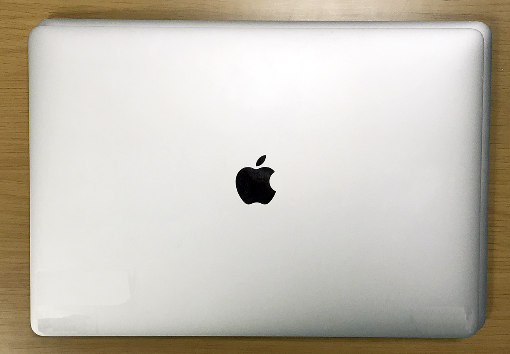
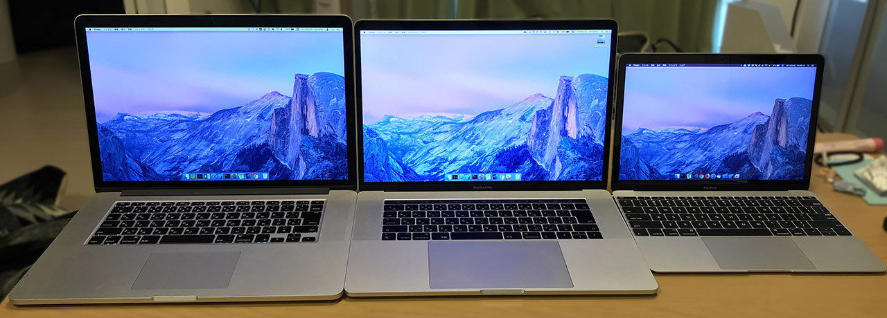
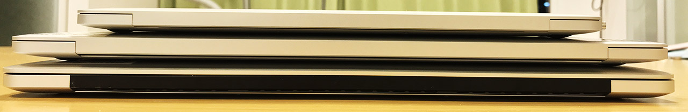

久々の MacBook 外観比較シリーズ。

今回は主に15インチ MacBookPro の新旧モデルを比較してみる。

## 目次

## 比較する機種

今回比較する機種は以下のとおり。

- MacBookPro 15-Inch 2017 (TouchBar)
- MacBookPro 15-Inch 2013
- MacBook 12-Inch 2017

2013年モデルの MacBookPro は2015年モデルまでとほぼ同じ外観だし、2017年モデルは2016年から現行の2018年モデルまでほぼ同じ外観なので、外観に関しては「2015 vs 2016」とも「2015 vs 2018」とも表現できるだろうか。

15インチの2台は借り物だが、サイズの比較用に手持ちの12インチ MacBook も並べた次第。

## さっそく比較

↑コレが2017年モデルの15インチ MacBookPro。TouchBar モデルである。

↑左が2013年モデル、右が2017年モデル。幅・奥行きのサイズ感は一回り小さくなったくらいだが、トラックパッドがかなり大きくなっている。

↑両方 JIS 配列。いわゆる平たい「ペチペチ」キーボードのモデルになってからは、左右の矢印キーが大きめに作られている。

↑向かい合わせてみた。左が2013年・右が2017年。

↑2013年の JIS キーボード。

↑2017年の JIS キーボード。

↑Touch Bar。Esc キーまでタッチディスプレイになっていて押しづらい。

↑さらに重ねてみた。2017年モデルの方が若干小さくなっているが、サイズ感はそこまで変わりない。

↑幅・奥行きの差が分かるよう右上の辺にズーム。

## AC アダプタも USB-C 化

AC アダプタも、見た目のサイズは同じようなモノだが、USB-C ケーブルで接続できるモノになっている。

↑左が2013年モデルに付属の MagSafe2。右が2017年モデルに付属の USB-C タイプ。ケーブルを巻き取って引っ掛ける「ツメ」がなくなっている。

↑上が2017年モデルの方。USB PD (急速充電) の表記が見える。

↑ついでに12インチ MacBook 向けの AC 電源と比較してみた。Pro 用は大きい。

## 12インチ MacBook も並べてみる

12インチ MacBook も並べて、3台で比較。

↑左から、2013年・2017年・12インチ。

↑左上が2013年・右上が2017年・右下が12インチ。

↑3台重ねた感じ。

↑左側面。2013年モデルは MagSafe2 と USB-A、Thunderbolt2 端子などがある。

↑右側面。2013年モデルは USB-A と HDMI 端子がある。2017年モデルは TouchBar モデルなので、左右に USB-C ポートが2つずつ。

↑正面の切り欠きは12インチモデルが一番大きく取られている。

↑後ろ。2013年モデルは下部がアルミではない。

## 12インチモデルとの比較

↑2013年モデルと12インチ。

↑2017年モデルと12インチ。

## カタログ比較

写真は以上。Apple 公式の技術仕様へのリンクを載せておく。

- [MacBook Pro (Retina, 15-inch, Late 2013) - 技術仕様](https://support.apple.com/kb/SP690?locale=ja_JP)
- [MacBook Pro (15-inch, 2017) - 技術仕様](https://support.apple.com/kb/SP756?locale=ja_JP)

2013年モデルは Core i7・8GB RAM・256GB SSD。2017年モデルは Core i7・16GB RAM・512GB SSD。それぞれ世代が全然違うので、ベンチマークをとったら性能差が分かるのかもしれないが、体感上は2013年モデルでも全然性能差を感じない。フロントエンド開発程度であれば、2013年モデルぐらいのスペックでも十分戦えるということだろう。

重量は 2.02kg と 1.83kg。体感の重さはほとんど差はない。どちらも手に持つとずっしりくる。外寸も最大で1センチ程度しか差がないので、よほどスペックに拘りがない限りは、旧モデルでも「体感的には」そう変わらないと思う。旧モデルが安く手に入るならアリだと思う。

キーボードも、なんだかんだいって2015年モデルまでのキーボードの方が、打ち心地が良い。2016年以降のキーボードは指に直接衝撃が伝わってくる感じがあって、ハードパンチャーは指を痛めるかも。

というワケで、外観比較は以上。やっぱり軽くて優秀な12インチ MacBook が優勝ってことですね！(ぉ
