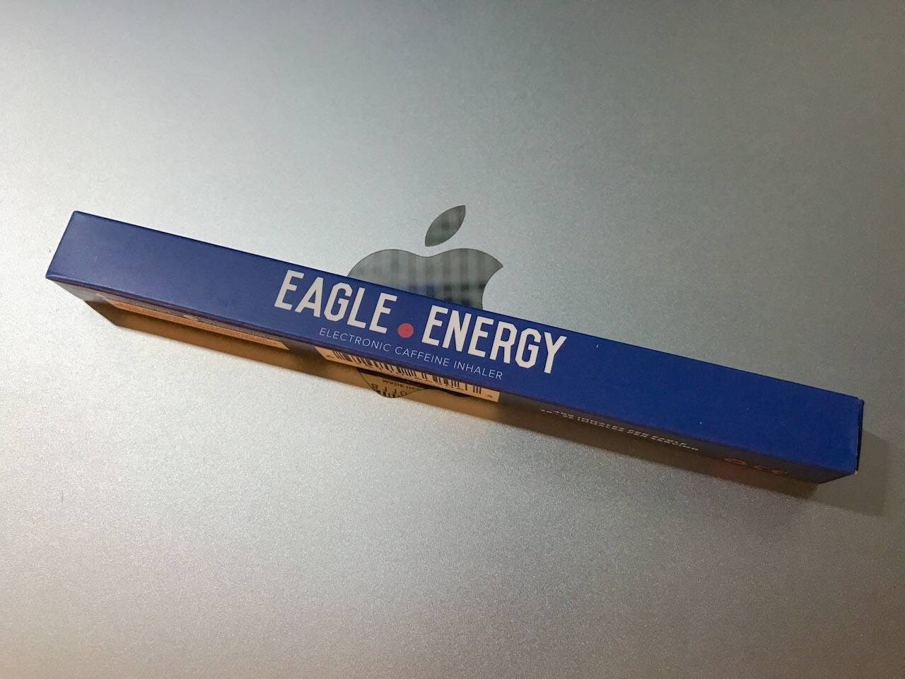
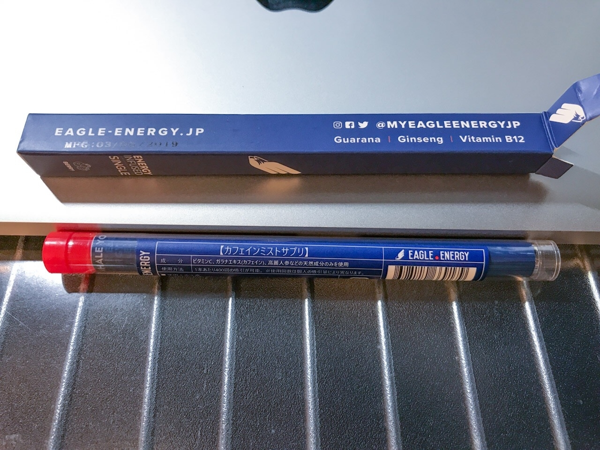

ある時ネットサーフィンをしていると、_「吸うエナジードリンク」_なる単語が目に入った。__Eagle Energy (イーグル・エナジー)__ という商品で、タバコのように吸うと、ガラナエキスやカフェインが吸引できて、10～20回吸うとエナジードリンク1杯分の効果が得られるんだとか。

僕はこのところ、ほとんど毎日__「モンスター・エナジー・キューバ・リブレ」__を飲んでいて、カフェインやアルギニンの効果が薄れてきていた。同時に糖質も摂りすぎている気がしていたので、タバコの要領で座席を離れる口実を作り、さらに糖質を摂ることなくエナジードリンク成分が得られれば、もう少し健康的に元気になれるのではないか、と考えた。

というワケで早速イーグル・エナジーの「エナジー・ドリンク・フレーバー」を購入。_1本で1500円程度_だった。

値段について計算してみるが、10～20回吸うとエナドリ1本分に相当するということなので、1度あたり15回吸うとして、1日に2度吸ったら30回の吸引。_1本あたりは400回程度吸える_らしいので、1本で14日近く持つ計算だ。ということは、1日換算で100円ちょっと、ということになる。1本2・300円するエナドリを買うよりは安く済みそうなので、今回試してみた次第。

イーグル・エナジーは吸引し始めると LED が光って、水蒸気が吸引できるようになる。「煙」ではなく「水蒸気」で、ニコチンなどの有害成分は含まれていないので、原理からするとタバコのような有害性はないのだが、この水蒸気の量が結構多い。部屋がしばらくモクモクする。_吸う場所はやはり喫煙所になってしまいそうだ。_

味については、わずかにエナジー・ドリンク系の風味がするかな？程度。口の中には味らしい味は残らないが、吐き出した水蒸気の方が匂いとしては残る感じ。部屋の中で吸うとこの香りも残るので注意。吸っている本人は嗅覚・味覚がおかしくなっていてあまり匂いを感じないが、周りの人からするとあま～～い香りがする。

肝心の__エナドリ効果__の程だが、コレは__正直微妙。__イーグル・エナジーを吸う代わりにエナジードリンクは断っているのだが、コレによって眠気が覚めたとかいう感覚はあまりない。レッドブルを初めて飲んだ時のような覚醒感もない。せいぜい「眠気はあるが妙に眠れない感じ」ぐらいまでの効果かなぁと思う。イーグル・エナジーのおかげでシャキッとしたワケではなく、イーグル・エナジーを吸うために喫煙所まで外出していることが気分転換になっている疑惑だ。

そもそも僕がエナジードリンクを飲んでいたのも、炭酸と味が好きなだけだ。眠気を押し殺してまで仕事に追われているワケでもなく、飲まなくなったからといってあまり変化を感じてはいない。時にはエナドリも飲まず Eagle Energy も吸わない日もあったりしたが、特に変化を感じなかったり。

そんなワケで、効果はイマイチ感じなかったのが残念だけど、効果ゼロではなさそうだし、「タバコは嫌いだけど喫煙を口実に休憩したい」という人にはちょうど良いかもしれない。

僕が買ったのは「エナジー・ドリンク・フレーバー」だったが、「ライチミント」味や「ブルーベリースーパーミント」味などもあるので、イーグル・エナジーで__「煙を吸う」という楽しみを健康的に味わう__のも良いだろう。
