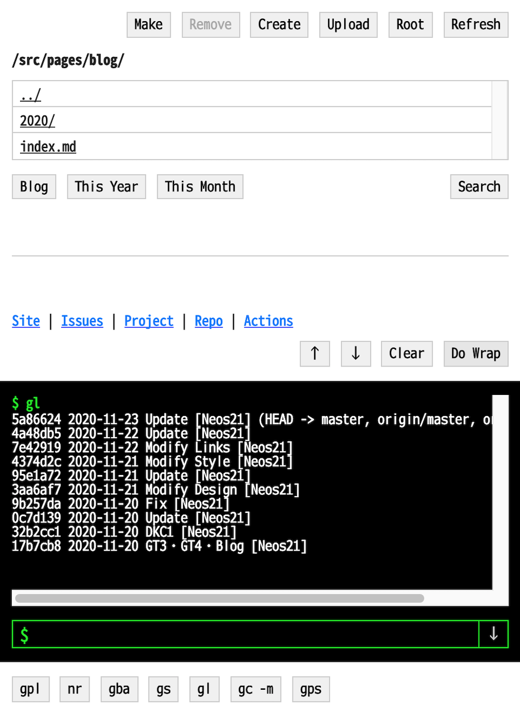
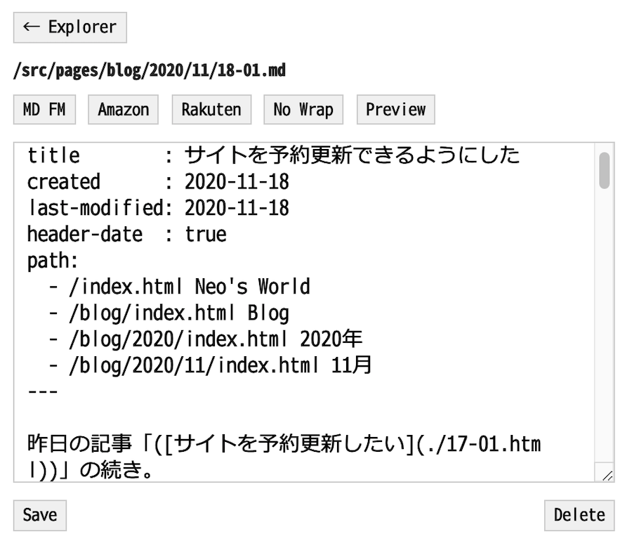

このサイトをどのように構築しているのか、その裏側を紹介します。


## 目次


## サーバ・インフラ

### ホスティングスペース : GitHub Pages

このサイトのホスティングスペースは、2002年の開設当初から2020年までは、[XREA](https://www.xrea.com/) を使用していた。当時使ってきた URL は `neo.s21.xrea.com`。長らく広告付きの無料プランで利用してきたが、2020年11月に独自ドメインを取得したことに伴い、有料プランの XREA Plus を契約して広告を外した。

- アカウントを取得した当時の XREA にはユーザフォーラムがあって、内容が優れているサイトだと特別に無料プランのまま広告を外させてもらえる仕組みがあったりしたのだが、GMO グループの傘下に入ってからはそうした仕組みもなくなってしまった…

2021年に XREA Plus の契約更新を止め、ホスティング先も XREA から GitHub Pages に変更した。生の URL は <https://neos21.github.io/neos21.net/> となり、コレに独自ドメインを割り当てている。

### 独自ドメイン : Value-Domain

このサイトの独自ドメイン `neos21.net` は、[Value-Domain](https://www.value-domain.com/) で2020年11月に取得した。XREA でホスティングしている場合は、XREA との親和性が高く、設定が楽なので助かっている。

API 経由での操作ができないので、AWS などイマドキのクラウドベンダでの作業に慣れている人はちょっと辛いかも。自分はこのサイトを一発設定したら普段イジることはないので、コレでも問題ない。

### SSL : GitHub Pages 提供

XREA でホスティングしていた時代は、XREA が提供していた無料 SSL 機能を利用して HTTPS 化していた。実体は Let's Encrypt みたいなのだが、更新が自動的に行われるので楽できた。

GitHub Pages でホスティングしている2022年現在は、同じく GitHub Pages が提供する SSL 機能で HTTPS 化している。


## ソース管理 : GitHub

以上でサーバ周りの話は終わり。以降はこのサイトの HTML ソースがどのように出来上がっていくかの説明となる。

ソースコードは全て [GitHub](https://github.com/Neos21) で管理している。

- [GitHub - Neos21/neos21.net : Repository of Neo's World](https://github.com/Neos21/neos21.net)


## パッケージ管理 : npm

自分は JavaScript が得意なので、サイトをビルドするための実装言語には Node.js を採用している。外部パッケージの利用もあるので、npm (`package.json`) で管理している。


## スタイリング : Neo's Normalize

サイトのスタイリングには、拙作の [Neo's Normalize](https://neos21.github.io/neos-normalize/) を利用している。Normalize.css や Bootstrap4 Reboot の思想に影響を受けて作った、オレオレ・ノーマライズだ。CSS 変数を駆使して調整しているので、このサイト用に CSS 変数値を差し替えることで大まかな調整が効くようにしている。

CSS のビルドには `clean-css-cli` を使用している。SCSS はもう使用していない。


## HTML ビルド

このサイトの HTML ページは、独自のビルドシステムによりビルドされて、最終的な HTML ファイルに変換されている。

### Front Matter 入り HTML

このサイトの元の HTML ファイルは、次のように書かれている。

```html
---
title        : Neo's World
created      : 2002-10-09
last-modified: 2020-11-20
toc          : false
path:
  - /index.html Neo's World
---

<h2>こんにちは世界</h2>
```

ファイル先頭には [Front Matter](https://middlemanapp.com/jp/basics/frontmatter/)・つまり YAML の形式で、そのページのタイトルや更新日など、各種メタデータを記述している。ページ本文にあたる部分はその下に書いているが、`html`・`head`・`body` 要素などは書かれていない。

### Front Matter の抽出

Front Matter 部分のデータは、正規表現でキャプチャして `yaml` パッケージで取得している。ココで取得したデータを、後でテンプレート HTML に埋め込んでいる。

### Rehype によるドキュメント加工

HTML ソースの一部を自動一括処理するために、[Rehype](https://github.com/rehypejs) というパッケージ群を利用している。コレは HTML ソースを AST (抽象構文木) に変換できるモノで、抽象構文木に落とし込むことで、色々な処理を行いやすくなるのだ。

コレを使って Front Matter 部分を抽出したり、見出し要素に `id` 属性を自動付与したりしている。具体的に使用しているパッケージは次のとおり。

- `rehype-parse` : HTML ソースファイルを読み込み AST (hast) にする
- `rehype-slug` : 見出しに ID 属性値を付ける
- `rehype-toc` : ページ中の見出しを拾い上げて目次 (Table of Contents) を作成する
- `rehype-autolink-headlngs` : 見出しの前後に、その見出しへのハッシュリンクを追加する
  - このサイトだと、見出しの左側に薄い `$` ドルマークがあると思うが、コレ
- `@neos21/rehype-prism` : コードブロックに Prism.js を用いたシンタックスハイライトを効かせる
- `rehype-stringify` : hast を HTML ソースに戻す
- `rehype-format` : HTML ソースを整形出力する

こんな感じ。見出しやシンタックスハイライト周りを自動で処理できるのは嬉しい。

### テンプレート HTML

ページ全体を構成する*テンプレート HTML* ファイルがあって、コレにはいくつかのプレースホルダ文字列が埋め込まれている。

```html
<!-- テンプレート HTML 抜粋 -->

<!DOCTYPE html>
<html lang="ja">
  <head>
    <meta charset="UTF-8">
    <meta name="viewport" content="width=device-width, initial-scale=1">
    <title>{{ page-title }}</title>
    <link rel="icon" href="/favicon.ico">
    <link rel="stylesheet" href="/styles.css">
  </head>
  <body>
    <div id="container">
      <header id="header">
        <div id="site-title"><a href="/index.html">Neo's World</a></div>
      </header>
      <main id="main">
        {{ date }}
        <h1 id="page-title">{{ title }}</h1>
{{ contents }}
      </main>
```

こんな感じだ。`{{ page-title }}` とか `{{ contents }}` とかの部分を抽出して、JavaScript の `.replace()` 関数を使って各ページ用のデータを入れている。

当初は Fork して作った [@neos21/template-html](https://github.com/Neos21/template-html) パッケージを使っていたが、現在は完全に独自で `replace()` 関数を書いている。

先程抽出した Front Matter の内容や、それ以外の HTML ソース部分をガンガン当てはめて置換している。


## Markdown ビルド

このサイトは上述のような「Front Matter 入り HTML」だけでなく、**Markdown 形式でページを作っても HTML ソースの場合と同じ結果が出力できるように**ビルドシステムを組んでいる。

テンプレート HTML ファイルは前述のモノと同じテンプレートを使っている。

### Front Matter 入り Markdown

Markdown 形式でページを作る場合は、次のような Markdown ファイルを作る。

```markdown
---
title        : このサイトに使われている技術
created      : 2020-11-23
last-modified: 2020-11-23
path:
  - /index.html Neo's World
  - /tech/index.html Tech
---

## こんにちは世界
```

コチラも HTML の場合と同様、Front Matter が冒頭にあり、コンテンツは Markdown 形式で書いている。

サイト内の相対リンクについては置換処理が入っていないので、Markdown の `example.md` ファイルを作ってページをこしらえても、そのページにリンクする時は

```html
<a href="./example.html">リンク</a>
```

ないしは

```markdown
[リンク](./example.html)
```

というように、拡張子を `.md` ではなく `.html` で実装しておく必要がある。最終的にビルドされた後にどういうリンクになるかを少し想像する必要がある。

### Remark による HTML 変換

Markdown から HTML への変換には、[Remark](https://github.com/remarkjs) というパッケージ群を利用している。具体的に使用しているのは以下のとおり。

- `remark-parse` : Markdown テキストから mdast (AST) に変換する
- `remark-frontmatter` : Front Matter 部分を抽出する
- `remark-extract-frontmatter` : Front Matter 部分の情報を `yaml` パッケージでパースして連想配列として取得する
- `remark-slug` : 見出しに `id` 属性を付与する
- `remark-toc` : 目次 (Table of Contents) を作成する
- `remark-rehype` : mdast から hast (HTML AST) に変換する
  - 以降は先程も登場したプラグイン
- `rehype-autolink-headings` : 見出しにハッシュリンクを追加する
- `@neos21/rehype-prism` : シンタックスハイライトを効かせる
- `rehype-stringify` : hast を HTML ソースに戻す
- `rehype-format` : HTML ソースを整形出力する

`remark-parse` は v9.0.0 以降は Pedantic モードが廃止されている。Pedantic モードというのは、簡単に言えば「アンダースコアでも強調構文が使える」モードなのだが、バグが多いため廃止されたという。自分は「はてなブログ」で執筆してきた期間が長く、アスタリスクでの強調よりもアンダースコアでの強調の方が馴染みがあるので、あえて *Pedantic モードでパースしてくれる v8.0.3* という一つ古いバージョンの `remark-parse` を使っている。

HTML の場合は正規表現で抽出した Front Matter だが、Markdown の場合は `remark-extract-frontmatter` という専用のプラグインがあるので、コレを使った。

HTML の場合は `rehype-slug`・`rehype-toc` を使って見出しと目次を処理したが、Markdown の場合は mdast (HTML に変換する前) の時点で処理するため、`remark-slug`・`remark-toc` という別のパッケージを使っている。結果はほぼほぼ同じになる。

HTML に変換した後は、HTML ソースをビルドする場合と同じプラグインを噛ませて処理してやることで、Markdown をベースにビルドしても、ほとんど同じ結果を実現している。


## ブログ部分の工夫

このサイトの [Blog](/blog/index.html) 部分は、前述の「Markdown ビルド」の仕組みで実現している。いわゆる SSG、静的サイトジェネレータによる静的なブログである。

ブログらしい見た目にするために、最新の記事を数件配置したり、指定年月の記事一覧を表示したりする仕組みを作っている。

今度はテンプレート HTML 側でなく、ソースの Markdown ファイル側に、専用のプレースホルダ文字列を用意しておく。コレを見付け次第、Node.js の `fs` でひたすらディレクトリ配下の Markdown ファイルを取得して、記事一覧のリストやリンクを組み立てている。


## (過去情報) GitHub Actions による自動 FTP アップロード

<ins class="ins-block">

XREA サーバでホスティングしていた時代は、以下のような方法で GitHub Actions から FTP 転送をしていた。

GitHub Pages でホスティングしている現在は、コミットの度に全量ビルドされると時間がかかるので、差分ビルドするための仕組みをコネコネしてはいるものの、基本的には GitHub Pages への通常のデプロイと同じ手順を取っている。

</ins>

XREA サーバにファイルを配備するには、FTP 転送が必要になる。そこで、[GitHub Actions](https://github.com/Neos21/neos21.net/actions) を使って、`master` ブランチにコミットされたファイルをビルドし、 FTP アップロードするように設定している。

コミットされたファイルを特定するには、[jitterbit/get-changed-files@v1](https://github.com/jitterbit/get-changed-files) という Action を使っている。コレで取得したファイルをビルドして、FTP アップロードしている。

FTP アップロードには [ftp-client](https://www.npmjs.com/package/ftp-client) というパッケージを使っている。このパッケージの注意点は、新規ディレクトリを自動的には作ってくれないので、`new-directory/new-file.html` をアップロードしようと思ったら、アップロード対象ファイルの配列にディレクトリ名も入れてやる必要がある。

```javascript
const uploadFiles = ['new-directory', 'new-directory/new-file.html'];
```

こういう感じだ。


## 予約投稿を実現する仕組み

先程、「`master` ブランチにコミットされたファイルをアップロードしている」と書いたが、ブログの予約投稿を実現するために、一工夫入れている。

各ソースファイルには「初版作成日 (Created)」と「最終更新日 (Last-Modified)」を記す Front Matter を用意している。この情報を参照して、**ビルド処理を実行している日よりも未来日のファイルについては、コミットされてもアップロードの対象外にしている**のだ。

この仕組みは随所に登場している。

- ブログの記事一覧を生成する際、その記事の「作成日」を見て、未来日ならリストに含めないよう処理していたり
- トップページの「更新履歴」の内容を管理する YAML ファイルの日付を見て、予約更新しようとしている「更新履歴」の内容を表示しないようにしていたり

サイトのソースコードを Git 管理するなら、予約投稿したい内容を別ブランチに分けたらどうか、とも思ったのだが、マージ時にコンフリクトがあると面倒なので、基本は `master` ブランチに思い立った時に放り込んで、良き時にアップロードするように考えた。

そして、自動的に予約投稿するために、毎日定時に実行される GitHub Actions を用意した。コレは、前述の「初版作成日」や「最終更新日」が当日を迎えたファイルを抽出し、そのファイルをビルド・アップロードするスクリプトだ。


## Atom フィードのビルド

このサイトでは Atom フィードを配信している。コレも GitHub Actions でビルドし、サイトにアップロードしている。

Atom フィードも当然、前述の「予約投稿を実現する仕組み」を使って、まだ公開するつもりのない未来日の情報は含めないようにしている。

フィードファイルの構築方法は、HTML や Markdown のビルドでもやったように、プレースホルダを用意したテンプレートファイルに、`replace()` で愚直に置換して挿入している。

毎日実行される GitHub Actions で、更新されるファイルがあればフィードもビルドし、アップロードしている。


## サイトマップのビルド

このドメイン配下のページ一覧となる、サイトマップ XML もビルドしている。コチラも、初版作成日が未来日のファイルは除外するようにしている。


## ただひたすらに Node.js スクリプトを実装

Markdown のパースなど、一部処理は外部パッケージを利用しているが、基本的には Node.js 組み込みの `fs` パッケージでファイルを取得・更新しまくっているだけ。どのように変換するかは、独自に定めたプレースホルダを正規表現で特定して `replace()` 関数でゴリゴリ書き換えているだけ。

元々は `replace()` 関数の第2引数に指定できる関数が、非同期処理に対応していなかったためなのだが、`fs` パッケージの同期関数を多用している。`fs.readFileSync()` だったり、`fs.writeFileSync()` だったり。

しかし、Node.js や JavaScript はシングルスレッドで動作するので、変に `async`・`await` を使って非同期化しようとするとかえって動作が遅くなるらしく、大量ファイルを同期関数で処理していても非同期関数で書いたときよりも速く動作している。


## どこからでもサイトを更新できるオンライン・エディタ

このサイトをビルドするための技術は以上だが、ココからは番外編。

GitHub Actions などで自動アップロードしている都合上、GitHub に Push できる環境でないと、サイト更新が難しい。すなわち、Git リポジトリをクローンして操作できる、PC 環境がほとんど必須なのだ。

そうすると、スマホなんかでササッと記事だけ書いてアップロード、というような、CMS 的なことはできない。

そこで、[Oracle Cloud Infrastructure](https://www.oracle.com/jp/cloud/) で借りられる、永久無料の IaaS VM 上に、専用のウェブアプリを配備した。

このウェブアプリは [simple-git](https://github.com/steveukx/git-js) という npm パッケージを利用して、このサイトの GitHub リポジトリを OCI VM 上にクローンしてある。そして、指定のファイルの内容を編集し、その内容をコミット・Push できるオンライン・エディタを作ったのだ。



↑ 実際のウェブアプリ画面。ファイルを選択できるエクスプローラと、下部にターミナルコンソールが用意されている。

ターミナルは、フォームに入力したコマンドがそのまま、Express を経由して `child_process.exec()` に渡されて、実際にコマンドがサーバ上で動作している。

技術上はこのように可能だが、メチャクチャ危険な行為なので、安易に真似しないように。自分の場合はサイトへのアクセス制限をかけたり、普段はサーバを落としておいたりしている他、`child_process.exec()` に渡される文字列の中に危険そうな文字列があったら排除するようにしている。ほとんど自分が決めているエイリアスしか動作しなくなっている。



↑ コレはエディタ画面。Front Matter 部分を自動挿入するためのボタンとか、Amazon・楽天の広告コードを挿入したりするためのボタンとか、よくある CMS の管理画面的に、必要なショートカットを揃えている。

こうしたちょっとしたウェブアプリを作っておけば、スマホ上でも記事を書いたりできる。GitHub への Push を忘れていても、データは OCI の IaaS 上に保管されているワケなので、PC でエディタを開いて続きを書いて、そこから Push したりしても良い。我ながら、シンプルかつやりたいことが全部できていて、よきよき。


---


以上。2022年時点で、このサイトはこのようにして構築されている。
