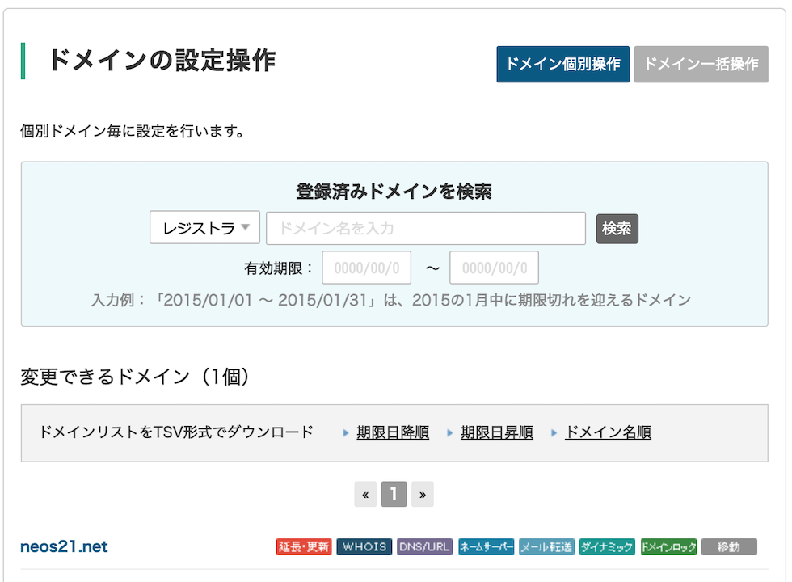
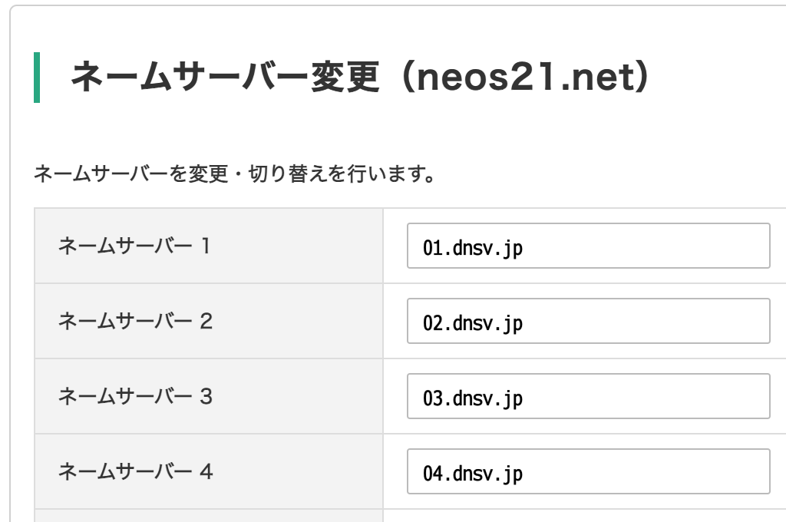
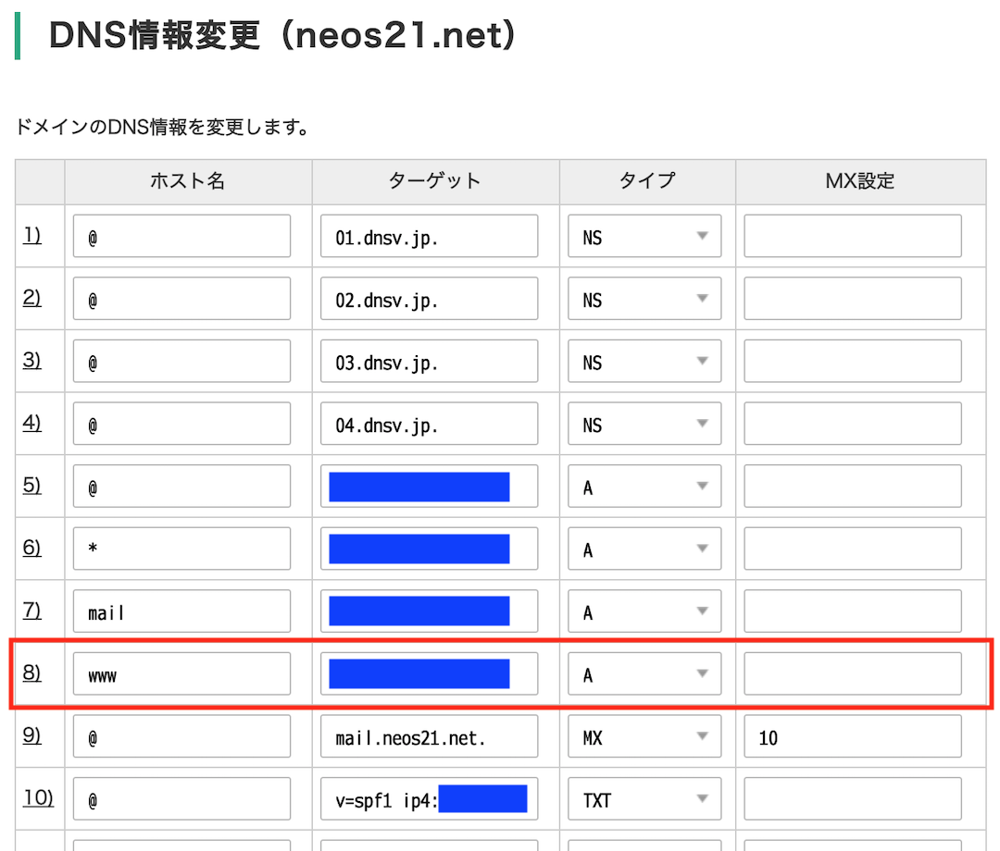
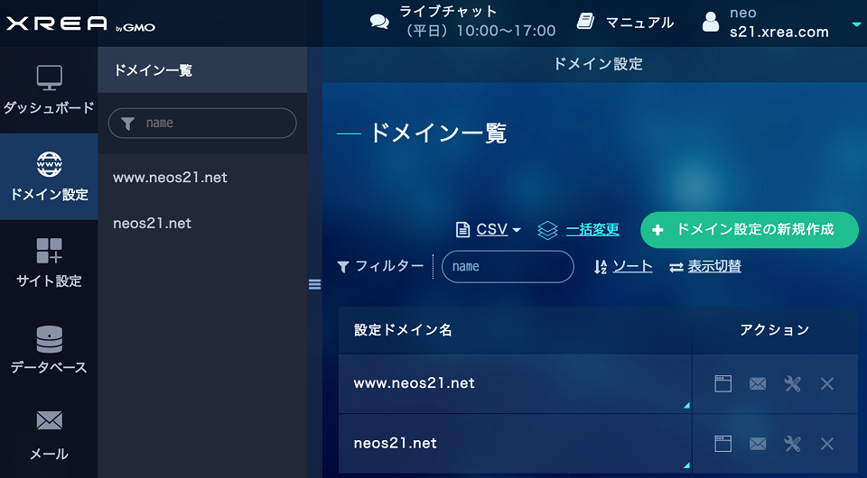
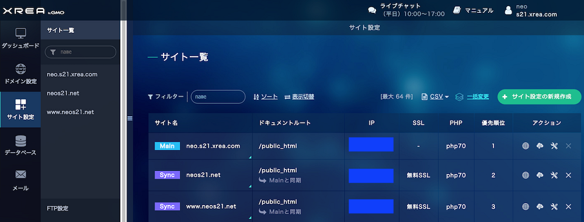

<ins class="ins-block">

本情報は2020年当時、XREA サーバを利用していた際の記録です。2022年現在、このサイトは GitHub Pages でホスティングしており、Value-Domain で取得した独自ドメインを紐付けています。

情報自体は、XREA サーバと Value-Domain の連携方法として利用できるかと思うので、「2020年当時はこのような設定手順でドメイン設定ができた」という資料としてお読みください。

</ins>

2020年当時、このサイトは [XREA サーバ](https://www.xrea.com/)でホスティングしていました。XREA と同じ運営会社が提供する [Value-Domain](https://www.value-domain.com/) では、独自ドメインが取得でき、XREA サーバとの連携も簡単です。そこで今回は、当サイトが実際に Value-Domain でドメインを取得して、XREA サーバに設定した手順を紹介します。

作業手順はいずれも2020年11月頃に実施したものです。


## 目次


## このサイトの場合

このサイトの場合、次のような情報で XREA サーバと独自ドメインを紐付けています。

- XREA サーバ
  - `neo.s21.xrea.com` … 2002年に取得したアカウント
- Value-Domain
  - 2020年11月にアカウントを作成し、上の XREA サーバの情報を紐付け
  - `neos21.net` ドメインを取得


## Value-Domain に登録する

まずは Value-Domain のアカウントのみを作成します。既にアカウントを取得済の人は飛ばして構いません。

- [ユーザー登録 | VALUE-DOMAIN](https://www.value-domain.com/signup_buy/)

GMO ID は作っても作らなくても良いです。ドメイン購入用のクレジットカード情報や、住所等を入力します。

アカウント登録ができたら Value-Domain 管理画面にログインします。


## XREA サーバを取得する

続いて、XREA サーバを取得します。既に XREA サーバアカウントを取得済の人は飛ばして構いません。私は2002年に取得した `neo.s21.xrea.com` というアカウントを利用しているので、今回新たにはアカウントを取得しておりません。

Value-Domain と連携して作成できるレンタルスペースサービスには3種類あります。

- __XREA__：広告が付くが無料で作成できる・CGI・SSL にも対応・有料プランにすれば広告を外せる
- [Value-Server](https://www.value-domain.com/rental-server/vs/)：格安で始められるレンタルサーバ
- [Core-Server](https://www.value-domain.com/rental-server/core/)：法人でも使える高性能レンタルサーバ

このページでは、私が XREA サーバのアカウントを既に持っていたので、XREA を前提に話しますが、より高性能なサーバが必要な場合は Value-Server や Core-Server を検討すると良いでしょう。Value-Domain で取得した独自ドメインは他のウェブスペース等とも紐付けできますが、同じ GMO 内のサーバと連携する場合は設定がより容易です。

XREA サーバは次の画面から取得できます。まずは広告アリの無料プランで登録すれば良いです。

- [XREA の管理・購入 | VALUE-DOMAIN](https://www.value-domain.com/web.php?action=signupfreeweb1)

XREA に登録できたら、次の管理画面にログインできるようになっているはずです。「サイト設定」画面で、XREA サーバを示す IP アドレスが確認できます。後で DNS 設定時に登場するので見ておくと良いでしょう。

- [ダッシュボード | XREA Control Panel](https://cp.xrea.com/)


## Value-Domain に XREA サーバを追加する

Value-Domain 管理画面で、登録した XREA サーバが見えているか確認します。

Value-Domain 管理画面の左メニュー「サーバー」→「XREA」と進み、「XREA の管理・購入」画面を開きます。ココに先程登録した XREA サーバの情報が見えていれば、この手順は飛ばして構いません。

自分は以前登録した XREA サーバを後から紐付けようとしたので、この下面の下部にある_「取得済み XREA アカウントを登録する」_リンクから、XREA サーバ情報を追加する必要がありました。


## 独自ドメインを取得する

Value-Domain 管理画面に移り、独自ドメインの登録を始めます。

好きなドメインを選択し、登録年数を指定します。

独自ドメイン登録時に注意すべきポイントは __WHOIS 情報__の設定です。独自ドメインはその所有者の名義や住所情報が、[WHOIS](https://www.value-domain.com/whois.php) というデータベースで公開されます。素直に登録すると、ユーザ個人の名前や住所が筒抜けになってしまいます。

Value-Domain では、Value-Domain アカウント作成時に入力したユーザ情報が正しければ、WHOIS に公開する情報を Value-Domain 社のモノに代理変更できます。ドメイン登録画面下部に「ドメインの名義 (WHOIS 情報) を代理公開する」という欄があるので、ココから「弊社の代理名義にする」ボタンを押下し、その上部にある「【ドメイン名】の登録者情報」欄が GMO 社の名義に変わっていることを確認しましょう。電話番号やメールアドレス含めて全ての情報が書き換わりますが、Value-Domain アカウントの方で自分のメールアドレス等は登録しているはずなので、キチンと自分への連絡が付きます。

ドメインは案外あっけなく取得できてしまいます。ｗ

独自ドメインが取得できたら、Value-Domain 管理画面左メニュー「ドメイン」→「ドメインの設定操作 (登録済みドメイン一覧)」より、各種設定が可能になります。




## ネームサーバを設定する

「ドメインの設定操作」から「ネームサーバー」のアイコンを押下し、ネームサーバを設定します。

_「転送機能付き上位レジストラのネームサーバーを利用する」_を押下して、

- 01.dnsv.jp
- 02.dnsv.jp
- 03.dnsv.jp
- 04.dnsv.jp

の4つを割り当てておきましょう。




## DNS の設定

続いて「ドメインの設定操作」から「DNS/URL」のアイコンを押下し、DNS を設定します。

下部に「自動設定」欄があり、ココのプルダウンから_「『s【サーバ番号】.xrea.com』で運用する設定に変更」_を選択します。

コレだけでも独自ドメインから XREA サーバへの紐付けは出来ているのですが、コレだけだと __`www.ドメイン名` でアクセスしようとした時に上手く接続できない__ことがあります。

そんな時は次のように、`www` を XREA の IP アドレスに向ける A レコードを追加してください。「自動設定」で追加される TXT レコードが2つあると「変更」ボタン押下時にエラーが出ることがあるので、適宜 TXT レコードを1つにしてください。




## XREA 側でドメイン設定する

ココまでで、独自ドメインから XREA サーバを特定する DNS 設定までが完了しました。続いて、XREA サーバ側がドメイン名でのアクセスを上手く転送できるようにするための設定をしていきます。

今度は XREA 管理画面にログインし、「ドメイン設定」画面を開きます。「ドメイン設定の新規作成」ボタンより、取得したドメインを登録します。確認のため、「A レコードのチェックを行う」にはチェックを入れておきましょう。

ココで、`www` アリと `www` ナシとで同じサイトを表示させたい場合は、`www.ドメイン名` というドメインも追加で登録します。つまり以下のように、2つのドメイン設定を追加しておきます。




## XREA 側でサイト設定する

上で登録したドメインに対し、どのサイトを表示するかを指定します。今回は最初に取得した `http://【ID】.s【サーバ番号】.xrea.com` にアクセスした時と同じ内容を表示させます。

XREA 管理画面の「サイト設定」より、「サイト設定の新規作成」ボタンを押下します。先程登録したドメインを選択したら、「同期設定」で「する」を選択します。「同期元」で「`【ID】.s【サーバ番号】.xrea.com` と同じ内容を表示する」を選択します。

さらに下部、「SSL」の項目があるので、_「無料 SSL」_を選択します。コレにより、HTTPS アクセス時のサーバ証明書を自動的に用意してくれます。

このようにしてサイトを追加しますが、先程 `www` アリのドメインも登録したので、このようなサイト設定をもう一度繰り返し、`www` ナシのドメインと `www` アリのドメインとで、全て XREA サーバと同じ内容を表示するように設定します。設定が完了すると、次のように見えているはずえす。




## 完了

以上で設定完了です。DNS の設定や、XREA サーバの設定が反映されるのには10分ちょっとかかるので、設定直後は正しく表示されていなくても焦らず待ちましょう。

全ての設定が完了すると、次の全ての URL で、同じコンテンツが表示できるようになっているはずです。

- `http://【ID】.s【サーバ番号】.xrea.com/`
- `http://【ドメイン名】/`
- `http://www.【ドメイン名】/`
- `https://【ドメイン名】/`
- `https://www.【ドメイン名】/`


## トラブルシューティング

### 「ドメインウェブの設定が見つかりません」画面が表示される

指定の URL にアクセスすると、次のようなメッセージが表示される場合です。

> #### ドメインウェブの設定が見つかりません
> 
> 考えられる原因
> 
> - ドメインウェブの設定がまだ行われていない。
> - ドメインウェブの設定がまだ反映されていない。(反映には数時間～24時間かかることがあります)
> - ドメインウェブ・DNSの設定が誤っている。
> - アカウントが存在しない、契約が終了している、削除されている。

コレは主に、Value-Domain の DNS 設定か、XREA のサイト設定に誤りがあります。Linux コマンドが利用できる環境があれば、`dig` コマンドで当該ドメインがどのように名前解決されているか確認してみましょう。`ANSWER SECTION` の A レコード値が XREA サーバの IP になっていることを確認しましょう。

```bash
$ dig neos21.net
$ dig www.neos21.net
```

設定を変更したにも関わらず値がおかしい場合は、反映されるのに時間がかかっているだけなので、15分ほど待ってから再確認してみましょう。
